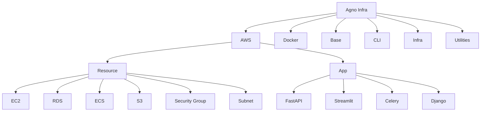
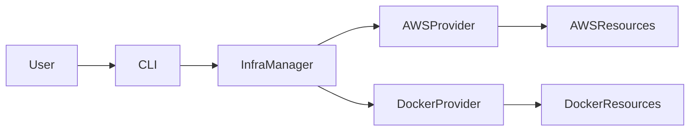
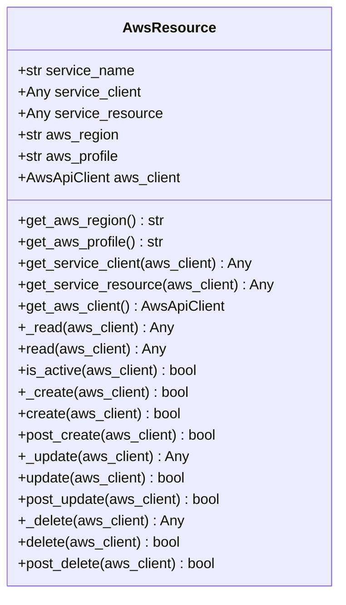
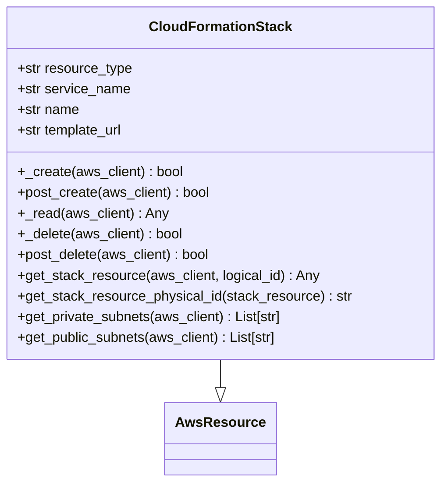
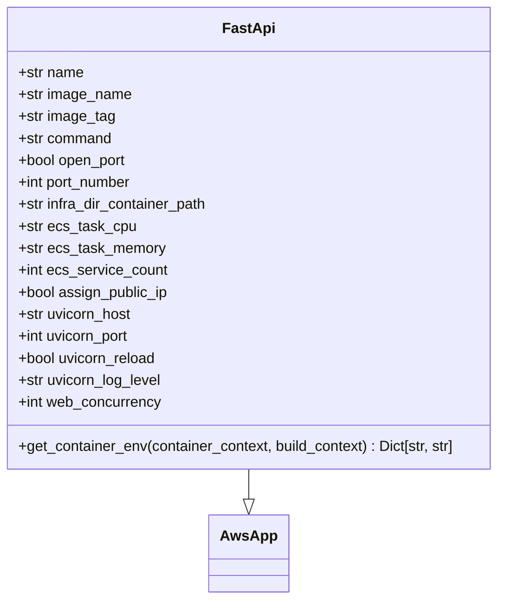
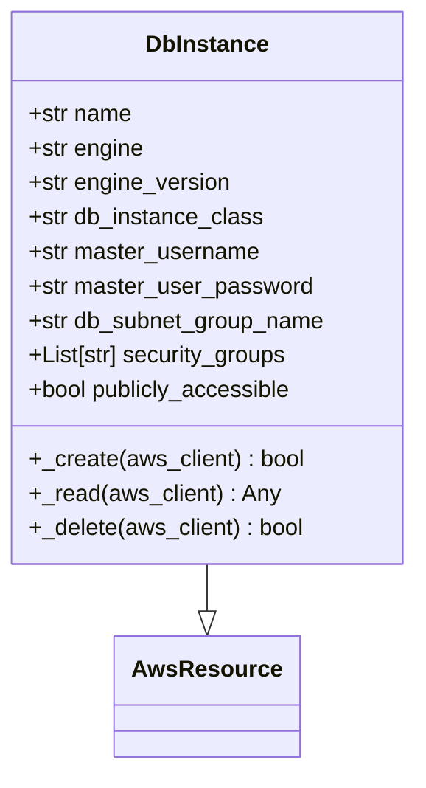
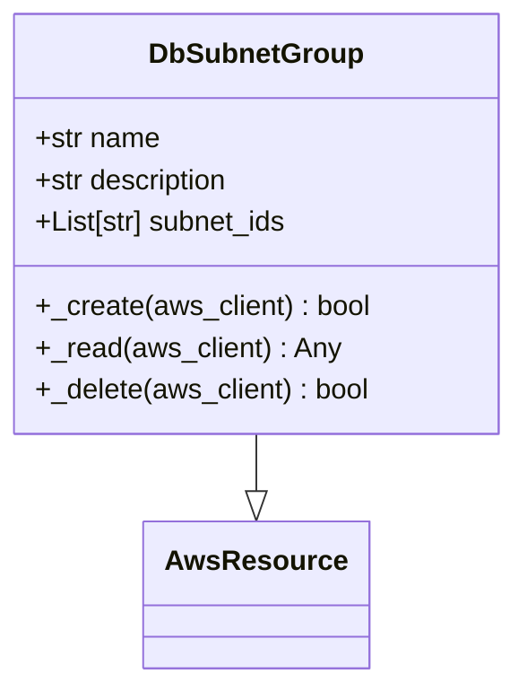
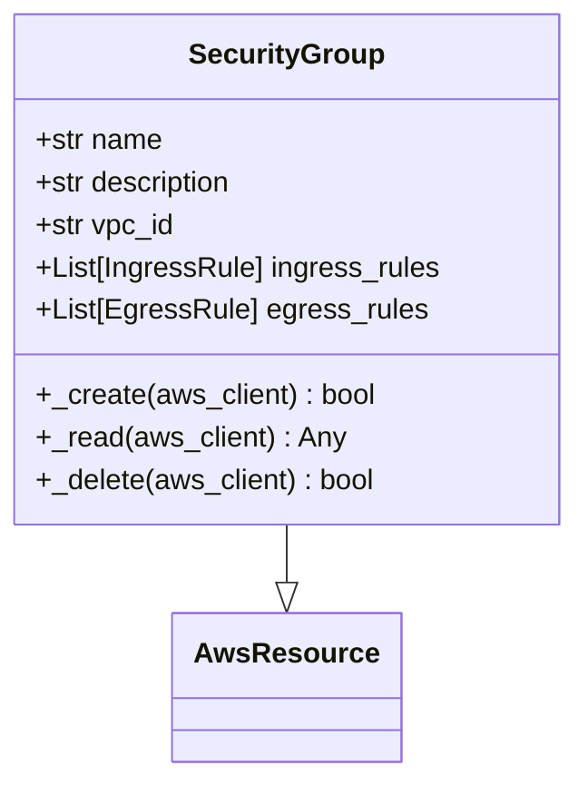
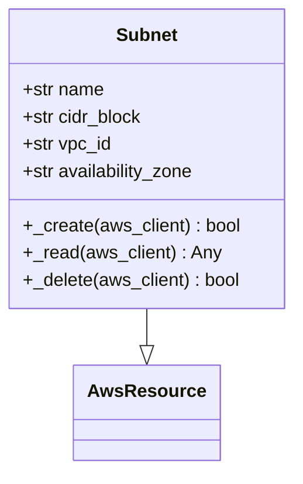
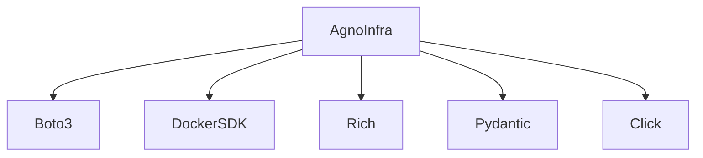

# 云平台部署

<cite>
**本文档中引用的文件**  
- [README.md](file://libs/agno_infra/README.md)
- [stack.py](file://libs/agno_infra/agno/aws/resource/cloudformation/stack.py)
- [fastapi.py](file://libs/agno_infra/agno/aws/app/fastapi/fastapi.py)
- [base.py](file://libs/agno_infra/agno/aws/resource/base.py)
- [config.py](file://libs/agno_infra/agno/cli/config.py)
- [operator.py](file://libs/agno_infra/agno/infra/operator.py)
- [db_cluster.py](file://libs/agno_infra/agno/aws/resource/rds/db_cluster.py)
- [db_instance.py](file://libs/agno_infra/agno/aws/resource/rds/db_instance.py)
- [db_subnet_group.py](file://libs/agno_infra/agno/aws/resource/rds/db_subnet_group.py)
- [ecs/cluster.py](file://libs/agno_infra/agno/aws/resource/ecs/cluster.py)
- [ecs/service.py](file://libs/agno_infra/agno/aws/resource/ecs/service.py)
- [ec2/security_group.py](file://libs/agno_infra/agno/aws/resource/ec2/security_group.py)
- [ec2/subnet.py](file://libs/agno_infra/agno/aws/resource/ec2/subnet.py)
</cite>

## 目录
1. [简介](#简介)
2. [项目结构](#项目结构)
3. [核心组件](#核心组件)
4. [架构概述](#架构概述)
5. [详细组件分析](#详细组件分析)
6. [依赖分析](#依赖分析)
7. [性能考虑](#性能考虑)
8. [故障排除指南](#故障排除指南)
9. [结论](#结论)

## 简介
Agno Infra 是一个专为构建和部署智能体应用而设计的轻量级基础设施管理框架。它提供了一个统一的接口，用于在多个平台（包括 AWS、Docker 和本地环境）上管理基础设施，使部署 AI 智能体和支持服务变得简单。本指南将详细介绍如何在主流云平台（AWS、GCP、Azure）上使用 Agno Infra 进行自动化部署，重点介绍云环境下的安全最佳实践。

## 项目结构
Agno Infra 项目结构清晰，分为多个模块，每个模块负责不同的功能。主要模块包括 AWS 资源管理、Docker 资源管理、基础类和接口、命令行界面、核心基础设施管理和辅助工具。

**Diagram sources**
- [README.md](file://libs/agno_infra/README.md)

**Section sources**
- [README.md](file://libs/agno_infra/README.md)

## 核心组件
Agno Infra 的核心组件包括 AWS 资源管理、Docker 资源管理、命令行界面和基础设施管理。这些组件共同工作，提供了一个完整的基础设施管理解决方案。

**Section sources**
- [README.md](file://libs/agno_infra/README.md)
- [base.py](file://libs/agno_infra/agno/aws/resource/base.py)

## 架构概述
Agno Infra 的架构设计旨在提供一个灵活且可扩展的基础设施管理框架。它通过抽象不同云平台的资源管理，提供了一个统一的接口，使用户可以轻松地在不同平台上部署和管理基础设施。

**Diagram sources**
- [operator.py](file://libs/agno_infra/agno/infra/operator.py)
- [config.py](file://libs/agno_infra/agno/cli/config.py)

## 详细组件分析

### AWS 资源管理
Agno Infra 提供了对 AWS 资源的全面管理，包括 EC2 实例、RDS 数据库、ECS 集群、S3 存储桶、安全组和子网等。

#### AWS 基础资源类

**Diagram sources**
- [base.py](file://libs/agno_infra/agno/aws/resource/base.py)

#### AWS CloudFormation 栈

**Diagram sources**
- [stack.py](file://libs/agno_infra/agno/aws/resource/cloudformation/stack.py)

### 应用部署
Agno Infra 支持多种应用类型的部署，包括 FastAPI、Streamlit、Celery 和 Django。

#### FastAPI 应用

**Diagram sources**
- [fastapi.py](file://libs/agno_infra/agno/aws/app/fastapi/fastapi.py)

### 数据库管理
Agno Infra 提供了对 RDS 数据库实例和集群的管理。

#### RDS 数据库实例

**Diagram sources**
- [db_instance.py](file://libs/agno_infra/agno/aws/resource/rds/db_instance.py)

#### RDS 数据库子网组

**Diagram sources**
- [db_subnet_group.py](file://libs/agno_infra/agno/aws/resource/rds/db_subnet_group.py)

### 网络和安全
Agno Infra 提供了对安全组和子网的管理，确保云环境的安全性。

#### 安全组

**Diagram sources**
- [ec2/security_group.py](file://libs/agno_infra/agno/aws/resource/ec2/security_group.py)

#### 子网

**Diagram sources**
- [ec2/subnet.py](file://libs/agno_infra/agno/aws/resource/ec2/subnet.py)

**Section sources**
- [fastapi.py](file://libs/agno_infra/agno/aws/app/fastapi/fastapi.py)
- [db_instance.py](file://libs/agno_infra/agno/aws/resource/rds/db_instance.py)
- [db_subnet_group.py](file://libs/agno_infra/agno/aws/resource/rds/db_subnet_group.py)
- [security_group.py](file://libs/agno_infra/agno/aws/resource/ec2/security_group.py)
- [subnet.py](file://libs/agno_infra/agno/aws/resource/ec2/subnet.py)

## 依赖分析
Agno Infra 的依赖关系清晰，主要依赖于 boto3 用于 AWS 资源管理，以及 Docker SDK 用于 Docker 资源管理。此外，它还依赖于一些辅助库，如 rich 用于命令行输出，pydantic 用于数据验证。

**Diagram sources**
- [requirements.txt](file://libs/agno_infra/requirements.txt)

**Section sources**
- [requirements.txt](file://libs/agno_infra/requirements.txt)

## 性能考虑
Agno Infra 在设计时考虑了性能，通过缓存和异步操作来提高效率。例如，资源的读取操作会优先使用缓存值，如果可用的话。此外，创建和删除资源的操作都支持等待器，以确保操作完成后再继续。

## 故障排除指南
在使用 Agno Infra 时，可能会遇到一些常见问题。以下是一些故障排除建议：

- **AWS 凭证问题**：确保已正确配置 AWS 凭证，可以通过环境变量或 AWS 配置文件进行设置。
- **Docker 服务未运行**：确保 Docker 服务正在运行，否则无法管理 Docker 资源。
- **网络问题**：检查网络连接，确保可以访问所需的云服务。
- **权限问题**：确保 IAM 角色具有足够的权限来管理所需的资源。

**Section sources**
- [README.md](file://libs/agno_infra/README.md)
- [config.py](file://libs/agno_infra/agno/cli/config.py)

## 结论
Agno Infra 提供了一个强大且灵活的基础设施管理框架，适用于在主流云平台上部署和管理 AI 智能体应用。通过使用 Agno Infra，用户可以轻松地自动化部署过程，同时遵循云环境下的安全最佳实践。无论是使用 AWS CloudFormation、GCP Deployment Manager 还是 Azure Resource Manager，Agno Infra 都提供了一致的接口和工具，使基础设施管理变得更加简单和高效。