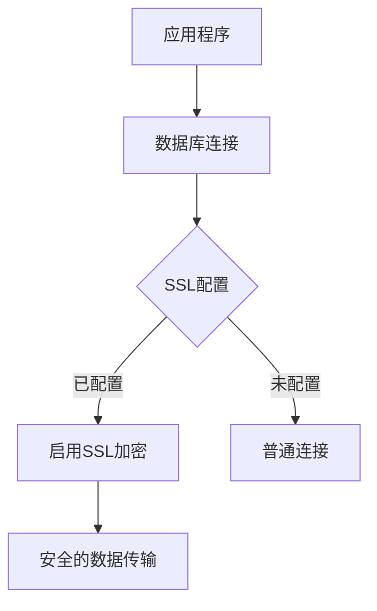
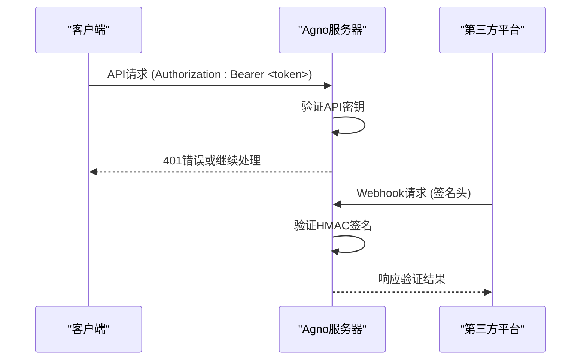
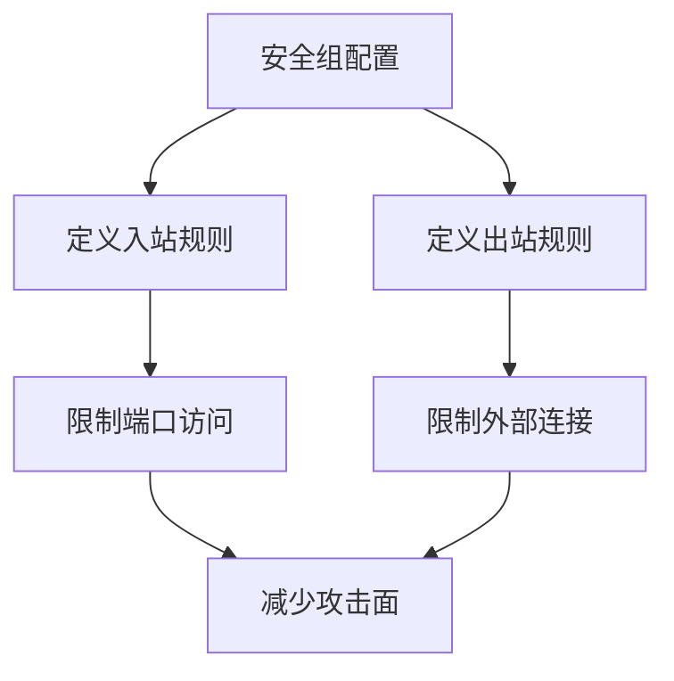
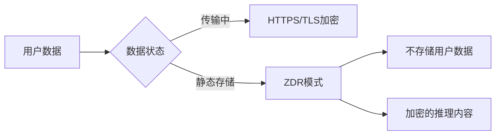
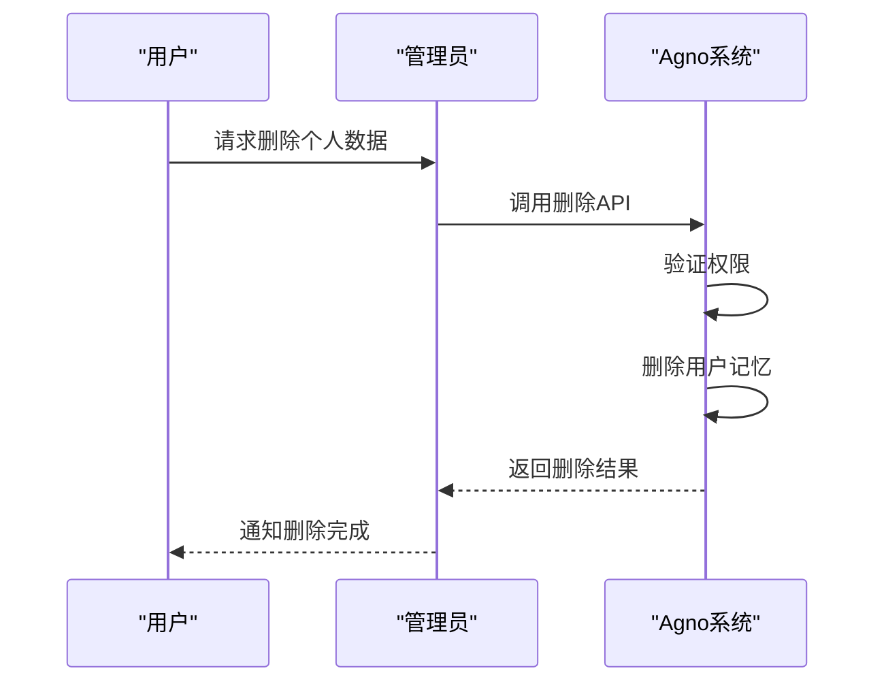

# 安全与合规

<cite>
**本文档中引用的文件**  
- [auth.py](file://libs/agno/agno/os/auth.py)
- [settings.py](file://libs/agno/agno/os/settings.py)
- [security.py](file://libs/agno/agno/os/interfaces/whatsapp/security.py)
- [security.py](file://libs/agno/agno/os/interfaces/slack/security.py)
- [singlestore_db.py](file://cookbook/knowledge/vector_db/singlestore_db/singlestore_db.py)
- [responses.py](file://libs/agno/agno/models/openai/responses.py)
- [security_group.py](file://libs/agno_infra/agno/aws/resource/ec2/security_group.py)
- [memory.py](file://libs/agno/agno/os/routers/memory/memory.py)
- [in_memory_db.py](file://libs/agno/agno/db/in_memory/in_memory_db.py)
- [postgres.py](file://libs/agno/agno/db/postgres/postgres.py)
- [sqlite.py](file://libs/agno/agno/db/sqlite/sqlite.py)
- [mongo.py](file://libs/agno/agno/db/mongo/mongo.py)
- [dynamo.py](file://libs/agno/agno/db/dynamo/dynamo.py)
- [firestore.py](file://libs/agno/agno/db/firestore/firestore.py)
- [redis.py](file://libs/agno/agno/db/redis/redis.py)
</cite>

## 目录
1. [引言](#引言)
2. [HTTPS与TLS证书配置](#https与tls证书配置)
3. [认证与授权机制](#认证与授权机制)
4. [安全漏洞扫描与渗透测试](#安全漏洞扫描与渗透测试)
5. [数据加密实施](#数据加密实施)
6. [GDPR等数据隐私法规合规](#gdpr等数据隐私法规合规)
7. [结论](#结论)

## 引言
Agno系统提供了一套全面的安全与合规框架，旨在保护用户数据、确保系统安全并符合国际数据隐私法规。本文档详细阐述了如何配置HTTPS和TLS证书以保护数据传输安全，介绍了API密钥、OAuth等认证与授权机制的实现和管理，讨论了数据加密（传输中和静态）的实施方法，并提供了符合GDPR等数据隐私法规的配置指南。

**Section sources**
- [auth.py](file://libs/agno/agno/os/auth.py#L0-L57)
- [settings.py](file://libs/agno/agno/os/settings.py#L0-L43)

## HTTPS与TLS证书配置
Agno系统通过配置SSL/TLS来确保数据库连接的安全性。在与支持SSL的数据库（如SingleStore）连接时，系统会自动启用SSL加密。通过设置环境变量`SINGLESTORE_SSL_CERT`，系统会将SSL证书路径附加到数据库连接URL中，并启用证书验证，确保连接的安全性。

**Diagram sources**
- [singlestore_db.py](file://cookbook/knowledge/vector_db/singlestore_db/singlestore_db.py#L31)

**Section sources**
- [singlestore_db.py](file://cookbook/knowledge/vector_db/singlestore_db/singlestore_db.py#L0-L62)

## 认证与授权机制
Agno系统实现了多种认证与授权机制，包括API密钥、WebSocket认证以及第三方平台（如WhatsApp和Slack）的Webhook签名验证。

### API密钥认证
系统使用API密钥进行身份验证。通过在`AgnoAPISettings`中设置`os_security_key`，可以启用API认证。所有API请求必须在Authorization头中提供有效的Bearer令牌，否则将返回401错误。

### WebSocket认证
WebSocket连接使用与API相同的`os_security_key`进行令牌验证。如果未设置安全密钥，则跳过认证。

### 第三方Webhook安全
对于与第三方平台的集成，系统实现了安全的Webhook签名验证：
- **WhatsApp**: 使用HMAC-SHA256验证Webhook签名，确保请求来自合法的WhatsApp服务器。
- **Slack**: 验证Slack签名和时间戳，防止重放攻击。

**Diagram sources**
- [auth.py](file://libs/agno/agno/os/auth.py#L0-L57)
- [security.py](file://libs/agno/agno/os/interfaces/whatsapp/security.py#L0-L53)
- [security.py](file://libs/agno/agno/os/interfaces/slack/security.py#L0-L30)

**Section sources**
- [auth.py](file://libs/agno/agno/os/auth.py#L0-L57)
- [security.py](file://libs/agno/agno/os/interfaces/whatsapp/security.py#L0-L53)
- [security.py](file://libs/agno/agno/os/interfaces/slack/security.py#L0-L30)

## 安全漏洞扫描与渗透测试
虽然代码库中没有直接的安全漏洞扫描工具，但系统通过以下方式支持安全测试：
- **AWS安全组配置**: 通过`security_group.py`文件，可以定义入站和出站规则，限制网络访问，仅允许必要的端口和IP地址。
- **开发模式**: 系统支持开发模式，在此模式下可以绕过某些安全验证（如WhatsApp Webhook签名），便于测试和调试。

**Diagram sources**
- [security_group.py](file://libs/agno_infra/agno/aws/resource/ec2/security_group.py#L0-L588)

**Section sources**
- [security_group.py](file://libs/agno_infra/agno/aws/resource/ec2/security_group.py#L0-L588)

## 数据加密实施
Agno系统通过多种方式实施数据加密，保护数据在传输和静态存储中的安全。

### 传输中加密
- 所有API和WebSocket通信都应通过HTTPS进行。
- 数据库连接使用SSL/TLS加密，如SingleStore连接示例所示。

### 静态加密
- **OpenAI ZDR模式**: 通过设置`store=False`，可以启用OpenAI的零数据保留（Zero Data Retention）模式，确保用户数据不会被存储。
- **加密的推理内容**: 在ZDR模式下，推理内容被加密处理，保护用户隐私。

**Diagram sources**
- [responses.py](file://libs/agno/agno/models/openai/responses.py#L0-L1000)

**Section sources**
- [responses.py](file://libs/agno/agno/models/openai/responses.py#L0-L1000)

## GDPR等数据隐私法规合规
Agno系统提供了符合GDPR等数据隐私法规的功能，包括数据访问控制和用户数据删除流程。

### 数据访问控制
系统通过以下方式实现数据访问控制：
- 基于API密钥的身份验证
- 限制数据库访问权限
- 通过环境变量配置安全设置

### 用户数据删除流程
系统提供了删除用户数据的功能，支持GDPR的"被遗忘权"要求：
- **删除单个记忆**: 通过`delete_user_memory`方法删除特定的用户记忆。
- **批量删除记忆**: 通过`delete_user_memories`方法批量删除多个用户记忆。
- **统计信息**: 提供`get_user_memory_stats`方法获取用户记忆统计信息，便于数据管理。

**Diagram sources**
- [memory.py](file://libs/agno/agno/os/routers/memory/memory.py#L337-L409)
- [in_memory_db.py](file://libs/agno/agno/db/in_memory/in_memory_db.py#L385-L413)
- [postgres.py](file://libs/agno/agno/db/postgres/postgres.py#L923-L960)
- [sqlite.py](file://libs/agno/agno/db/sqlite/sqlite.py#L861-L896)
- [mongo.py](file://libs/agno/agno/db/mongo/mongo.py#L807-L842)
- [dynamo.py](file://libs/agno/agno/db/dynamo/dynamo.py#L799-L827)
- [firestore.py](file://libs/agno/agno/db/firestore/firestore.py#L576-L615)
- [redis.py](file://libs/agno/agno/db/redis/redis.py#L758-L795)

**Section sources**
- [memory.py](file://libs/agno/agno/os/routers/memory/memory.py#L337-L409)
- [in_memory_db.py](file://libs/agno/agno/db/in_memory/in_memory_db.py#L385-L413)
- [postgres.py](file://libs/agno/agno/db/postgres/postgres.py#L923-L960)
- [sqlite.py](file://libs/agno/agno/db/sqlite/sqlite.py#L861-L896)
- [mongo.py](file://libs/agno/agno/db/mongo/mongo.py#L807-L842)
- [dynamo.py](file://libs/agno/agno/db/dynamo/dynamo.py#L799-L827)
- [firestore.py](file://libs/agno/agno/db/firestore/firestore.py#L576-L615)
- [redis.py](file://libs/agno/agno/db/redis/redis.py#L758-L795)

## 结论
Agno系统通过综合的安全与合规框架，确保了数据的安全性和隐私保护。系统支持HTTPS和TLS证书配置，实现了多种认证与授权机制，提供了数据加密功能，并符合GDPR等数据隐私法规的要求。通过合理的配置和管理，可以确保Agno系统在各种应用场景下的安全性和合规性。