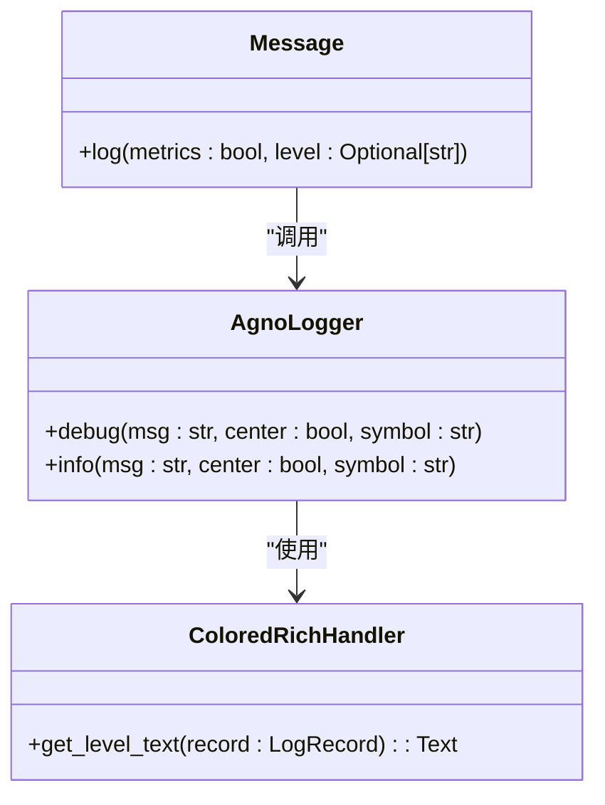
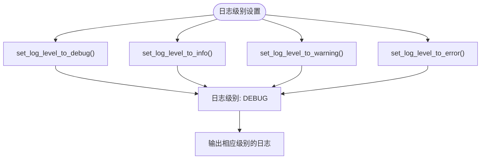
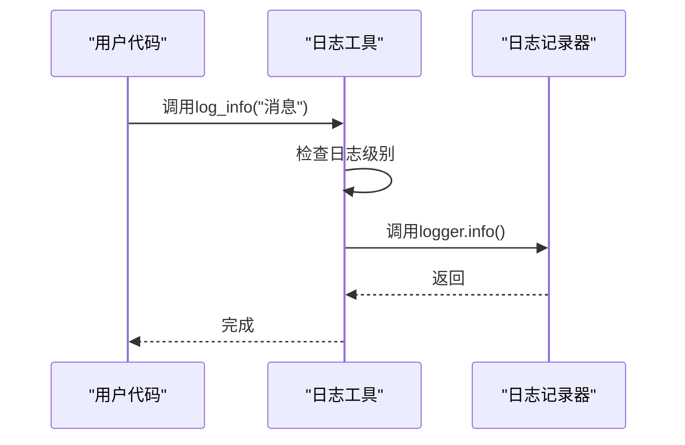
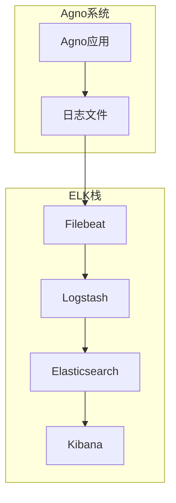

# 日志管理

<cite>
**本文档引用的文件**  
- [log.py](file://libs/agno/agno/utils/log.py)
- [custom_logging.py](file://cookbook/agents/custom_logging/custom_logging.py)
- [custom_logging_advanced.py](file://cookbook/agents/custom_logging/custom_logging_advanced.py)
- [log_to_file.py](file://cookbook/agents/custom_logging/log_to_file.py)
- [message.py](file://libs/agno/agno/models/message.py)
- [performance.py](file://libs/agno/agno/eval/performance.py)
- [postgres.py](file://libs/agno/agno/db/postgres/postgres.py)
- [debug.py](file://libs/agno/agno/debug.py)
- [langfuse_via_openinference.py](file://cookbook/integrations/observability/langfuse_via_openinference.py)
</cite>

## 目录
1. [简介](#简介)
2. [日志格式与级别](#日志格式与级别)
3. [日志配置与管理](#日志配置与管理)
4. [日志轮转与归档策略](#日志轮转与归档策略)
5. [日志聚合与分析](#日志聚合与分析)
6. [业务指标分析示例](#业务指标分析示例)
7. [异常处理与调试](#异常处理与调试)
8. [结论](#结论)

## 简介
Agno系统提供了一套完整的日志管理解决方案，支持结构化日志记录、多级别日志控制、自定义日志配置以及与外部监控系统的集成。本文档详细说明了Agno系统的日志管理策略，包括日志格式规范、日志级别使用场景、日志轮转策略以及与ELK等日志分析系统的集成方法。

**Section sources**
- [log.py](file://libs/agno/agno/utils/log.py)

## 日志格式与级别

### 日志格式规范
Agno系统采用结构化日志格式，主要使用JSON格式进行日志输出。日志记录包含以下关键字段：

- **时间戳**：记录日志生成的时间
- **日志级别**：标识日志的重要程度
- **消息内容**：日志的具体信息
- **来源类型**：标识日志的来源（agent、team、workflow）
- **上下文信息**：包含相关的执行上下文数据

系统使用Rich库进行日志格式化，提供彩色输出和丰富的文本格式支持。日志格式通过`ColoredRichHandler`类实现，根据不同的日志源类型（agent、team、workflow）应用不同的颜色主题。



**Diagram sources**
- [log.py](file://libs/agno/agno/utils/log.py)
- [message.py](file://libs/agno/agno/models/message.py)

### 日志级别使用场景
Agno系统定义了四个主要的日志级别，每个级别有明确的使用场景：

| 日志级别 | 使用场景 | 示例 |
|---------|--------|------|
| DEBUG | 调试信息，用于开发和问题排查 | "开始执行工具调用", "内存状态更新" |
| INFO | 重要事件和操作的记录 | "代理已初始化", "工作流开始执行" |
| WARNING | 潜在问题或非关键错误 | "知识库搜索失败，使用备用方法", "API调用接近速率限制" |
| ERROR | 错误事件，影响正常执行流程 | "数据库连接失败", "模型调用异常" |

日志级别可以通过以下函数进行动态设置：
- `set_log_level_to_debug()`：设置为DEBUG级别
- `set_log_level_to_info()`：设置为INFO级别  
- `set_log_level_to_warning()`：设置为WARNING级别
- `set_log_level_to_error()`：设置为ERROR级别



**Diagram sources**
- [log.py](file://libs/agno/agno/utils/log.py)

**Section sources**
- [log.py](file://libs/agno/agno/utils/log.py)

## 日志配置与管理

### 自定义日志配置
Agno系统允许用户通过`configure_agno_logging()`函数配置自定义日志记录器。该函数支持为不同组件（默认、代理、团队、工作流）设置不同的日志记录器。

```python
def configure_agno_logging(
    custom_default_logger: Optional[Any] = None,
    custom_agent_logger: Optional[Any] = None,
    custom_team_logger: Optional[Any] = None,
    custom_workflow_logger: Optional[Any] = None,
) -> None:
    """
    配置自定义日志记录器。这些记录器将在整个Agno库中使用。

    参数:
        custom_default_logger: 要使用的默认记录器（覆盖代理记录器作为默认）
        custom_agent_logger: 代理操作的自定义记录器
        custom_team_logger: 团队操作的自定义记录器
        custom_workflow_logger: 工作流操作的自定义记录器
    """
```

**Section sources**
- [log.py](file://libs/agno/agno/utils/log.py)

### 日志记录函数
Agno系统提供了一系列全局日志记录函数，简化日志记录操作：

- `log_debug()`：记录调试信息
- `log_info()`：记录信息性消息
- `log_warning()`：记录警告信息
- `log_error()`：记录错误信息
- `log_exception()`：记录异常信息

这些函数封装了底层的日志记录逻辑，确保日志输出的一致性和可读性。



**Diagram sources**
- [log.py](file://libs/agno/agno/utils/log.py)

**Section sources**
- [log.py](file://libs/agno/agno/utils/log.py)

## 日志轮转与归档策略

### 文件日志记录
虽然Agno系统默认将日志输出到控制台，但可以通过自定义日志记录器将日志写入文件。以下示例展示了如何配置文件日志记录：

```python
def get_custom_logger():
    """返回一个示例自定义记录器。"""
    custom_logger = logging.getLogger("file_logger")
    
    # 确保tmp目录存在
    log_file_path = Path("tmp/log.txt")
    log_file_path.parent.mkdir(parents=True, exist_ok=True)
    
    # 使用FileHandler而不是StreamHandler写入文件
    handler = logging.FileHandler(log_file_path)
    formatter = logging.Formatter("%(levelname)s: %(message)s")
    handler.setFormatter(formatter)
    custom_logger.addHandler(handler)
    custom_logger.setLevel(logging.INFO)
    custom_logger.propagate = False
    return custom_logger
```

**Section sources**
- [log_to_file.py](file://cookbook/agents/custom_logging/log_to_file.py)

### 日志轮转实现
Agno系统本身不直接提供日志轮转功能，但可以通过与Python标准库`logging.handlers`模块集成来实现日志轮转。推荐的轮转策略包括：

1. **按大小轮转**：当日志文件达到指定大小时创建新文件
2. **按时间轮转**：按天、小时等时间间隔创建新日志文件
3. **组合策略**：结合大小和时间条件进行轮转

```python
from logging.handlers import RotatingFileHandler

def configure_rotating_logger():
    """配置轮转日志记录器"""
    logger = logging.getLogger("rotating_logger")
    handler = RotatingFileHandler(
        "agno.log", 
        maxBytes=10*1024*1024,  # 10MB
        backupCount=5
    )
    formatter = logging.Formatter("%(asctime)s - %(levelname)s - %(message)s")
    handler.setFormatter(formatter)
    logger.addHandler(handler)
    logger.setLevel(logging.INFO)
    return logger
```

### 存储空间优化
为了节省存储空间，建议采用以下策略：

- **压缩归档日志**：将旧的日志文件压缩为gzip格式
- **设置保留策略**：自动删除超过指定时间的日志文件
- **分级存储**：将近期日志存储在高速存储中，历史日志存储在低成本存储中

**Section sources**
- [log_to_file.py](file://cookbook/agents/custom_logging/log_to_file.py)

## 日志聚合与分析

### ELK技术栈集成
Agno系统的日志可以轻松集成到ELK（Elasticsearch, Logstash, Kibana）技术栈中进行集中管理和分析。集成步骤如下：

1. **日志格式化**：确保日志输出为JSON格式，便于Logstash解析
2. **日志收集**：使用Filebeat等工具收集日志文件
3. **日志处理**：通过Logstash进行日志解析、过滤和转换
4. **日志存储**：将处理后的日志存储到Elasticsearch中
5. **日志可视化**：使用Kibana创建仪表板和查询界面



**Diagram sources**
- [log.py](file://libs/agno/agno/utils/log.py)

### OpenTelemetry集成
Agno系统支持通过OpenTelemetry进行分布式追踪和日志聚合。以下示例展示了如何将Agno与Langfuse集成：

```python
# 配置OpenTelemetry导出器
tracer_provider = TracerProvider()
tracer_provider.add_span_processor(SimpleSpanProcessor(OTLPSpanExporter()))

# 启动Agno的OpenInference检测
AgnoInstrumentor().instrument(tracer_provider=tracer_provider)

# 创建代理并启用调试模式
agent = Agent(
    name="Stock Price Agent",
    model=OpenAIChat(id="gpt-4o-mini"),
    tools=[YFinanceTools()],
    instructions="You are a stock price agent. Answer questions in the style of a stock analyst.",
    debug_mode=True,
)
```

**Section sources**
- [langfuse_via_openinference.py](file://cookbook/integrations/observability/langfuse_via_openinference.py)

## 业务指标分析示例

### 用户活跃度分析
通过分析日志中的代理交互记录，可以计算用户活跃度指标：

```python
def analyze_user_activity(log_data):
    """分析用户活跃度"""
    # 统计每日活跃用户
    daily_active_users = {}
    for log_entry in log_data:
        date = log_entry.timestamp.date()
        user_id = log_entry.user_id
        if date not in daily_active_users:
            daily_active_users[date] = set()
        daily_active_users[date].add(user_id)
    
    return {
        "daily_active_users": {k: len(v) for k, v in daily_active_users.items()},
        "total_active_users": len(set().union(*daily_active_users.values()))
    }
```

### 功能使用频率分析
通过分析工具调用日志，可以了解各功能的使用频率：

```python
def analyze_feature_usage(log_data):
    """分析功能使用频率"""
    feature_usage = {}
    for log_entry in log_data:
        if log_entry.event_type == "tool_call":
            tool_name = log_entry.tool_name
            feature_usage[tool_name] = feature_usage.get(tool_name, 0) + 1
    
    # 按使用频率排序
    sorted_usage = sorted(feature_usage.items(), key=lambda x: x[1], reverse=True)
    return sorted_usage
```

### 性能指标分析
Agno系统内置性能评估功能，可以收集和分析关键性能指标：

```mermaid
erDiagram
PERFORMANCE_METRICS {
timestamp: datetime PK
run_time: float
memory_usage: float
input_tokens: int
output_tokens: int
total_tokens: int
cache_read_tokens: int
duration: float
time_to_first_token: float
}
USER_METRICS {
user_id: string PK
session_count: int
total_interactions: int
avg_response_time: float
last_active: datetime
}
PERFORMANCE_METRICS ||--o{ USER_METRICS : "belongs_to"
```

**Diagram sources**
- [performance.py](file://libs/agno/agno/eval/performance.py)

**Section sources**
- [performance.py](file://libs/agno/agno/eval/performance.py)

## 异常处理与调试

### 异常日志记录
Agno系统在异常处理中集成了详细的日志记录功能：

```python
try:
    # 执行数据库操作
    result = self.db_engine.execute(query)
    log_info(f"成功执行查询: {query}")
except Exception as e:
    log_error(f"执行查询失败: {e}")
    raise
```

系统定义了多种异常类型，每种异常都有相应的日志记录策略：

- `AgentRunException`：代理运行异常
- `RetryAgentRun`：需要重试的异常
- `StopAgentRun`：需要停止执行的异常
- `RunCancelledException`：运行被取消
- `ModelProviderError`：模型提供商错误

**Section sources**
- [exceptions.py](file://libs/agno/agno/exceptions.py)

### 调试模式
Agno系统提供调试模式，可以通过以下方式启用：

```python
def enable_debug_mode() -> None:
    """启用agno库的调试模式。
    此函数将日志级别设置为DEBUG
    """
    from agno.utils.log import set_log_level_to_debug
    set_log_level_to_debug()

def disable_debug_mode() -> None:
    """禁用agno库的调试模式。
    此函数将日志级别重置为INFO
    """
    from agno.utils.log import set_log_level_to_info
    set_log_level_to_info()
```

调试模式下，系统会输出更详细的执行信息，包括：
- 代理的思考过程
- 工具调用的详细参数
- 内存状态变化
- 模型交互的完整上下文

**Section sources**
- [debug.py](file://libs/agno/agno/debug.py)

## 结论
Agno系统提供了一套全面的日志管理解决方案，支持从日志生成、存储到分析的完整生命周期管理。通过结构化的日志格式、灵活的日志级别控制和强大的外部集成能力，Agno能够满足各种规模应用的日志管理需求。建议在生产环境中结合ELK等日志分析平台使用，以实现高效的日志聚合、搜索和可视化分析，从而更好地监控系统运行状态、排查问题和优化性能。