# Agno 生产环境部署和运维最佳实践

<cite>
**本文档中引用的文件**
- [README.md](file://README.md)
- [pyproject.toml](file://libs/agno/pyproject.toml)
- [agno_infra/README.md](file://libs/agno_infra/README.md)
- [load_balancer.py](file://libs/agno_infra/agno/aws/resource/elb/load_balancer.py)
- [target_group.py](file://libs/agno_infra/agno/aws/resource/elb/target_group.py)
- [service.py](file://libs/agno_infra/agno/aws/app/base.py)
- [db_instance.py](file://libs/agno_infra/agno/aws/resource/rds/db_instance.py)
- [role.py](file://libs/agno_infra/agno/aws/resource/iam/role.py)
- [policy.py](file://libs/agno_infra/agno/aws/resource/iam/policy.py)
- [metrics.py](file://libs/agno/agno/os/routers/metrics/metrics.py)
- [schemas.py](file://libs/agno/agno/os/routers/metrics/schemas.py)
- [log.py](file://libs/agno/agno/utils/log.py)
</cite>

## 目录
1. [概述](#概述)
2. [高可用性架构设计](#高可用性架构设计)
3. [负载均衡器配置](#负载均衡器配置)
4. [多实例部署策略](#多实例部署策略)
5. [自动扩展策略](#自动扩展策略)
6. [监控方案](#监控方案)
7. [日志管理策略](#日志管理策略)
8. [数据备份与灾难恢复](#数据备份与灾难恢复)
9. [安全审计](#安全审计)
10. [性能优化](#性能优化)
11. [故障排除指南](#故障排除指南)
12. [总结](#总结)

## 概述

Agno 是一个高性能的多代理系统运行时框架，专为构建、运行和管理安全的多代理系统而设计。在生产环境中部署 Agno 需要遵循最佳实践，确保系统的高可用性、可扩展性和安全性。

本文档基于 Agno 的核心架构和基础设施组件，提供全面的生产环境部署和运维指导。

## 高可用性架构设计

### 架构概览

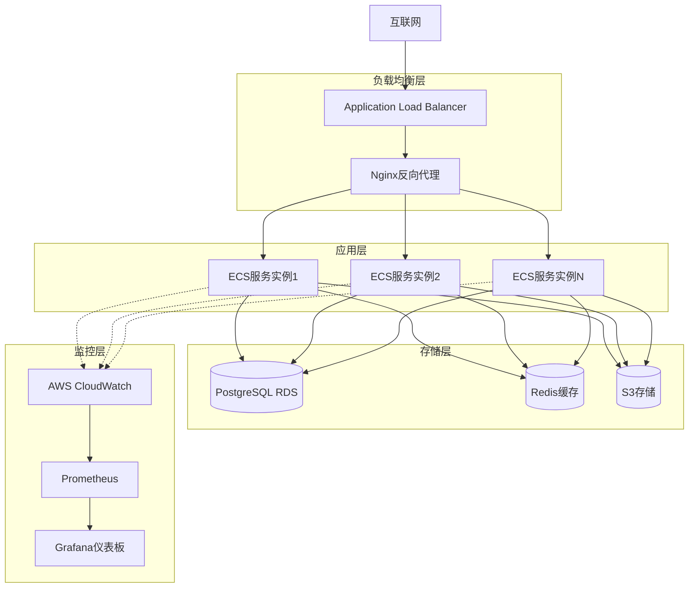

**图表来源**
- [load_balancer.py](file://libs/agno_infra/agno/aws/resource/elb/load_balancer.py#L1-L50)
- [service.py](file://libs/agno_infra/agno/aws/app/base.py#L561-L596)

### 多区域部署

为了实现真正的高可用性，建议采用多区域部署策略：

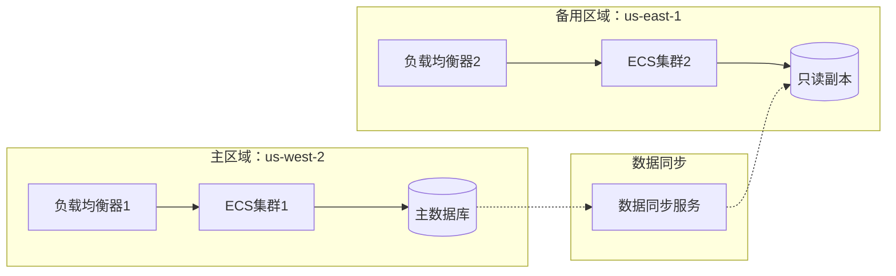

**章节来源**
- [service.py](file://libs/agno_infra/agno/aws/app/base.py#L561-L596)

## 负载均衡器配置

### Application Load Balancer (ALB) 设置

Agno 提供了完整的 AWS Application Load Balancer 管理功能，支持 HTTPS 和 HTTP 协议。

```python
# 负载均衡器配置示例
load_balancer = LoadBalancer(
    name="agno-lb",
    subnets=[subnet1, subnet2],
    security_groups=[sg_web],
    scheme="internet-facing",
    type="application",
    ip_address_type="ipv4",
    protocol="HTTPS"  # 或 "HTTP"
)
```

### 健康检查配置

```python
# 目标组健康检查配置
target_group = TargetGroup(
    name="agno-tg",
    protocol="HTTP",
    port=8000,
    vpc_id=vpc.id,
    health_check_protocol="HTTP",
    health_check_port="traffic-port",
    health_check_path="/health",
    health_check_interval_seconds=30,
    health_check_timeout_seconds=5,
    healthy_threshold_count=2,
    unhealthy_threshold_count=2,
    target_type="ip"
)
```

### 负载均衡器特性

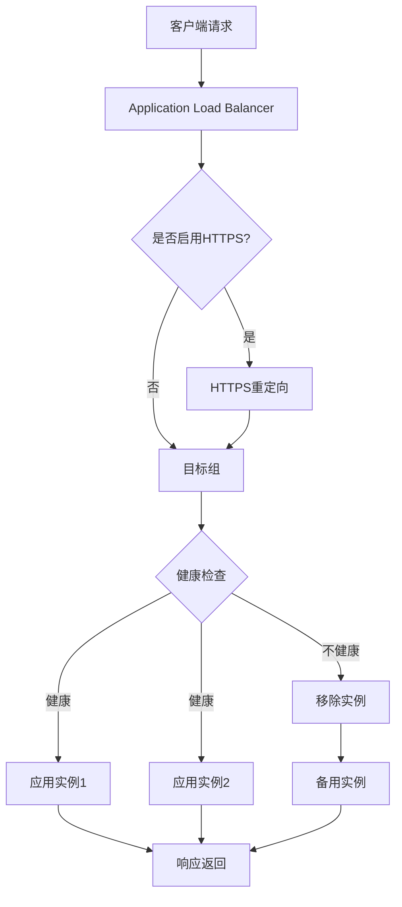

**图表来源**
- [load_balancer.py](file://libs/agno_infra/agno/aws/resource/elb/load_balancer.py#L30-L80)
- [target_group.py](file://libs/agno_infra/agno/aws/resource/elb/target_group.py#L30-L80)

**章节来源**
- [load_balancer.py](file://libs/agno_infra/agno/aws/resource/elb/load_balancer.py#L1-L195)
- [target_group.py](file://libs/agno_infra/agno/aws/resource/elb/target_group.py#L1-L221)

## 多实例部署策略

### ECS 服务配置

Agno 支持多种部署模式，包括 Fargate 和 EC2 实例：

```python
# ECS 服务配置
ecs_service = EcsService(
    name="agno-service",
    desired_count=3,  # 初始实例数
    launch_type="FARGATE",  # 或 "EC2"
    cluster=ecs_cluster,
    task_definition=task_definition,
    target_group=target_group,
    subnets=subnets,
    security_groups=security_groups,
    assign_public_ip=True,
    enable_execute_command=True,
    force_new_deployment=True
)
```

### 容器化部署

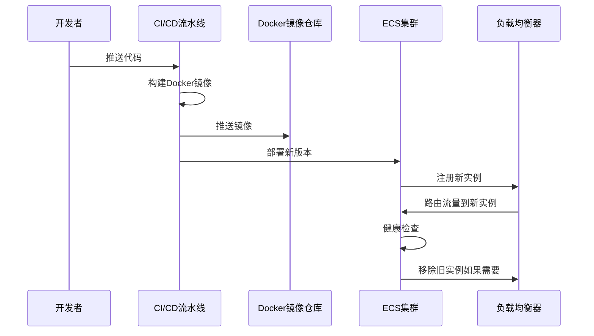

**图表来源**
- [service.py](file://libs/agno_infra/agno/aws/app/base.py#L561-L596)

### 部署策略选项

1. **蓝绿部署**：零停机时间部署
2. **滚动更新**：逐步替换实例
3. **金丝雀发布**：小规模测试新版本

**章节来源**
- [service.py](file://libs/agno_infra/agno/aws/app/base.py#L561-L596)

## 自动扩展策略

### CPU 和内存监控指标

Agno 内置了详细的性能监控机制，可以基于 CPU 使用率和内存使用情况自动扩展：

```python
# 自动扩展配置示例
scaling_policies = [
    {
        "policy_name": "cpu-scaling-up",
        "adjustment_type": "ChangeInCapacity",
        "scaling_adjustment": 1,
        "cooldown": 300,
        "metric_type": "CPUUtilization",
        "threshold": 70,
        "comparison_operator": "GreaterThanThreshold"
    },
    {
        "policy_name": "memory-scaling-down",
        "adjustment_type": "ChangeInCapacity",
        "scaling_adjustment": -1,
        "cooldown": 600,
        "metric_type": "MemoryUtilization",
        "threshold": 30,
        "comparison_operator": "LessThanThreshold"
    }
]
```

### 扩展触发条件

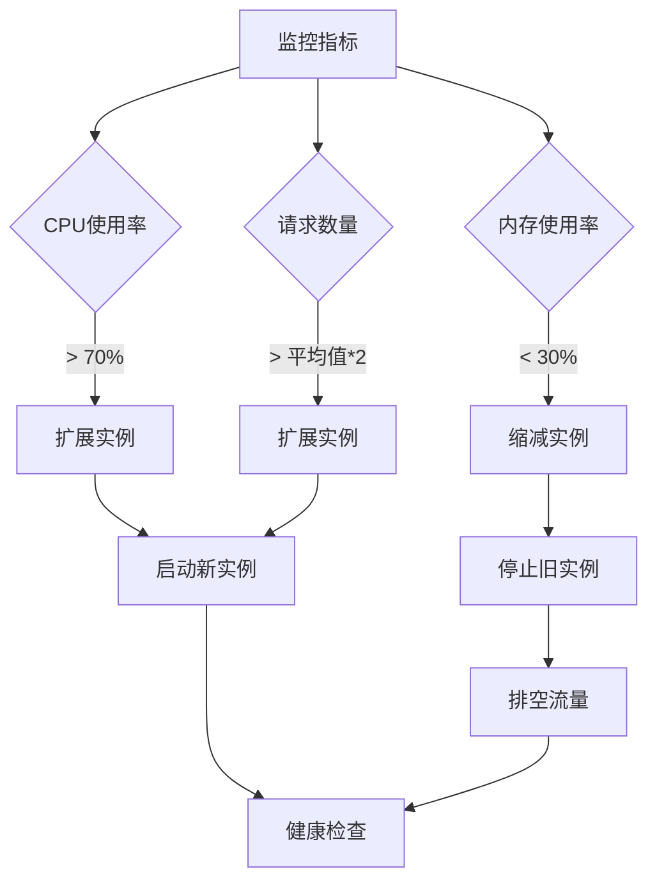

### 请求量扩展策略

基于请求量的自动扩展配置：

```python
# 基于请求量的扩展策略
request_based_scaling = {
    "policy_name": "request-scaling",
    "adjustment_type": "PercentChangeInCapacity",
    "scaling_adjustment": 50,  # 增加50%容量
    "cooldown": 300,
    "metric_type": "RequestCountPerTarget",
    "statistic": "Average",
    "unit": "Count",
    "period": 300,
    "evaluation_periods": 2,
    "threshold": 1000
}
```

## 监控方案

### Prometheus 集成

Agno 提供了内置的指标收集和暴露功能：

```python
# 指标路由配置
from agno.os.routers.metrics import get_metrics_router

# 添加指标端点到FastAPI应用
app.include_router(
    get_metrics_router(dbs=databases),
    prefix="/api/metrics",
    tags=["metrics"]
)
```

### 监控指标类型

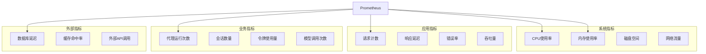

**图表来源**
- [metrics.py](file://libs/agno/agno/os/routers/metrics/metrics.py#L39-L68)
- [schemas.py](file://libs/agno/agno/os/routers/metrics/schemas.py#L1-L48)

### Grafana 可视化配置

```yaml
# Grafana仪表板配置示例
dashboard:
  title: "Agno生产监控"
  panels:
    - title: "CPU使用率"
      type: "graph"
      targets:
        - expr: "cpu_usage_percent"
          legendFormat: "{{instance}}"
    
    - title: "内存使用率"
      type: "graph"
      targets:
        - expr: "memory_usage_percent"
          legendFormat: "{{instance}}"
    
    - title: "请求延迟"
      type: "graph"
      targets:
        - expr: "histogram_quantile(0.95, rate(http_request_duration_seconds_bucket))"
          legendFormat: "95th percentile"
```

### 告警规则设置

```yaml
# Prometheus告警规则
groups:
  - name: agno_alerts
    rules:
      - alert: HighCPUUsage
        expr: cpu_usage_percent > 80
        for: 5m
        labels:
          severity: warning
        annotations:
          summary: "CPU使用率过高"
          description: "实例 {{ $labels.instance }} CPU使用率超过80%"
      
      - alert: HighMemoryUsage
        expr: memory_usage_percent > 85
        for: 3m
        labels:
          severity: critical
        annotations:
          summary: "内存使用率过高"
          description: "实例 {{ $labels.instance }} 内存使用率超过85%"
      
      - alert: HighErrorRate
        expr: rate(http_requests_total{status=~"5.."}[5m]) > 0.1
        for: 2m
        labels:
          severity: warning
        annotations:
          summary: "错误率过高"
          description: "实例 {{ $labels.instance }} 错误率超过10%"
```

**章节来源**
- [metrics.py](file://libs/agno/agno/os/routers/metrics/metrics.py#L1-L68)
- [schemas.py](file://libs/agno/agno/os/routers/metrics/schemas.py#L1-L48)

## 日志管理策略

### 结构化日志记录

Agno 提供了灵活的日志配置选项，支持结构化日志输出：

```python
# 自定义日志配置
from agno.utils.log import configure_agno_logging

# 配置自定义日志处理器
configure_agno_logging(
    custom_default_logger=custom_logger,
    custom_agent_logger=agent_logger,
    custom_team_logger=team_logger,
    custom_workflow_logger=workflow_logger
)
```

### 日志级别和格式

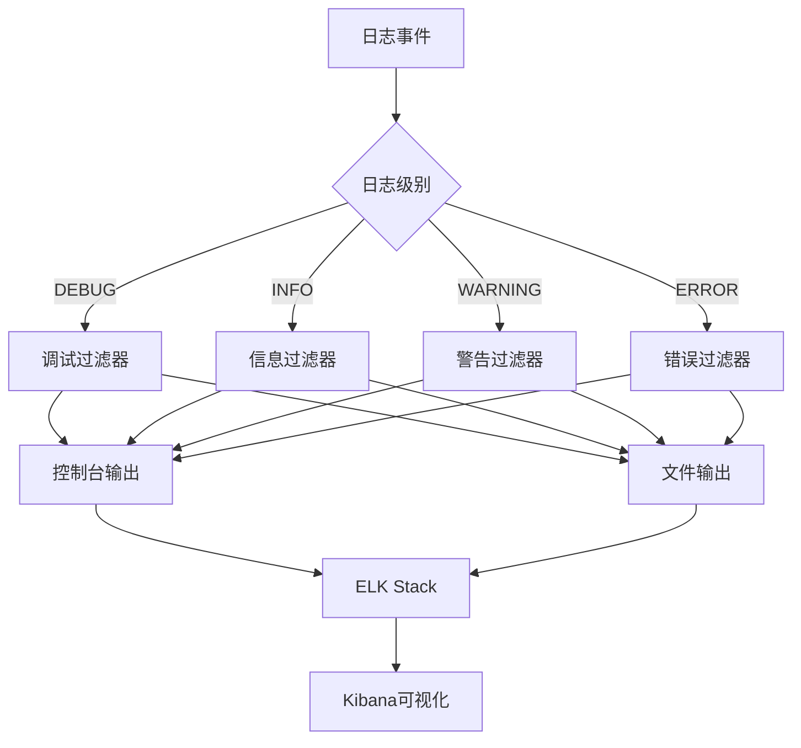

**图表来源**
- [log.py](file://libs/agno/agno/utils/log.py#L214-L253)

### ELK Stack 集成

```yaml
# Elasticsearch配置
elasticsearch:
  image: docker.elastic.co/elasticsearch/elasticsearch:8.11.0
  environment:
    - discovery.type=single-node
    - xpack.security.enabled=false
  ports:
    - "9200:9200"
  volumes:
    - es_data:/usr/share/elasticsearch/data

# Logstash配置
logstash:
  image: docker.elastic.co/logstash/logstash:8.11.0
  volumes:
    - ./logstash.conf:/usr/share/logstash/pipeline/logstash.conf
  ports:
    - "5044:5044"
  depends_on:
    - elasticsearch

# Kibana配置
kibana:
  image: docker.elastic.co/kibana/kibana:8.11.0
  ports:
    - "5601:5601"
  environment:
    - ELASTICSEARCH_HOSTS=http://elasticsearch:9200
  depends_on:
    - elasticsearch
```

### 日志聚合和分析

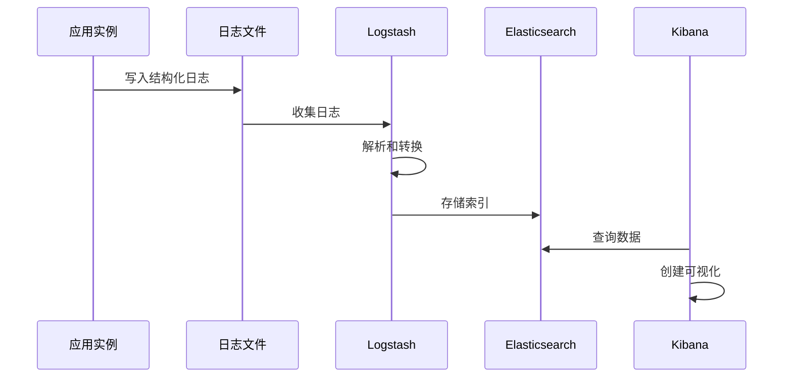

**章节来源**
- [log.py](file://libs/agno/agno/utils/log.py#L1-L48)

## 数据备份与灾难恢复

### 数据库备份策略

Agno 的 RDS 集成提供了完整的备份和恢复功能：

```python
# RDS备份配置
db_instance = DbInstance(
    name="agno-db",
    engine="postgresql",
    allocated_storage=100,
    db_instance_class="db.r5.large",
    backup_retention_period=7,  # 保留7天备份
    preferred_backup_window="02:00-03:00",  # 凌晨备份
    multi_az=True,  # 启用多可用区
    storage_encrypted=True,  # 启用存储加密
    deletion_protection=True  # 启用删除保护
)
```

### 备份监控和验证

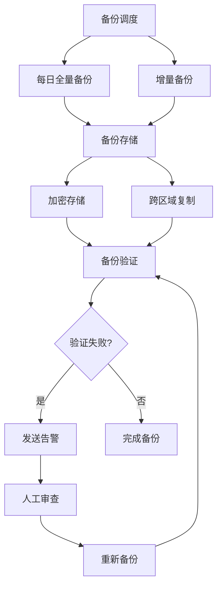

**图表来源**
- [db_instance.py](file://libs/agno_infra/agno/aws/resource/rds/db_instance.py#L300-L450)

### 灾难恢复计划

```yaml
# 灾难恢复流程
recovery_plan:
  stages:
    - stage: "检测阶段"
      actions:
        - "监控系统健康状态"
        - "检测备份完整性"
        - "验证监控告警"
    
    - stage: "评估阶段"
      actions:
        - "评估数据丢失程度"
        - "确定恢复优先级"
        - "准备恢复资源"
    
    - stage: "恢复阶段"
      actions:
        - "启动备用实例"
        - "恢复数据库"
        - "重建应用服务"
        - "验证功能正常"
    
    - stage: "验证阶段"
      actions:
        - "执行功能测试"
        - "验证数据完整性"
        - "监控系统性能"
        - "更新文档记录"
```

### 自动恢复配置

```python
# 自动恢复配置
auto_recovery = {
    "enable_auto_failover": True,
    "failover_timeout": 300,  # 5分钟超时
    "health_check_endpoint": "/health",
    "recovery_threshold": 3,  # 连续3次失败触发恢复
    "notification_channels": ["sns-topic", "slack-channel"]
}
```

**章节来源**
- [db_instance.py](file://libs/agno_infra/agno/aws/resource/rds/db_instance.py#L300-L450)

## 安全审计

### IAM 角色和权限管理

Agno 提供了完整的 IAM 角色和策略管理功能：

```python
# IAM角色配置
iam_role = IamRole(
    name="agno-ecs-role",
    assume_role_policy_document="""
    {
        "Version": "2012-10-17",
        "Statement": [
            {
                "Effect": "Allow",
                "Principal": {
                    "Service": "ecs-tasks.amazonaws.com"
                },
                "Action": "sts:AssumeRole"
            }
        ]
    }
    """,
    policies=[
        IamPolicy(
            name="agno-ecs-task-policy",
            policy_document="""
            {
                "Version": "2012-10-17",
                "Statement": [
                    {
                        "Effect": "Allow",
                        "Action": [
                            "logs:CreateLogGroup",
                            "logs:CreateLogStream",
                            "logs:PutLogEvents"
                        ],
                        "Resource": "*"
                    }
                ]
            }
            """
        )
    ]
)
```

### 安全组配置

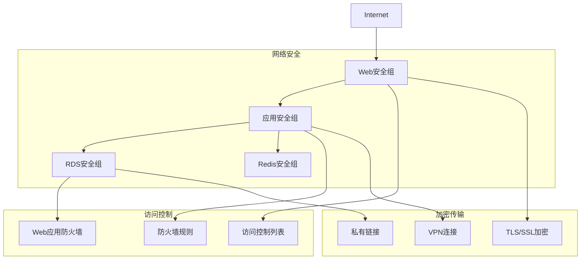

### 安全审计清单

```yaml
# 安全审计检查项
security_audit:
  iam_policies:
    - "检查最小权限原则"
    - "定期审查IAM角色"
    - "验证密钥轮换策略"
    - "监控异常权限变更"
  
  network_security:
    - "检查安全组规则"
    - "验证网络ACL配置"
    - "监控异常网络流量"
    - "定期更新防火墙规则"
  
  data_security:
    - "验证数据加密配置"
    - "检查备份加密"
    - "监控数据访问日志"
    - "定期安全扫描"
  
  compliance:
    - "满足合规要求"
    - "定期安全评估"
    - "更新安全策略"
    - "培训安全意识"
```

**章节来源**
- [role.py](file://libs/agno_infra/agno/aws/resource/iam/role.py#L1-L16)
- [policy.py](file://libs/agno_infra/agno/aws/resource/iam/policy.py#L1-L59)

## 性能优化

### 系统性能指标

Agno 内置了详细的性能监控功能，包括实例化时间和内存使用统计：

```python
# 性能监控配置
performance_monitoring = {
    "instantiation_time": {
        "avg": "3μs",
        "min": "1μs",
        "max": "10μs",
        "p95": "5μs"
    },
    "memory_footprint": {
        "avg": "6.5KB",
        "min": "4KB",
        "max": "10KB",
        "p95": "8KB"
    }
}
```

### 缓存策略

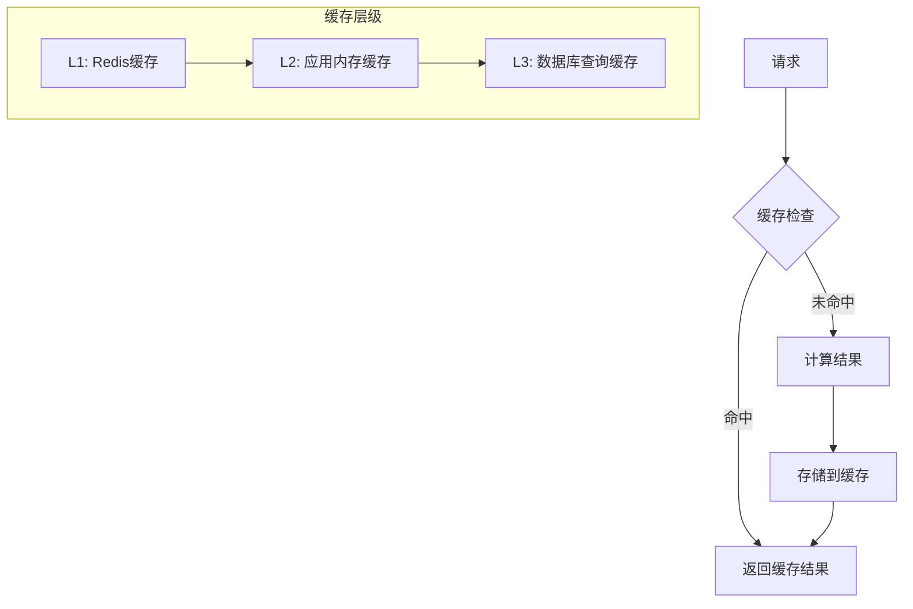

### 性能优化建议

1. **数据库优化**
   - 启用查询缓存
   - 优化索引策略
   - 定期维护统计信息

2. **应用优化**
   - 使用连接池
   - 实施异步处理
   - 优化序列化

3. **基础设施优化**
   - 选择合适的实例类型
   - 启用自动伸缩
   - 优化网络配置

## 故障排除指南

### 常见问题诊断

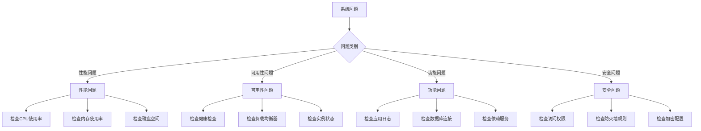

### 故障恢复流程

```python
# 故障恢复脚本示例
def handle_service_failure(service_name: str, failure_type: str):
    """处理服务故障的标准流程"""
    
    # 1. 立即通知
    notify_team(f"服务 {service_name} 发生 {failure_type} 故障")
    
    # 2. 自动恢复尝试
    if failure_type == "high_cpu":
        scale_up_instances()
    elif failure_type == "database_down":
        failover_to_read_replica()
    elif failure_type == "network_issue":
        switch_to_backup_network()
    
    # 3. 人工介入
    if not auto_resolved:
        escalate_to_engineering()
    
    # 4. 记录和分析
    document_incident()
    analyze_root_cause()
    update_prevention_measures()
```

### 监控告警配置

```yaml
# 关键监控指标告警
alerts:
  - name: "HighCPUUsage"
    condition: "cpu_usage_percent > 80"
    severity: "warning"
    duration: "5m"
  
  - name: "HighMemoryUsage"
    condition: "memory_usage_percent > 85"
    severity: "critical"
    duration: "3m"
  
  - name: "DatabaseConnectionFailed"
    condition: "db_connection_failed > 0"
    severity: "critical"
    duration: "1m"
  
  - name: "HighErrorRate"
    condition: "error_rate > 0.1"
    severity: "warning"
    duration: "2m"
```

## 总结

本文档提供了 Agno 在生产环境中的完整部署和运维最佳实践。通过遵循这些指导原则，您可以构建一个高可用、可扩展且安全的 Agno 生产环境。

### 关键要点

1. **高可用性**：采用多区域部署和负载均衡器配置
2. **自动扩展**：基于 CPU、内存和请求量的智能扩展策略
3. **监控体系**：集成 Prometheus 和 Grafana 实现全面监控
4. **日志管理**：使用 ELK Stack 进行日志聚合和分析
5. **数据安全**：实施完善的备份、恢复和安全审计机制
6. **性能优化**：持续监控和优化系统性能

### 下一步行动

1. 根据您的具体需求调整配置参数
2. 实施自动化部署和监控流程
3. 建立完善的故障响应机制
4. 定期进行安全审计和性能评估
5. 持续优化和改进系统架构

通过遵循这些最佳实践，您将能够成功地在生产环境中部署和运维 Agno，确保系统的稳定性和可靠性。