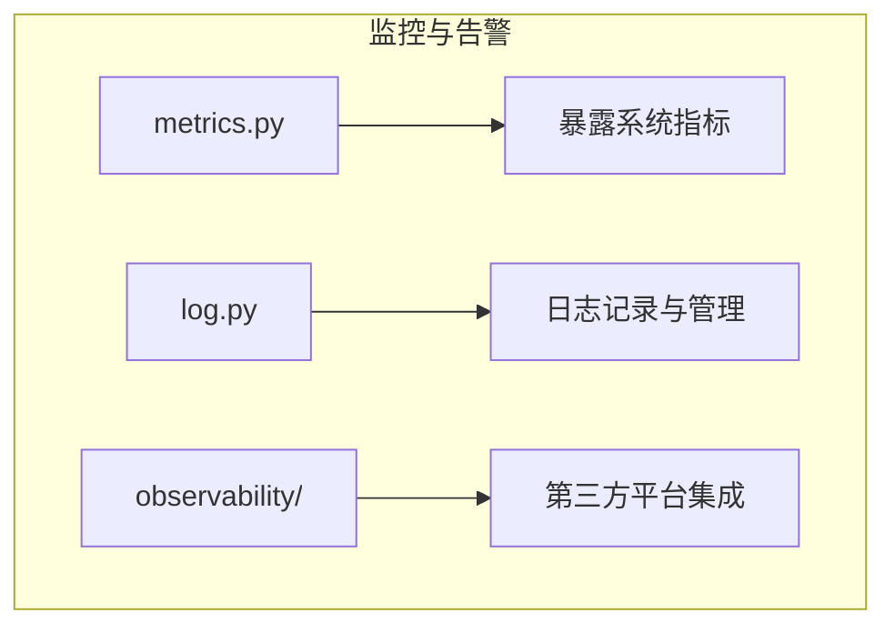
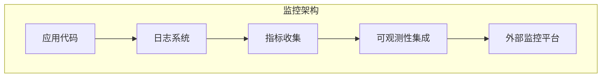
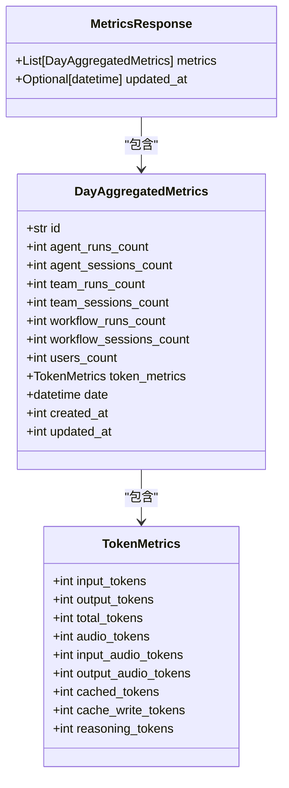
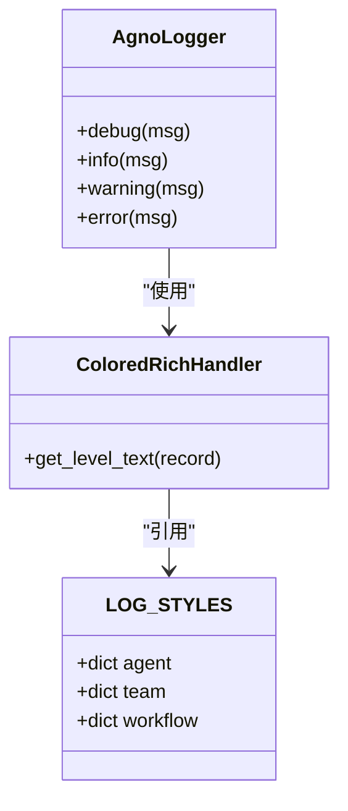
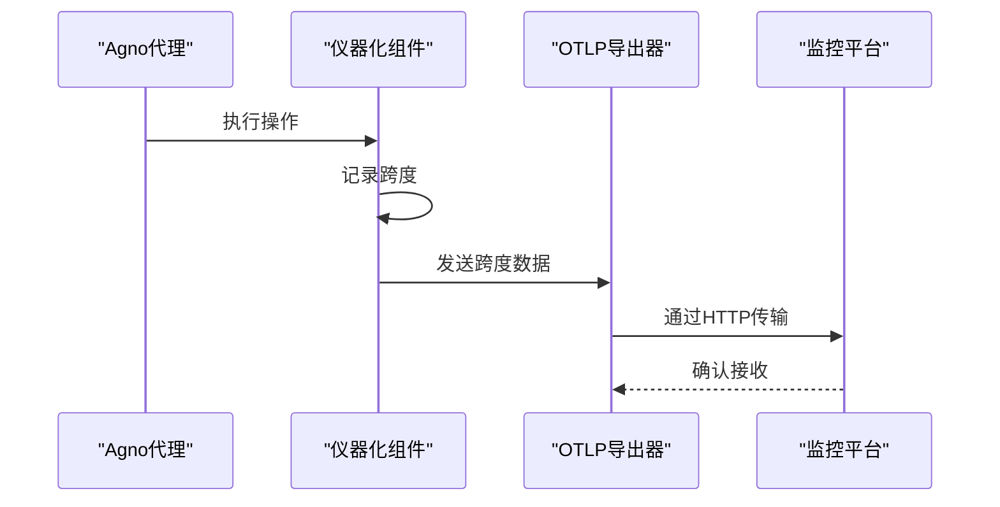
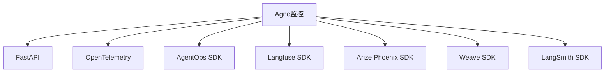

# 监控与告警

<cite>
**本文档引用的文件**
- [metrics.py](file://libs/agno/agno/os/routers/metrics/metrics.py)
- [log.py](file://libs/agno/agno/utils/log.py)
- [custom_logging_advanced.py](file://cookbook/agents/custom_logging/custom_logging_advanced.py)
- [agent_ops.py](file://cookbook/integrations/observability/agent_ops.py)
- [langfuse_via_openinference.py](file://cookbook/integrations/observability/langfuse_via_openinference.py)
- [arize_phoenix_via_openinference.py](file://cookbook/integrations/observability/arize_phoenix_via_openinference.py)
- [weave_op.py](file://cookbook/integrations/observability/weave_op.py)
- [langsmith_via_openinference.py](file://cookbook/integrations/observability/langsmith_via_openinference.py)
- [db_logging.py](file://cookbook/evals/performance/db_logging.py)
- [custom_tool_events.py](file://cookbook/tools/custom_tool_events.py)
</cite>

## 目录
1. [引言](#引言)
2. [项目结构](#项目结构)
3. [核心组件](#核心组件)
4. [架构概述](#架构概述)
5. [详细组件分析](#详细组件分析)
6. [依赖分析](#依赖分析)
7. [性能考量](#性能考量)
8. [故障排除指南](#故障排除指南)
9. [结论](#结论)

## 引言
本文档详细说明了Agno系统的监控与告警机制。文档涵盖了如何集成Prometheus进行指标收集，包括自定义指标的暴露方法。提供了Grafana仪表板的配置指南，展示关键性能指标如请求延迟、错误率和吞吐量。阐述了基于不同阈值（如CPU使用率、内存占用、请求失败率）设置告警规则的策略。介绍了如何将告警与Slack、邮件等通知渠道集成。提供了常见性能瓶颈的诊断流程和解决方案。

## 项目结构
Agno系统的监控与告警功能主要分布在`libs/agno/agno/os/routers/metrics/`目录下，该目录包含用于暴露系统指标的API路由。日志功能则位于`libs/agno/agno/utils/log.py`，提供了灵活的日志配置和输出机制。可观测性集成示例位于`cookbook/integrations/observability/`目录，展示了与多种监控平台的集成方法。

**Diagram sources**
- [metrics.py](file://libs/agno/agno/os/routers/metrics/metrics.py)
- [log.py](file://libs/agno/agno/utils/log.py)

**Section sources**
- [metrics.py](file://libs/agno/agno/os/routers/metrics/metrics.py)
- [log.py](file://libs/agno/agno/utils/log.py)

## 核心组件
Agno系统的核心监控组件包括指标路由、日志系统和可观测性集成。指标路由组件负责暴露系统的运行时指标，日志系统提供详细的运行日志，可观测性集成则允许将数据发送到第三方监控平台。

**Section sources**
- [metrics.py](file://libs/agno/agno/os/routers/metrics/metrics.py)
- [log.py](file://libs/agno/agno/utils/log.py)

## 架构概述
Agno系统的监控架构采用分层设计，底层是日志系统，中间层是指标收集，顶层是可观测性集成。日志系统负责记录详细的运行信息，指标收集组件定期汇总关键性能指标，可观测性集成则将这些数据发送到外部监控平台。

**Diagram sources**
- [metrics.py](file://libs/agno/agno/os/routers/metrics/metrics.py)
- [log.py](file://libs/agno/agno/utils/log.py)

## 详细组件分析

### 指标收集组件分析
指标收集组件通过FastAPI路由暴露系统指标，支持按日期范围查询和手动刷新指标。组件能够收集代理运行次数、会话次数、用户数量和令牌使用情况等关键指标。

**Diagram sources**
- [metrics.py](file://libs/agno/agno/os/routers/metrics/metrics.py)

**Section sources**
- [metrics.py](file://libs/agno/agno/os/routers/metrics/metrics.py)

### 日志系统分析
日志系统提供了灵活的日志配置选项，支持为不同组件（代理、团队、工作流）设置不同的日志记录器。系统支持多种日志级别，并提供了丰富的日志格式化选项。

**Diagram sources**
- [log.py](file://libs/agno/agno/utils/log.py)

**Section sources**
- [log.py](file://libs/agno/agno/utils/log.py)

### 可观测性集成分析
可观测性集成组件展示了如何将Agno系统与多种第三方监控平台集成，包括AgentOps、Langfuse、Arize Phoenix、Weave和LangSmith。这些集成通过OpenTelemetry标准协议实现，确保了数据的互操作性。

**Diagram sources**
- [agent_ops.py](file://cookbook/integrations/observability/agent_ops.py)
- [langfuse_via_openinference.py](file://cookbook/integrations/observability/langfuse_via_openinference.py)

**Section sources**
- [agent_ops.py](file://cookbook/integrations/observability/agent_ops.py)
- [langfuse_via_openinference.py](file://cookbook/integrations/observability/langfuse_via_openinference.py)

## 依赖分析
Agno系统的监控功能依赖于多个外部库，包括FastAPI用于API路由，OpenTelemetry用于标准化指标收集，以及各种第三方监控平台的SDK。这些依赖关系通过清晰的接口进行管理，确保了系统的可维护性和可扩展性。

**Diagram sources**
- [metrics.py](file://libs/agno/agno/os/routers/metrics/metrics.py)
- [agent_ops.py](file://cookbook/integrations/observability/agent_ops.py)

**Section sources**
- [metrics.py](file://libs/agno/agno/os/routers/metrics/metrics.py)
- [agent_ops.py](file://cookbook/integrations/observability/agent_ops.py)

## 性能考量
在性能方面，Agno系统的监控组件设计为低开销运行。指标收集采用异步方式，避免阻塞主应用流程。日志系统支持动态调整日志级别，可以在需要时开启详细日志记录，而在生产环境中保持较低的日志级别以减少性能影响。

**Section sources**
- [metrics.py](file://libs/agno/agno/os/routers/metrics/metrics.py)
- [log.py](file://libs/agno/agno/utils/log.py)

## 故障排除指南
当遇到监控问题时，首先检查日志系统是否正常工作，然后验证指标路由是否能够正确返回数据。对于第三方平台集成问题，检查API密钥配置和网络连接。使用提供的性能评估工具可以帮助识别和诊断性能瓶颈。

**Section sources**
- [log.py](file://libs/agno/agno/utils/log.py)
- [db_logging.py](file://cookbook/evals/performance/db_logging.py)

## 结论
Agno系统提供了全面的监控与告警功能，通过内置的指标收集、灵活的日志系统和广泛的第三方平台集成，确保了系统的可观测性和可维护性。这些功能共同构成了一个强大的监控体系，能够有效支持系统的稳定运行和持续优化。