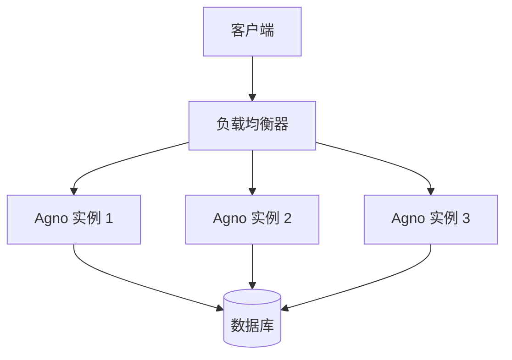
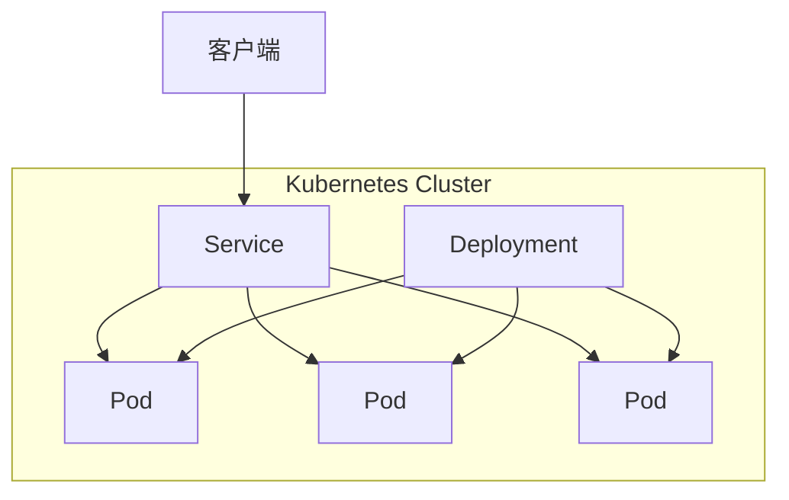
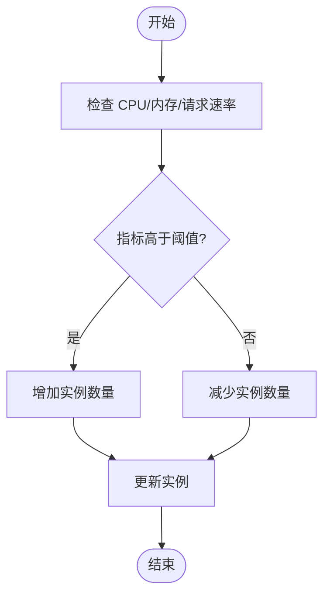
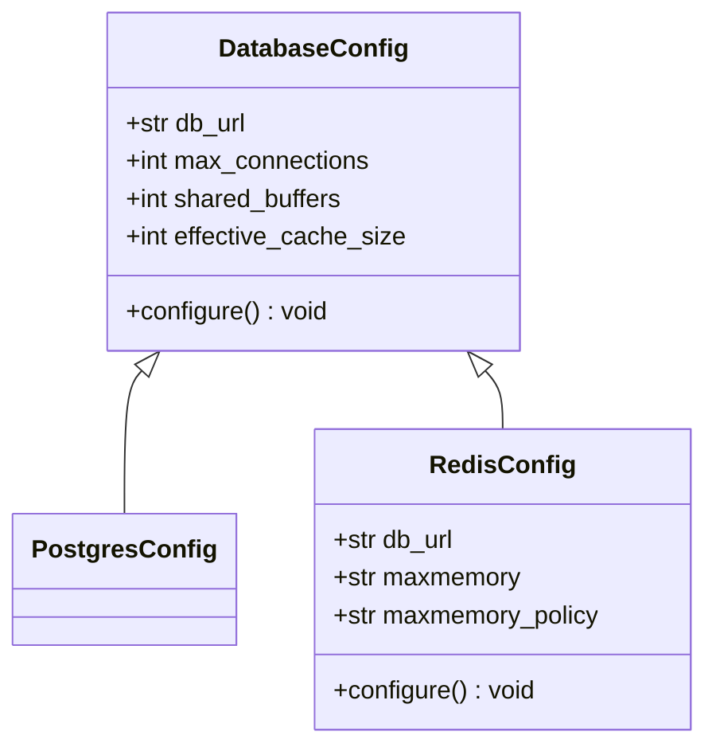
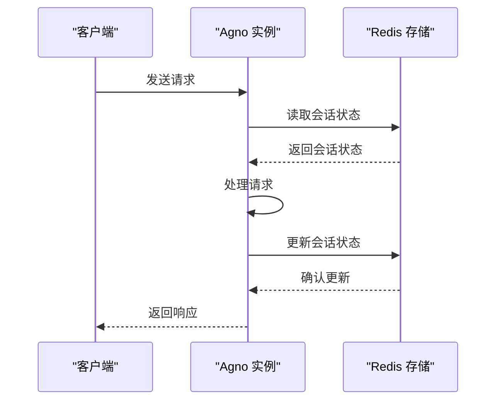

# 高可用性与扩展

<cite>
**本文档中引用的文件**  
- [config.yaml](file://cookbook/agent_os/os_config/config.yaml)
- [redis_for_agent.py](file://cookbook/db/redis/redis_for_agent.py)
- [postgres_for_agent.py](file://cookbook/db/postgres/postgres_for_agent.py)
- [run.py](file://cookbook/demo/run.py)
- [base.py](file://libs/agno_infra/agno/aws/app/base.py)
- [redis.py](file://libs/agno_infra/agno/docker/app/redis/redis.py)
- [postgres.py](file://libs/agno_infra/agno/docker/app/postgres/postgres.py)
</cite>

## 目录
1. [简介](#简介)
2. [负载均衡配置](#负载均衡配置)
3. [容器编排平台部署](#容器编排平台部署)
4. [自动扩展策略](#自动扩展策略)
5. [数据库连接池优化](#数据库连接池优化)
6. [会话状态外部存储](#会话状态外部存储)
7. [结论](#结论)

## 简介
Agno 是一个高性能的多智能体系统运行时环境，专为构建、运行和管理安全的多智能体系统而设计。本文档详细阐述了如何通过负载均衡器分发流量到多个 Agno 实例，如何在 Kubernetes 或 Docker Swarm 等容器编排平台中部署 Agno，以及如何配置基于 CPU、内存或请求速率的自动扩展策略。此外，本文还讨论了数据库连接池的优化和会话状态的外部存储（如 Redis）以支持水平扩展。

## 负载均衡配置
Agno 系统可以通过负载均衡器（如 Nginx 或云服务商的负载均衡）将流量分发到多个 Agno 实例，从而实现高可用性和扩展性。在 AWS 环境中，Agno Infra 框架支持通过 ECS（Elastic Container Service）和 ALB（Application Load Balancer）来实现负载均衡。



**Diagram sources**
- [base.py](file://libs/agno_infra/agno/aws/app/base.py#L89-L119)
- [base.py](file://libs/agno_infra/agno/aws/app/base.py#L227-L254)

**Section sources**
- [base.py](file://libs/agno_infra/agno/aws/app/base.py#L89-L119)
- [base.py](file://libs/agno_infra/agno/aws/app/base.py#L227-L254)

## 容器编排平台部署
Agno 可以在 Kubernetes 或 Docker Swarm 等容器编排平台中部署。Agno Infra 提供了对 Docker 和 AWS 的支持，使得部署过程更加简便。

### Docker 部署
使用 Agno Infra 的 CLI 工具，可以轻松创建和部署基于 Docker 的 Agno 实例。

```bash
# 创建新的 agent 基础设施项目
ag create my-agent-infra --template agent-infra-docker

# 导航到项目目录
cd my-agent-infra

# 部署基础设施
ag deploy
```

### Kubernetes 部署
虽然当前代码库中没有直接的 Kubernetes 配置文件，但可以通过将 Agno 应用打包为 Docker 镜像，并使用 Kubernetes 的 Deployment 和 Service 资源来部署。



**Diagram sources**
- [base.py](file://libs/agno_infra/agno/aws/app/base.py#L600-L740)
- [run.py](file://cookbook/demo/run.py#L0-L36)

**Section sources**
- [base.py](file://libs/agno_infra/agno/aws/app/base.py#L600-L740)
- [run.py](file://cookbook/demo/run.py#L0-L36)

## 自动扩展策略
Agno 系统可以根据 CPU、内存或请求速率等指标进行自动扩展。在 AWS 环境中，可以通过 ECS 的自动扩展功能来实现。

### 基于 CPU 和内存的自动扩展
在 ECS 中，可以配置基于 CPU 和内存使用率的自动扩展策略。当实例的 CPU 或内存使用率超过预设阈值时，ECS 会自动增加实例数量。

### 基于请求速率的自动扩展
通过监控负载均衡器的请求速率，可以配置自动扩展策略。当请求速率超过预设阈值时，系统会自动增加 Agno 实例的数量。



**Diagram sources**
- [base.py](file://libs/agno_infra/agno/aws/app/base.py#L600-L740)
- [redis.py](file://libs/agno_infra/agno/docker/app/redis/redis.py#L0-L46)

**Section sources**
- [base.py](file://libs/agno_infra/agno/aws/app/base.py#L600-L740)
- [redis.py](file://libs/agno_infra/agno/docker/app/redis/redis.py#L0-L46)

## 数据库连接池优化
为了支持高并发访问，Agno 系统需要优化数据库连接池。通过合理配置连接池的大小和超时时间，可以有效提高系统的性能和稳定性。

### PostgreSQL 连接池配置
在 PostgreSQL 中，可以通过调整 `max_connections`、`shared_buffers` 和 `effective_cache_size` 等参数来优化连接池。

### Redis 连接池配置
在 Redis 中，可以通过调整 `maxmemory` 和 `maxmemory-policy` 等参数来优化连接池。



**Diagram sources**
- [postgres.py](file://libs/agno_infra/agno/docker/app/postgres/postgres.py#L0-L40)
- [redis.py](file://libs/agno_infra/agno/docker/app/redis/redis.py#L0-L46)

**Section sources**
- [postgres.py](file://libs/agno_infra/agno/docker/app/postgres/postgres.py#L0-L40)
- [redis.py](file://libs/agno_infra/agno/docker/app/redis/redis.py#L0-L46)

## 会话状态外部存储
为了支持水平扩展，Agno 系统需要将会话状态存储在外部存储中，如 Redis。这样可以确保多个实例之间的会话状态一致性。

### Redis 作为会话存储
通过将 Redis 用作会话存储，可以实现会话状态的集中管理。每个 Agno 实例都可以从 Redis 中读取和写入会话数据。

```python
from agno.db.redis import RedisDb

# 初始化 Redis 数据库
db = RedisDb(db_url="redis://localhost:6379")

# 创建智能体并使用 Redis 数据库
agent = Agent(
    db=db,
    tools=[DuckDuckGoTools()],
    add_history_to_context=True,
)
```



**Diagram sources**
- [redis_for_agent.py](file://cookbook/db/redis/redis_for_agent.py#L0-L40)
- [redis.py](file://libs/agno_infra/agno/docker/app/redis/redis.py#L0-L46)

**Section sources**
- [redis_for_agent.py](file://cookbook/db/redis/redis_for_agent.py#L0-L40)
- [redis.py](file://libs/agno_infra/agno/docker/app/redis/redis.py#L0-L46)

## 结论
通过合理配置负载均衡器、容器编排平台、自动扩展策略、数据库连接池和会话状态外部存储，Agno 系统可以实现高可用性和扩展性。这些配置不仅提高了系统的性能和稳定性，还为大规模部署提供了坚实的基础。