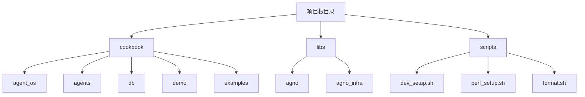

# 部署指南

<cite>
**本文档中引用的文件**  
- [dev_setup.sh](file://scripts/dev_setup.sh)
- [pyproject.toml](file://libs/agno_infra/pyproject.toml)
- [README.md](file://libs/agno_infra/README.md)
- [run.py](file://cookbook/demo/run.py)
- [config.yaml](file://cookbook/demo/config.yaml)
- [run_pgvector.sh](file://cookbook/scripts/run_pgvector.sh)
- [run_redis.sh](file://cookbook/scripts/run_redis.sh)
- [run_qdrant.sh](file://cookbook/scripts/run_qdrant.sh)
- [run_mongodb.sh](file://cookbook/scripts/run_mongodb.sh)
- [run_clickhouse.sh](file://cookbook/scripts/run_clickhouse.sh)
- [run_cassandra.sh](file://cookbook/scripts/run_cassandra.sh)
- [run_surrealdb.sh](file://cookbook/scripts/run_surrealdb.sh)
- [run_weaviate.sh](file://cookbook/scripts/run_weaviate.sh)
- [run_singlestore.sh](file://cookbook/scripts/run_singlestore.sh)
- [run_mysql.sh](file://cookbook/scripts/run_mysql.sh)
</cite>

## 目录
1. [简介](#简介)
2. [项目结构](#项目结构)
3. [Docker容器化部署](#docker容器化部署)
4. [主流云平台部署](#主流云平台部署)
5. [自动化部署脚本](#自动化部署脚本)
6. [生产环境最佳实践](#生产环境最佳实践)
7. [故障排查](#故障排查)
8. [结论](#结论)

## 简介
Agno是一个高性能的多智能体系统运行时环境，专为构建、运行和管理安全的多智能体系统而设计。本部署指南将详细介绍如何将Agno应用部署到各种环境，包括使用Docker进行容器化部署、在主流云平台（如AWS、GCP、Azure）上的部署方法、自动化部署脚本的使用说明，以及生产环境的最佳实践。

Agno的核心优势在于其AgentOS运行时环境，它提供了预构建的FastAPI应用程序，使开发者能够快速启动产品开发。同时，Agno的控制平面直接连接到AgentOS，为系统测试、监控和管理提供了无与伦比的可见性和控制力。最重要的是，AgentOS在用户的云环境中运行，确保数据隐私，因为没有任何数据会离开用户的系统。

本指南将帮助开发者和运维人员全面了解Agno的部署流程，从本地开发环境的搭建到生产环境的配置，涵盖所有必要的步骤和最佳实践。

## 项目结构
Agno项目的目录结构清晰地组织了各个组件，便于管理和扩展。项目根目录包含cookbook、libs、scripts等主要目录，每个目录都有特定的用途。



**Diagram sources**  
- [README.md](file://README.md)

**Section sources**  
- [README.md](file://README.md)

## Docker容器化部署
Docker容器化部署是Agno应用部署的重要方式之一，它提供了环境一致性、可移植性和易于管理的优势。本节将详细介绍如何使用Docker部署Agno应用，包括Dockerfile示例和docker-compose配置。

### Docker部署准备
在开始Docker部署之前，需要确保系统中已安装Docker Desktop。对于macOS用户，可以从[Docker官网](https://docs.docker.com/desktop/install/mac-install/)下载并安装Docker Desktop。

### Dockerfile示例
虽然Agno项目中没有直接提供Dockerfile，但可以根据项目结构和依赖关系创建一个。以下是一个基本的Dockerfile示例：

```dockerfile
FROM python:3.12-slim

WORKDIR /app

COPY requirements.txt .
RUN pip install --no-cache-dir -r requirements.txt

COPY . .

CMD ["python", "cookbook/demo/run.py"]
```

### docker-compose配置
Agno项目中虽然没有直接的docker-compose.yml文件，但可以通过组合多个服务来创建一个完整的部署配置。以下是一个示例docker-compose.yml文件：

```yaml
version: '3.8'

services:
  agno-app:
    build: .
    ports:
      - "7777:7777"
    environment:
      - ANTHROPIC_API_KEY=${ANTHROPIC_API_KEY}
      - OPENAI_API_KEY=${OPENAI_API_KEY}
    depends_on:
      - pgvector
      - redis
      - qdrant

  pgvector:
    image: agnohq/pgvector:16
    environment:
      - POSTGRES_DB=ai
      - POSTGRES_USER=ai
      - POSTGRES_PASSWORD=ai
    volumes:
      - pgvolume:/var/lib/postgresql/data
    ports:
      - "5532:5432"

  redis:
    image: redis:7-alpine
    ports:
      - "6379:6379"

  qdrant:
    image: qdrant/qdrant:v1.10.0
    ports:
      - "6333:6333"
    volumes:
      - qdrant_storage:/qdrant/storage

volumes:
  pgvolume:
  qdrant_storage:
```

### 启动Docker服务
使用以下命令启动所有服务：

```bash
docker-compose up -d
```

这将以后台模式启动所有定义的服务。可以通过`docker ps`命令检查服务状态。

**Section sources**  
- [run_pgvector.sh](file://cookbook/scripts/run_pgvector.sh)
- [run_redis.sh](file://cookbook/scripts/run_redis.sh)
- [run_qdrant.sh](file://cookbook/scripts/run_qdrant.sh)

## 主流云平台部署
Agno应用可以在多个主流云平台上部署，包括AWS、GCP和Azure。本节将介绍在这些平台上部署Agno的必要基础设施设置和安全配置。

### AWS部署
Agno Infra提供了对AWS的全面支持，可以通过CLI工具轻松管理AWS资源。以下是AWS部署的关键步骤：

1. **配置AWS凭证**：确保AWS CLI已正确配置，或者通过环境变量设置AWS访问密钥和秘密密钥。

2. **创建基础设施**：使用Agno Infra CLI创建基础设施：
   ```bash
   ag create my-agno-app --template agent-infra-aws
   cd my-agno-app
   ```

3. **部署资源**：部署所需的AWS资源：
   ```bash
   ag deploy
   ```

4. **管理资源**：AWS支持的资源包括EC2实例、RDS数据库、S3存储桶、ECS集群等。可以通过CLI命令管理这些资源。

### GCP部署
虽然项目中没有直接的GCP部署脚本，但可以通过类似的方法在GCP上部署Agno应用：

1. **配置GCP凭证**：安装Google Cloud SDK并配置服务账户。

2. **创建虚拟机**：使用Compute Engine创建虚拟机实例。

3. **部署应用**：将Agno应用部署到虚拟机上，可以使用Docker或直接安装依赖。

4. **配置数据库**：使用Cloud SQL for PostgreSQL或Cloud Firestore作为后端数据库。

### Azure部署
Azure部署可以利用Azure Container Instances或Azure Kubernetes Service：

1. **创建资源组**：在Azure门户中创建新的资源组。

2. **部署容器**：使用Azure Container Registry存储Docker镜像，并通过Azure Container Instances运行。

3. **配置网络**：设置虚拟网络和安全组规则，确保应用的安全访问。

4. **监控和日志**：集成Azure Monitor和Log Analytics进行应用监控。

**Section sources**  
- [pyproject.toml](file://libs/agno_infra/pyproject.toml)
- [README.md](file://libs/agno_infra/README.md)

## 自动化部署脚本
Agno项目提供了一系列自动化部署脚本，简化了开发和部署流程。这些脚本位于`scripts`目录下，涵盖了从环境设置到性能测试的各个方面。

### 开发环境设置脚本
`dev_setup.sh`脚本用于创建虚拟环境并安装所有必要的依赖：

```bash
#!/bin/bash

CURR_DIR="$(cd "$(dirname "${BASH_SOURCE[0]}")" && pwd)"
REPO_ROOT="$(dirname "${CURR_DIR}")"
AGNO_DIR="${REPO_ROOT}/libs/agno"
AGNO_INFRA_DIR="${REPO_ROOT}/libs/agno_infra"
source "${CURR_DIR}/_utils.sh"

VENV_DIR="${REPO_ROOT}/.venv"
PYTHON_VERSION=$(python3 --version)

print_heading "Development setup..."

print_heading "Removing virtual env"
print_info "rm -rf ${VENV_DIR}"
rm -rf ${VENV_DIR}

print_heading "Creating virtual env"
print_info "VIRTUAL_ENV=${VENV_DIR} uv venv --python 3.12"
VIRTUAL_ENV=${VENV_DIR} uv venv --python 3.12

print_heading "Installing agno"
print_info "VIRTUAL_ENV=${VENV_DIR} uv pip install -r ${AGNO_DIR}/requirements.txt"
VIRTUAL_ENV=${VENV_DIR} uv pip install -r ${AGNO_DIR}/requirements.txt

print_heading "Installing agno in editable mode with tests dependencies"
VIRTUAL_ENV=${VENV_DIR} uv pip install -U -e ${AGNO_DIR}[tests]
VIRTUAL_ENV=${VENV_DIR} uv pip install yfinance

print_heading "Installing agno-os"
print_info "VIRTUAL_ENV=${VENV_DIR} uv pip install -r ${AGNO_INFRA_DIR}/requirements.txt"
VIRTUAL_ENV=${VENV_DIR} uv pip install -r ${AGNO_INFRA_DIR}/requirements.txt

print_heading "Installing agno-os in editable mode with dev dependencies"
VIRTUAL_ENV=${VENV_DIR} uv pip install -e ${AGNO_INFRA_DIR}[dev]
```

### 数据库启动脚本
项目提供了一系列脚本用于启动各种数据库服务：

- `run_pgvector.sh`：启动PostgreSQL with PgVector
- `run_redis.sh`：启动Redis
- `run_qdrant.sh`：启动Qdrant向量数据库
- `run_mongodb.sh`：启动MongoDB
- `run_clickhouse.sh`：启动ClickHouse
- `run_cassandra.sh`：启动Cassandra
- `run_surrealdb.sh`：启动SurrealDB
- `run_weaviate.sh`：启动Weaviate
- `run_singlestore.sh`：启动SingleStore
- `run_mysql.sh`：启动MySQL

这些脚本简化了本地开发环境的数据库设置，确保开发者可以快速启动和测试应用。

**Section sources**  
- [dev_setup.sh](file://scripts/dev_setup.sh)
- [run_pgvector.sh](file://cookbook/scripts/run_pgvector.sh)
- [run_redis.sh](file://cookbook/scripts/run_redis.sh)
- [run_qdrant.sh](file://cookbook/scripts/run_qdrant.sh)
- [run_mongodb.sh](file://cookbook/scripts/run_mongodb.sh)
- [run_clickhouse.sh](file://cookbook/scripts/run_clickhouse.sh)
- [run_cassandra.sh](file://cookbook/scripts/run_cassandra.sh)
- [run_surrealdb.sh](file://cookbook/scripts/run_surrealdb.sh)
- [run_weaviate.sh](file://cookbook/scripts/run_weaviate.sh)
- [run_singlestore.sh](file://cookbook/scripts/run_singlestore.sh)
- [run_mysql.sh](file://cookbook/scripts/run_mysql.sh)

## 生产环境最佳实践
在生产环境中部署Agno应用时，需要考虑负载均衡、自动扩展、监控和日志聚合等关键因素，以确保系统的高可用性和可维护性。

### 负载均衡
使用负载均衡器（如AWS ELB、GCP Cloud Load Balancing或Azure Load Balancer）分发流量到多个Agno应用实例。这不仅可以提高系统的可用性，还能实现横向扩展。

### 自动扩展
配置自动扩展策略，根据CPU使用率、内存使用率或请求速率动态调整应用实例的数量。这可以确保系统在高负载时有足够的资源处理请求，而在低负载时节省成本。

### 监控（Prometheus/Grafana）
集成Prometheus和Grafana进行系统监控：

1. **Prometheus**：收集和存储时间序列数据，包括CPU、内存、磁盘I/O等指标。
2. **Grafana**：可视化监控数据，创建仪表板以实时查看系统状态。
3. **Alertmanager**：配置告警规则，在系统出现异常时及时通知运维人员。

### 日志聚合（ELK Stack）
使用ELK Stack（Elasticsearch、Logstash、Kibana）进行日志聚合：

1. **Filebeat**：在每个应用实例上安装Filebeat，收集日志文件并发送到Logstash。
2. **Logstash**：处理和过滤日志数据，然后将其存储到Elasticsearch中。
3. **Elasticsearch**：存储和索引日志数据，支持快速搜索和分析。
4. **Kibana**：提供日志数据的可视化界面，便于故障排查和性能分析。

### 安全配置
1. **网络隔离**：使用VPC或虚拟网络隔离应用组件，限制不必要的网络访问。
2. **身份验证和授权**：实施严格的身份验证和授权机制，确保只有授权用户和系统可以访问敏感资源。
3. **数据加密**：对静态数据和传输中的数据进行加密，保护数据隐私。
4. **定期安全审计**：定期进行安全审计和漏洞扫描，及时发现和修复安全问题。

**Section sources**  
- [pyproject.toml](file://libs/agno_infra/pyproject.toml)
- [README.md](file://libs/agno_infra/README.md)

## 故障排查
在部署和运行Agno应用时，可能会遇到各种问题。以下是一些常见问题及其解决方案：

### Docker连接被拒绝
**问题**：Docker容器无法连接到数据库或其他服务。
**解决方案**：
1. 检查容器是否正在运行：`docker ps`
2. 检查端口映射是否正确：`docker inspect <container_name>`
3. 确保防火墙规则允许必要的端口通信。

### API密钥未设置
**问题**：应用无法访问外部API（如Anthropic、OpenAI）。
**解决方案**：
1. 确保环境变量已正确设置：`export ANTHROPIC_API_KEY=your_key`
2. 在docker-compose.yml中添加环境变量：
   ```yaml
   environment:
     - ANTHROPIC_API_KEY=${ANTHROPIC_API_KEY}
   ```

### 数据库连接失败
**问题**：应用无法连接到数据库。
**解决方案**：
1. 检查数据库服务是否正在运行。
2. 验证数据库连接字符串是否正确。
3. 检查网络配置，确保应用可以访问数据库。

### 性能问题
**问题**：应用响应缓慢或超时。
**解决方案**：
1. 使用性能监控工具（如Prometheus）分析系统瓶颈。
2. 优化数据库查询和索引。
3. 增加应用实例数量以分担负载。

### 内存不足
**问题**：应用因内存不足而崩溃。
**解决方案**：
1. 增加容器的内存限制。
2. 优化应用代码，减少内存使用。
3. 使用内存分析工具（如memory_profiler）识别内存泄漏。

**Section sources**  
- [run.py](file://cookbook/demo/run.py)
- [config.yaml](file://cookbook/demo/config.yaml)

## 结论
本部署指南详细介绍了如何将Agno应用部署到各种环境，涵盖了从本地开发到生产环境的完整流程。通过使用Docker容器化部署、在主流云平台上部署、利用自动化部署脚本以及遵循生产环境最佳实践，开发者和运维人员可以高效地部署和管理Agno应用。

Agno的AgentOS运行时环境为多智能体系统的开发和部署提供了强大的支持，其高性能、数据隐私和易用性使其成为构建复杂AI应用的理想选择。通过遵循本指南中的步骤和最佳实践，可以确保Agno应用在各种环境中稳定、高效地运行。