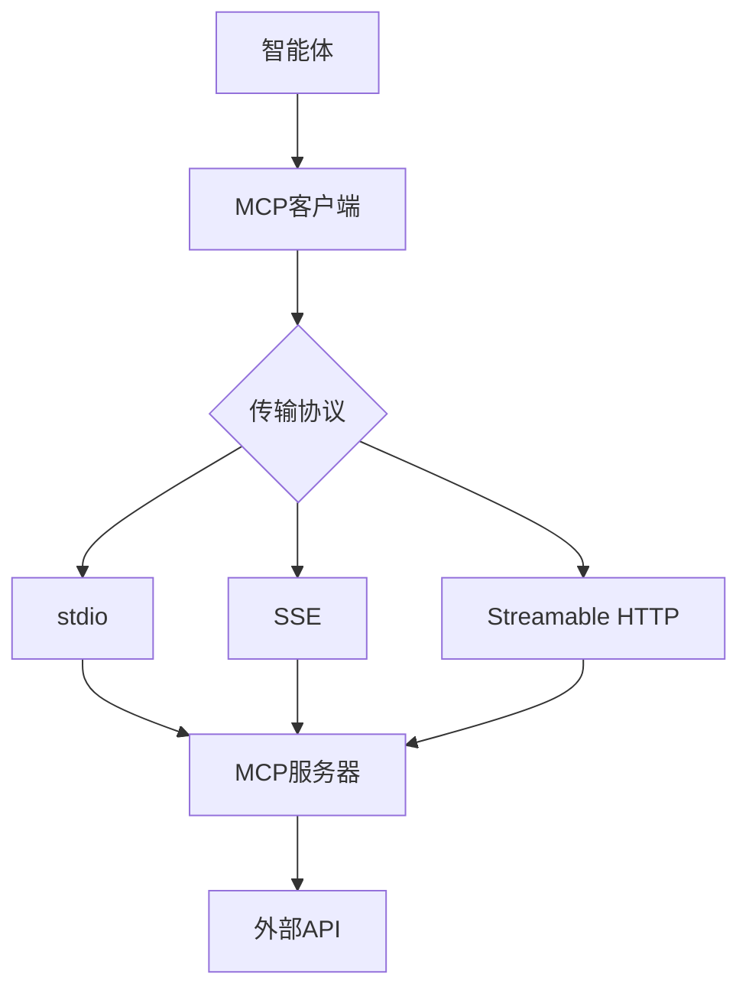
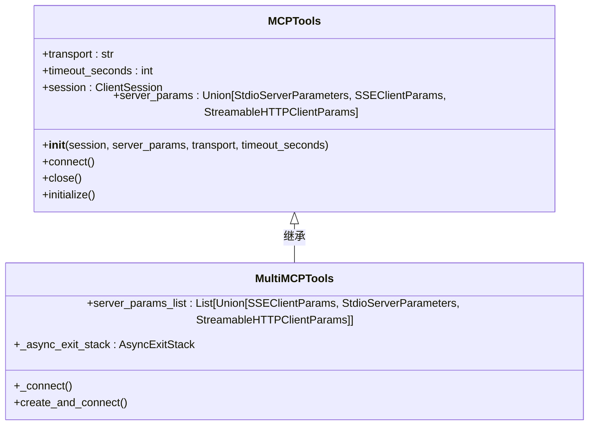
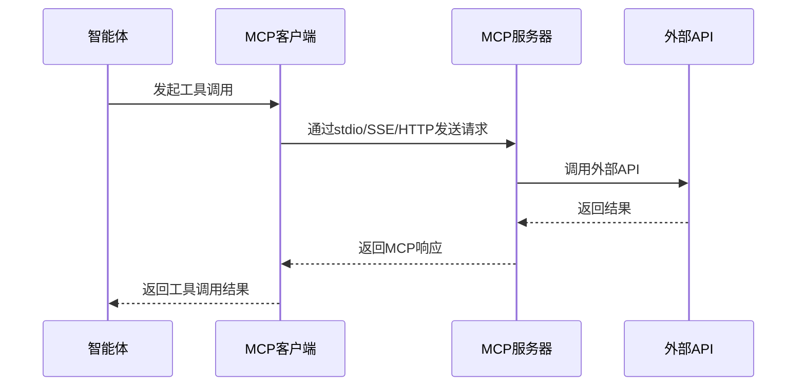
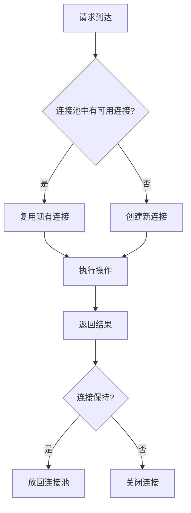

# MCP与外部API

<cite>
**本文档中引用的文件**  
- [mcp.py](file://libs/agno/agno/tools/mcp.py)
- [mcp_client.py](file://cookbook/examples/streamlit_apps/mcp_agent/mcp_client.py)
- [enable_mcp_example.py](file://cookbook/agent_os/mcp/enable_mcp_example.py)
- [mcp_tools_advanced_example.py](file://cookbook/agent_os/mcp/mcp_tools_advanced_example.py)
- [test_client.py](file://cookbook/agent_os/mcp/test_client.py)
- [github.py](file://cookbook/tools/mcp/github.py)
- [stripe.py](file://cookbook/tools/mcp/stripe.py)
- [notion_mcp_agent.py](file://cookbook/tools/mcp/notion_mcp_agent.py)
</cite>

## 目录
1. [引言](#引言)
2. [MCP协议概述](#mcp协议概述)
3. [核心组件分析](#核心组件分析)
4. [MCP工具定义与注册](#mcp工具定义与注册)
5. [同步与异步调用模式](#同步与异步调用模式)
6. [常见外部API集成示例](#常见外部api集成示例)
7. [MCP服务器与客户端实现](#mcp服务器与客户端实现)
8. [部署模式](#部署模式)
9. [高级主题](#高级主题)
10. [结论](#结论)

## 引言
Model Context Protocol（MCP）是一种标准化接口协议，用于智能体与外部工具和服务之间的通信。本文档详细介绍了MCP协议如何作为智能体与外部工具通信的标准接口，涵盖MCP工具的定义、注册和调用方法，包括同步和异步调用模式。通过具体示例展示如何集成GitHub、Stripe、Notion等常见外部API，并说明MCP服务器和客户端的实现方式以及在本地或分布式环境中的部署方法。同时涵盖安全性、认证、错误处理和流式传输等高级主题，帮助开发者构建可扩展的外部服务集成。

## MCP协议概述

MCP（Model Context Protocol）是一个开放协议，旨在为AI智能体提供统一的接口来访问外部工具和服务。该协议通过标准化的通信机制，使智能体能够无缝集成各种外部API，包括数据库、文件系统、支付网关、代码仓库等。

MCP协议的核心优势在于其解耦特性：智能体无需了解具体API的实现细节，只需通过标准化的MCP接口进行交互。这种设计模式提高了系统的可维护性和可扩展性，允许开发者轻松添加新的工具和服务。



**图示来源**  
- [mcp.py](file://libs/agno/agno/tools/mcp.py#L30-L87)

## 核心组件分析

MCP架构由几个关键组件构成：MCP客户端、MCP服务器、工具注册机制和通信协议。这些组件协同工作，实现智能体与外部服务的安全、高效通信。

### MCP工具包（MCPTools）
`MCPTools`类是MCP集成的核心，它作为智能体与MCP服务器之间的桥梁。该类支持多种初始化方式，包括直接会话连接、stdio传输、SSE和Streamable HTTP连接。



**图示来源**  
- [mcp.py](file://libs/agno/agno/tools/mcp.py#L30-L87)

**本节来源**  
- [mcp.py](file://libs/agno/agno/tools/mcp.py#L30-L612)

## MCP工具定义与注册

MCP工具的定义和注册过程是实现外部服务集成的关键步骤。开发者需要通过特定的配置将外部API封装为MCP工具，然后在智能体中注册这些工具。

### 工具定义
MCP工具通过命令行或URL方式定义。对于基于Node.js的MCP服务器，通常使用`npx`命令启动；对于远程MCP服务器，则通过URL连接。

```python
# 示例：定义Brave搜索MCP工具
brave_mcp_tools = MCPTools(
    command="npx -y @modelcontextprotocol/server-brave-search",
    env={"BRAVE_API_KEY": getenv("BRAVE_API_KEY")},
    timeout_seconds=60,
)
```

### 工具注册
工具注册通过将MCPTools实例添加到智能体的工具列表中完成。智能体在初始化时会自动发现并注册MCP服务器提供的所有可用工具。

```python
ai_framework_agent = Agent(
    id="agno-support-agent",
    name="Agno Support Agent",
    model=Claude(id="claude-sonnet-4-0"),
    db=db,
    tools=[brave_mcp_tools, agno_mcp_tools],  # 注册MCP工具
    add_history_to_context=True,
    num_history_runs=3,
    markdown=True,
)
```

**本节来源**  
- [mcp_tools_advanced_example.py](file://cookbook/agent_os/mcp/mcp_tools_advanced_example.py#L0-L66)
- [mcp.py](file://libs/agno/agno/tools/mcp.py#L30-L612)

## 同步与异步调用模式

MCP支持同步和异步两种调用模式，以适应不同的应用场景和性能需求。

### 异步调用模式
异步模式是推荐的调用方式，特别是在处理长时间运行的操作或需要流式响应的场景中。

```python
async def run_agent(message: str) -> None:
    async with MCPTools(
        transport="streamable-http", 
        url="http://localhost:7777/mcp", 
        timeout_seconds=60
    ) as mcp_tools:
        agent = Agent(
            tools=[mcp_tools],
            instructions="...",
            markdown=True,
        )
        await agent.aprint_response(message, stream=True)
```

### 同步调用注意事项
虽然MCP主要设计为异步架构，但可以通过事件循环在同步代码中调用异步方法。然而，这种混合模式可能导致资源管理问题，建议尽量避免。

**本节来源**  
- [test_client.py](file://cookbook/agent_os/mcp/test_client.py#L0-L81)
- [mcp.py](file://libs/agno/agno/tools/mcp.py#L30-L612)

## 常见外部API集成示例

### GitHub集成
通过MCP集成GitHub API，智能体可以查询仓库信息、管理问题和拉取请求。

```python
async def run_agent(message: str) -> None:
    server_params = StdioServerParameters(
        command="npx",
        args=["-y", "@modelcontextprotocol/server-github"],
    )
    
    async with MCPTools(server_params=server_params) as mcp_tools:
        agent = Agent(
            tools=[mcp_tools],
            instructions="You are a GitHub assistant...",
            markdown=True,
        )
        await agent.aprint_response(message, stream=True)
```

### Stripe支付集成
MCP可用于集成Stripe支付网关，实现产品、价格和支付链接的管理。

```python
async with MCPTools(
    command=f"{npx_command} -y @stripe/mcp --tools={enabled_tools} --api-key={stripe_api_key}"
) as mcp_toolkit:
    agent = Agent(
        name="StripeAgent",
        instructions="You are an AI assistant specialized in managing Stripe operations...",
        tools=[mcp_toolkit],
        markdown=True,
    )
```

### Notion知识管理集成
MCP可以连接Notion API，实现知识库的读写操作。

```python
# Notion MCP代理示例
async with MCPTools(
    command="npx -y @modelcontextprotocol/server-notion",
    env={"NOTION_API_KEY": notion_api_key}
) as mcp_tools:
    agent = Agent(
        tools=[mcp_tools],
        instructions="You are a Notion assistant...",
        markdown=True,
    )
```

**本节来源**  
- [github.py](file://cookbook/tools/mcp/github.py#L0-L88)
- [stripe.py](file://cookbook/tools/mcp/stripe.py#L0-L98)
- [notion_mcp_agent.py](file://cookbook/tools/mcp/notion_mcp_agent.py)

## MCP服务器与客户端实现

### MCP服务器实现
MCP服务器负责暴露外部API功能，通常作为独立进程运行。服务器可以通过stdio、SSE或Streamable HTTP协议与客户端通信。



**图示来源**  
- [mcp.py](file://libs/agno/agno/tools/mcp.py#L30-L612)

### MCP客户端实现
MCP客户端封装了与MCP服务器的通信细节，提供简洁的API供智能体使用。

```python
class MCPClient:
    def __init__(self):
        self.session = None
        self.exit_stack = AsyncExitStack()
        self.tools = []
        self.server_id = None

    async def connect_to_server(self, server_config: MCPServerConfig) -> MCPTools:
        server_params = StdioServerParameters(
            command=server_config.command,
            args=server_config.args,
        )
        stdio_transport = await self.exit_stack.enter_async_context(
            stdio_client(server_params)
        )
        self.stdio, self.write = stdio_transport
        self.session = await self.exit_stack.enter_async_context(
            ClientSession(self.stdio, self.write)
        )
        await self.session.initialize()
        mcp_tools = MCPTools(session=self.session)
        await mcp_tools.initialize()
        return mcp_tools
```

**本节来源**  
- [mcp_client.py](file://cookbook/examples/streamlit_apps/mcp_agent/mcp_client.py#L0-L72)
- [mcp.py](file://libs/agno/agno/tools/mcp.py#L30-L612)

## 部署模式

### 本地部署
在本地开发环境中，MCP服务器通常作为子进程通过stdio与智能体通信。

```python
# 本地部署示例
agent_os = AgentOS(
    description="Example app with MCP enabled",
    agents=[web_research_agent],
    enable_mcp=True,  # 在本地启用MCP服务器
)
```

### 分布式部署
在生产环境中，MCP服务器可以作为独立服务部署，通过Streamable HTTP协议进行通信。

```python
# 分布式部署示例
mcp_tools = MCPTools(
    transport="streamable-http",
    url="https://mcp-server.example.com",
    timeout_seconds=60,
)
```

### 多服务器集成
`MultiMCPTools`类支持同时连接多个MCP服务器，实现跨服务的集成。

```python
mcp_tools = MultiMCPTools(
    commands=["npx -y @modelcontextprotocol/server-brave-search"],
    urls=["https://docs.agno.com/mcp"],
    env={"BRAVE_API_KEY": getenv("BRAVE_API_KEY")},
)
```

**本节来源**  
- [enable_mcp_example.py](file://cookbook/agent_os/mcp/enable_mcp_example.py#L0-L47)
- [mcp_tools_advanced_example.py](file://cookbook/agent_os/mcp/mcp_tools_advanced_example.py#L0-L66)

## 高级主题

### 安全性与认证
MCP通过环境变量传递敏感信息，如API密钥，确保认证信息的安全性。

```python
# 认证示例
brave_mcp_tools = MCPTools(
    command="npx -y @modelcontextprotocol/server-brave-search",
    env={"BRAVE_API_KEY": getenv("BRAVE_API_KEY")},  # 通过环境变量传递密钥
    timeout_seconds=60,
)
```

### 错误处理
MCP客户端实现了全面的错误处理机制，包括连接错误、超时和工具注册失败等。

```python
try:
    await session.initialize()
    available_tools = await session.list_tools()
except Exception as e:
    logger.error(f"Failed to get MCP tools: {e}")
    raise
```

### 流式传输
MCP支持流式响应，适用于长时间运行的操作或需要实时反馈的场景。

```python
await agent.aprint_response(message, stream=True)  # 启用流式输出
```

### 性能优化
通过连接池和会话复用机制优化性能，减少重复建立连接的开销。



**本节来源**  
- [mcp.py](file://libs/agno/agno/tools/mcp.py#L30-L612)
- [test_client.py](file://cookbook/agent_os/mcp/test_client.py#L0-L81)

## 结论
MCP协议为智能体与外部服务的集成提供了标准化、安全且高效的解决方案。通过MCP，开发者可以轻松地将各种外部API集成到智能体系统中，而无需处理复杂的API细节。文档详细介绍了MCP的核心组件、工具定义与注册、调用模式、具体集成示例以及部署策略。高级主题部分涵盖了安全性、认证、错误处理和性能优化等关键方面。MCP的灵活性和可扩展性使其成为构建复杂智能体系统的理想选择，支持从本地开发到分布式生产的各种部署场景。