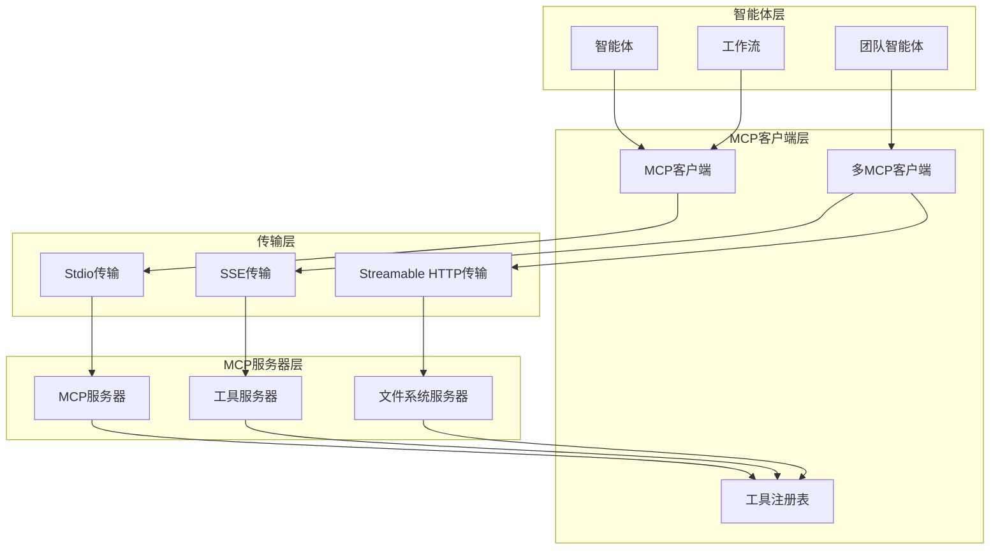
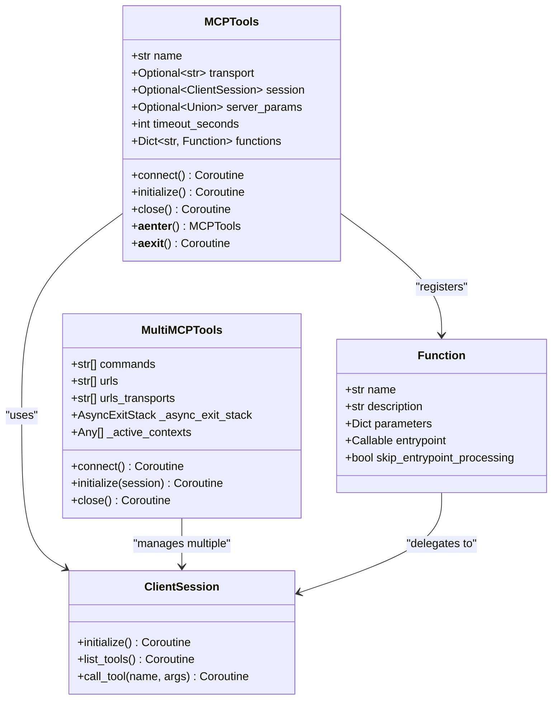
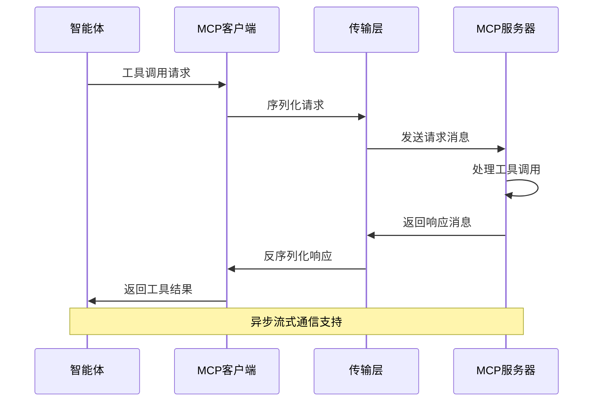
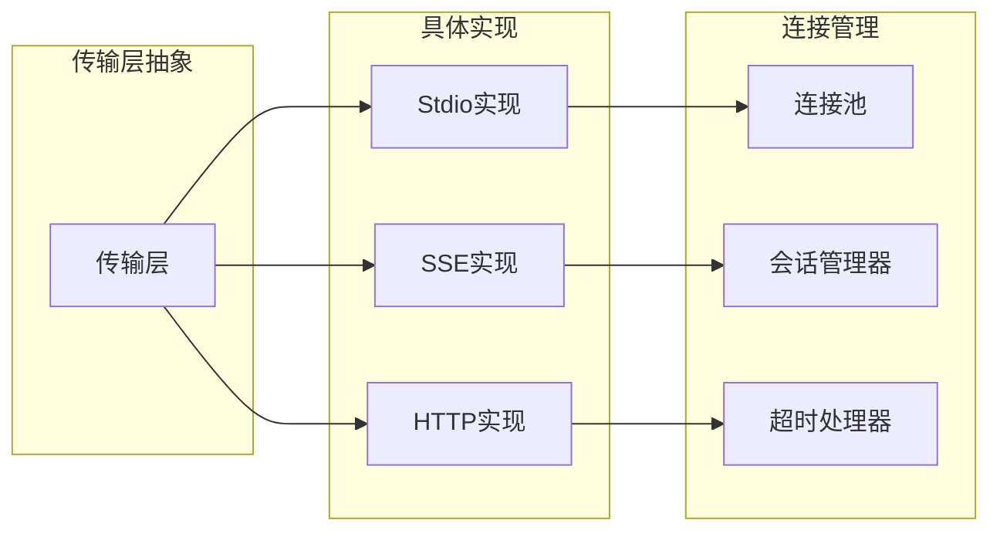
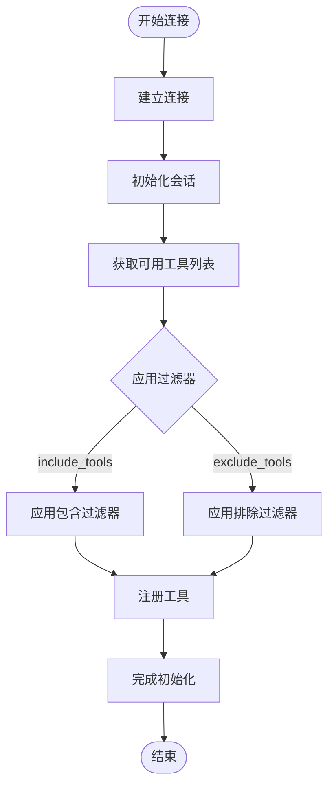
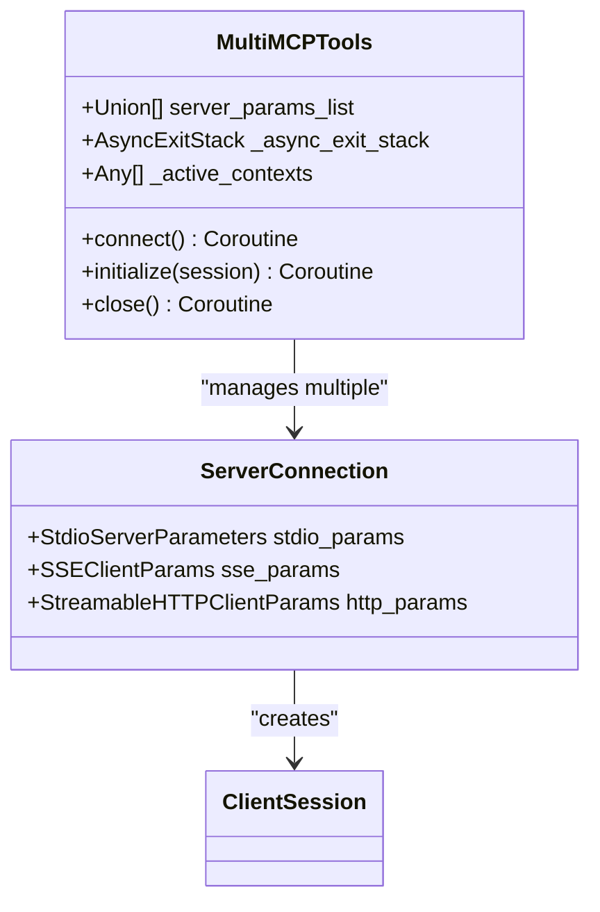
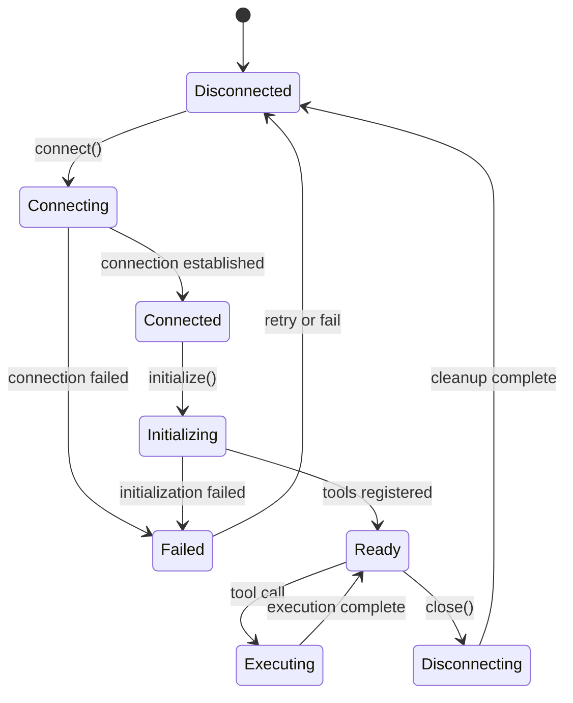
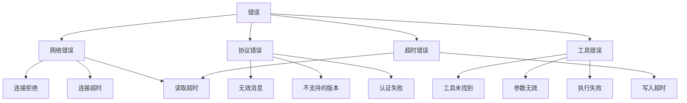

# MCP协议详解

<cite>
**本文档引用的文件**
- [libs/agno/agno/os/mcp.py](file://libs/agno/agno/os/mcp.py)
- [libs/agno/agno/tools/mcp.py](file://libs/agno/agno/tools/mcp.py)
- [libs/agno/agno/utils/mcp.py](file://libs/agno/agno/utils/mcp.py)
- [libs/agno/agno/os/schema.py](file://libs/agno/agno/os/schema.py)
- [cookbook/tools/mcp_tools.py](file://cookbook/tools/mcp_tools.py)
- [cookbook/agent_os/mcp/mcp_tools_example.py](file://cookbook/agent_os/mcp/mcp_tools_example.py)
- [cookbook/agent_os/mcp/test_client.py](file://cookbook/agent_os/mcp/test_client.py)
- [cookbook/tools/mcp/sse_transport/server.py](file://cookbook/tools/mcp/sse_transport/server.py)
- [cookbook/tools/mcp/streamable_http_transport/server.py](file://cookbook/tools/mcp/streamable_http_transport/server.py)
</cite>

## 目录
1. [简介](#简介)
2. [MCP协议概述](#mcp协议概述)
3. [核心架构设计](#核心架构设计)
4. [消息格式与通信协议](#消息格式与通信协议)
5. [传输层实现](#传输层实现)
6. [工具发现与管理](#工具发现与管理)
7. [会话管理机制](#会话管理机制)
8. [错误处理与超时策略](#错误处理与超时策略)
9. [版本兼容性与扩展性](#版本兼容性与扩展性)
10. [最佳实践指南](#最佳实践指南)
11. [故障排除](#故障排除)
12. [总结](#总结)

## 简介

Model Context Protocol（MCP）是一个标准化的协议，旨在为智能体与外部工具之间建立可靠的通信桥梁。在Agno框架中，MCP协议被广泛应用于连接各种外部服务和工具，使智能体能够访问丰富的功能生态系统。

MCP协议的核心价值在于：
- 提供统一的工具访问接口
- 支持多种传输协议
- 实现异步通信机制
- 建立安全的会话管理
- 提供完善的错误处理

## MCP协议概述

### 协议定义

MCP（Model Context Protocol）是一个开放标准协议，专门设计用于智能体与外部工具之间的通信。它定义了一套标准化的消息格式、请求/响应模式和会话管理机制。

### 核心特性

1. **标准化接口**：提供统一的工具调用接口
2. **多传输支持**：支持stdio、SSE和Streamable HTTP等多种传输方式
3. **异步通信**：原生支持异步操作和流式数据传输
4. **类型安全**：基于Pydantic模型的强类型验证
5. **可扩展性**：支持动态工具发现和注册

## 核心架构设计

### 整体架构图



**图表来源**
- [libs/agno/agno/tools/mcp.py](file://libs/agno/agno/tools/mcp.py#L1-L50)
- [libs/agno/agno/os/mcp.py](file://libs/agno/agno/os/mcp.py#L1-L30)

### 组件关系图



**图表来源**
- [libs/agno/agno/tools/mcp.py](file://libs/agno/agno/tools/mcp.py#L70-L150)
- [libs/agno/agno/tools/mcp.py](file://libs/agno/agno/tools/mcp.py#L320-L400)

**章节来源**
- [libs/agno/agno/tools/mcp.py](file://libs/agno/agno/tools/mcp.py#L1-L200)
- [libs/agno/agno/os/mcp.py](file://libs/agno/agno/os/mcp.py#L1-L100)

## 消息格式与通信协议

### 请求/响应模式

MCP协议采用标准的请求/响应模式，支持同步和异步通信：



**图表来源**
- [libs/agno/agno/utils/mcp.py](file://libs/agno/agno/utils/mcp.py#L20-L80)

### 消息结构

MCP协议定义了标准的消息格式：

1. **请求消息**：包含工具名称、参数和上下文信息
2. **响应消息**：包含执行结果、状态信息和元数据
3. **错误消息**：标准化的错误报告格式

### 数据类型支持

MCP协议支持多种数据类型的传输：

- 文本内容（TextContent）
- 图像内容（ImageContent）
- 嵌入资源（EmbeddedResource）
- 自定义JSON格式

**章节来源**
- [libs/agno/agno/utils/mcp.py](file://libs/agno/agno/utils/mcp.py#L1-L125)

## 传输层实现

### 支持的传输协议

MCP协议支持三种主要的传输协议：

#### 1. Stdio传输

Stdio传输是最常用的本地进程间通信方式：

```python
# 示例：Stdio传输配置
server_params = StdioServerParameters(
    command="python",
    args=["-m", "mcp_server"],
    env={"MCP_ENV": "production"}
)
```

#### 2. SSE传输

Server-Sent Events（SSE）传输适用于Web环境：

```python
# 示例：SSE传输配置
sse_params = SSEClientParams(
    url="http://localhost:8080/events",
    headers={"Authorization": "Bearer token"},
    timeout=30
)
```

#### 3. Streamable HTTP传输

Streamable HTTP传输提供了现代的HTTP/2支持：

```python
# 示例：Streamable HTTP传输配置
http_params = StreamableHTTPClientParams(
    url="http://localhost:8080/mcp",
    headers={"Content-Type": "application/json"},
    timeout=timedelta(seconds=30),
    sse_read_timeout=timedelta(minutes=5)
)
```

### 传输层架构



**图表来源**
- [libs/agno/agno/tools/mcp.py](file://libs/agno/agno/tools/mcp.py#L200-L300)

**章节来源**
- [libs/agno/agno/tools/mcp.py](file://libs/agno/agno/tools/mcp.py#L200-L400)
- [cookbook/tools/mcp/sse_transport/server.py](file://cookbook/tools/mcp/sse_transport/server.py#L1-L20)
- [cookbook/tools/mcp/streamable_http_transport/server.py](file://cookbook/tools/mcp/streamable_http_transport/server.py#L1-L20)

## 工具发现与管理

### 动态工具发现

MCP协议支持运行时动态发现和注册工具：



**图表来源**
- [libs/agno/agno/tools/mcp.py](file://libs/agno/agno/tools/mcp.py#L280-L350)

### 工具注册机制

每个MCP工具都会被转换为Agno框架中的Function对象：

```python
# 工具注册过程
for tool in filtered_tools:
    entrypoint = get_entrypoint_for_tool(tool, self.session)
    f = Function(
        name=tool.name,
        description=tool.description,
        parameters=tool.inputSchema,
        entrypoint=entrypoint,
        skip_entrypoint_processing=True,
    )
    self.functions[f.name] = f
```

### 多MCP服务器管理

MultiMCPTools类支持同时连接多个MCP服务器：



**图表来源**
- [libs/agno/agno/tools/mcp.py](file://libs/agno/agno/tools/mcp.py#L320-L450)

**章节来源**
- [libs/agno/agno/tools/mcp.py](file://libs/agno/agno/tools/mcp.py#L280-L500)

## 会话管理机制

### 会话生命周期

MCP会话管理包括以下关键阶段：

1. **会话创建**：建立与MCP服务器的连接
2. **会话初始化**：获取可用工具和服务
3. **工具调用**：执行具体的工具操作
4. **会话维护**：保持连接活跃状态
5. **会话清理**：优雅关闭连接

### 会话状态管理



### 会话配置

MCP会话支持多种配置选项：

- **超时设置**：控制连接和读取超时
- **重试机制**：自动重试失败的操作
- **连接池**：复用连接以提高性能
- **健康检查**：定期检测连接状态

**章节来源**
- [libs/agno/agno/os/mcp.py](file://libs/agno/agno/os/mcp.py#L100-L200)

## 错误处理与超时策略

### 错误分类

MCP协议定义了多种错误类型：



### 超时处理策略

MCP客户端实现了多层次的超时处理：

1. **连接超时**：建立连接的最大等待时间
2. **读取超时**：从服务器读取数据的超时时间
3. **写入超时**：向服务器发送数据的超时时间
4. **工具执行超时**：单个工具调用的超时限制

### 错误恢复机制

```python
# 错误恢复示例
try:
    result = await session.call_tool(tool_name, kwargs)
    if result.isError:
        return ToolResult(content=f"Error from MCP tool '{tool_name}': {result.content}")
except Exception as e:
    logger.error(f"Failed to call MCP tool '{tool_name}': {e}")
    return ToolResult(content=f"Error: {e}")
```

**章节来源**
- [libs/agno/agno/utils/mcp.py](file://libs/agno/agno/utils/mcp.py#L80-L125)

## 版本兼容性与扩展性

### 版本管理

MCP协议采用语义版本控制，确保向后兼容性：

- **主版本**：重大架构变更
- **次版本**：新功能添加
- **修订版本**：错误修复和小改进

### 扩展点设计

MCP协议提供了多个扩展点：

1. **自定义传输协议**：支持新的传输方式
2. **自定义工具类型**：扩展工具功能
3. **自定义消息格式**：支持特殊的数据格式
4. **插件系统**：第三方扩展支持

### 兼容性保证

- **向后兼容**：新版本保持对旧版本的兼容
- **渐进升级**：支持逐步升级到新版本
- **迁移工具**：提供自动迁移脚本

## 最佳实践指南

### 连接管理

1. **使用上下文管理器**：确保资源正确释放
2. **设置合理的超时**：平衡性能和可靠性
3. **实现重连机制**：处理临时网络问题
4. **监控连接状态**：及时发现和处理异常

### 工具使用

1. **验证工具可用性**：在使用前检查工具是否可用
2. **处理工具错误**：优雅处理工具执行失败
3. **缓存工具信息**：减少重复查询开销
4. **记录工具使用**：便于调试和监控

### 性能优化

1. **连接复用**：避免频繁建立连接
2. **批量操作**：合并多个相关操作
3. **异步处理**：充分利用异步特性
4. **资源池化**：管理连接和会话资源

## 故障排除

### 常见问题

1. **连接失败**
   - 检查服务器地址和端口
   - 验证网络连通性
   - 确认防火墙设置

2. **工具调用超时**
   - 增加超时时间设置
   - 检查服务器负载
   - 优化工具实现

3. **协议版本不匹配**
   - 更新客户端和服务器版本
   - 检查版本兼容性矩阵
   - 使用版本协商机制

### 调试技巧

1. **启用详细日志**：记录详细的通信信息
2. **使用网络抓包**：分析底层通信
3. **模拟服务器**：测试客户端逻辑
4. **单元测试**：验证各个组件功能

### 监控指标

- **连接成功率**：衡量连接稳定性
- **响应时间**：评估性能表现
- **错误率**：监控系统健康度
- **资源使用**：跟踪内存和CPU消耗

## 总结

MCP协议为智能体与外部工具的集成提供了强大而灵活的解决方案。通过标准化的接口、多样的传输方式和完善的错误处理机制，MCP协议确保了系统的可靠性和可扩展性。

### 关键优势

1. **标准化**：统一的工具访问接口
2. **灵活性**：支持多种传输协议
3. **可靠性**：完善的错误处理和恢复机制
4. **可扩展**：支持动态工具发现和注册
5. **性能**：异步通信和连接复用

### 未来发展方向

- **增强安全性**：支持更强大的认证和授权机制
- **优化性能**：进一步提升通信效率
- **扩展功能**：支持更多类型的工具和服务
- **简化集成**：提供更易用的开发工具和库

通过深入理解和正确使用MCP协议，开发者可以构建出更加智能、可靠和高效的智能体系统。