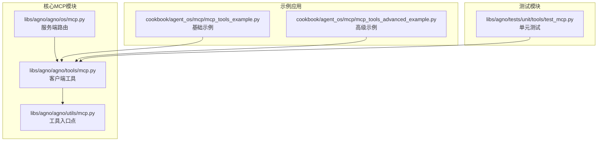
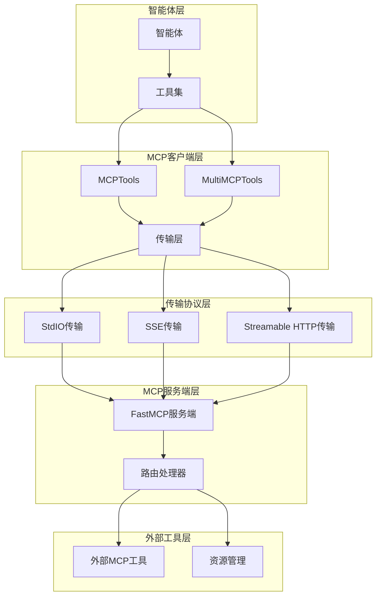
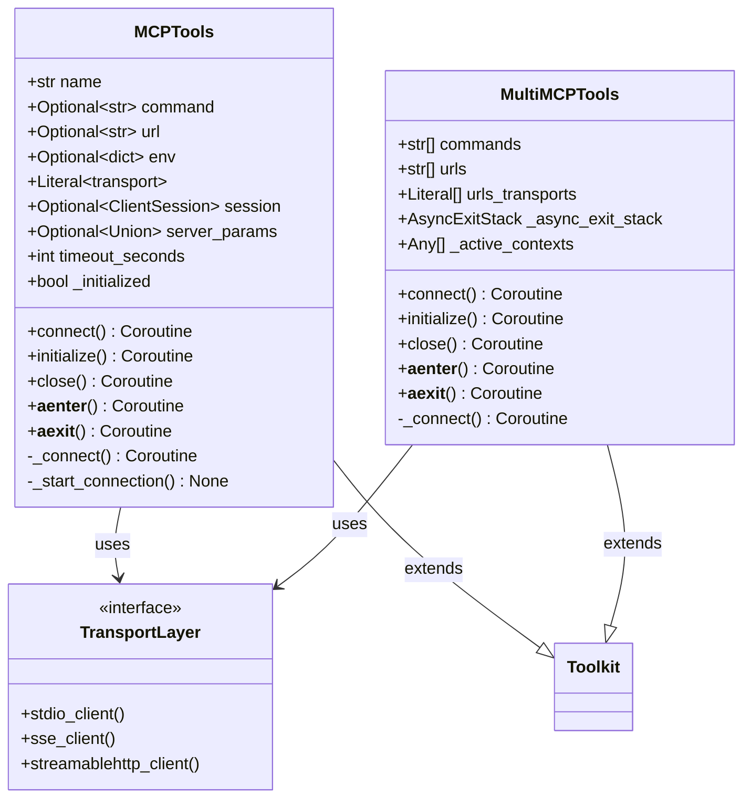
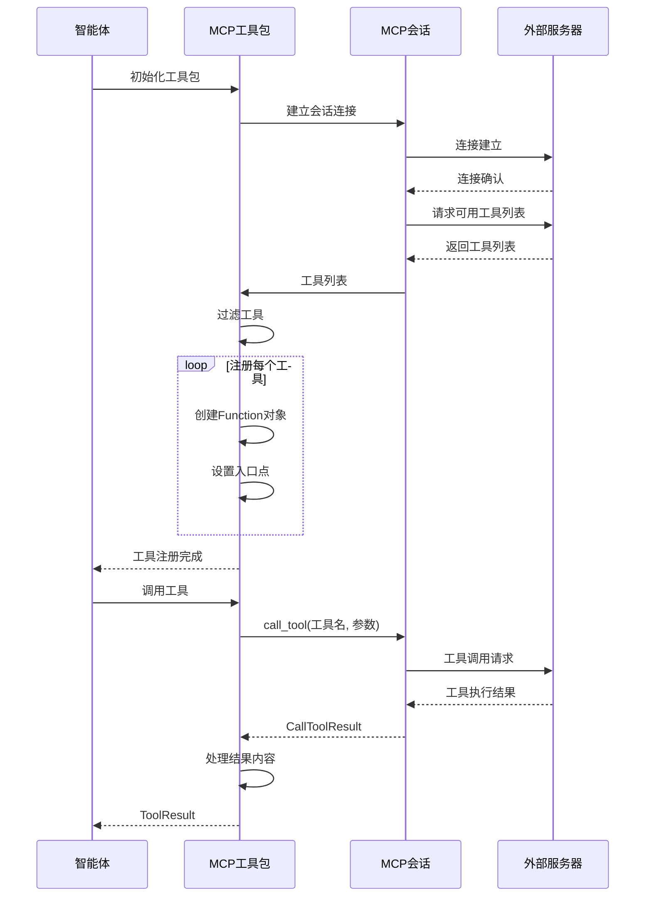
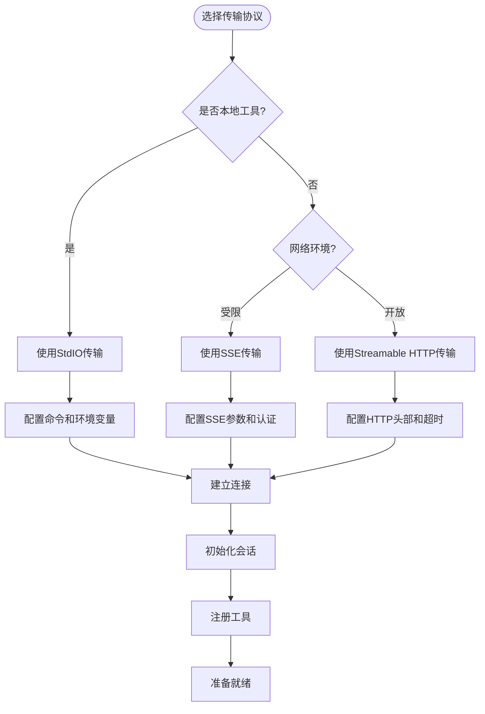
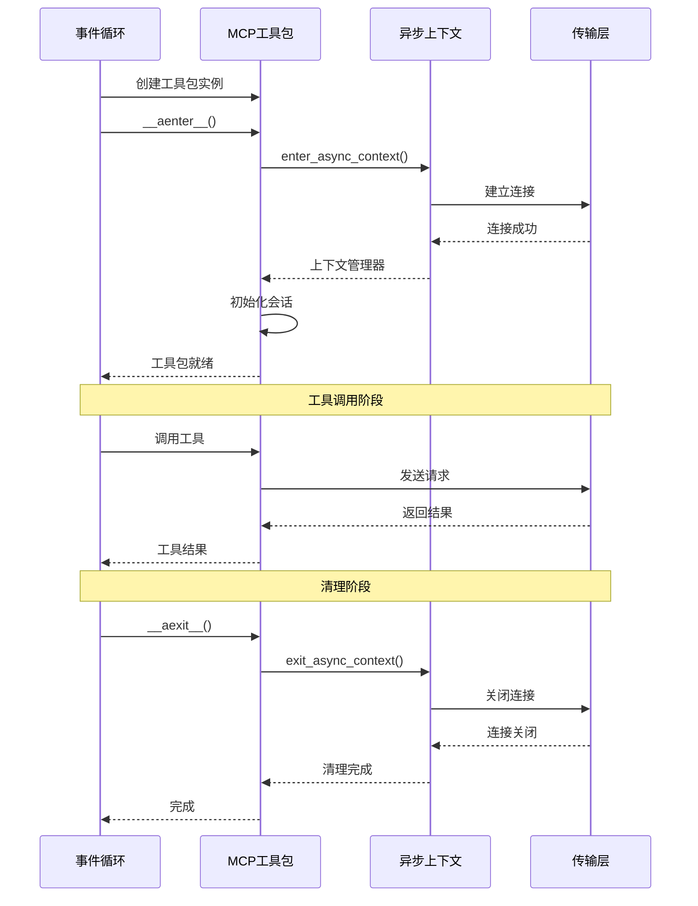
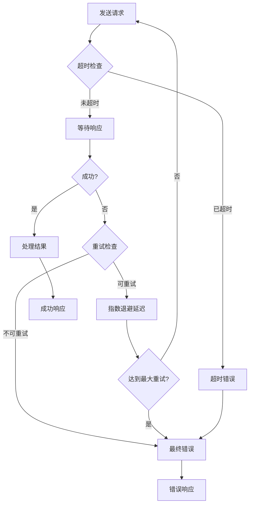

# MCP通信机制深度解析

<cite>
**本文档中引用的文件**
- [mcp.py](file://libs/agno/agno/os/mcp.py)
- [mcp.py](file://libs/agno/agno/tools/mcp.py)
- [mcp.py](file://libs/agno/agno/utils/mcp.py)
- [mcp_tools_example.py](file://cookbook/agent_os/mcp/mcp_tools_example.py)
- [mcp_tools_advanced_example.py](file://cookbook/agent_os/mcp/mcp_tools_advanced_example.py)
- [test_mcp.py](file://libs/agno/tests/unit/tools/test_mcp.py)
</cite>

## 目录
1. [简介](#简介)
2. [项目结构概览](#项目结构概览)
3. [核心组件分析](#核心组件分析)
4. [架构概览](#架构概览)
5. [详细组件分析](#详细组件分析)
6. [通信协议详解](#通信协议详解)
7. [同步与异步通信模式](#同步与异步通信模式)
8. [错误处理与重试机制](#错误处理与重试机制)
9. [性能考虑](#性能考虑)
10. [故障排除指南](#故障排除指南)
11. [结论](#结论)

## 简介

Model Context Protocol (MCP) 是一个用于智能体与外部工具之间进行双向通信的标准协议。在Agno框架中，MCP通信机制通过精心设计的架构实现了高效的工具调用、参数序列化和结果反序列化功能。本文档深入分析了MCP协议的通信机制，重点关注智能体与外部工具之间的请求-响应模式和双向通信流程。

MCP协议支持多种传输方式，包括标准输入输出(StdIO)、服务器发送事件(SSE)和可流式HTTP传输，为开发者提供了灵活的集成选项。通过`MCPTools`和`MultiMCPTools`类，Agno框架实现了对单个或多个MCP服务器的统一管理，支持同步和异步通信模式，并具备完善的错误处理和资源管理机制。

## 项目结构概览

MCP相关功能主要分布在以下关键文件中：



**图表来源**
- [mcp.py](file://libs/agno/agno/os/mcp.py#L1-L236)
- [mcp.py](file://libs/agno/agno/tools/mcp.py#L1-L612)
- [mcp.py](file://libs/agno/agno/utils/mcp.py#L1-L125)

## 核心组件分析

### MCP服务端组件

MCP服务端通过`FastMCP`框架提供RESTful API接口，支持智能体配置查询、运行控制和会话管理等功能。

```python
# 核心服务端实现
def get_mcp_server(os: "AgentOS") -> StarletteWithLifespan:
    """Attach MCP routes to the provided router."""
    
    # 创建MCP服务器实例
    mcp = FastMCP(os.name or "AgentOS")
    
    # 注册核心工具
    @mcp.tool(name="get_agentos_config", description="Get the configuration of the AgentOS")
    async def config() -> ConfigResponse:
        return ConfigResponse(
            os_id=os.os_id or "AgentOS",
            description=os.description,
            available_models=os.config.available_models if os.config else [],
            databases=[db.id for db in os.dbs.values()],
            # ... 更多配置信息
        )
```

### MCP客户端组件

客户端组件通过`MCPTools`类实现与外部MCP服务器的连接和通信：

```python
class MCPTools(Toolkit):
    """
    集成MCP服务器的工具包，允许智能体访问MCP服务器暴露的工具、资源和提示。
    
    支持三种使用方式：
    1. 直接使用ClientSession初始化
    2. 使用StdioServerParameters作为异步上下文管理器
    3. 使用SSE或Streamable HTTP客户端参数作为异步上下文管理器
    """
```

**章节来源**
- [mcp.py](file://libs/agno/agno/os/mcp.py#L35-L236)
- [mcp.py](file://libs/agno/agno/tools/mcp.py#L84-L346)

## 架构概览

MCP通信架构采用分层设计，支持多种传输协议和通信模式：



**图表来源**
- [mcp.py](file://libs/agno/agno/tools/mcp.py#L84-L111)
- [mcp.py](file://libs/agno/agno/os/mcp.py#L35-L46)

## 详细组件分析

### MCPTools类详细分析

`MCPTools`类是MCP客户端的核心实现，支持多种初始化方式和传输协议：



**图表来源**
- [mcp.py](file://libs/agno/agno/tools/mcp.py#L84-L346)
- [mcp.py](file://libs/agno/agno/tools/mcp.py#L349-L610)

### 工具注册与调用机制

MCP工具的注册和调用通过以下流程实现：



**图表来源**
- [mcp.py](file://libs/agno/agno/tools/mcp.py#L250-L346)
- [mcp.py](file://libs/agno/agno/utils/mcp.py#L18-L124)

**章节来源**
- [mcp.py](file://libs/agno/agno/tools/mcp.py#L250-L346)
- [mcp.py](file://libs/agno/agno/utils/mcp.py#L18-L124)

## 通信协议详解

### 传输协议支持

MCP协议支持三种主要传输方式：

#### 1. StdIO传输
基于标准输入输出的进程间通信，适用于本地工具集成：

```python
# StdIO传输配置示例
mcp_tools = MCPTools(
    command="python external_tool.py",
    env={"API_KEY": "your_key"},
    transport="stdio"
)
```

#### 2. SSE传输
服务器发送事件传输，支持实时数据流：

```python
# SSE传输配置示例
sse_params = SSEClientParams(
    url="http://localhost:8080/events",
    headers={"Authorization": "Bearer token"},
    timeout=30
)
mcp_tools = MCPTools(
    server_params=sse_params,
    transport="sse"
)
```

#### 3. Streamable HTTP传输
可流式HTTP传输，支持现代Web标准：

```python
# Streamable HTTP传输配置示例
http_params = StreamableHTTPClientParams(
    url="http://localhost:8080/mcp",
    headers={"Content-Type": "application/json"},
    timeout=timedelta(seconds=30),
    sse_read_timeout=timedelta(seconds=300)
)
mcp_tools = MCPTools(
    server_params=http_params,
    transport="streamable-http"
)
```

### 协议选择策略



**图表来源**
- [mcp.py](file://libs/agno/agno/tools/mcp.py#L113-L145)
- [mcp.py](file://libs/agno/agno/tools/mcp.py#L173-L207)

**章节来源**
- [mcp.py](file://libs/agno/agno/tools/mcp.py#L113-L145)
- [mcp.py](file://libs/agno/agno/tools/mcp.py#L173-L207)

## 同步与异步通信模式

### 异步上下文管理器模式

MCP工具支持异步上下文管理器模式，确保资源的正确管理和清理：

```python
# 异步上下文管理器使用示例
async with MCPTools(transport="streamable-http", url="http://localhost:8080") as mcp:
    # 工具已连接并初始化
    result = await mcp.run_tool("search", {"query": "test"})
    # 自动关闭连接
```

### 同步连接模式

对于需要显式控制连接生命周期的场景：

```python
# 同步连接模式
mcp = MCPTools(transport="stdio", command="python tool.py")
await mcp.connect()  # 手动连接
try:
    result = await mcp.run_tool("process", {"data": "input"})
finally:
    await mcp.close()  # 手动关闭
```

### 事件循环集成



**图表来源**
- [mcp.py](file://libs/agno/agno/tools/mcp.py#L250-L280)
- [mcp.py](file://libs/agno/agno/tools/mcp.py#L282-L310)

**章节来源**
- [mcp.py](file://libs/agno/agno/tools/mcp.py#L250-L346)
- [mcp.py](file://libs/agno/agno/tools/mcp.py#L282-L310)

## 错误处理与重试机制

### 错误传播机制

MCP工具实现了多层次的错误处理机制：

```python
async def call_tool(agent: Agent, tool_name: str, **kwargs) -> ToolResult:
    try:
        log_debug(f"Calling MCP Tool '{tool_name}' with args: {kwargs}")
        result: CallToolResult = await session.call_tool(tool_name, kwargs)
        
        if result.isError:
            return ToolResult(content=f"Error from MCP tool '{tool_name}': {result.content}")
        
        # 处理结果内容...
        return ToolResult(content=response_str.strip(), images=images if images else None)
        
    except Exception as e:
        log_exception(f"Failed to call MCP tool '{tool_name}': {e}")
        return ToolResult(content=f"Error: {e}")
```

### 超时重试策略



**图表来源**
- [mcp.py](file://libs/agno/agno/utils/mcp.py#L18-L124)

### 流式响应处理

MCP协议支持流式响应，能够实时处理大型数据传输：

```python
# 流式响应处理示例
async def handle_streaming_response(result: CallToolResult):
    response_str = ""
    images = []
    
    for content_item in result.content:
        if isinstance(content_item, TextContent):
            # 处理文本内容
            text_content = content_item.text
            response_str += text_content + "\n"
            
        elif isinstance(content_item, ImageContent):
            # 处理图像内容
            image_data = base64.b64decode(content_item.data)
            img_artifact = Image(
                id=str(uuid4()),
                url=content_item.url,
                content=image_data,
                mime_type=content_item.mimeType or "image/png"
            )
            images.append(img_artifact)
            response_str += "Image has been generated and added to the response.\n"
            
        elif isinstance(content_item, EmbeddedResource):
            # 处理嵌入资源
            response_str += f"[Embedded resource: {content_item.resource.model_dump_json()}]\n"
```

**章节来源**
- [mcp.py](file://libs/agno/agno/utils/mcp.py#L18-L124)

## 性能考虑

### 连接池管理

MCP工具支持连接池管理，提高并发性能：

```python
# 连接池配置示例
mcp_tools = MCPTools(
    transport="streamable-http",
    url="http://localhost:8080",
    timeout_seconds=30,  # 设置合理的超时时间
    client=HttpClient(max_connections=10)  # 连接池大小
)
```

### 内存优化

- 使用弱引用避免循环引用
- 及时清理不再使用的连接
- 支持流式处理大型响应

### 并发控制

```python
# 并发工具调用示例
async def concurrent_tool_calls(mcp: MCPTools, tasks: List[Dict]):
    semaphore = asyncio.Semaphore(5)  # 限制并发数
    
    async def bounded_call(task):
        async with semaphore:
            return await mcp.run_tool(task['name'], task['params'])
    
    results = await asyncio.gather(*[bounded_call(task) for task in tasks])
    return results
```

## 故障排除指南

### 常见问题诊断

1. **连接失败**
   - 检查服务器地址和端口
   - 验证网络连通性
   - 确认防火墙设置

2. **工具调用超时**
   - 增加超时时间设置
   - 检查服务器负载
   - 优化工具实现

3. **内存泄漏**
   - 确保正确使用异步上下文管理器
   - 及时关闭连接
   - 监控连接池状态

### 调试工具

```python
# 启用调试日志
import logging
logging.getLogger('agno.tools.mcp').setLevel(logging.DEBUG)

# 连接状态监控
async def monitor_connection(mcp: MCPTools):
    print(f"Connection status: {'Connected' if mcp._initialized else 'Disconnected'}")
    print(f"Active contexts: {len(mcp._active_contexts)}")
    print(f"Timeout: {mcp.timeout_seconds}s")
```

**章节来源**
- [test_mcp.py](file://libs/agno/tests/unit/tools/test_mcp.py#L1-L28)

## 结论

MCP通信机制通过精心设计的架构和多种传输协议，为智能体与外部工具之间的高效通信提供了坚实的基础。本文档详细分析了MCP协议的核心组件、通信流程、错误处理机制和性能优化策略。

关键要点总结：

1. **多协议支持**：支持StdIO、SSE和Streamable HTTP三种传输协议，满足不同部署场景需求
2. **异步优先**：全面采用异步编程模式，支持高并发和低延迟通信
3. **资源管理**：完善的连接管理和清理机制，确保系统稳定性
4. **错误处理**：多层次的错误处理和重试机制，提高系统可靠性
5. **扩展性**：支持单个和多个MCP服务器的统一管理

通过遵循本文档提供的最佳实践和故障排除指南，开发者可以构建高可靠性的MCP集成，实现智能体与外部工具之间的无缝协作。