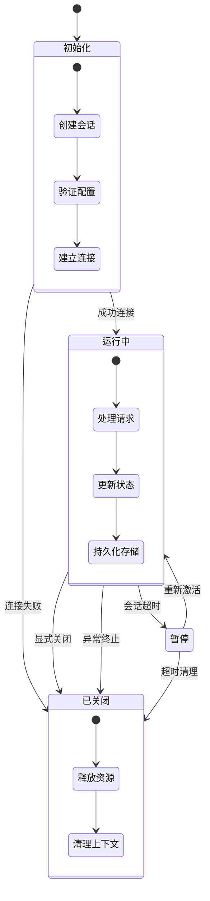
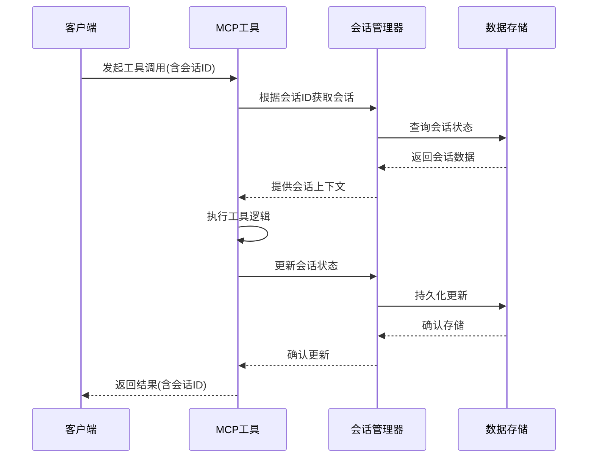
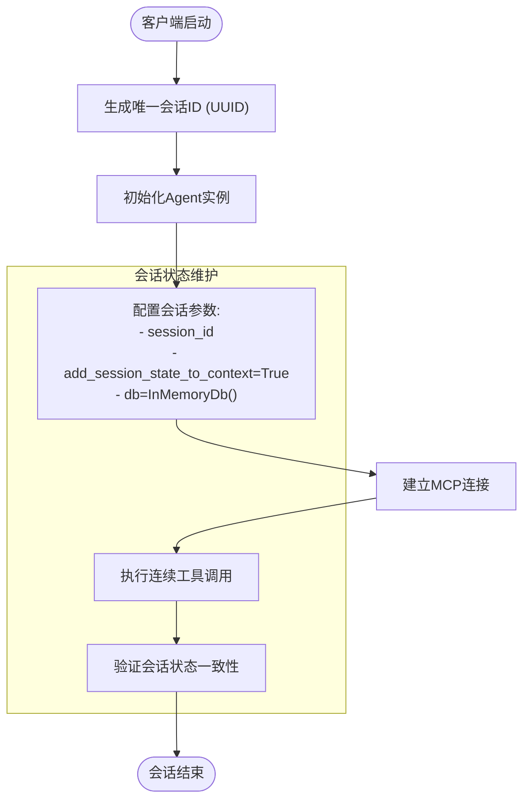
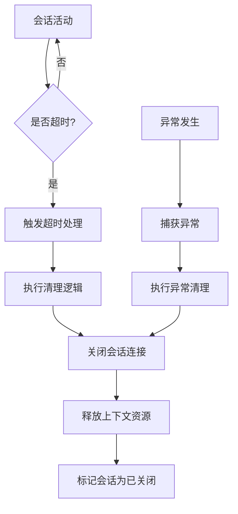
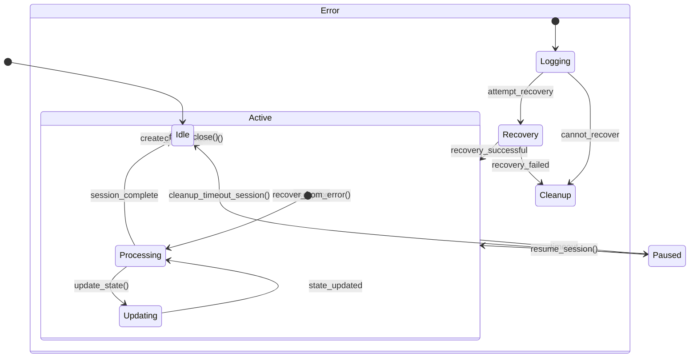

# 会话与状态管理

<cite>
**本文档引用的文件**
- [mcp.py](file://libs/agno/agno/tools/mcp.py)
- [test_client.py](file://cookbook/agent_os/mcp/test_client.py)
- [workflow.py](file://libs/agno/agno/workflow/workflow.py)
- [agent.py](file://libs/agno/agno/agent/agent.py)
- [team.py](file://libs/agno/agno/team/team.py)
- [session_state_basic.py](file://cookbook/agents/state/session_state_basic.py)
- [session_state_advanced.py](file://cookbook/agents/state/session_state_advanced.py)
</cite>

## 目录
1. [引言](#引言)
2. [会话生命周期管理](#会话生命周期管理)
3. [上下文一致性维护](#上下文一致性维护)
4. [客户端会话状态管理](#客户端会话状态管理)
5. [会话超时与异常处理](#会话超时与异常处理)
6. [智能体工作流集成](#智能体工作流集成)
7. [会话状态机](#会话状态机)
8. [最佳实践](#最佳实践)

## 引言
本文档全面阐述MCP协议中的会话与状态管理机制，重点分析如何通过会话ID维护跨多个工具调用的上下文一致性。文档将深入探讨`mcp.py`中会话生命周期的管理逻辑，结合`test_client.py`中的测试用例说明客户端会话状态的保持机制，并展示`workflow.py`中会话状态与智能体工作流的集成方式。

## 会话生命周期管理
MCP协议中的会话生命周期管理通过异步上下文管理器实现，确保资源的正确初始化和清理。会话的创建、初始化和关闭过程遵循严格的生命周期管理规则。



**图示来源**
- [mcp.py](file://libs/agno/agno/tools/mcp.py#L173-L207)
- [mcp.py](file://libs/agno/agno/tools/mcp.py#L259-L299)

**本节来源**
- [mcp.py](file://libs/agno/agno/tools/mcp.py#L173-L299)

## 上下文一致性维护
MCP协议通过会话ID在多个工具调用间维护上下文一致性。每个会话都与唯一的会话ID关联，确保跨调用的状态连续性。



**图示来源**
- [mcp.py](file://libs/agno/agno/tools/mcp.py#L173-L207)
- [agent.py](file://libs/agno/agno/agent/agent.py#L4245-L4263)

**本节来源**
- [mcp.py](file://libs/agno/agno/tools/mcp.py#L113-L133)
- [agent.py](file://libs/agno/agno/agent/agent.py#L4245-L4263)

## 客户端会话状态管理
客户端通过`test_client.py`中的实现展示了如何在连续的工具调用中保持会话状态。客户端使用UUID生成唯一的会话ID，并在Agent初始化时传递该ID。



**图示来源**
- [test_client.py](file://cookbook/agent_os/mcp/test_client.py#L37-L81)
- [agent.py](file://libs/agno/agno/agent/agent.py#L4548-L4572)

**本节来源**
- [test_client.py](file://cookbook/agent_os/mcp/test_client.py#L37-L81)

## 会话超时与异常处理
系统通过配置的超时参数和异常处理机制来管理会话的生命周期。当会话超时或发生异常时，系统会自动清理相关资源。



**图示来源**
- [mcp.py](file://libs/agno/agno/tools/mcp.py#L259-L299)
- [mcp.py](file://libs/agno/agno/tools/mcp.py#L379-L394)

**本节来源**
- [mcp.py](file://libs/agno/agno/tools/mcp.py#L259-L299)

## 智能体工作流集成
会话状态与智能体工作流的集成通过共享状态机制实现。工作流中的各个步骤可以访问和修改共享的会话状态，实现跨步骤的状态传递。

```mermaid
graph TD
A[工作流初始化] --> B[创建共享会话状态]
B --> C[步骤1: 添加项目]
C --> D[更新会话状态]
D --> E[步骤2: 列出项目]
E --> F[读取会话状态]
F --> G[返回结果]
G --> H[步骤3: 清理状态]
H --> I[更新会话状态]
I --> J[完成工作流]
subgraph "共享会话状态"
K[{"shopping_list": []}]
end
D --> K
F --> K
I --> K
```

**图示来源**
- [workflow.py](file://libs/agno/agno/workflow/workflow.py#L591-L612)
- [session_state_advanced.py](file://cookbook/agents/state/session_state_advanced.py#L0-L76)

**本节来源**
- [workflow.py](file://libs/agno/agno/workflow/workflow.py#L591-L612)
- [session_state_advanced.py](file://cookbook/agents/state/session_state_advanced.py#L0-L76)

## 会话状态机
会话状态机定义了会话在不同状态间的转换条件和处理逻辑，为构建有状态的MCP应用提供理论支持。



**图示来源**
- [mcp.py](file://libs/agno/agno/tools/mcp.py#L173-L207)
- [mcp.py](file://libs/agno/agno/tools/mcp.py#L259-L299)
- [agent.py](file://libs/agno/agno/agent/agent.py#L4245-L4263)

**本节来源**
- [mcp.py](file://libs/agno/agno/tools/mcp.py#L173-L299)
- [agent.py](file://libs/agno/agno/agent/agent.py#L4245-L4263)

## 最佳实践
基于对MCP协议会话与状态管理机制的分析，以下是构建有状态应用的最佳实践：

1. **会话ID管理**：使用UUID等机制确保会话ID的唯一性
2. **状态初始化**：在会话创建时明确初始化状态数据结构
3. **资源清理**：确保在会话关闭时释放所有相关资源
4. **异常处理**：实现健壮的异常处理和恢复机制
5. **状态持久化**：选择合适的存储后端持久化会话状态
6. **超时配置**：根据应用场景合理配置会话超时时间

**本节来源**
- [mcp.py](file://libs/agno/agno/tools/mcp.py#L173-L299)
- [test_client.py](file://cookbook/agent_os/mcp/test_client.py#L37-L81)
- [workflow.py](file://libs/agno/agno/workflow/workflow.py#L591-L612)