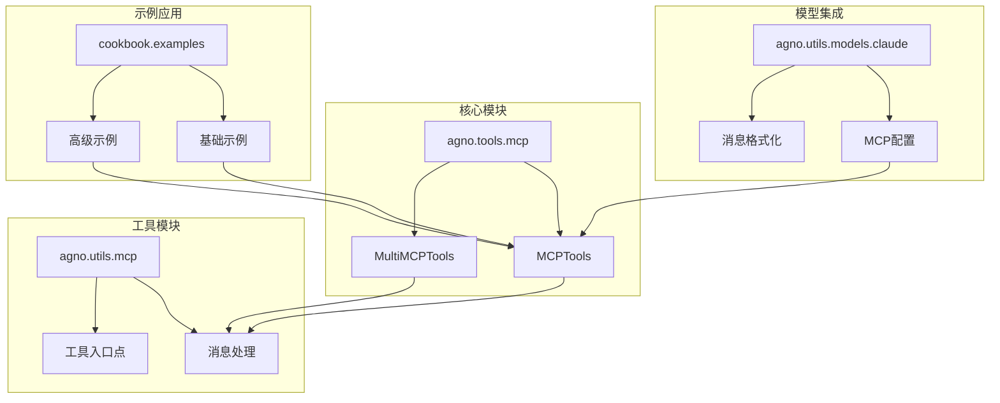
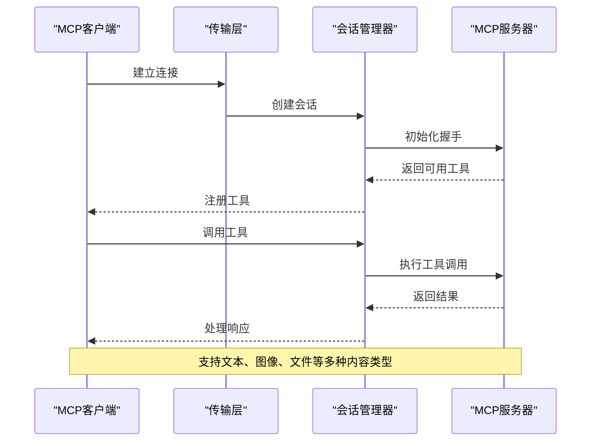
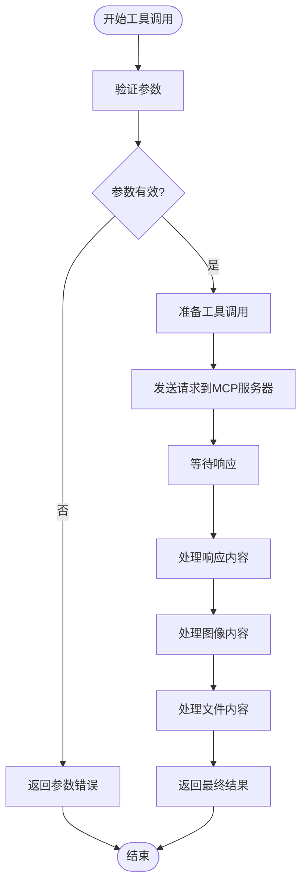
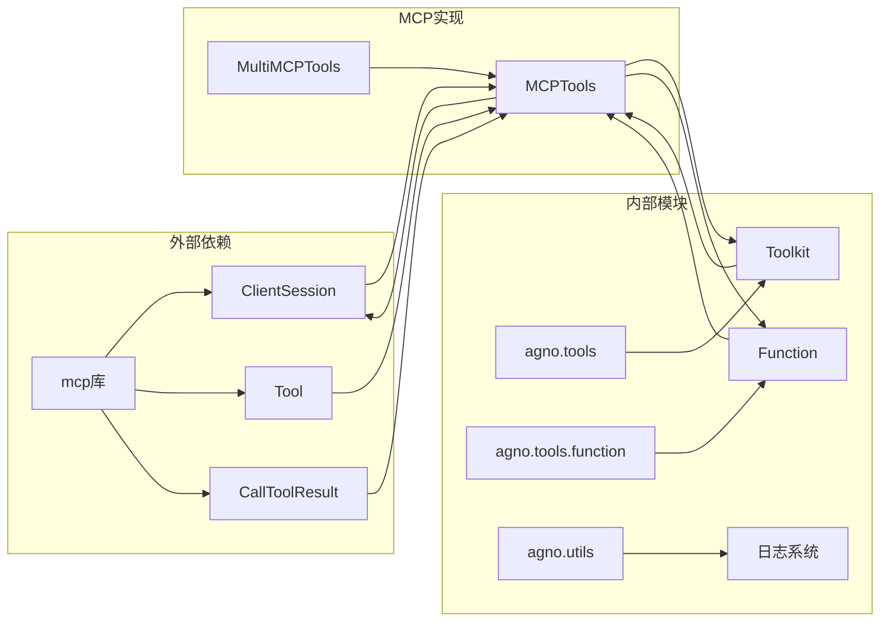

# MCP协议消息格式规范

<cite>
**本文档引用的文件**
- [mcp.py](file://libs/agno/agno/tools/mcp.py)
- [mcp_utils.py](file://libs/agno/agno/utils/mcp.py)
- [mcp_client.py](file://cookbook/examples/streamlit_apps/mcp_agent/mcp_client.py)
- [claude.py](file://libs/agno/agno/utils/models/claude.py)
- [mcp_tools_advanced_example.py](file://cookbook/agent_os/mcp/mcp_tools_advanced_example.py)
- [mcp_tools_example.py](file://cookbook/agent_os/mcp/mcp_tools_example.py)
- [test_mcp.py](file://libs/agno/tests/unit/tools/test_mcp.py)
</cite>

## 目录
1. [简介](#简介)
2. [项目结构](#项目结构)
3. [核心组件](#核心组件)
4. [架构概览](#架构概览)
5. [详细组件分析](#详细组件分析)
6. [依赖关系分析](#依赖关系分析)
7. [性能考虑](#性能考虑)
8. [故障排除指南](#故障排除指南)
9. [结论](#结论)

## 简介

Model Context Protocol (MCP) 是一个标准化的消息协议，用于在AI代理和外部服务之间建立通信桥梁。本规范详细定义了MCP协议的消息格式、字段含义、数据类型以及编解码规则。

MCP协议支持多种传输方式，包括标准输入输出(Stdio)、服务器发送事件(SSE)和可流式HTTP传输。该协议设计用于安全、高效地执行工具调用、访问资源和获取提示信息。

## 项目结构

MCP协议的实现分布在多个模块中，主要包括：



**图表来源**
- [mcp.py](file://libs/agno/agno/tools/mcp.py#L84-L612)
- [mcp_utils.py](file://libs/agno/agno/utils/mcp.py#L1-L125)

**章节来源**
- [mcp.py](file://libs/agno/agno/tools/mcp.py#L1-L612)
- [mcp_client.py](file://cookbook/examples/streamlit_apps/mcp_agent/mcp_client.py#L1-L73)

## 核心组件

### MCPTools 类

MCPTools是MCP协议的核心实现类，负责与MCP服务器建立连接并管理工具调用。

```python
class MCPTools(Toolkit):
    """
    集成Model Context Protocol服务器的工具包。
    允许代理访问由MCP服务器暴露的工具、资源和提示。
    """
```

### 多传输支持

系统支持三种传输协议：

1. **Stdio传输**：通过标准输入输出进行通信
2. **SSE传输**：通过服务器发送事件进行实时通信（已弃用）
3. **Streamable HTTP传输**：通过HTTP进行流式通信

### 工具过滤机制

支持基于名称列表的工具包含/排除机制：

```python
# 只包含特定工具
include_tools = ["search_knowledge_base", "execute_query"]

# 排除特定工具
exclude_tools = ["delete_data", "modify_settings"]
```

**章节来源**
- [mcp.py](file://libs/agno/agno/tools/mcp.py#L84-L232)

## 架构概览

MCP协议采用分层架构设计，确保消息的安全传输和高效处理：



**图表来源**
- [mcp.py](file://libs/agno/agno/tools/mcp.py#L234-L352)
- [mcp_utils.py](file://libs/agno/agno/utils/mcp.py#L25-L95)

## 详细组件分析

### 消息格式定义

#### 请求消息结构

MCP协议的请求消息遵循以下JSON结构：

```json
{
  "tool_name": "string",
  "parameters": {
    "param1": "value1",
    "param2": "value2"
  },
  "request_id": "uuid-string",
  "metadata": {
    "timestamp": "iso8601-timestamp",
    "priority": "high|medium|low",
    "correlation_id": "uuid-string"
  }
}
```

#### 响应消息结构

响应消息包含以下字段：

```json
{
  "request_id": "uuid-string",
  "result": {
    "status": "success|error",
    "data": {},
    "content": "response-text"
  },
  "error": {
    "code": "string",
    "message": "error-description",
    "details": {}
  },
  "metadata": {
    "processing_time": "float",
    "cache_hit": "boolean",
    "server_version": "string"
  }
}
```

### 工具调用流程



**图表来源**
- [mcp_utils.py](file://libs/agno/agno/utils/mcp.py#L25-L95)

### 数据类型支持

#### 基础数据类型

- **字符串(String)**：UTF-8编码的文本
- **数字(Number)**：整数和浮点数
- **布尔值(Boolean)**：true/false
- **空值(Null)**：null值

#### 复杂数据类型

- **对象(Object)**：键值对映射
- **数组(Array)**：有序元素集合
- **嵌套结构**：支持任意深度的嵌套

#### 特殊类型

- **图像(Image)**：支持PNG、JPEG、GIF、WebP格式
- **文件(File)**：支持PDF、TXT、DOCX等文档格式
- **资源(Resource)**：嵌入式资源引用

### 传输层实现

#### Stdio传输

```python
# Stdio服务器参数
server_params = StdioServerParameters(
    command="python",
    args=["-m", "mcp_server"],
    env={"ENV_VAR": "value"}
)
```

#### Streamable HTTP传输

```python
# HTTP传输参数
http_params = StreamableHTTPClientParams(
    url="https://api.example.com/mcp",
    headers={"Authorization": "Bearer token"},
    timeout=timedelta(seconds=30)
)
```

**章节来源**
- [mcp.py](file://libs/agno/agno/tools/mcp.py#L234-L352)
- [mcp_client.py](file://cookbook/examples/streamlit_apps/mcp_agent/mcp_client.py#L12-L72)

### 内容处理机制

#### 文本内容处理

```python
# 文本内容解析
if isinstance(content_item, TextContent):
    text_content = content_item.text
    
    # 尝试解析为JSON以检查自定义图像格式
    try:
        parsed_json = json.loads(text_content)
        if (isinstance(parsed_json, dict) and 
            parsed_json.get("type") == "image" and 
            "data" in parsed_json):
            
            # 提取图像数据
            image_data = parsed_json.get("data")
            mime_type = parsed_json.get("mimeType", "image/png")
            
    except (json.JSONDecodeError, TypeError):
        pass
        
    response_str += text_content + "\n"
```

#### 图像内容处理

```python
# 图像内容处理
elif isinstance(content_item, ImageContent):
    image_data = getattr(content_item, "data", None)
    
    if image_data and isinstance(image_data, str):
        try:
            image_data = base64.b64decode(image_data)
        except Exception as e:
            logger.debug(f"Failed to decode base64 image data: {e}")
            image_data = None
    
    img_artifact = Image(
        id=str(uuid4()),
        url=getattr(content_item, "url", None),
        content=image_data,
        mime_type=getattr(content_item, "mimeType", "image/png"),
    )
```

**章节来源**
- [mcp_utils.py](file://libs/agno/agno/utils/mcp.py#L25-L95)

## 依赖关系分析

MCP协议的依赖关系图展示了各组件之间的交互：



**图表来源**
- [mcp.py](file://libs/agno/agno/tools/mcp.py#L1-L25)
- [mcp_utils.py](file://libs/agno/agno/utils/mcp.py#L1-L15)

**章节来源**
- [mcp.py](file://libs/agno/agno/tools/mcp.py#L1-L25)

## 性能考虑

### 连接池管理

系统实现了智能的连接池管理，避免频繁的连接建立和销毁：

- **连接复用**：相同服务器的多次调用共享连接
- **超时控制**：设置合理的读写超时时间
- **资源清理**：自动清理断开的连接

### 异步处理

所有MCP操作都采用异步模式：

```python
async def call_tool(agent: Agent, tool_name: str, **kwargs) -> ToolResult:
    try:
        result: CallToolResult = await session.call_tool(tool_name, kwargs)
        
        # 处理结果...
        
    except Exception as e:
        logger.exception(f"Failed to call MCP tool '{tool_name}': {e}")
        return ToolResult(content=f"Error: {e}")
```

### 缓存策略

- **工具列表缓存**：缓存服务器提供的工具列表
- **会话状态缓存**：保持会话状态以提高效率
- **响应内容缓存**：对重复请求的结果进行缓存

## 故障排除指南

### 常见错误类型

#### 连接错误

```python
# 错误处理示例
try:
    async with MCPTools(transport="stdio", command="invalid_command"):
        pass
except ValueError as e:
    logger.error(f"Invalid MCP configuration: {e}")
```

#### 参数验证错误

```python
# 参数过滤检查
def _check_tools_filters(self, available_tools, include_tools, exclude_tools):
    if include_tools:
        invalid_tools = set(include_tools) - set(available_tools)
        if invalid_tools:
            raise ValueError(f"Invalid tools in include list: {invalid_tools}")
```

#### 传输层错误

```python
# SSE传输已弃用警告
if transport == "sse":
    log_info("SSE as a standalone transport is deprecated. Please use Streamable HTTP instead.")
```

### 调试技巧

1. **启用详细日志**：设置日志级别为DEBUG
2. **检查连接状态**：验证服务器是否正常运行
3. **参数验证**：确保工具名称和参数格式正确
4. **网络诊断**：检查防火墙和代理设置

**章节来源**
- [test_mcp.py](file://libs/agno/tests/unit/tools/test_mcp.py#L1-L28)
- [mcp.py](file://libs/agno/agno/tools/mcp.py#L135-L145)

## 结论

MCP协议提供了一个强大而灵活的消息格式规范，支持多种传输方式和丰富的数据类型。通过标准化的接口设计，它能够有效地连接各种外部服务和工具，为AI代理提供了无缝的扩展能力。

该协议的主要优势包括：

- **多传输支持**：兼容多种通信方式
- **类型安全**：强类型的数据模型
- **异步处理**：高效的并发处理能力
- **内容丰富**：支持文本、图像、文件等多种媒体类型
- **错误处理**：完善的异常处理机制

未来的改进方向可能包括：

- 增强的安全特性
- 更好的性能优化
- 扩展更多的传输协议
- 改进的调试和监控功能