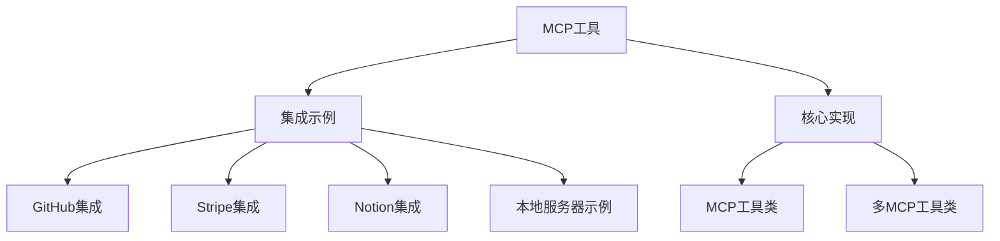
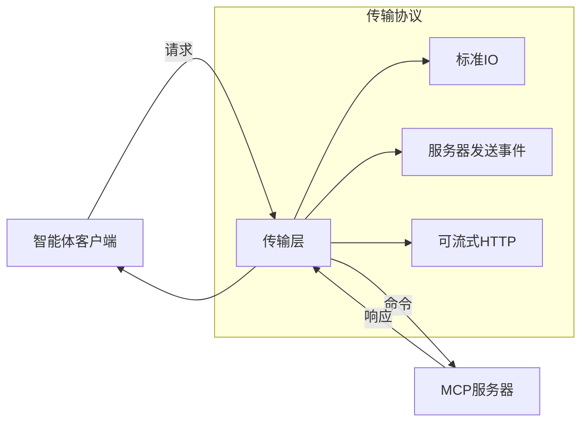
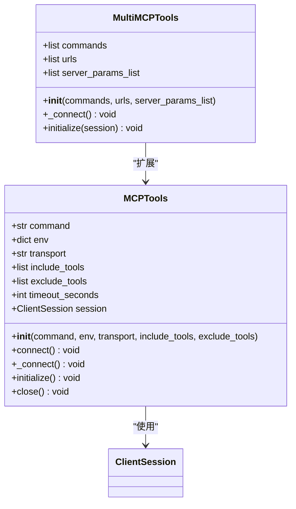
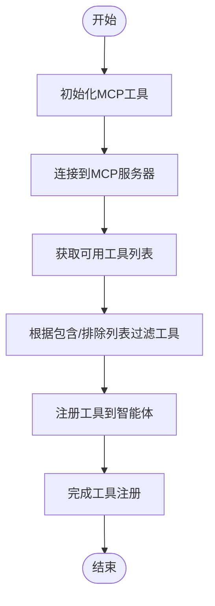
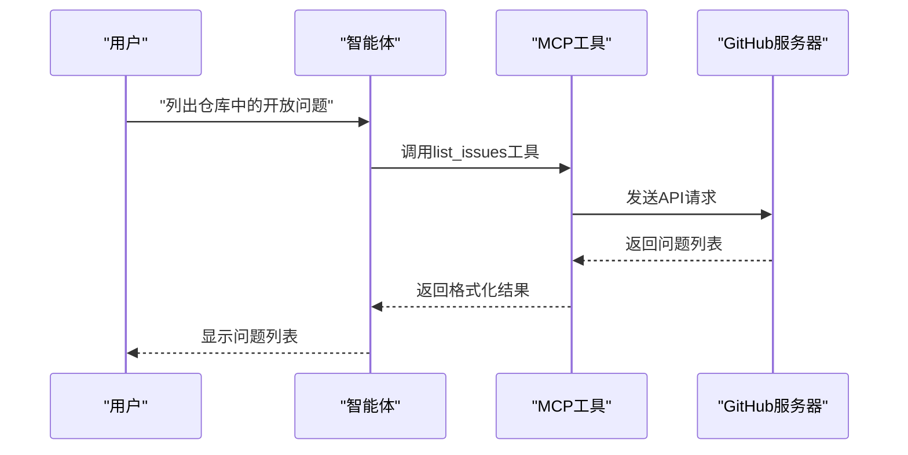
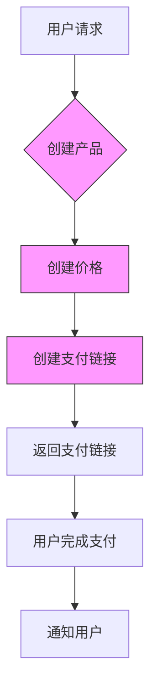
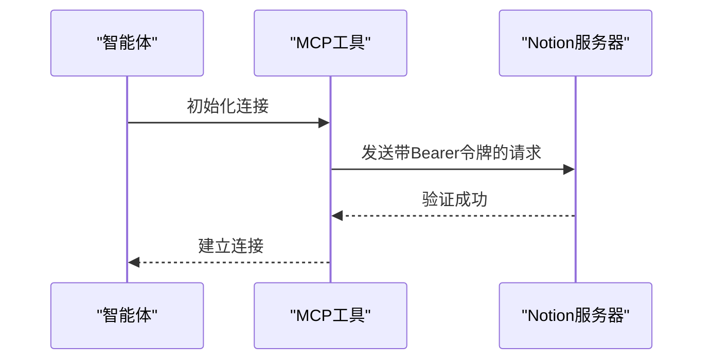
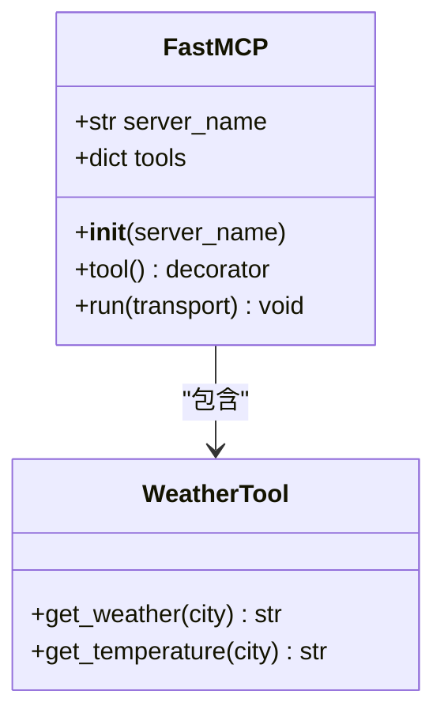
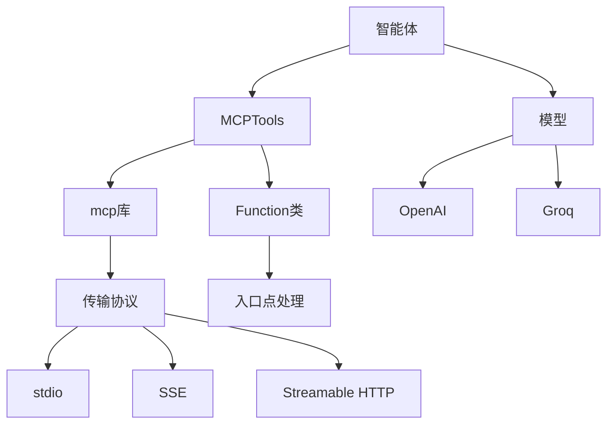

# MCP工具定义与注册

<cite>
**本文档引用的文件**
- [github.py](file://cookbook/tools/mcp/github.py)
- [stripe.py](file://cookbook/tools/mcp/stripe.py)
- [notion_mcp_agent.py](file://cookbook/tools/mcp/notion_mcp_agent.py)
- [mcp.py](file://libs/agno/agno/tools/mcp.py)
- [server.py](file://cookbook/tools/mcp/local_server/server.py)
- [client.py](file://cookbook/tools/mcp/local_server/client.py)
</cite>

## 目录
1. [简介](#简介)
2. [项目结构](#项目结构)
3. [核心组件](#核心组件)
4. [架构概述](#架构概述)
5. [详细组件分析](#详细组件分析)
6. [依赖分析](#依赖分析)
7. [性能考虑](#性能考虑)
8. [故障排除指南](#故障排除指南)
9. [结论](#结论)

## 简介
MCP（Model Context Protocol）工具为智能体提供了通过标准化接口与外部系统交互的能力。本指南详细介绍了如何使用`@tool`装饰器创建MCP工具函数，包括工具名称、描述、输入输出模式（JSON Schema）的定义，以及处理复杂数据类型（如文件、数组、嵌套对象）的方法。文档还涵盖了如何将现有API（如GitHub、Stripe、Notion）封装为MCP工具，包括认证配置、错误映射和性能优化技巧。

## 项目结构
本项目结构展示了MCP工具的组织方式，包括各种集成示例和核心工具实现。

**图示来源**
- [github.py](file://cookbook/tools/mcp/github.py)
- [stripe.py](file://cookbook/tools/mcp/stripe.py)
- [notion_mcp_agent.py](file://cookbook/tools/mcp/notion_mcp_agent.py)
- [mcp.py](file://libs/agno/agno/tools/mcp.py)

**本节来源**
- [github.py](file://cookbook/tools/mcp/github.py)
- [stripe.py](file://cookbook/tools/mcp/stripe.py)
- [notion_mcp_agent.py](file://cookbook/tools/mcp/notion_mcp_agent.py)

## 核心组件
MCP工具的核心组件包括工具定义、服务器参数配置和异步上下文管理。通过`MCPTools`类，开发者可以轻松地将外部API集成到智能体中。

**本节来源**
- [mcp.py](file://libs/agno/agno/tools/mcp.py#L0-L611)
- [github.py](file://cookbook/tools/mcp/github.py#L0-L88)

## 架构概述
MCP工具的架构基于Model Context Protocol标准，通过标准化的接口与外部系统通信。架构主要包括客户端、服务器和传输层三个部分。

**图示来源**
- [mcp.py](file://libs/agno/agno/tools/mcp.py#L113-L133)
- [server.py](file://cookbook/tools/mcp/local_server/server.py#L0-L27)

## 详细组件分析

### MCP工具类分析
`MCPTools`类是MCP集成的核心，负责管理与MCP服务器的连接和工具注册。

#### 类图

**图示来源**
- [mcp.py](file://libs/agno/agno/tools/mcp.py#L0-L611)

#### 工具注册流程

**图示来源**
- [mcp.py](file://libs/agno/agno/tools/mcp.py#L259-L299)
- [mcp.py](file://libs/agno/agno/tools/mcp.py#L545-L582)

**本节来源**
- [mcp.py](file://libs/agno/agno/tools/mcp.py#L0-L611)

### GitHub集成分析
GitHub MCP工具展示了如何将GitHub API封装为MCP工具，使智能体能够探索和分析GitHub仓库。

#### 交互流程

**图示来源**
- [github.py](file://cookbook/tools/mcp/github.py#L0-L88)

**本节来源**
- [github.py](file://cookbook/tools/mcp/github.py#L0-L88)

### Stripe集成分析
Stripe MCP工具展示了如何将支付系统集成到智能体中，支持创建和管理Stripe对象。

#### 支付流程

**图示来源**
- [stripe.py](file://cookbook/tools/mcp/stripe.py#L0-L98)

**本节来源**
- [stripe.py](file://cookbook/tools/mcp/stripe.py#L0-L98)

### Notion集成分析
Notion MCP工具展示了如何与Notion工作区交互，管理文档和页面。

#### 认证流程

**图示来源**
- [notion_mcp_agent.py](file://cookbook/tools/mcp/notion_mcp_agent.py#L0-L66)

**本节来源**
- [notion_mcp_agent.py](file://cookbook/tools/mcp/notion_mcp_agent.py#L0-L66)

### 本地服务器示例分析
本地服务器示例展示了如何创建自定义的MCP服务器并将其集成到智能体中。

#### 服务器创建流程

**图示来源**
- [server.py](file://cookbook/tools/mcp/local_server/server.py#L0-L27)
- [client.py](file://cookbook/tools/mcp/local_server/client.py#L0-L25)

**本节来源**
- [server.py](file://cookbook/tools/mcp/local_server/server.py#L0-L27)
- [client.py](file://cookbook/tools/mcp/local_server/client.py#L0-L25)

## 依赖分析
MCP工具的依赖关系展示了各个组件之间的交互和依赖。

**图示来源**
- [mcp.py](file://libs/agno/agno/tools/mcp.py#L0-L32)
- [mcp.py](file://libs/agno/agno/tools/mcp.py#L113-L133)

**本节来源**
- [mcp.py](file://libs/agno/agno/tools/mcp.py#L0-L611)

## 性能考虑
在使用MCP工具时，需要考虑以下性能优化策略：

1. **连接池**：复用MCP服务器连接，减少连接建立的开销
2. **超时设置**：合理设置读取超时，避免长时间等待
3. **工具过滤**：使用include_tools和exclude_tools参数减少不必要的工具注册
4. **异步处理**：充分利用异步上下文管理器提高并发性能

**本节来源**
- [mcp.py](file://libs/agno/agno/tools/mcp.py#L259-L299)
- [mcp.py](file://libs/agno/agno/tools/mcp.py#L545-L582)

## 故障排除指南
在使用MCP工具时可能遇到的常见问题及解决方案：

1. **命令执行失败**：确保Node.js和npm/npx已正确安装并添加到系统PATH
2. **认证失败**：检查API密钥是否正确设置，特别是环境变量
3. **工具未注册**：验证工具名称是否在包含/排除列表中正确配置
4. **连接超时**：检查网络连接和服务器状态，适当调整超时设置

**本节来源**
- [mcp.py](file://libs/agno/agno/tools/mcp.py#L321-L352)
- [stripe.py](file://cookbook/tools/mcp/stripe.py#L0-L98)

## 结论
MCP工具为智能体提供了强大的外部系统集成能力。通过本指南，开发者可以掌握从简单工具到复杂API集成的完整开发流程，包括工具定义、认证配置、错误处理和性能优化等关键方面。建议从简单的本地服务器示例开始，逐步过渡到复杂的第三方API集成，以充分掌握MCP工具的开发最佳实践。