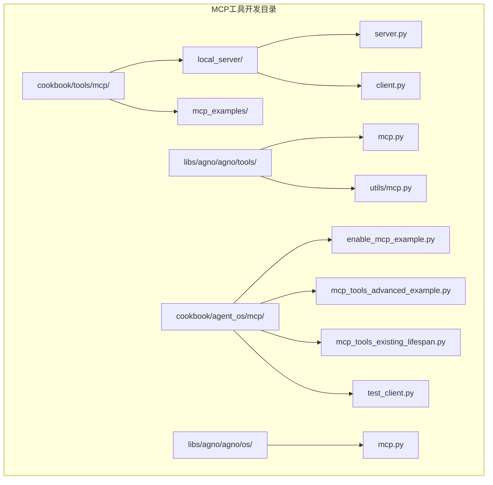
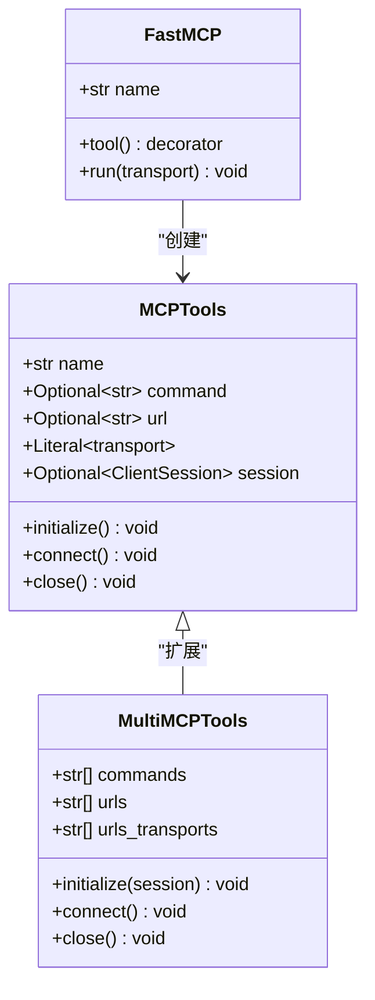
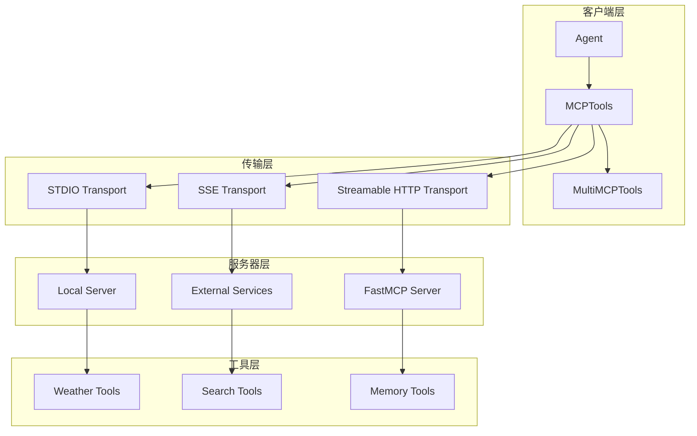
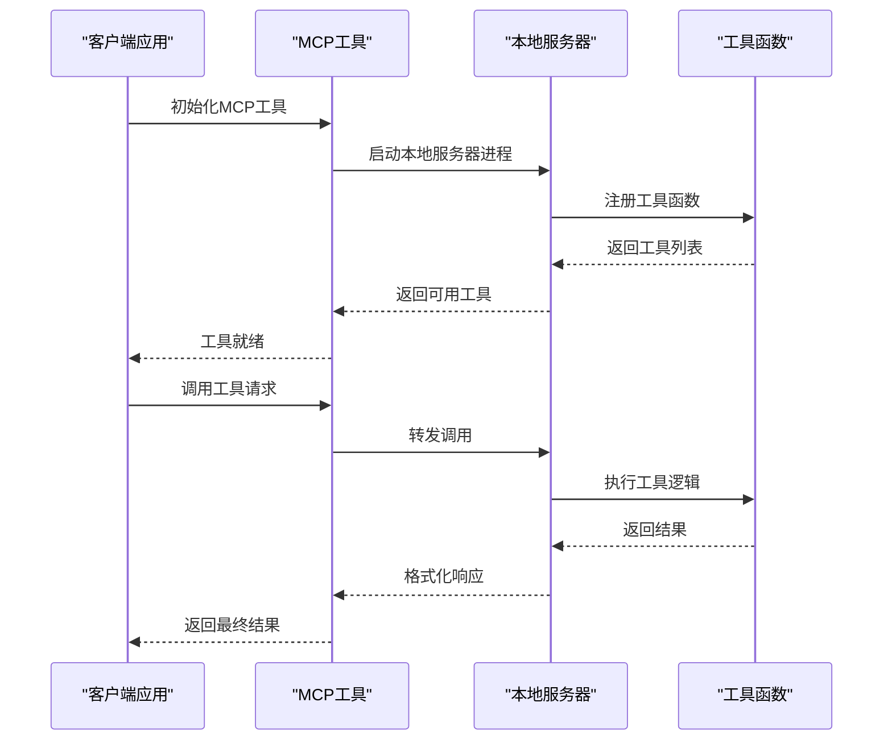
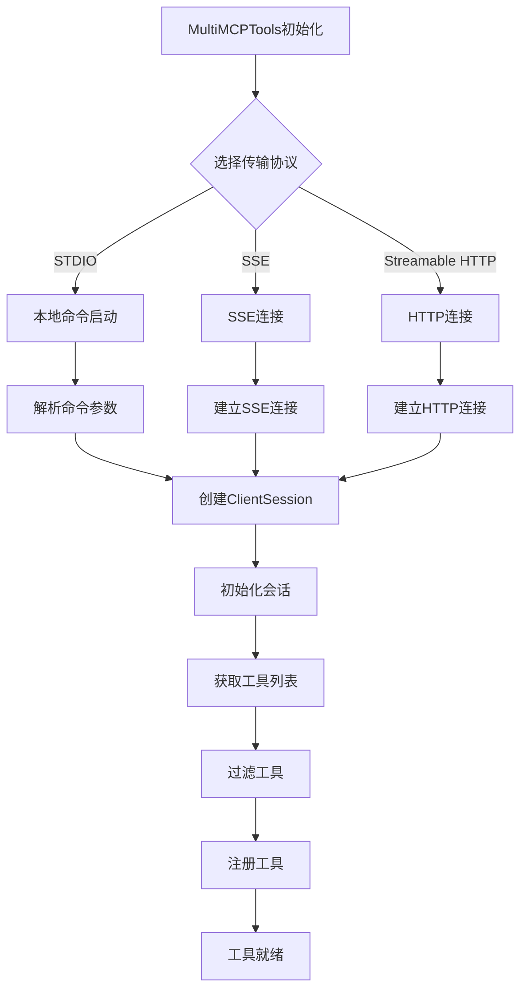
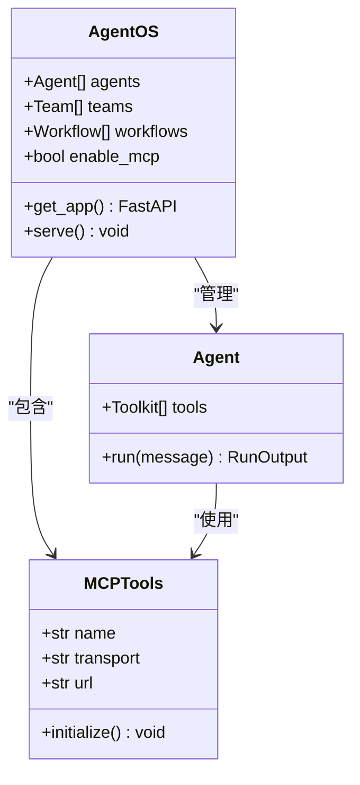
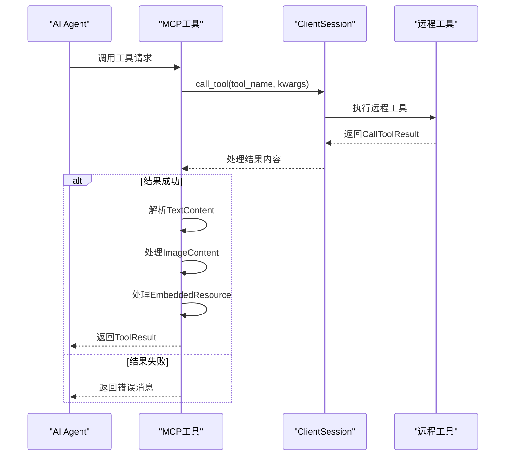
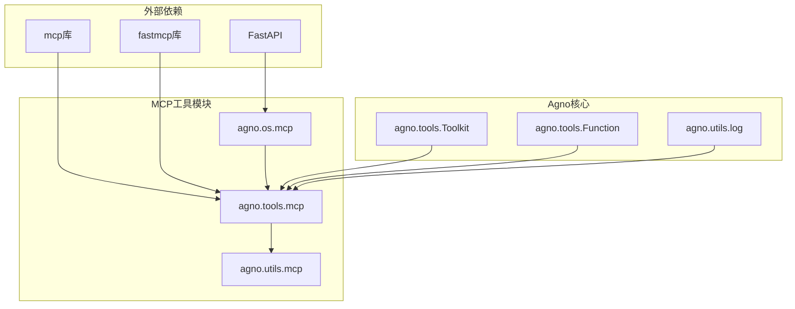

# MCP工具开发详细指南

<cite>
**本文档引用的文件**
- [server.py](file://cookbook/tools/mcp/local_server/server.py)
- [client.py](file://cookbook/tools/mcp/local_server/client.py)
- [mcp.py](file://libs/agno/agno/tools/mcp.py)
- [mcp.py](file://libs/agno/agno/utils/mcp.py)
- [mcp_tools_advanced_example.py](file://cookbook/agent_os/mcp/mcp_tools_advanced_example.py)
- [mcp_tools_existing_lifespan.py](file://cookbook/agent_os/mcp/mcp_tools_existing_lifespan.py)
- [enable_mcp_example.py](file://cookbook/agent_os/mcp/enable_mcp_example.py)
- [test_client.py](file://cookbook/agent_os/mcp/test_client.py)
- [mcp.py](file://libs/agno/agno/os/mcp.py)
</cite>

## 目录
1. [简介](#简介)
2. [项目结构概览](#项目结构概览)
3. [核心组件分析](#核心组件分析)
4. [架构概览](#架构概览)
5. [详细组件分析](#详细组件分析)
6. [依赖关系分析](#依赖关系分析)
7. [性能考虑](#性能考虑)
8. [故障排除指南](#故障排除指南)
9. [结论](#结论)

## 简介

Model Context Protocol (MCP) 是一种标准化协议，允许AI代理与外部工具和服务进行交互。本指南详细介绍了如何在Agno框架中开发、部署和管理MCP工具，包括从简单的本地工具到复杂的多服务器集成的各种场景。

MCP工具开发涉及以下几个关键方面：
- 使用`@tool`装饰器创建工具函数
- 定义输入输出模式和数据验证
- 处理复杂的数据类型和媒体内容
- 实现本地MCP服务器和工具热重载
- 集成现有的API服务如GitHub、Stripe、Notion等

## 项目结构概览

MCP工具开发相关的文件主要分布在以下目录结构中：



**图表来源**
- [server.py](file://cookbook/tools/mcp/local_server/server.py#L1-L28)
- [mcp.py](file://libs/agno/agno/tools/mcp.py#L1-L50)

**章节来源**
- [server.py](file://cookbook/tools/mcp/local_server/server.py#L1-L28)
- [mcp.py](file://libs/agno/agno/tools/mcp.py#L1-L612)

## 核心组件分析

### MCP工具装饰器系统

MCP工具的核心是`@tool`装饰器系统，它提供了声明式的方式来定义工具函数：

```python
from fastmcp import FastMCP

mcp = FastMCP("weather_tools")

@mcp.tool()
def get_weather(city: str) -> str:
    return f"The weather in {city} is sunny"

@mcp.tool()
def get_temperature(city: str) -> str:
    return f"The temperature in {city} is 70 degrees"
```

这个装饰器系统支持：
- 自动参数提取和验证
- 输入输出模式定义
- 工具描述和标签管理
- 错误处理和结果格式化

### MCP工具类架构

MCP工具类提供了三种主要的初始化方式：

1. **直接会话初始化**：使用预建立的ClientSession
2. **标准输入输出传输**：通过stdio启动服务器进程
3. **流式HTTP传输**：通过HTTP端点连接



**图表来源**
- [mcp.py](file://libs/agno/agno/tools/mcp.py#L85-L200)
- [mcp.py](file://libs/agno/agno/tools/mcp.py#L350-L450)

**章节来源**
- [server.py](file://cookbook/tools/mcp/local_server/server.py#L10-L25)
- [mcp.py](file://libs/agno/agno/tools/mcp.py#L85-L200)

## 架构概览

MCP工具开发采用分层架构设计，支持多种传输协议和部署模式：



**图表来源**
- [mcp.py](file://libs/agno/agno/tools/mcp.py#L200-L300)
- [mcp.py](file://libs/agno/agno/os/mcp.py#L20-L50)

## 详细组件分析

### 本地MCP服务器开发

本地MCP服务器是最基础的工具开发形式，适合快速原型开发和测试：



**图表来源**
- [server.py](file://cookbook/tools/mcp/local_server/server.py#L1-L28)
- [client.py](file://cookbook/tools/mcp/local_server/client.py#L1-L26)

#### 基础工具开发示例

```python
from fastmcp import FastMCP

mcp = FastMCP("weather_tools")

@mcp.tool()
def get_weather(city: str) -> str:
    """获取指定城市的天气信息"""
    return f"The weather in {city} is sunny"

@mcp.tool()
def get_temperature(city: str) -> str:
    """获取指定城市的温度信息"""
    return f"The temperature in {city} is 70 degrees"
```

#### 高级工具开发示例

对于更复杂的工具，可以使用装饰器参数来定义详细的元数据：

```python
@mcp.tool(
    name="advanced_search",
    description="Perform advanced web search with filtering",
    tags=["search", "web"],
    output_schema=SearchResults.model_json_schema()
)
async def advanced_search(query: str, filters: dict) -> SearchResults:
    """执行带过滤条件的高级网络搜索"""
    # 实现搜索逻辑
    pass
```

**章节来源**
- [server.py](file://cookbook/tools/mcp/local_server/server.py#L1-L28)
- [mcp.py](file://libs/agno/agno/os/mcp.py#L40-L80)

### 多服务器MCP集成

当需要集成多个外部服务时，MultiMCPTools提供了强大的多服务器连接能力：



**图表来源**
- [mcp.py](file://libs/agno/agno/tools/mcp.py#L350-L450)
- [mcp.py](file://libs/agno/agno/tools/mcp.py#L500-L600)

#### 多服务器配置示例

```python
from agno.tools.mcp import MultiMCPTools

# 配置多个MCP服务器
mcp_tools = MultiMCPTools(
    commands=[
        "npx -y @modelcontextprotocol/server-brave-search",
        "npx -y @modelcontextprotocol/server-github"
    ],
    urls=["https://api.example.com/mcp"],
    env={
        "BRAVE_API_KEY": getenv("BRAVE_API_KEY"),
        "GITHUB_TOKEN": getenv("GITHUB_TOKEN")
    }
)
```

**章节来源**
- [mcp_tools_advanced_example.py](file://cookbook/agent_os/mcp/mcp_tools_advanced_example.py#L1-L67)

### AgentOS集成

AgentOS提供了内置的MCP支持，使得MCP工具可以无缝集成到完整的AI应用中：



**图表来源**
- [mcp_tools_existing_lifespan.py](file://cookbook/agent_os/mcp/mcp_tools_existing_lifespan.py#L1-L60)
- [enable_mcp_example.py](file://cookbook/agent_os/mcp/enable_mcp_example.py#L1-L48)

#### AgentOS配置示例

```python
from agno.os import AgentOS
from agno.tools.mcp import MCPTools

# 创建MCP工具实例
mcp_tools = MCPTools(
    transport="streamable-http", 
    url="https://docs.agno.com/mcp"
)

# 配置AgentOS
agent_os = AgentOS(
    description="Example app with MCP Tools",
    agents=[support_agent],
    enable_mcp=True,
    lifespan=lifespan
)
```

**章节来源**
- [mcp_tools_existing_lifespan.py](file://cookbook/agent_os/mcp/mcp_tools_existing_lifespan.py#L1-L60)
- [enable_mcp_example.py](file://cookbook/agent_os/mcp/enable_mcp_example.py#L1-L48)

### 工具入口点处理

MCP工具的核心功能是通过入口点函数来处理工具调用：



**图表来源**
- [mcp.py](file://libs/agno/agno/utils/mcp.py#L20-L80)

#### 高级内容处理

工具入口点函数能够处理多种内容类型：

```python
async def call_tool(agent: Agent, tool_name: str, **kwargs) -> ToolResult:
    try:
        result: CallToolResult = await session.call_tool(tool_name, kwargs)
        
        if result.isError:
            return ToolResult(content=f"Error from MCP tool '{tool_name}': {result.content}")
        
        response_str = ""
        images = []
        
        for content_item in result.content:
            if isinstance(content_item, TextContent):
                # 处理文本内容
                response_str += content_item.text + "\n"
            elif isinstance(content_item, ImageContent):
                # 处理图像内容
                img_artifact = Image(
                    id=str(uuid4()),
                    url=getattr(content_item, "url", None),
                    content=image_data,
                    mime_type=getattr(content_item, "mimeType", "image/png"),
                )
                images.append(img_artifact)
            elif isinstance(content_item, EmbeddedResource):
                # 处理嵌入资源
                response_str += f"[Embedded resource: {content_item.resource.model_dump_json()}]\n"
        
        return ToolResult(content=response_str.strip(), images=images if images else None)
    except Exception as e:
        return ToolResult(content=f"Error: {e}")
```

**章节来源**
- [mcp.py](file://libs/agno/agno/utils/mcp.py#L20-L125)

## 依赖关系分析

MCP工具开发涉及多个层次的依赖关系：



**图表来源**
- [mcp.py](file://libs/agno/agno/tools/mcp.py#L1-L20)
- [mcp.py](file://libs/agno/agno/utils/mcp.py#L1-L15)

**章节来源**
- [mcp.py](file://libs/agno/agno/tools/mcp.py#L1-L30)
- [mcp.py](file://libs/agno/agno/utils/mcp.py#L1-L15)

## 性能考虑

### 连接池管理

MCP工具支持连接池和会话复用，以提高性能：

- **超时设置**：合理设置连接超时时间
- **会话复用**：避免频繁重新建立连接
- **资源清理**：及时关闭不再使用的连接

### 并发处理

多服务器MCP工具支持并发处理多个工具调用：

```python
async def _connect(self) -> None:
    """连接到MCP服务器并初始化工具"""
    for server_params in self.server_params_list:
        # 处理每个服务器参数
        if isinstance(server_params, StdioServerParameters):
            # 标准输入输出传输
            stdio_transport = await self._async_exit_stack.enter_async_context(
                stdio_client(server_params)
            )
            # 其他传输类型的处理...
```

### 缓存策略

对于频繁访问的工具，建议实施缓存策略：

- **工具列表缓存**：缓存已发现的工具列表
- **会话状态缓存**：缓存会话状态信息
- **结果缓存**：缓存工具执行结果

## 故障排除指南

### 常见问题和解决方案

#### 1. MCP服务器启动失败

**问题症状**：无法启动本地MCP服务器或连接外部服务

**解决方案**：
```python
# 检查命令格式
try:
    parts = _prepare_command(command)
    # 验证可执行文件
    executable = parts[0].split("/")[-1]
    if executable not in ALLOWED_COMMANDS:
        raise ValueError(f"Invalid executable: {executable}")
except Exception as e:
    logger.error(f"Command preparation failed: {e}")
```

#### 2. 工具调用超时

**问题症状**：工具调用长时间无响应

**解决方案**：
```python
# 设置合理的超时时间
mcp_tools = MCPTools(
    command="your_mcp_server_command",
    timeout_seconds=30,  # 增加超时时间
    env={"TIMEOUT": "30"}
)
```

#### 3. 内容格式错误

**问题症状**：工具返回的内容格式不符合预期

**解决方案**：
```python
# 添加内容验证和转换
def process_content(result: CallToolResult) -> ToolResult:
    try:
        # 验证内容类型
        for item in result.content:
            if not isinstance(item, (TextContent, ImageContent, EmbeddedResource)):
                logger.warning(f"Unknown content type: {type(item)}")
                continue
        # 处理内容...
    except Exception as e:
        logger.error(f"Content processing failed: {e}")
        return ToolResult(content=f"Processing error: {e}")
```

**章节来源**
- [mcp.py](file://libs/agno/agno/tools/mcp.py#L25-L50)
- [mcp.py](file://libs/agno/agno/utils/mcp.py#L80-L125)

### 调试技巧

#### 1. 启用详细日志

```python
from agno.utils.log import logger

# 设置日志级别
logger.setLevel(logging.DEBUG)

# 监控工具调用
log_debug(f"Calling MCP Tool '{tool_name}' with args: {kwargs}")
```

#### 2. 工具状态监控

```python
# 检查工具初始化状态
if not self._initialized:
    await self.initialize()
    log_debug(f"{self.name} initialized with {len(filtered_tools)} tools")
```

#### 3. 连接健康检查

```python
# 定期检查连接状态
async def health_check(self):
    try:
        await self.session.initialize()
        return True
    except Exception as e:
        logger.error(f"Connection health check failed: {e}")
        return False
```

## 结论

MCP工具开发是一个强大而灵活的框架，支持从简单的本地工具到复杂的多服务器集成的各种场景。通过本指南介绍的工具装饰器系统、多传输协议支持和智能内容处理机制，开发者可以轻松地将各种API服务封装为MCP工具，并集成到AI应用中。

关键要点总结：

1. **装饰器驱动开发**：使用`@tool`装饰器简化工具定义
2. **多传输协议支持**：支持stdio、SSE和Streamable HTTP传输
3. **智能内容处理**：自动处理文本、图像和嵌入资源
4. **多服务器集成**：支持同时连接多个MCP服务器
5. **AgentOS集成**：无缝集成到完整的AI应用框架
6. **性能优化**：连接池、缓存和并发处理支持

通过遵循本指南的最佳实践，开发者可以构建高效、可靠且易于维护的MCP工具，为AI应用提供丰富的外部服务集成能力。