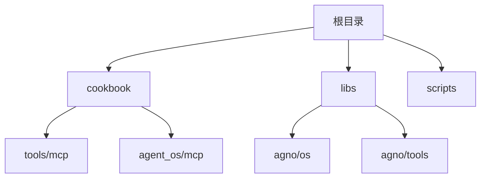
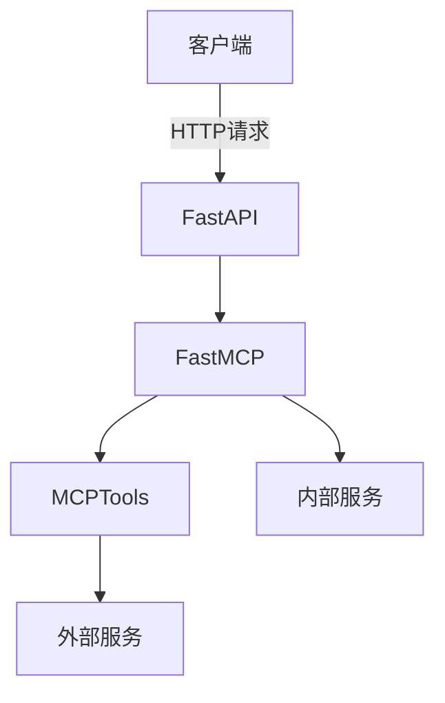
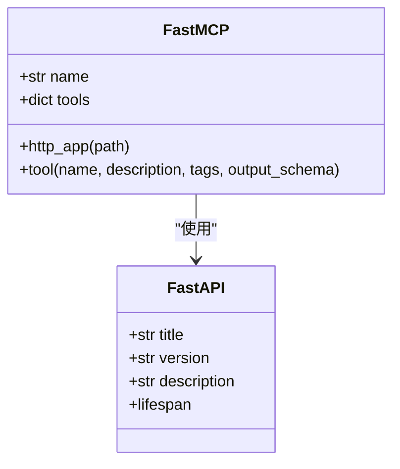
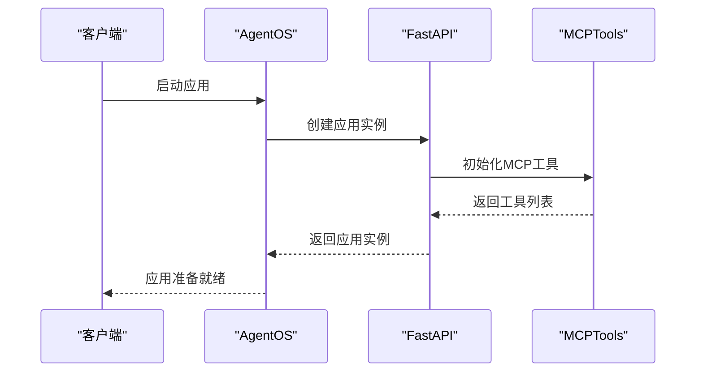
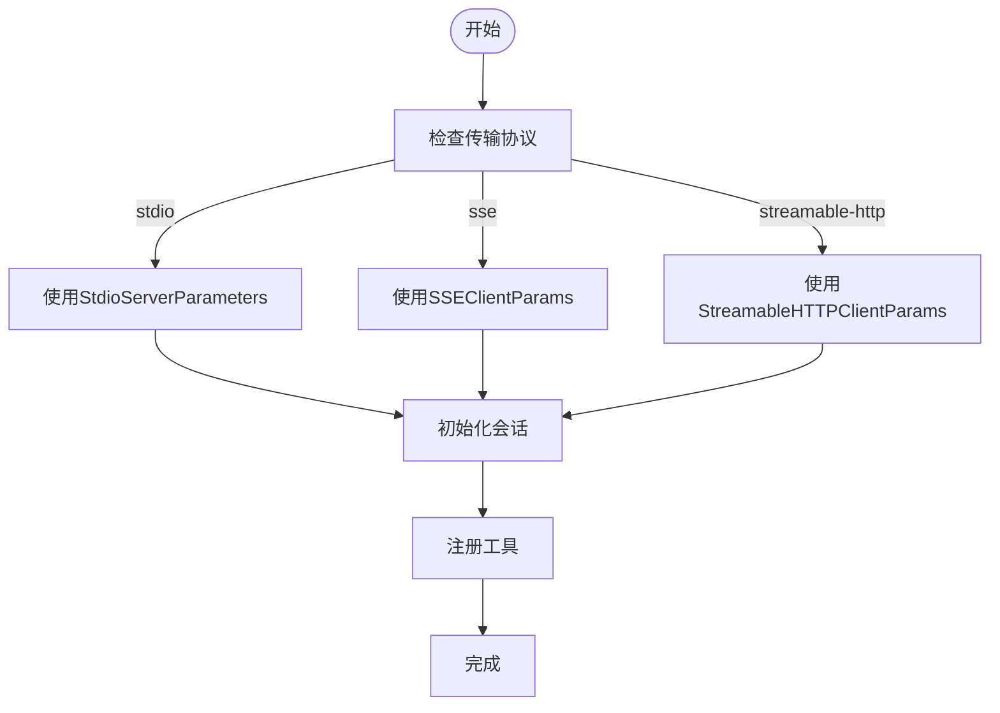
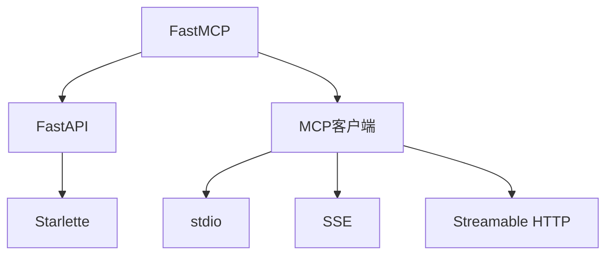

# MCP服务器部署

<cite>
**本文档中引用的文件**  
- [server.py](file://cookbook/tools/mcp/local_server/server.py)
- [mcp.py](file://libs/agno/agno/os/mcp.py)
- [app.py](file://libs/agno/agno/os/app.py)
- [mcp_tools.py](file://libs/agno/agno/tools/mcp.py)
- [multiple_servers.py](file://cookbook/tools/mcp/multiple_servers.py)
- [enable_mcp_example.py](file://cookbook/agent_os/mcp/enable_mcp_example.py)
- [test_client.py](file://cookbook/agent_os/mcp/test_client.py)
- [mcp_tools_example.py](file://cookbook/agent_os/mcp/mcp_tools_example.py)
- [custom_lifespan.py](file://cookbook/agent_os/customize/custom_lifespan.py)
- [custom_fastapi_app.py](file://cookbook/agent_os/customize/custom_fastapi_app.py)
</cite>

## 目录
1. [简介](#简介)
2. [项目结构](#项目结构)
3. [核心组件](#核心组件)
4. [架构概述](#架构概述)
5. [详细组件分析](#详细组件分析)
6. [依赖分析](#依赖分析)
7. [性能考虑](#性能考虑)
8. [故障排除指南](#故障排除指南)
9. [结论](#结论)

## 简介
本文档提供了一个完整的指南，用于部署和配置MCP（Model Context Protocol）服务器。文档涵盖了从基础设置到高级配置的所有方面，包括使用Python内置HTTP服务器或FastAPI部署MCP服务端点、服务器配置选项（如端口绑定、SSL/TLS加密、CORS策略和速率限制）、工具注册与热重载、多服务器部署场景以及生产环境部署建议。

## 项目结构
本项目包含多个目录，每个目录都有特定的功能。主要目录包括`cookbook`、`libs`和`scripts`。`cookbook`目录包含了各种示例和教程，而`libs`目录则包含了核心库代码。`scripts`目录包含了一些辅助脚本。

**图源**  
- [server.py](file://cookbook/tools/mcp/local_server/server.py)
- [mcp.py](file://libs/agno/agno/os/mcp.py)

**节源**  
- [server.py](file://cookbook/tools/mcp/local_server/server.py)
- [mcp.py](file://libs/agno/agno/os/mcp.py)

## 核心组件
MCP服务器的核心组件包括FastMCP、AgentOS和MCPTools。这些组件共同工作，以提供一个强大且灵活的服务框架。

**节源**  
- [server.py](file://cookbook/tools/mcp/local_server/server.py)
- [mcp.py](file://libs/agno/agno/os/mcp.py)
- [mcp_tools.py](file://libs/agno/agno/tools/mcp.py)

## 架构概述
MCP服务器的架构基于FastAPI构建，支持多种传输协议，包括stdio、SSE和Streamable HTTP。服务器通过FastMCP库暴露API端点，并可以通过AgentOS进行集成。

**图源**  
- [mcp.py](file://libs/agno/agno/os/mcp.py)
- [app.py](file://libs/agno/agno/os/app.py)

## 详细组件分析

### FastMCP分析
FastMCP是MCP服务器的核心，负责处理所有API请求和响应。

**图源**  
- [mcp.py](file://libs/agno/agno/os/mcp.py)
- [server.py](file://cookbook/tools/mcp/local_server/server.py)

**节源**  
- [mcp.py](file://libs/agno/agno/os/mcp.py)
- [server.py](file://cookbook/tools/mcp/local_server/server.py)

### AgentOS分析
AgentOS是整个系统的入口点，负责初始化和管理所有组件。

**图源**  
- [app.py](file://libs/agno/agno/os/app.py)
- [enable_mcp_example.py](file://cookbook/agent_os/mcp/enable_mcp_example.py)

**节源**  
- [app.py](file://libs/agno/agno/os/app.py)
- [enable_mcp_example.py](file://cookbook/agent_os/mcp/enable_mcp_example.py)

### MCPTools分析
MCPTools是连接外部服务的关键组件，支持多种传输方式。

**图源**  
- [mcp_tools.py](file://libs/agno/agno/tools/mcp.py)
- [multiple_servers.py](file://cookbook/tools/mcp/multiple_servers.py)

**节源**  
- [mcp_tools.py](file://libs/agno/agno/tools/mcp.py)
- [multiple_servers.py](file://cookbook/tools/mcp/multiple_servers.py)

## 依赖分析
MCP服务器依赖于多个外部库，包括FastMCP、FastAPI和MCP客户端库。这些依赖关系确保了服务器能够与各种外部服务进行通信。

**图源**  
- [mcp.py](file://libs/agno/agno/os/mcp.py)
- [mcp_tools.py](file://libs/agno/agno/tools/mcp.py)

**节源**  
- [mcp.py](file://libs/agno/agno/os/mcp.py)
- [mcp_tools.py](file://libs/agno/agno/tools/mcp.py)

## 性能考虑
在生产环境中部署MCP服务器时，需要考虑性能优化。建议使用Docker容器化部署，结合负载均衡器来分发请求。此外，应实现健康检查机制以确保服务的高可用性。

## 故障排除指南
如果遇到问题，请首先检查日志文件。常见的问题包括环境变量未正确设置、依赖库版本不匹配以及网络连接问题。对于多服务器部署，确保所有服务器的配置一致。

**节源**  
- [test_client.py](file://cookbook/agent_os/mcp/test_client.py)
- [custom_lifespan.py](file://cookbook/agent_os/customize/custom_lifespan.py)

## 结论
本文档提供了MCP服务器部署的全面指南。通过遵循这些步骤，您可以成功地部署和配置MCP服务器，无论是用于开发还是生产环境。未来的工作可以集中在进一步优化性能和增强安全性上。