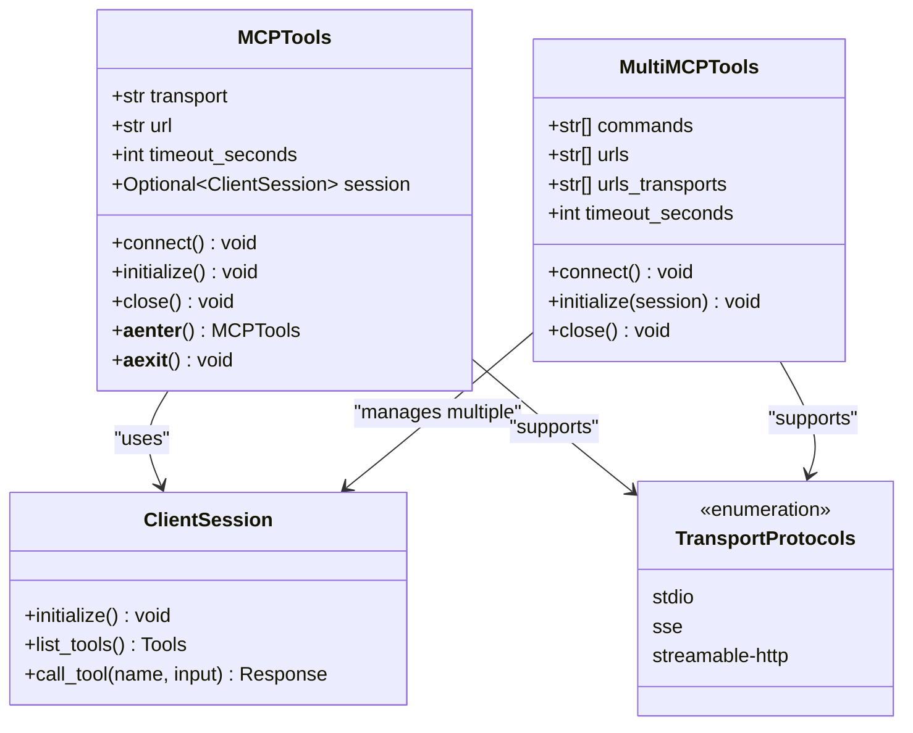

# MCP工具测试与调试实用指南

<cite>
**本文档中引用的文件**
- [test_client.py](file://cookbook/agent_os/mcp/test_client.py)
- [mcp_tools_example.py](file://cookbook/agent_os/mcp/mcp_tools_example.py)
- [mcp_tools_advanced_example.py](file://cookbook/agent_os/mcp/mcp_tools_advanced_example.py)
- [mcp_tools.py](file://cookbook/tools/mcp_tools.py)
- [mcp.py](file://libs/agno/agno/tools/mcp.py)
- [mcp_connector.py](file://cookbook/models/anthropic/mcp_connector.py)
- [README.md](file://README.md)
</cite>

## 目录
1. [简介](#简介)
2. [MCP工具架构概览](#mcp工具架构概览)
3. [测试客户端配置与使用](#测试客户端配置与使用)
4. [多传输协议支持](#多传输协议支持)
5. [调试方法与技巧](#调试方法与技巧)
6. [单元测试与集成测试](#单元测试与集成测试)
7. [常见问题排查](#常见问题排查)
8. [性能优化建议](#性能优化建议)
9. [最佳实践](#最佳实践)
10. [总结](#总结)

## 简介

Model Context Protocol (MCP) 是一种标准化协议，用于在AI代理和外部工具之间建立通信桥梁。本指南详细介绍了如何使用Agno框架中的MCP工具进行测试与调试，包括构造测试请求、验证响应模式以及处理各种边缘情况。

MCP工具提供了强大的功能，允许代理访问外部资源、执行复杂操作并与其他系统集成。通过正确的测试和调试方法，可以确保MCP工具在生产环境中的稳定性和可靠性。

## MCP工具架构概览

MCP工具基于异步架构设计，支持多种传输协议和连接方式。核心组件包括：



**图表来源**
- [mcp.py](file://libs/agno/agno/tools/mcp.py#L60-L200)
- [mcp.py](file://libs/agno/agno/tools/mcp.py#L320-L450)

**章节来源**
- [mcp.py](file://libs/agno/agno/tools/mcp.py#L1-L100)

## 测试客户端配置与使用

### 基础测试客户端

测试客户端是验证MCP工具功能的基础工具。以下是一个完整的测试客户端配置示例：

```python
import asyncio
from uuid import uuid4
from agno.agent import Agent
from agno.db.in_memory import InMemoryDb
from agno.models.openai import OpenAIChat
from agno.tools.mcp import MCPTools

# 配置服务器URL
server_url = "http://localhost:7777/mcp"

# 创建唯一会话ID
session_id = f"session_{uuid4()}"

async def run_agent() -> None:
    # 使用上下文管理器自动管理连接生命周期
    async with MCPTools(
        transport="streamable-http", 
        url=server_url, 
        timeout_seconds=60
    ) as mcp_tools:
        
        # 创建代理实例
        agent = Agent(
            model=OpenAIChat(id="gpt-5-mini"),
            tools=[mcp_tools],
            instructions=[
                "你是一个有用的助手，可以访问AgentOS的配置。",
                "如果需要执行某些操作，请使用适当的工具。",
                "查找AgentOS配置中所需的信息。",
            ],
            user_id="john@example.com",
            session_id=session_id,
            db=InMemoryDb(),
            add_session_state_to_context=True,
            add_history_to_context=True,
            markdown=True,
        )
        
        # 执行测试查询
        await agent.aprint_response(
            input="我的AgentOS中有哪些代理？", 
            stream=True, 
            markdown=True
        )
```

### 高级测试配置

对于更复杂的测试场景，可以配置多个MCP服务器和高级参数：

```python
from agno.tools.mcp import MultiMCPTools
from os import getenv

# 配置多个MCP服务器
mcp_tools = MultiMCPTools(
    commands=[
        "npx -y @modelcontextprotocol/server-brave-search"
    ],
    urls=[
        "https://docs.agno.com/mcp"
    ],
    env={
        "BRAVE_API_KEY": getenv("BRAVE_API_KEY"),
    },
    timeout_seconds=60,
    include_tools=["search", "web_scraping"],
    exclude_tools=["dangerous_operation"]
)
```

**章节来源**
- [test_client.py](file://cookbook/agent_os/mcp/test_client.py#L1-L82)
- [mcp_tools_advanced_example.py](file://cookbook/agent_os/mcp/mcp_tools_advanced_example.py#L1-L67)

## 多传输协议支持

MCP工具支持三种主要的传输协议，每种都有其特定的使用场景和优势：

### 1. 标准输入输出 (stdio) 协议

适用于本地命令行工具和服务：

```python
from mcp.client.stdio import StdioServerParameters

server_params = StdioServerParameters(
    command="python",
    args=["-m", "my_mcp_server"],
    env={
        "ENV_VAR": "value",
        "DEBUG": "true"
    }
)

mcp_tools = MCPTools(
    server_params=server_params,
    transport="stdio"
)
```

### 2. SSE (Server-Sent Events) 协议

适用于实时数据流和事件通知：

```python
from mcp.client.sse import sse_client
from agno.tools.mcp import SSEClientParams

sse_params = SSEClientParams(
    url="http://localhost:8080/events",
    headers={"Authorization": "Bearer token"},
    timeout=30,
    sse_read_timeout=300
)

mcp_tools = MCPTools(
    server_params=sse_params,
    transport="sse"
)
```

### 3. 可流式HTTP协议

推荐的现代传输协议，支持双向通信：

```python
from agno.tools.mcp import StreamableHTTPClientParams

http_params = StreamableHTTPClientParams(
    url="http://localhost:7777/mcp",
    headers={"Content-Type": "application/json"},
    timeout=timedelta(seconds=30),
    sse_read_timeout=timedelta(minutes=5),
    terminate_on_close=True
)

mcp_tools = MCPTools(
    server_params=http_params,
    transport="streamable-http"
)
```

**章节来源**
- [mcp.py](file://libs/agno/agno/tools/mcp.py#L200-L280)

## 调试方法与技巧

### 启用详细日志记录

```python
import logging
from agno.utils.log import logger

# 设置日志级别
logger.setLevel(logging.DEBUG)

# 自定义日志格式
logging.basicConfig(
    level=logging.DEBUG,
    format='%(asctime)s - %(name)s - %(levelname)s - %(message)s'
)
```

### 实时调试：SSE监控

使用SSE进行实时调试，监控MCP服务器的通信：

```python
import asyncio
from mcp.client.sse import sse_client
from mcp import ClientSession

async def debug_mcp_connection():
    async with sse_client(url="http://localhost:7777/mcp") as (read, write):
        async with ClientSession(read, write) as session:
            # 初始化会话
            await session.initialize()
            
            # 监控工具列表
            tools = await session.list_tools()
            print(f"可用工具: {[tool.name for tool in tools.tools]}")
            
            # 监控工具调用
            for tool in tools.tools:
                try:
                    result = await session.call_tool(
                        tool.name, 
                        {}
                    )
                    print(f"工具 {tool.name} 返回: {result}")
                except Exception as e:
                    print(f"工具 {tool.name} 错误: {e}")
```

### 可流式HTTP传输调试

```python
from agno.tools.mcp import StreamableHTTPClientParams
import aiohttp

async def debug_http_connection():
    params = StreamableHTTPClientParams(
        url="http://localhost:7777/mcp",
        timeout=timedelta(seconds=30)
    )
    
    async with streamablehttp_client(asdict(params)) as (read, write):
        # 检查连接状态
        if read.is_connected():
            print("连接已建立")
        
        # 发送测试请求
        async with aiohttp.ClientSession() as session:
            async with session.get(params.url) as response:
                print(f"HTTP状态: {response.status}")
                print(f"响应头: {response.headers}")
```

### 连接超时处理

```python
import asyncio
from agno.tools.mcp import MCPTools

async def robust_mcp_connection():
    try:
        async with MCPTools(
            transport="streamable-http",
            url="http://localhost:7777/mcp",
            timeout_seconds=30
        ) as mcp_tools:
            # 连接成功后的操作
            await mcp_tools.connect()
            print("MCP连接成功建立")
            
    except asyncio.TimeoutError:
        print("连接超时，请检查服务器状态")
    except Exception as e:
        print(f"连接错误: {e}")
```

**章节来源**
- [mcp.py](file://libs/agno/agno/tools/mcp.py#L200-L300)

## 单元测试与集成测试

### 基础单元测试

```python
import unittest
import asyncio
from agno.tools.mcp import MCPTools

class TestMCPTools(unittest.TestCase):
    def setUp(self):
        self.loop = asyncio.new_event_loop()
        asyncio.set_event_loop(self.loop)
    
    def tearDown(self):
        self.loop.close()
    
    def test_mcp_initialization(self):
        """测试MCP工具初始化"""
        mcp_tools = MCPTools(
            transport="stdio",
            command="echo test"
        )
        
        self.assertIsNotNone(mcp_tools)
        self.assertFalse(mcp_tools._initialized)
    
    def test_mcp_connection(self):
        """测试MCP连接"""
        async def test_coroutine():
            async with MCPTools(
                transport="stdio",
                command="echo test"
            ) as mcp_tools:
                await mcp_tools.connect()
                self.assertTrue(mcp_tools._initialized)
        
        self.loop.run_until_complete(test_coroutine())
```

### 集成测试框架

```python
import pytest
import asyncio
from agno.tools.mcp import MCPTools, MultiMCPTools

@pytest.mark.asyncio
async def test_mcp_integration():
    """集成测试MCP工具"""
    mcp_tools = MCPTools(
        transport="stdio",
        command="python -m pytest --help"
    )
    
    async with mcp_tools:
        # 测试连接
        await mcp_tools.connect()
        
        # 测试工具列表
        tools = await mcp_tools.session.list_tools()
        assert len(tools.tools) > 0
        
        # 测试工具调用
        for tool in tools.tools[:2]:  # 测试前两个工具
            try:
                result = await mcp_tools.session.call_tool(
                    tool.name, 
                    {}
                )
                print(f"工具 {tool.name} 成功调用")
            except Exception as e:
                print(f"工具 {tool.name} 调用失败: {e}")
```

### 测试客户端自动化

```python
import json
from pathlib import Path

class MCPTestSuite:
    def __init__(self, test_cases_path: str):
        self.test_cases_path = Path(test_cases_path)
        self.results = []
    
    async def run_test_suite(self):
        """运行完整的测试套件"""
        test_cases = self.load_test_cases()
        
        for case in test_cases:
            try:
                result = await self.run_test_case(case)
                self.results.append({
                    "case": case["name"],
                    "status": "success",
                    "result": result
                })
            except Exception as e:
                self.results.append({
                    "case": case["name"],
                    "status": "failed",
                    "error": str(e)
                })
    
    def load_test_cases(self):
        """加载测试用例"""
        with open(self.test_cases_path, 'r') as f:
            return json.load(f)
    
    async def run_test_case(self, case):
        """运行单个测试用例"""
        async with MCPTools(
            transport=case.get("transport", "stdio"),
            url=case.get("url"),
            command=case.get("command")
        ) as mcp_tools:
            await mcp_tools.connect()
            
            # 执行测试逻辑
            if "test_function" in case:
                return await getattr(self, case["test_function"])(mcp_tools, case)
            
            return {"status": "test_not_implemented"}
```

**章节来源**
- [test_client.py](file://cookbook/agent_os/mcp/test_client.py#L20-L50)
- [mcp_tools.py](file://cookbook/tools/mcp_tools.py#L1-L40)

## 常见问题排查

### 认证失败

**问题症状：**
- 连接被拒绝
- 401 Unauthorized错误
- 权限不足

**解决方案：**

```python
# 1. 检查认证配置
from agno.tools.mcp import StreamableHTTPClientParams

params = StreamableHTTPClientParams(
    url="http://localhost:7777/mcp",
    headers={
        "Authorization": "Bearer YOUR_TOKEN_HERE",
        "X-API-Key": "YOUR_API_KEY"
    }
)

# 2. 验证环境变量
import os
from agno.tools.mcp import MCPTools

mcp_tools = MCPTools(
    transport="streamable-http",
    url="http://localhost:7777/mcp",
    env={
        "MCP_AUTH_TOKEN": os.getenv("MCP_AUTH_TOKEN"),
        "API_KEY": os.getenv("API_KEY")
    }
)

# 3. 添加认证中间件
async def authenticated_mcp_connection():
    async with MCPTools(
        transport="streamable-http",
        url="http://localhost:7777/mcp"
    ) as mcp_tools:
        # 在会话中添加认证逻辑
        await mcp_tools.session.initialize()
        # 执行认证检查
        await mcp_tools.session.call_tool("authenticate", {})
```

### 模式验证错误

**问题症状：**
- JSON Schema验证失败
- 参数类型不匹配
- 输入格式错误

**解决方案：**

```python
from typing import Any, Dict
from pydantic import BaseModel, ValidationError

class MCPToolInput(BaseModel):
    query: str
    limit: int = 10
    filters: Dict[str, Any] = {}

async def safe_tool_call(mcp_tools, tool_name: str, input_data: Dict[str, Any]):
    """安全的工具调用包装器"""
    try:
        # 验证输入数据
        validated_input = MCPToolInput(**input_data)
        
        # 调用工具
        result = await mcp_tools.session.call_tool(
            tool_name, 
            validated_input.dict()
        )
        
        return result
        
    except ValidationError as e:
        print(f"输入验证错误: {e}")
        # 提供默认值或回退方案
        return await fallback_tool_call(mcp_tools, tool_name, input_data)
    except Exception as e:
        print(f"工具调用错误: {e}")
        return None

async def fallback_tool_call(mcp_tools, tool_name: str, input_data: Dict[str, Any]):
    """回退工具调用"""
    # 尝试简化输入
    simplified_input = {k: v for k, v in input_data.items() if v is not None}
    return await mcp_tools.session.call_tool(tool_name, simplified_input)
```

### 性能瓶颈

**问题症状：**
- 响应时间过长
- 内存使用过高
- 并发连接数限制

**解决方案：**

```python
import asyncio
from concurrent.futures import ThreadPoolExecutor
from functools import wraps

def monitor_performance(func):
    """性能监控装饰器"""
    @wraps(func)
    async def wrapper(*args, **kwargs):
        import time
        start_time = time.time()
        start_memory = get_memory_usage()
        
        try:
            result = await func(*args, **kwargs)
            return result
        finally:
            end_time = time.time()
            end_memory = get_memory_usage()
            
            print(f"函数 {func.__name__} 执行时间: {end_time - start_time:.2f}s")
            print(f"内存使用变化: {end_memory - start_memory:.2f}MB")
    
    return wrapper

def get_memory_usage():
    """获取当前内存使用量"""
    import psutil
    process = psutil.Process()
    return process.memory_info().rss / 1024 / 1024

# 使用线程池优化并发
async def batch_mcp_operations(mcp_tools, operations: list):
    """批量处理MCP操作"""
    max_workers = 5  # 限制并发数
    
    with ThreadPoolExecutor(max_workers=max_workers) as executor:
        tasks = [
            asyncio.get_event_loop().run_in_executor(
                executor, 
                lambda op: mcp_tools.session.call_tool(op['name'], op['input']),
                op
            )
            for op in operations
        ]
        
        results = await asyncio.gather(*tasks, return_exceptions=True)
        return results
```

### 网络中断处理

**问题症状：**
- 连接突然断开
- 数据传输中断
- 重连失败

**解决方案：**

```python
import asyncio
from typing import Callable, Any

class MCPConnectionManager:
    def __init__(self, mcp_tools: MCPTools, max_retries: int = 3):
        self.mcp_tools = mcp_tools
        self.max_retries = max_retries
        self.connected = False
    
    async def ensure_connection(self):
        """确保连接可用"""
        for attempt in range(self.max_retries):
            try:
                if not self.connected:
                    await self.mcp_tools.connect()
                    self.connected = True
                    break
            except Exception as e:
                print(f"连接尝试 {attempt + 1} 失败: {e}")
                
                if attempt < self.max_retries - 1:
                    await asyncio.sleep(2 ** attempt)  # 指数退避
                else:
                    raise ConnectionError("无法建立MCP连接")
    
    async def safe_tool_call(self, tool_name: str, input_data: dict) -> Any:
        """安全的工具调用，包含重试机制"""
        for attempt in range(self.max_retries):
            try:
                await self.ensure_connection()
                return await self.mcp_tools.session.call_tool(tool_name, input_data)
                
            except Exception as e:
                print(f"工具调用尝试 {attempt + 1} 失败: {e}")
                self.connected = False
                
                if attempt < self.max_retries - 1:
                    await asyncio.sleep(2 ** attempt)
                else:
                    raise e

# 使用示例
async def resilient_mcp_usage():
    mcp_tools = MCPTools(transport="streamable-http", url="http://localhost:7777/mcp")
    manager = MCPConnectionManager(mcp_tools)
    
    try:
        result = await manager.safe_tool_call("search", {"query": "test"})
        print(f"搜索结果: {result}")
    finally:
        await mcp_tools.close()
```

**章节来源**
- [mcp.py](file://libs/agno/agno/tools/mcp.py#L400-L500)

## 性能优化建议

### 连接池管理

```python
import asyncio
from typing import Dict, List
from agno.tools.mcp import MCPTools

class MCPConnectionPool:
    def __init__(self, pool_size: int = 5):
        self.pool_size = pool_size
        self.connections: Dict[str, List[MCPTools]] = {}
        self.lock = asyncio.Lock()
    
    async def get_connection(self, server_key: str) -> MCPTools:
        """从连接池获取连接"""
        async with self.lock:
            if server_key not in self.connections:
                self.connections[server_key] = []
            
            if self.connections[server_key]:
                return self.connections[server_key].pop()
            
            # 创建新连接
            return MCPTools(
                transport="streamable-http",
                url=f"http://localhost:7777/{server_key}"
            )
    
    async def return_connection(self, server_key: str, connection: MCPTools):
        """归还连接到连接池"""
        async with self.lock:
            if len(self.connections[server_key]) < self.pool_size:
                self.connections[server_key].append(connection)
            else:
                await connection.close()
    
    async def close_all(self):
        """关闭所有连接"""
        async with self.lock:
            for server_key, connections in self.connections.items():
                for conn in connections:
                    await conn.close()
```

### 缓存策略

```python
from functools import lru_cache
import hashlib
import json
from typing import Any

class MCPCache:
    def __init__(self, max_size: int = 1000):
        self.cache = {}
        self.max_size = max_size
    
    def _generate_key(self, tool_name: str, input_data: dict) -> str:
        """生成缓存键"""
        data_str = json.dumps(input_data, sort_keys=True)
        return hashlib.md5(f"{tool_name}:{data_str}".encode()).hexdigest()
    
    def cache_result(self, tool_name: str, input_data: dict, result: Any):
        """缓存结果"""
        if len(self.cache) >= self.max_size:
            # 移除最旧的条目
            oldest_key = next(iter(self.cache))
            del self.cache[oldest_key]
        
        key = self._generate_key(tool_name, input_data)
        self.cache[key] = {
            "result": result,
            "timestamp": time.time()
        }
    
    def get_cached_result(self, tool_name: str, input_data: dict) -> Any:
        """获取缓存结果"""
        key = self._generate_key(tool_name, input_data)
        if key in self.cache:
            return self.cache[key]["result"]
        return None
```

### 异步批处理

```python
import asyncio
from collections import defaultdict
from typing import Dict, List, Tuple

class MCPBatchProcessor:
    def __init__(self, batch_size: int = 10, timeout: float = 1.0):
        self.batch_size = batch_size
        self.timeout = timeout
        self.pending_batches: Dict[str, List[Tuple[dict, asyncio.Future]]] = defaultdict(list)
        self.task = asyncio.create_task(self._process_batches())
    
    async def add_to_batch(self, server_key: str, tool_name: str, input_data: dict):
        """添加到批处理队列"""
        future = asyncio.Future()
        self.pending_batches[server_key].append(({
            "tool_name": tool_name,
            "input_data": input_data
        }, future))
        
        if len(self.pending_batches[server_key]) >= self.batch_size:
            await self._flush_batch(server_key)
        
        return future
    
    async def _process_batches(self):
        """处理批处理任务"""
        while True:
            await asyncio.sleep(self.timeout)
            
            for server_key in list(self.pending_batches.keys()):
                if self.pending_batches[server_key]:
                    await self._flush_batch(server_key)
    
    async def _flush_batch(self, server_key: str):
        """刷新批处理"""
        batch = self.pending_batches.pop(server_key, [])
        if not batch:
            return
        
        # 批量调用工具
        results = await self._batch_call(server_key, batch)
        
        # 分发结果
        for (request, future), result in zip(batch, results):
            if not future.done():
                future.set_result(result)
    
    async def _batch_call(self, server_key: str, batch: List) -> List:
        """执行批量工具调用"""
        # 实现具体的批量调用逻辑
        pass
```

## 最佳实践

### 1. 错误处理最佳实践

```python
from typing import Any, Dict, Optional
import traceback

class MCPErrorHandler:
    @staticmethod
    async def handle_tool_call(
        mcp_tools: MCPTools, 
        tool_name: str, 
        input_data: Dict[str, Any],
        retries: int = 3
    ) -> Optional[Any]:
        """带重试机制的工具调用"""
        last_exception = None
        
        for attempt in range(retries):
            try:
                # 验证输入
                validated_input = validate_tool_input(tool_name, input_data)
                
                # 调用工具
                result = await mcp_tools.session.call_tool(
                    tool_name, 
                    validated_input
                )
                
                # 验证结果
                validate_tool_result(tool_name, result)
                
                return result
                
            except ValidationError as e:
                print(f"输入验证失败 (尝试 {attempt + 1}): {e}")
                return None
                
            except ConnectionError as e:
                print(f"连接错误 (尝试 {attempt + 1}): {e}")
                last_exception = e
                if attempt < retries - 1:
                    await asyncio.sleep(2 ** attempt)
                    
            except Exception as e:
                print(f"未知错误 (尝试 {attempt + 1}): {e}")
                last_exception = e
                if attempt < retries - 1:
                    await asyncio.sleep(2 ** attempt)
        
        # 记录详细的错误信息
        MCPErrorHandler.log_error(
            tool_name=tool_name,
            input_data=input_data,
            error=str(last_exception),
            traceback=traceback.format_exc()
        )
        
        return None
    
    @staticmethod
    def log_error(tool_name: str, input_data: Dict[str, Any], error: str, traceback: str):
        """记录错误信息"""
        error_log = {
            "timestamp": datetime.now().isoformat(),
            "tool_name": tool_name,
            "input_data": input_data,
            "error": error,
            "traceback": traceback
        }
        
        with open("mcp_errors.log", "a") as f:
            f.write(json.dumps(error_log) + "\n")
```

### 2. 监控和指标收集

```python
import time
from dataclasses import dataclass
from typing import Dict, List

@dataclass
class MCPMetrics:
    total_requests: int = 0
    successful_requests: int = 0
    failed_requests: int = 0
    avg_response_time: float = 0.0
    errors_by_type: Dict[str, int] = None
    
    def __post_init__(self):
        if self.errors_by_type is None:
            self.errors_by_type = {}

class MCPMonitor:
    def __init__(self):
        self.metrics = MCPMetrics()
        self.response_times: List[float] = []
    
    async def monitored_tool_call(self, mcp_tools: MCPTools, tool_name: str, input_data: dict):
        """监控的工具调用"""
        start_time = time.time()
        
        try:
            result = await mcp_tools.session.call_tool(tool_name, input_data)
            
            # 更新成功指标
            self.metrics.successful_requests += 1
            
            # 记录响应时间
            response_time = time.time() - start_time
            self.response_times.append(response_time)
            
            # 计算平均响应时间
            self.metrics.avg_response_time = sum(self.response_times) / len(self.response_times)
            
            return result
            
        except Exception as e:
            # 更新失败指标
            self.metrics.failed_requests += 1
            
            # 记录错误类型
            error_type = type(e).__name__
            self.metrics.errors_by_type[error_type] = \
                self.metrics.errors_by_type.get(error_type, 0) + 1
            
            raise
        
        finally:
            # 更新总请求数
            self.metrics.total_requests += 1
    
    def get_metrics(self) -> MCPMetrics:
        """获取当前指标"""
        return self.metrics
    
    def reset_metrics(self):
        """重置指标"""
        self.metrics = MCPMetrics()
        self.response_times.clear()
```

### 3. 配置管理

```python
from dataclasses import dataclass
from typing import Optional, Dict, List
import yaml

@dataclass
class MCPConfig:
    transport: str = "streamable-http"
    url: str = "http://localhost:7777/mcp"
    timeout_seconds: int = 30
    max_retries: int = 3
    retry_delay: float = 1.0
    enable_caching: bool = True
    log_level: str = "INFO"
    environment: str = "development"
    servers: List[Dict[str, str]] = None
    
    @classmethod
    def from_yaml(cls, config_path: str):
        """从YAML文件加载配置"""
        with open(config_path, 'r') as f:
            config_data = yaml.safe_load(f)
        
        # 验证必需字段
        required_fields = ['transport', 'url']
        for field in required_fields:
            if field not in config_data:
                raise ValueError(f"配置缺少必需字段: {field}")
        
        return cls(**config_data)
    
    def validate(self):
        """验证配置有效性"""
        valid_transports = ["stdio", "sse", "streamable-http"]
        if self.transport not in valid_transports:
            raise ValueError(f"无效的传输协议: {self.transport}")
        
        if self.timeout_seconds <= 0:
            raise ValueError("超时时间必须大于0")
        
        if self.max_retries < 0:
            raise ValueError("重试次数不能为负数")

# 使用示例
config = MCPConfig.from_yaml("mcp_config.yaml")
config.validate()

mcp_tools = MCPTools(
    transport=config.transport,
    url=config.url,
    timeout_seconds=config.timeout_seconds
)
```

## 总结

本指南全面介绍了MCP工具的测试与调试方法，涵盖了从基础配置到高级优化的各个方面。通过遵循这些最佳实践和调试技巧，可以显著提高MCP工具的可靠性和性能。

关键要点包括：

1. **选择合适的传输协议**：根据具体需求选择stdio、SSE或streamable-http
2. **实施完善的错误处理**：使用重试机制和优雅降级
3. **启用监控和日志记录**：及时发现和诊断问题
4. **优化性能**：使用连接池、缓存和批处理
5. **遵循最佳实践**：包括配置管理、验证和测试

通过系统化的测试和调试流程，可以确保MCP工具在各种场景下的稳定运行，为构建可靠的AI代理系统奠定坚实基础。