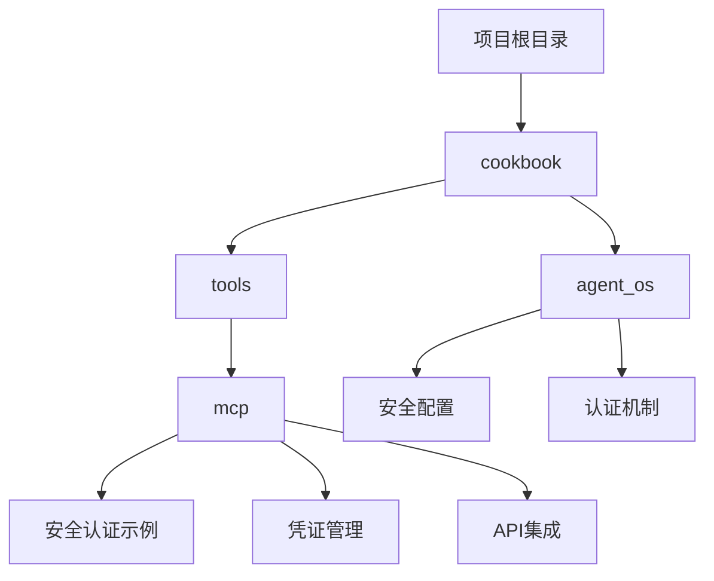
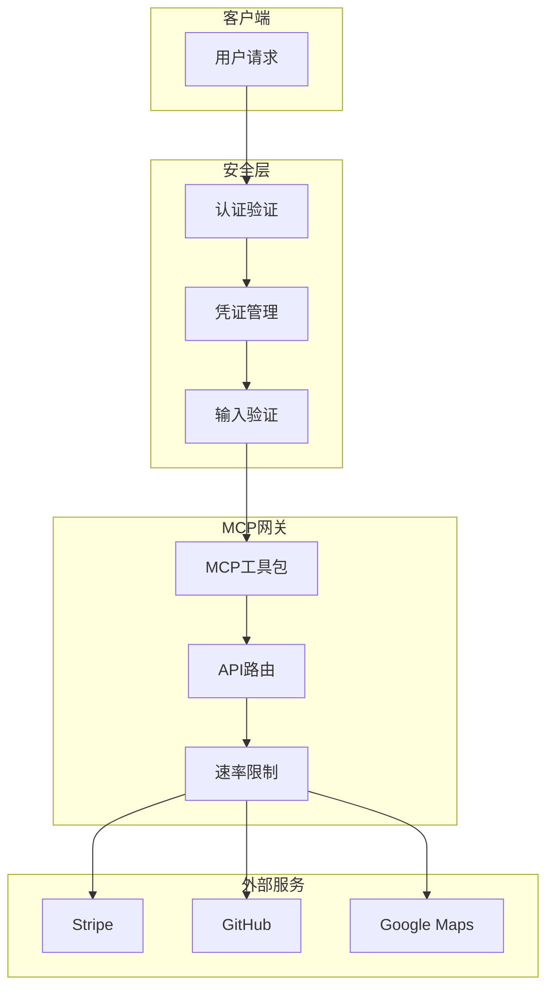
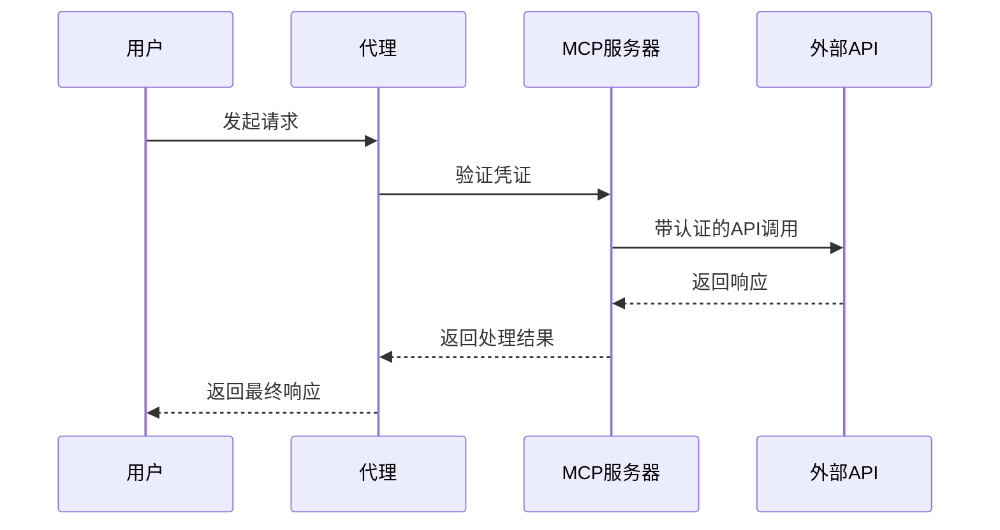
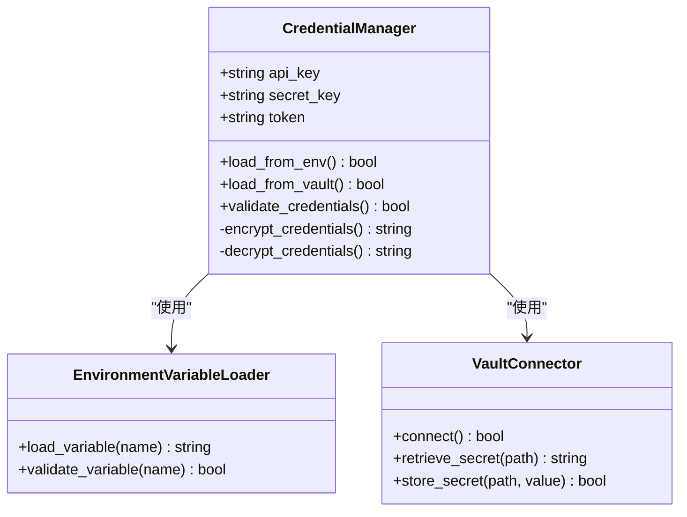
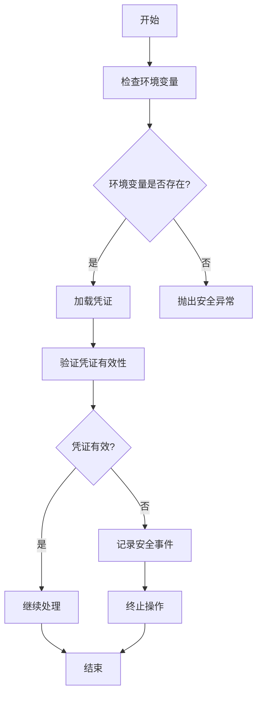
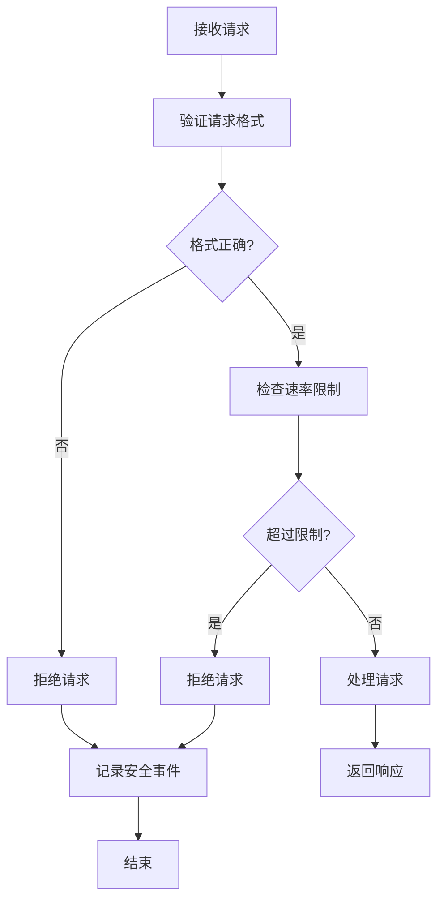
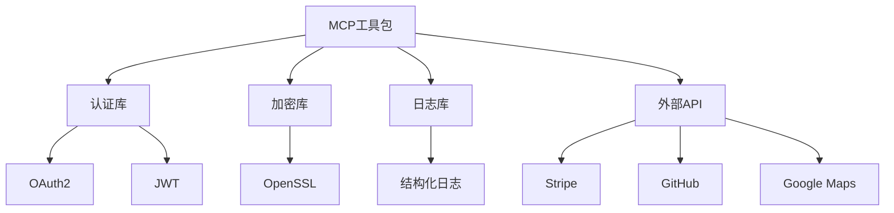

# 外部API安全集成

<cite>
**本文档引用的文件**   
- [stripe.py](file://cookbook/tools/mcp/stripe.py)
- [github.py](file://cookbook/tools/mcp/github.py)
- [pipedream_auth.py](file://cookbook/tools/mcp/pipedream_auth.py)
- [multiple_servers.py](file://cookbook/tools/mcp/multiple_servers.py)
- [oxylabs.py](file://cookbook/tools/mcp/oxylabs.py)
- [mcp.py](file://libs/agno/agno/tools/mcp.py)
- [mcp_demo.py](file://cookbook/agent_os/advanced/mcp_demo.py)
</cite>

## 目录
1. [引言](#引言)
2. [项目结构](#项目结构)
3. [核心组件](#核心组件)
4. [架构概述](#架构概述)
5. [详细组件分析](#详细组件分析)
6. [依赖分析](#依赖分析)
7. [性能考虑](#性能考虑)
8. [故障排除指南](#故障排除指南)
9. [结论](#结论)

## 引言
本文档旨在为外部API安全集成提供权威指南，重点关注MCP（Model Context Protocol）集成中的安全最佳实践。文档深入探讨了认证机制、敏感数据保护、输入验证和防滥用策略等关键安全领域。通过分析代码库中的实际实现，提供了针对常见安全威胁的防护方案，确保外部API集成的安全性和合规性。

## 项目结构
本项目采用模块化设计，将MCP工具和安全相关功能组织在清晰的目录结构中。核心安全功能主要分布在`cookbook/tools/mcp`目录下，其中包含了各种MCP服务器的集成示例和安全配置。

**图示来源**
- [stripe.py](file://cookbook/tools/mcp/stripe.py)
- [github.py](file://cookbook/tools/mcp/github.py)
- [pipedream_auth.py](file://cookbook/tools/mcp/pipedream_auth.py)

**本节来源**
- [stripe.py](file://cookbook/tools/mcp/stripe.py)
- [github.py](file://cookbook/tools/mcp/github.py)

## 核心组件
本项目的核心安全组件包括MCP工具包、认证机制和凭证管理系统。这些组件共同构成了外部API安全集成的基础，确保了与外部服务交互的安全性。

**本节来源**
- [mcp.py](file://libs/agno/agno/tools/mcp.py)
- [stripe.py](file://cookbook/tools/mcp/stripe.py)
- [github.py](file://cookbook/tools/mcp/github.py)

## 架构概述
系统的安全架构基于MCP协议，通过标准化的接口与外部系统进行交互。安全控制贯穿于整个架构，从凭证管理到API调用，每个环节都实施了相应的安全措施。

**图示来源**
- [mcp.py](file://libs/agno/agno/tools/mcp.py)
- [pipedream_auth.py](file://cookbook/tools/mcp/pipedream_auth.py)
- [multiple_servers.py](file://cookbook/tools/mcp/multiple_servers.py)

## 详细组件分析
### MCP工具安全实现分析
MCP工具的安全实现是整个系统安全性的核心。通过对MCP工具包的分析，我们可以了解其安全机制和最佳实践。

#### 认证机制
MCP工具支持多种认证机制，包括API密钥、OAuth和JWT。这些机制确保了与外部服务交互的安全性。

**图示来源**
- [mcp.py](file://libs/agno/agno/tools/mcp.py)
- [stripe.py](file://cookbook/tools/mcp/stripe.py)
- [github.py](file://cookbook/tools/mcp/github.py)

#### 凭证管理
凭证管理是安全集成的关键环节。系统通过环境变量和密钥管理服务来安全地存储和访问敏感凭证。

**图示来源**
- [mcp.py](file://libs/agno/agno/tools/mcp.py)
- [pipedream_auth.py](file://cookbook/tools/mcp/pipedream_auth.py)
- [oxylabs.py](file://cookbook/tools/mcp/oxylabs.py)

**本节来源**
- [mcp.py](file://libs/agno/agno/tools/mcp.py)
- [pipedream_auth.py](file://cookbook/tools/mcp/pipedream_auth.py)
- [oxylabs.py](file://cookbook/tools/mcp/oxylabs.py)

### 安全最佳实践分析
#### 环境变量安全
系统强制要求使用环境变量来存储敏感信息，如API密钥和访问令牌。这种方法避免了将敏感信息硬编码在源代码中。

**图示来源**
- [stripe.py](file://cookbook/tools/mcp/stripe.py)
- [github.py](file://cookbook/tools/mcp/github.py)
- [mcp_demo.py](file://cookbook/agent_os/advanced/mcp_demo.py)

#### 输入验证和防滥用
系统实施了严格的输入验证和防滥用策略，包括速率限制和请求验证。

**图示来源**
- [mcp.py](file://libs/agno/agno/tools/mcp.py)
- [multiple_servers.py](file://cookbook/tools/mcp/multiple_servers.py)
- [include_exclude_tools.py](file://cookbook/tools/mcp/include_exclude_tools.py)

**本节来源**
- [mcp.py](file://libs/agno/agno/tools/mcp.py)
- [multiple_servers.py](file://cookbook/tools/mcp/multiple_servers.py)
- [include_exclude_tools.py](file://cookbook/tools/mcp/include_exclude_tools.py)

## 依赖分析
系统的安全功能依赖于多个关键组件和外部服务。这些依赖关系需要被仔细管理，以确保整体安全性。

**图示来源**
- [mcp.py](file://libs/agno/agno/tools/mcp.py)
- [stripe.py](file://cookbook/tools/mcp/stripe.py)
- [github.py](file://cookbook/tools/mcp/github.py)

**本节来源**
- [mcp.py](file://libs/agno/agno/tools/mcp.py)
- [stripe.py](file://cookbook/tools/mcp/stripe.py)
- [github.py](file://cookbook/tools/mcp/github.py)

## 性能考虑
在确保安全性的同时，系统也考虑了性能影响。安全检查和验证操作被优化以最小化对整体性能的影响。

## 故障排除指南
当遇到安全相关问题时，可以参考以下常见问题和解决方案。

**本节来源**
- [mcp.py](file://libs/agno/agno/tools/mcp.py)
- [stripe.py](file://cookbook/tools/mcp/stripe.py)
- [github.py](file://cookbook/tools/mcp/github.py)

## 结论
本文档详细介绍了外部API安全集成的最佳实践，涵盖了认证机制、凭证管理、输入验证和防滥用策略等关键领域。通过遵循这些指南，可以确保MCP集成的安全性和合规性，有效防范常见的安全威胁。