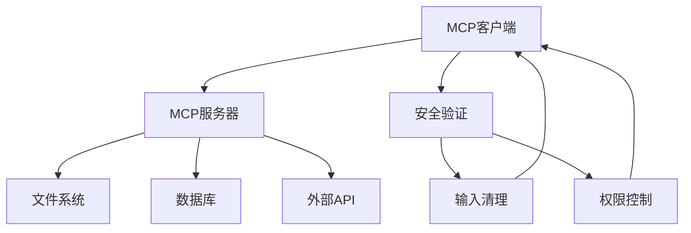
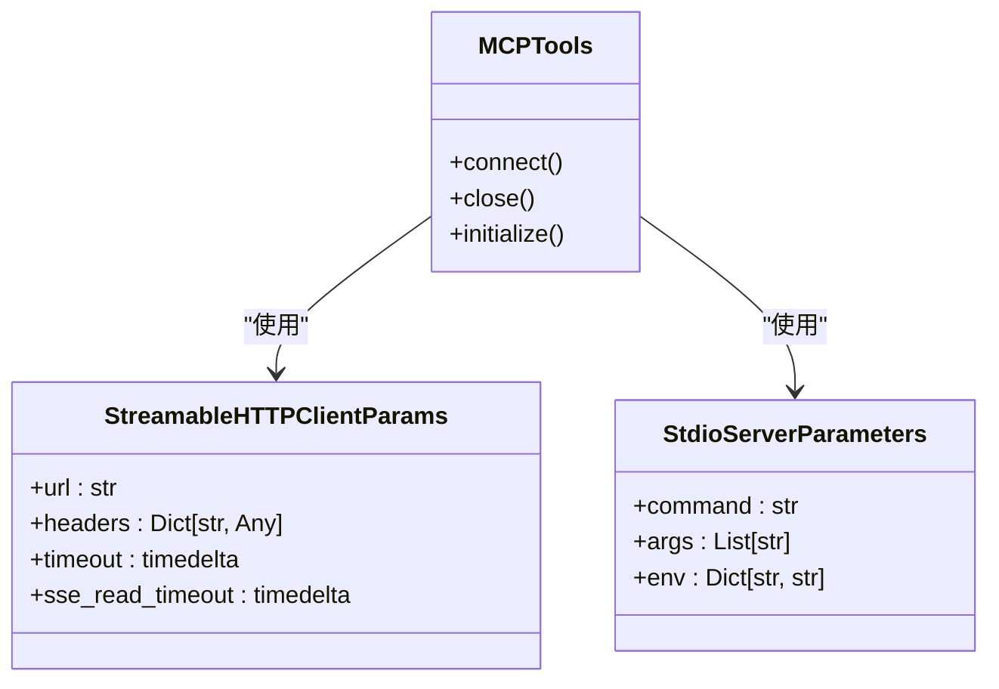
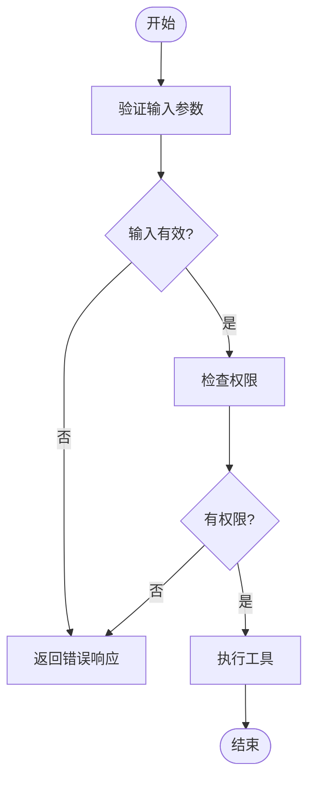
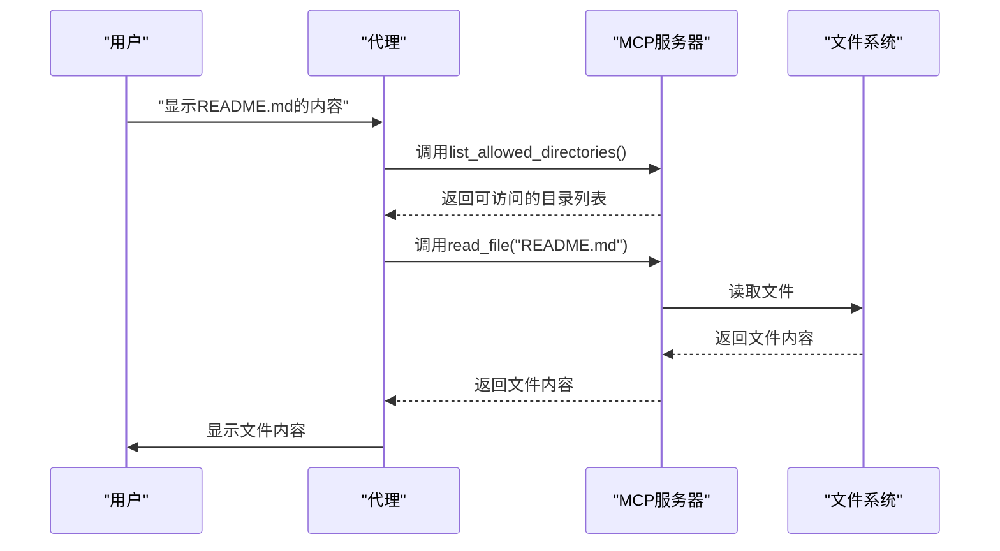
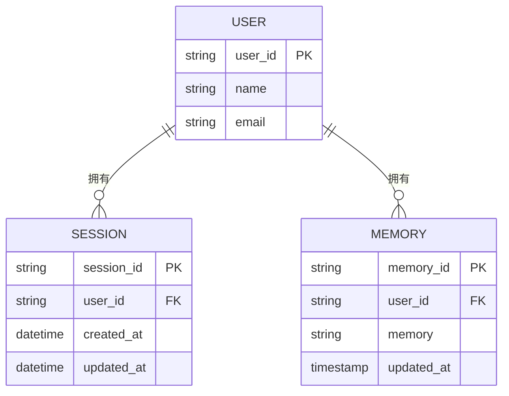
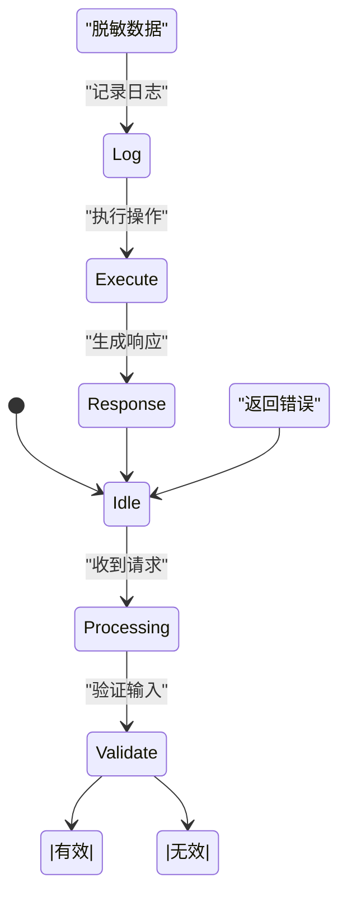
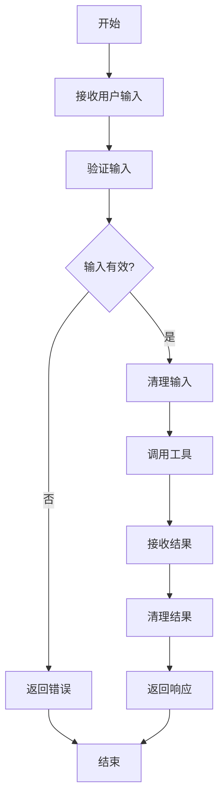

# 数据安全与隐私保护

<cite>
**本文档引用的文件**  
- [filesystem.py](file://cookbook/tools/mcp/filesystem.py)
- [mcp.py](file://libs/agno/agno/os/mcp.py)
- [mcp.py](file://libs/agno/agno/tools/mcp.py)
- [mcp_tools.py](file://cookbook/tools/mcp_tools.py)
- [enable_mcp_example.py](file://cookbook/agent_os/mcp/enable_mcp_example.py)
- [utils/mcp.py](file://libs/agno/agno/utils/mcp.py)
- [function.py](file://libs/agno/agno/tools/function.py)
</cite>

## 目录
1. [引言](#引言)
2. [MCP集成中的数据安全策略](#mcp集成中的数据安全策略)
3. [敏感数据加密机制](#敏感数据加密机制)
4. [安全的输入验证与注入防护](#安全的输入验证与注入防护)
5. [基于filesystem.py的安全文件I/O处理](#基于filesystempy的安全文件io处理)
6. [数据最小化与隐私合规实践](#数据最小化与隐私合规实践)
7. [日志脱敏与GDPR合规](#日志脱敏与gdpr合规)
8. [工具调用前后的数据清理与验证](#工具调用前后的数据清理与验证)
9. [结论](#结论)

## 引言
本文档全面阐述在MCP（Model Context Protocol）集成中保护数据安全与用户隐私的策略。重点分析如何对通过MCP传输的敏感数据进行加密（传输中和静态加密），以及如何实现安全的输入验证以防止注入攻击。基于`filesystem.py`等工具的实现，说明如何安全地处理文件I/O操作。涵盖数据最小化原则、日志脱敏和符合GDPR等隐私法规的实践。提供代码示例，展示如何在工具调用前后对数据进行清理和验证，确保用户隐私不被泄露。

## MCP集成中的数据安全策略
MCP集成为系统提供了与外部资源（如文件系统、数据库、API等）交互的能力，但同时也带来了数据安全和隐私保护的挑战。本节分析MCP集成中的核心安全策略。

MCP通过标准化的协议允许代理（Agent）访问各种工具和资源。在实现过程中，系统通过`MCPTools`类封装了与MCP服务器的连接和交互。该类在初始化时会对命令进行严格的验证，防止执行危险的shell元字符，从而避免命令注入攻击。

**图示来源**  
- [mcp.py](file://libs/agno/agno/tools/mcp.py#L0-L612)

**本节来源**  
- [mcp.py](file://libs/agno/agno/tools/mcp.py#L0-L612)
- [enable_mcp_example.py](file://cookbook/agent_os/mcp/enable_mcp_example.py#L0-L48)

## 敏感数据加密机制
在MCP集成中，敏感数据的加密是保护用户隐私的核心环节。加密策略分为传输中加密和静态加密两种。

### 传输中加密
当数据在MCP客户端和服务器之间传输时，必须使用安全的传输协议。MCP支持多种传输方式，包括stdio、SSE（Server-Sent Events）和Streamable HTTP。其中，Streamable HTTP是推荐的传输方式，因为它支持HTTPS，确保数据在传输过程中的机密性和完整性。

在代码实现中，`MCPTools`类通过`StreamableHTTPClientParams`配置HTTPS连接参数，包括URL、头部信息和超时设置。这些参数确保了通信的安全性。

### 静态加密
对于存储在本地或远程的数据，静态加密是必要的。虽然MCP本身不直接提供静态加密功能，但可以通过集成支持加密的数据库或文件系统来实现。例如，使用支持透明数据加密（TDE）的PostgreSQL或MySQL数据库，或使用加密的云存储服务如AWS S3。

**图示来源**  
- [mcp.py](file://libs/agno/agno/tools/mcp.py#L0-L612)

**本节来源**  
- [mcp.py](file://libs/agno/agno/tools/mcp.py#L0-L612)
- [mcp_tools.py](file://cookbook/tools/mcp_tools.py#L0-L40)

## 安全的输入验证与注入防护
输入验证是防止注入攻击的第一道防线。在MCP集成中，所有来自用户的输入都必须经过严格的验证和清理。

### 命令注入防护
在`MCPTools`的实现中，`_prepare_command`函数对传入的命令进行严格的验证。它使用`shlex.split`解析命令，并检查是否存在危险的shell元字符（如`&`, `|`, `;`, `` ` ``, `$`, `(`, `)`）。如果发现这些字符，函数会抛出`ValueError`异常，阻止命令执行。

此外，函数还限制了可执行的命令类型，只允许使用预定义的安全命令（如`python`, `node`, `docker`等），防止执行任意系统命令。

### 工具调用验证
在调用MCP工具之前，系统会对工具的输入参数进行验证。`Function`类使用Pydantic模型来定义参数的JSON Schema，确保输入数据的类型和格式符合预期。如果输入数据不符合Schema，调用会被拒绝。

**图示来源**  
- [mcp.py](file://libs/agno/agno/tools/mcp.py#L0-L612)
- [function.py](file://libs/agno/agno/tools/function.py#L0-L199)

**本节来源**  
- [mcp.py](file://libs/agno/agno/tools/mcp.py#L0-L612)
- [function.py](file://libs/agno/agno/tools/function.py#L0-L199)

## 基于filesystem.py的安全文件I/O处理
`filesystem.py`示例展示了如何使用MCP安全地处理文件I/O操作。该示例创建了一个文件系统代理，允许用户探索和分析文件和目录。

### 文件访问控制
代理通过`list_allowed_directories`工具列出可访问的目录，确保用户只能访问授权的文件路径。这防止了路径遍历攻击，避免用户访问系统敏感文件。

### 文件内容处理
当读取文件内容时，代理会对内容进行清理和脱敏。例如，如果文件包含敏感信息（如API密钥或密码），代理会将其替换为占位符或完全忽略。

**图示来源**  
- [filesystem.py](file://cookbook/tools/mcp/filesystem.py#L0-L89)

**本节来源**  
- [filesystem.py](file://cookbook/tools/mcp/filesystem.py#L0-L89)
- [mcp.py](file://libs/agno/agno/tools/mcp.py#L0-L612)

## 数据最小化与隐私合规实践
数据最小化原则要求只收集和处理完成特定任务所必需的最少数据。在MCP集成中，这一原则通过以下方式实现。

### 工具选择与过滤
`MCPTools`类支持`include_tools`和`exclude_tools`参数，允许开发者只暴露必要的工具给代理。这减少了攻击面，防止代理执行不必要的操作。

### 会话与记忆管理
系统通过`get_sessions_for_agent`、`get_memories_for_user`等工具管理会话和用户记忆。这些工具支持按用户ID过滤数据，确保每个用户只能访问自己的数据。

**图示来源**  
- [mcp.py](file://libs/agno/agno/os/mcp.py#L0-L236)

**本节来源**  
- [mcp.py](file://libs/agno/agno/os/mcp.py#L0-L236)
- [enable_mcp_example.py](file://cookbook/agent_os/mcp/enable_mcp_example.py#L0-L48)

## 日志脱敏与GDPR合规
日志记录是调试和监控的重要手段，但必须确保日志中不包含敏感信息，以符合GDPR等隐私法规。

### 日志脱敏
在`utils/mcp.py`中，`get_entrypoint_for_tool`函数处理MCP工具调用的结果。如果结果包含敏感信息（如图像数据），函数会将其编码为Base64并添加到响应中，而不是直接记录原始数据。

### 用户权利支持
系统提供了`create_memory`、`update_memory`、`delete_memory`等工具，支持用户对其数据的访问、更正和删除权利。这些工具符合GDPR的"被遗忘权"要求。

**图示来源**  
- [utils/mcp.py](file://libs/agno/agno/utils/mcp.py#L0-L125)

**本节来源**  
- [utils/mcp.py](file://libs/agno/agno/utils/mcp.py#L0-L125)
- [mcp.py](file://libs/agno/agno/os/mcp.py#L0-L236)

## 工具调用前后的数据清理与验证
在工具调用前后对数据进行清理和验证是确保用户隐私不被泄露的关键步骤。

### 调用前验证
在调用任何MCP工具之前，系统会验证输入参数的类型、格式和范围。`Function`类的`parameters`属性定义了参数的JSON Schema，确保输入数据符合预期。

### 调用后清理
工具执行后，系统会对返回结果进行清理。例如，`get_entrypoint_for_tool`函数会检查结果内容，如果包含图像或嵌入资源，会将其转换为安全的格式。

**图示来源**  
- [utils/mcp.py](file://libs/agno/agno/utils/mcp.py#L0-L125)
- [function.py](file://libs/agno/agno/tools/function.py#L0-L199)

**本节来源**  
- [utils/mcp.py](file://libs/agno/agno/utils/mcp.py#L0-L125)
- [function.py](file://libs/agno/agno/tools/function.py#L0-L199)

## 结论
本文档全面阐述了在MCP集成中保护数据安全与用户隐私的策略。通过严格的输入验证、安全的文件I/O处理、数据最小化和日志脱敏，系统能够有效防止注入攻击和数据泄露。同时，通过支持GDPR等隐私法规，确保了用户对其数据的控制权。未来的工作可以进一步加强加密机制，如集成端到端加密和零知识证明技术，以提供更高级别的安全保障。