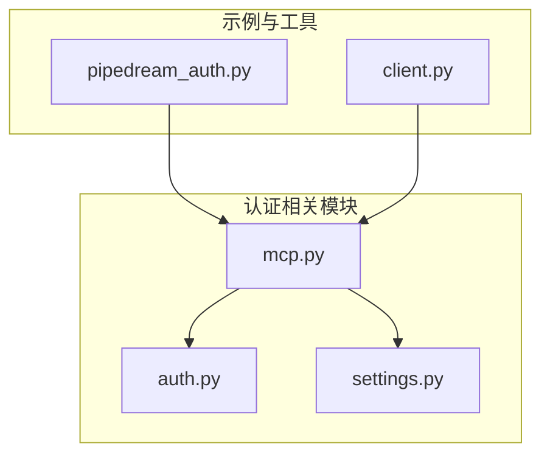
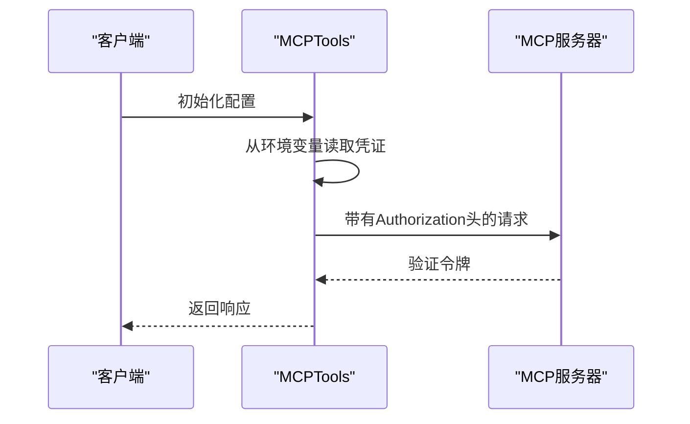
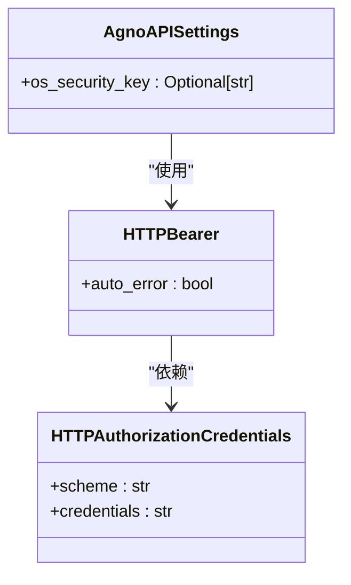
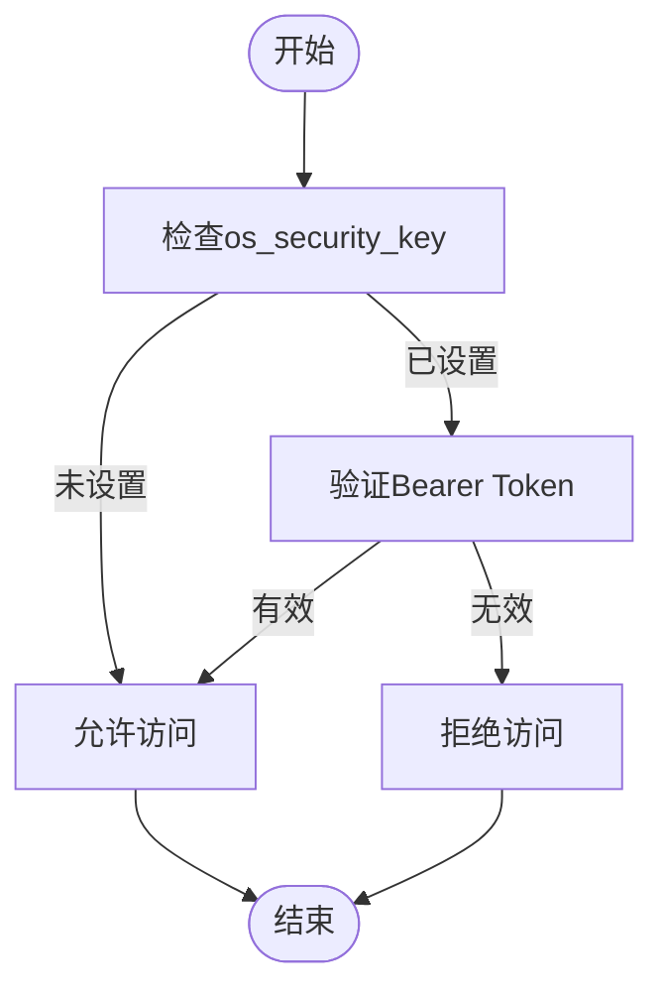
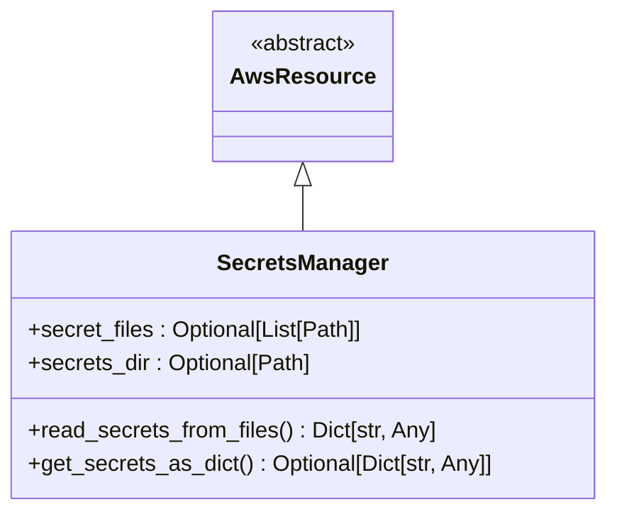
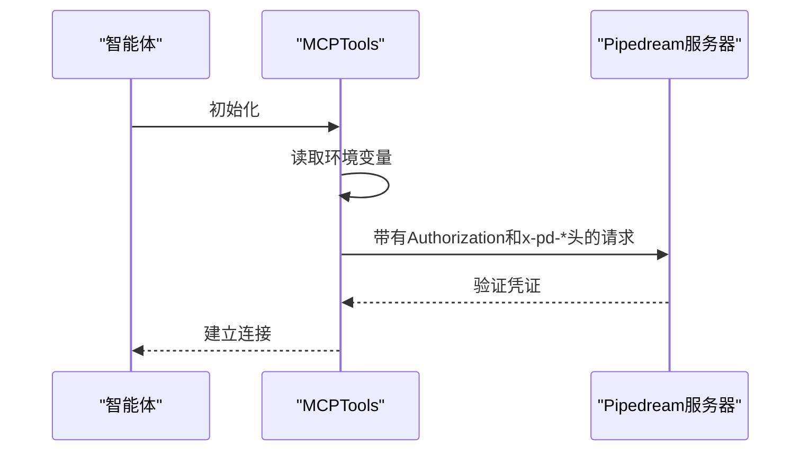

# 认证与授权机制

<cite>
**本文档中引用的文件**  
- [mcp.py](file://libs/agno/agno/tools/mcp.py)
- [pipedream_auth.py](file://cookbook/tools/mcp/pipedream_auth.py)
- [auth.py](file://libs/agno/agno/os/auth.py)
- [settings.py](file://libs/agno/agno/os/settings.py)
- [streamable_http_transport/client.py](file://cookbook/tools/mcp/streamable_http_transport/client.py)
</cite>

## 目录
1. [项目结构](#项目结构)
2. [核心组件](#核心组件)
3. [认证机制实现](#认证机制实现)
4. [授权流程与作用域管理](#授权流程与作用域管理)
5. [凭证管理与安全实践](#凭证管理与安全实践)
6. [防止凭证泄露与攻击防护](#防止凭证泄露与攻击防护)
7. [实际认证集成模式](#实际认证集成模式)

## 项目结构



**图示来源**
- [mcp.py](file://libs/agno/agno/tools/mcp.py)
- [auth.py](file://libs/agno/agno/os/auth.py)
- [settings.py](file://libs/agno/agno/os/settings.py)
- [pipedream_auth.py](file://cookbook/tools/mcp/pipedream_auth.py)
- [client.py](file://cookbook/tools/mcp/streamable_http_transport/client.py)

## 核心组件

本系统中的认证与授权机制主要由以下几个核心组件构成：MCP工具集成模块、认证服务模块、安全设置模块以及凭证管理服务。这些组件协同工作，确保MCP集成过程中的安全性。

**组件来源**
- [mcp.py](file://libs/agno/agno/tools/mcp.py)
- [auth.py](file://libs/agno/agno/os/auth.py)
- [settings.py](file://libs/agno/agno/os/settings.py)

## 认证机制实现

### API密钥认证

系统通过环境变量和配置文件管理API密钥，使用`StreamableHTTPClientParams`类来封装认证参数。在`pipedream_auth.py`示例中，展示了如何从环境变量获取访问令牌并将其作为Bearer Token添加到请求头中。



**图示来源**
- [pipedream_auth.py](file://cookbook/tools/mcp/pipedream_auth.py#L0-L58)
- [mcp.py](file://libs/agno/agno/tools/mcp.py#L113-L133)

### OAuth 2.0集成

虽然当前代码库中没有直接展示OAuth 2.0的完整实现，但通过`StreamableHTTPClientParams`的设计模式，可以轻松扩展支持OAuth 2.0认证流程。开发者可以通过自定义认证参数，在请求中包含access token来实现OAuth 2.0认证。

### JWT认证

系统支持JWT（JSON Web Token）认证方式，通过`HTTPBearer`类实现。当启用安全密钥时，所有API请求都需要提供有效的JWT令牌，服务器会验证令牌的有效性。



**图示来源**
- [auth.py](file://libs/agno/agno/os/auth.py#L0-L57)
- [settings.py](file://libs/agno/agno/os/settings.py#L0-L43)

## 授权流程与作用域管理

### 作用域管理

系统通过`include_tools`和`exclude_tools`参数实现细粒度的工具访问控制。这相当于OAuth 2.0中的作用域（scope）概念，允许限制MCP工具的可用性。

```python
# 示例：限制可用工具
mcp_tools = MCPTools(
    include_tools=["tool_a", "tool_b"],
    exclude_tools=["tool_c"]
)
```

### 权限验证

权限验证主要通过两个层面实现：
1. **全局安全密钥验证**：通过`os_security_key`配置项控制整个系统的访问权限
2. **特定工具权限验证**：通过工具过滤机制控制具体功能的访问权限



**图示来源**
- [auth.py](file://libs/agno/agno/os/auth.py#L0-L57)
- [mcp.py](file://libs/agno/agno/tools/mcp.py#L400-L611)

## 凭证管理与安全实践

### 环境变量管理

系统推荐使用环境变量来管理敏感凭证，如API密钥、访问令牌等。这种方式避免了将敏感信息硬编码在源代码中。

```python
# 从环境变量读取凭证
mcp_server_url = getenv("MCP_SERVER_URL")
mcp_access_token = getenv("MCP_ACCESS_TOKEN")
pipedream_project_id = getenv("PIPEDREAM_PROJECT_ID")
pipedream_environment = getenv("PIPEDREAM_ENVIRONMENT")
```

### 配置文件管理

除了环境变量，系统还支持通过配置文件管理凭证。`SecretsManager`类提供了从YAML文件读取密钥的功能，支持从指定目录或文件列表中加载密钥。



**图示来源**
- [manager.py](file://libs/agno_infra/agno/aws/resource/secret/manager.py)
- [reader.py](file://libs/agno_infra/agno/aws/resource/secret/reader.py)

### 密钥管理服务集成

系统集成了AWS Secrets Manager，允许将敏感凭证存储在云端密钥管理服务中。这种做法提供了更高的安全性，包括自动轮换、访问控制和审计日志等功能。

## 防止凭证泄露与攻击防护

### 凭证泄露防护

系统采取了多种措施防止凭证泄露：
- 禁止在命令行中使用危险字符（&、|、;等）
- 限制允许执行的命令类型
- 使用环境变量而非硬编码方式管理凭证

```python
# 阻止危险字符
if any(char in command for char in ["&", "|", ";", "`", "$", "(", ")"]):
    raise ValueError("MCP命令不能包含shell元字符")
```

### 会话劫持防护

通过使用HTTPS传输和Bearer Token认证，系统有效防止了会话劫持攻击。同时，WebSocket连接也实现了令牌验证机制。

```python
async def validate_websocket_token(token: str, settings: AgnoAPISettings) -> bool:
    if not settings or not settings.os_security_key:
        return True
    return token == settings.os_security_key
```

### 重放攻击防护

系统通过以下方式防范重放攻击：
- 使用短期有效的访问令牌
- 在关键操作中实施一次性令牌机制
- 记录和监控异常的请求模式

## 实际认证集成模式

### Pipedream认证集成

`pipedream_auth.py`示例展示了如何与Pipedream MCP服务器进行认证集成。该模式使用Bearer Token认证，并通过自定义HTTP头传递项目ID和环境信息。



**图示来源**
- [pipedream_auth.py](file://cookbook/tools/mcp/pipedream_auth.py#L0-L58)

### Streamable HTTP传输认证

`streamable_http_transport/client.py`示例展示了如何使用Streamable HTTP传输协议进行认证。这种模式适用于需要流式传输的场景。

```python
# 使用Streamable HTTP传输
async with MCPTools(transport="streamable-http", url=server_url) as mcp_tools:
    agent = Agent(
        model=OpenAIChat(id="gpt-4o"),
        tools=[mcp_tools],
        markdown=True,
    )
```

**组件来源**
- [pipedream_auth.py](file://cookbook/tools/mcp/pipedream_auth.py)
- [client.py](file://cookbook/tools/mcp/streamable_http_transport/client.py)
- [mcp.py](file://libs/agno/agno/tools/mcp.py)