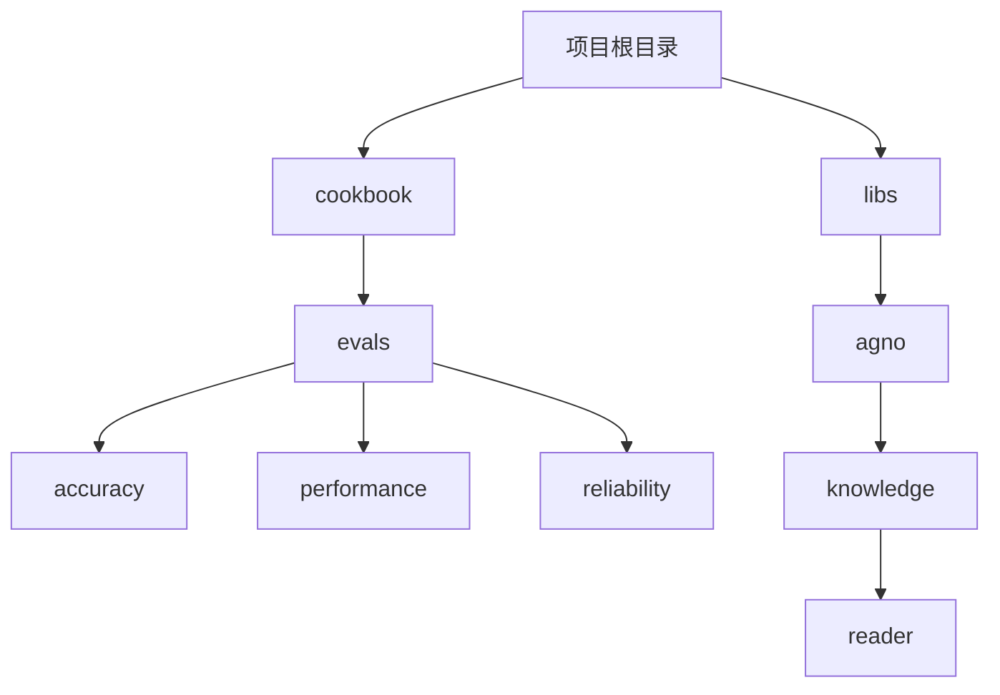
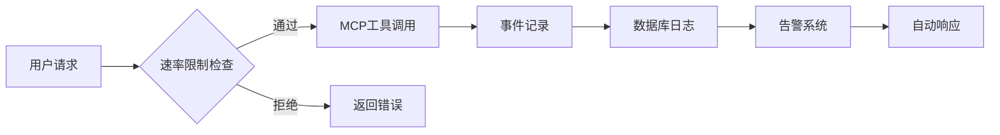
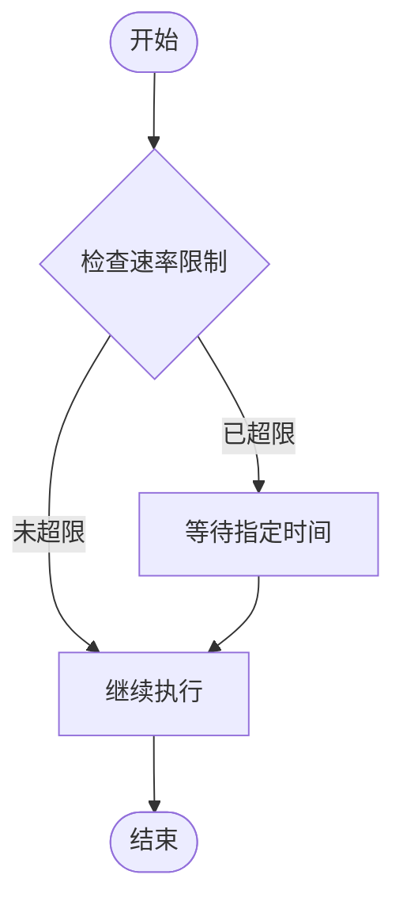
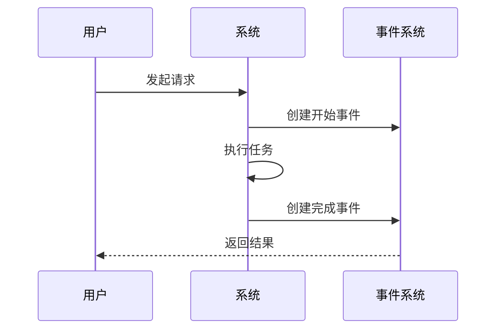
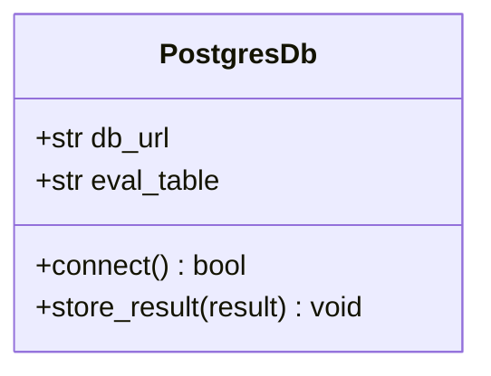
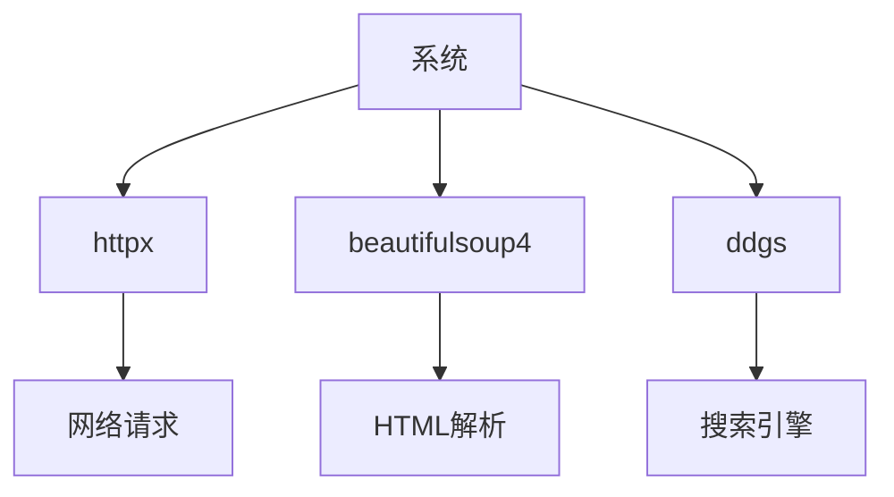

# 防滥用与速率限制

<cite>
**本文档中引用的文件**  
- [rate_limit.py](file://rate_limit.py)
- [events.py](file://events.py)
- [db_logging.py](file://db_logging.py)
- [mcp.py](file://mcp.py)
- [web_search_reader.py](file://web_search_reader.py)
</cite>

## 目录
1. [引言](#引言)
2. [项目结构](#项目结构)
3. [核心组件](#核心组件)
4. [架构概述](#架构概述)
5. [详细组件分析](#详细组件分析)
6. [依赖分析](#依赖分析)
7. [性能考虑](#性能考虑)
8. [故障排除指南](#故障排除指南)
9. [结论](#结论)

## 引言
本文档旨在制定防止MCP集成被滥用的综合策略。详细说明如何在AgentOS运行时和MCP工具层面实现速率限制和配额管理，以防止拒绝服务（DoS）攻击和API滥用。通过分析`rate_limit.py`和事件系统（events）的实现，展示如何监控和记录工具调用频率。探讨基于用户、会话或IP地址的限流策略。结合`db_logging.py`中的评估日志，说明如何设置告警和自动响应机制来检测异常行为，确保系统的稳定性和可用性。

## 项目结构
项目结构包含多个模块，其中与防滥用和速率限制相关的模块主要集中在`cookbook/evals`和`libs/agno/agno/knowledge/reader`目录下。这些模块提供了评估、日志记录和速率限制的功能。

**图示来源**
- [project_structure](file://project_structure#L1-L50)

## 核心组件
核心组件包括速率限制、事件系统和数据库日志记录。这些组件共同作用，确保系统在高负载下的稳定性和安全性。

**组件来源**
- [rate_limit.py](file://rate_limit.py#L1-L100)
- [events.py](file://events.py#L1-L100)
- [db_logging.py](file://db_logging.py#L1-L100)

## 架构概述
系统架构通过事件驱动的方式，结合速率限制和日志记录，实现对MCP工具调用的全面监控和管理。

**图示来源**
- [mcp.py](file://mcp.py#L1-L50)
- [web_search_reader.py](file://web_search_reader.py#L1-L50)

## 详细组件分析
### 速率限制组件分析
速率限制组件通过`web_search_reader.py`中的`_respect_rate_limits`方法实现，确保在高频率请求下不会超出服务提供商的限制。

**图示来源**
- [web_search_reader.py](file://web_search_reader.py#L69-L87)

### 事件系统组件分析
事件系统通过`events.py`中的各种事件类，记录MCP工具调用的全过程，包括开始、完成和错误事件。

**图示来源**
- [events.py](file://events.py#L1-L50)

### 数据库日志组件分析
数据库日志组件通过`db_logging.py`中的`PostgresDb`类，将评估结果存储到数据库中，便于后续分析和告警。

**图示来源**
- [db_logging.py](file://db_logging.py#L1-L50)

## 依赖分析
系统依赖于多个外部库，如`httpx`、`beautifulsoup4`和`ddgs`，这些库提供了网络请求、HTML解析和搜索引擎访问的功能。

**图示来源**
- [web_search_reader.py](file://web_search_reader.py#L1-L50)

## 性能考虑
在高并发场景下，速率限制和日志记录可能会成为性能瓶颈。建议通过异步处理和缓存机制优化性能。

## 故障排除指南
当系统出现性能下降或请求被频繁拒绝时，应检查速率限制配置和日志记录频率，确保配置合理。

**故障排除来源**
- [rate_limit.py](file://rate_limit.py#L1-L50)
- [db_logging.py](file://db_logging.py#L1-L50)

## 结论
通过综合运用速率限制、事件系统和数据库日志记录，可以有效防止MCP集成被滥用，确保系统的稳定性和可用性。建议定期审查和优化相关配置，以应对不断变化的使用场景。