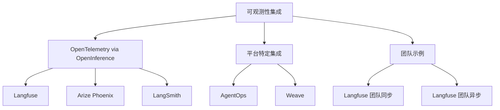
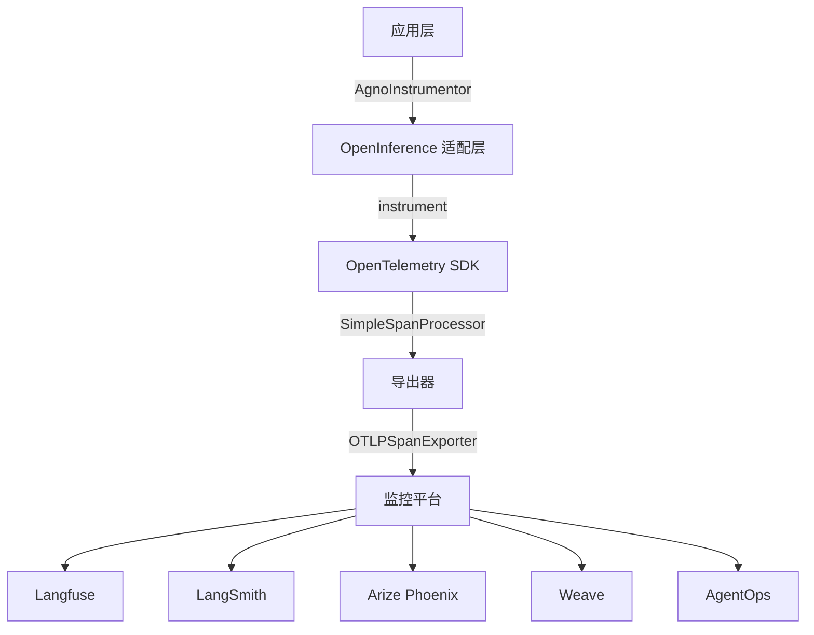
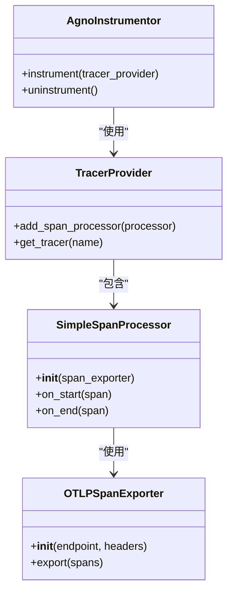
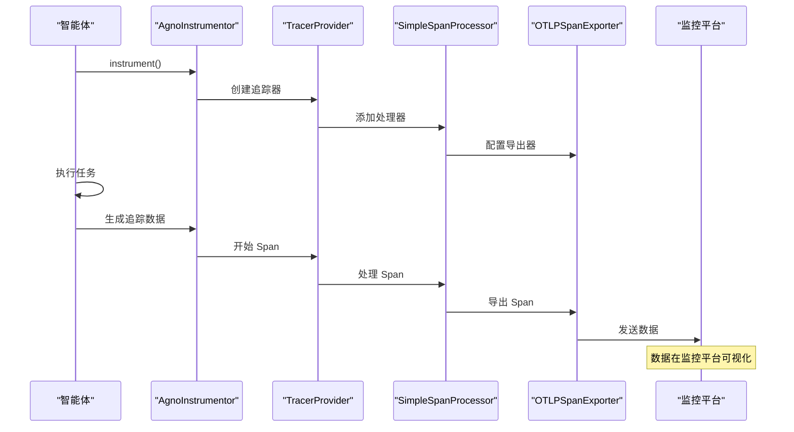
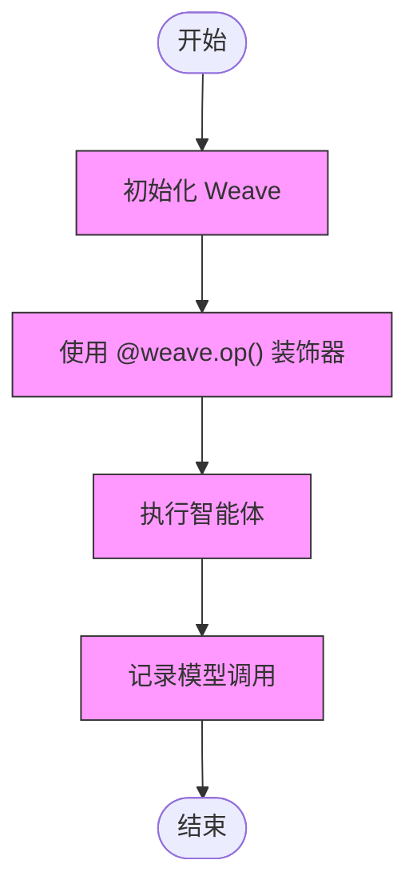
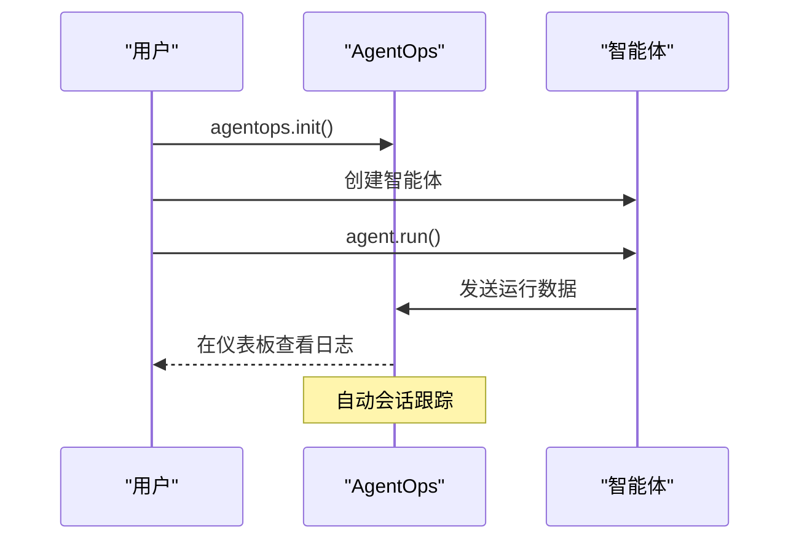
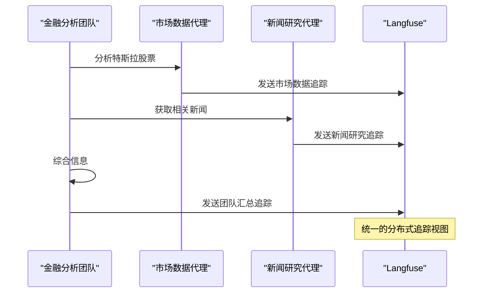
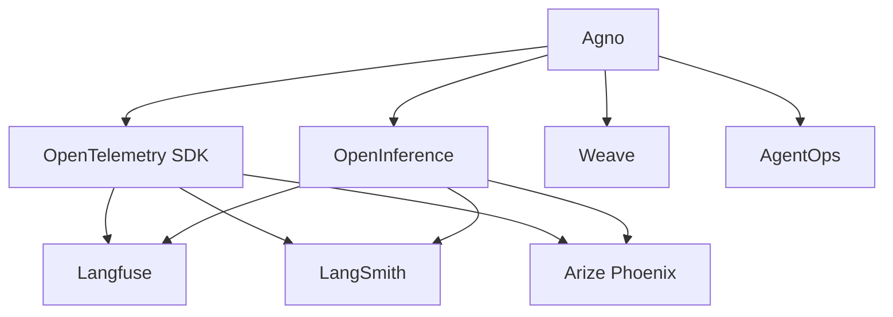

# 可观测性集成

<cite>
**本文档中引用的文件**  
- [langfuse_via_openinference.py](file://cookbook/integrations/observability/langfuse_via_openinference.py)
- [arize_phoenix_via_openinference.py](file://cookbook/integrations/observability/arize_phoenix_via_openinference.py)
- [langsmith_via_openinference.py](file://cookbook/integrations/observability/langsmith_via_openinference.py)
- [weave_op.py](file://cookbook/integrations/observability/weave_op.py)
- [agent_ops.py](file://cookbook/integrations/observability/agent_ops.py)
- [agent.py](file://libs/agno/agno/agent/agent.py)
- [README.md](file://cookbook/integrations/observability/README.md)
- [langfuse_via_openinference_team.py](file://cookbook/integrations/observability/teams/langfuse_via_openinference_team.py)
- [langfuse_via_openinference_async_team.py](file://cookbook/integrations/observability/teams/langfuse_via_openinference_async_team.py)
</cite>

## 目录
1. [简介](#简介)
2. [项目结构](#项目结构)
3. [核心组件](#核心组件)
4. [架构概述](#架构概述)
5. [详细组件分析](#详细组件分析)
6. [依赖分析](#依赖分析)
7. [性能考虑](#性能考虑)
8. [故障排除指南](#故障排除指南)
9. [结论](#结论)

## 简介
Agno 提供了与主流可观测性平台的深度集成，使开发者能够全面监控、追踪和分析智能体系统的运行状态。通过与 Langfuse、LangSmith、Arize Phoenix 和 Weave 等工具的集成，Agno 实现了标准化的指标收集、分布式追踪和性能分析功能。这些集成基于 OpenInference 和 OpenTelemetry 标准，支持跨平台的统一监控体验。本文档详细介绍了如何配置这些集成，以及如何利用它们进行调试、性能优化和 AI 行为分析。

## 项目结构
可观测性集成功能主要位于 `cookbook/integrations/observability` 目录下，该目录包含了与各种监控平台集成的示例代码和配置说明。

**图示来源**
- [README.md](file://cookbook/integrations/observability/README.md)

**本节来源**
- [README.md](file://cookbook/integrations/observability/README.md)

## 核心组件
Agno 的可观测性系统由多个核心组件构成，包括基于 OpenInference 的标准化追踪、平台特定的 SDK 集成以及事件驱动的监控机制。系统通过 `telemetry` 参数控制数据收集，默认情况下为启用状态，允许收集最小化的分析数据以改进系统和支持服务。这些组件共同工作，提供了从单个智能体到多智能体团队的全面监控能力。

**本节来源**
- [agent.py](file://libs/agno/agno/agent/agent.py#L1-L50)
- [README.md](file://cookbook/integrations/observability/README.md#L1-L20)

## 架构概述
Agno 的可观测性架构采用分层设计，底层基于 OpenTelemetry 标准，中间层通过 OpenInference 进行适配，上层则与具体的监控平台集成。这种架构确保了灵活性和可扩展性，允许开发者轻松切换不同的监控后端。

**图示来源**
- [langfuse_via_openinference.py](file://cookbook/integrations/observability/langfuse_via_openinference.py#L1-L30)
- [arize_phoenix_via_openinference.py](file://cookbook/integrations/observability/arize_phoenix_via_openinference.py#L1-L30)
- [langsmith_via_openinference.py](file://cookbook/integrations/observability/langsmith_via_openinference.py#L1-L30)

## 详细组件分析

### OpenInference 集成分析
OpenInference 集成是 Agno 可观测性的核心，它通过标准的 OpenTelemetry 协议将智能体的运行数据导出到各种监控平台。

#### 类图

**图示来源**
- [langfuse_via_openinference.py](file://cookbook/integrations/observability/langfuse_via_openinference.py#L15-L30)
- [langsmith_via_openinference.py](file://cookbook/integrations/observability/langsmith_via_openinference.py#L15-L30)

#### 序列图

**图示来源**
- [langfuse_via_openinference.py](file://cookbook/integrations/observability/langfuse_via_openinference.py#L1-L50)
- [arize_phoenix_via_openinference.py](file://cookbook/integrations/observability/arize_phoenix_via_openinference.py#L1-L30)

**本节来源**
- [langfuse_via_openinference.py](file://cookbook/integrations/observability/langfuse_via_openinference.py#L1-L50)
- [arize_phoenix_via_openinference.py](file://cookbook/integrations/observability/arize_phoenix_via_openinference.py#L1-L30)
- [langsmith_via_openinference.py](file://cookbook/integrations/observability/langsmith_via_openinference.py#L1-L45)

### 平台特定集成分析
Agno 支持多种平台特定的集成方式，包括 Weave 和 AgentOps，这些集成提供了更直接的监控体验。

#### 流程图

**图示来源**
- [weave_op.py](file://cookbook/integrations/observability/weave_op.py#L1-L30)

#### 序列图

**图示来源**
- [agent_ops.py](file://cookbook/integrations/observability/agent_ops.py#L1-L25)

**本节来源**
- [weave_op.py](file://cookbook/integrations/observability/weave_op.py#L1-L30)
- [agent_ops.py](file://cookbook/integrations/observability/agent_ops.py#L1-L25)

### 团队可观测性分析
在多智能体团队场景下，Agno 提供了分布式追踪能力，能够监控团队成员之间的协作和数据流动。

#### 序列图

**图示来源**
- [langfuse_via_openinference_team.py](file://cookbook/integrations/observability/teams/langfuse_via_openinference_team.py#L1-L85)
- [langfuse_via_openinference_async_team.py](file://cookbook/integrations/observability/teams/langfuse_via_openinference_async_team.py#L1-L85)

**本节来源**
- [langfuse_via_openinference_team.py](file://cookbook/integrations/observability/teams/langfuse_via_openinference_team.py#L1-L85)
- [langfuse_via_openinference_async_team.py](file://cookbook/integrations/observability/teams/langfuse_via_openinference_async_team.py#L1-L85)

## 依赖分析
Agno 的可观测性系统依赖于多个外部库和平台，这些依赖关系确保了系统的灵活性和可扩展性。

**图示来源**
- [README.md](file://cookbook/integrations/observability/README.md#L1-L85)
- [requirements.txt](file://cookbook/examples/chainlit_apps/basic/requirements.txt#L265-L366)

**本节来源**
- [README.md](file://cookbook/integrations/observability/README.md#L1-L85)

## 性能考虑
在配置可观测性集成时，需要考虑数据收集对系统性能的影响。建议在生产环境中使用批量导出模式以减少网络开销，并根据需要调整追踪的详细程度。对于高吞吐量的应用，可以考虑使用异步导出器来避免阻塞主执行线程。

## 故障排除指南
当遇到可观测性集成问题时，首先检查环境变量是否正确设置，特别是 API 密钥和端点 URL。确保所需的依赖包已正确安装，并验证网络连接是否能够访问监控平台。如果使用 OpenInference，检查 OTLP 导出器的配置是否正确。对于 Weave 和 AgentOps 等平台特定集成，确保已正确初始化 SDK。

**本节来源**
- [langfuse_via_openinference.py](file://cookbook/integrations/observability/langfuse_via_openinference.py#L1-L50)
- [weave_op.py](file://cookbook/integrations/observability/weave_op.py#L1-L30)
- [agent_ops.py](file://cookbook/integrations/observability/agent_ops.py#L1-L25)

## 结论
Agno 的可观测性集成提供了一套完整的工具链，使开发者能够深入了解智能体系统的运行状态。通过与主流监控平台的集成，开发者可以获得宝贵的洞察，用于调试、性能优化和 AI 行为分析。建议根据具体需求选择合适的集成方式，并充分利用分布式追踪功能来监控复杂的多智能体协作场景。