# 云原生数据库集成

<cite>
**本文档中引用的文件**
- [cookbook/db/dynamodb/README.md](file://cookbook/db/dynamodb/README.md)
- [cookbook/db/firestore/README.md](file://cookbook/db/firestore/README.md)
- [cookbook/db/dynamodb/dynamo_for_agent.py](file://cookbook/db/dynamodb/dynamo_for_agent.py)
- [cookbook/db/firestore/firestore_for_agent.py](file://cookbook/db/firestore/firestore_for_agent.py)
- [libs/agno/agno/db/dynamo/dynamo.py](file://libs/agno/agno/db/dynamo/dynamo.py)
- [libs/agno/agno/db/firestore/firestore.py](file://libs/agno/agno/db/firestore/firestore.py)
- [libs/agno/agno/db/dynamo/utils.py](file://libs/agno/agno/db/dynamo/utils.py)
- [libs/agno/agno/db/firestore/utils.py](file://libs/agno/agno/db/firestore/utils.py)
- [libs/agno/agno/db/dynamo/schemas.py](file://libs/agno/agno/db/dynamo/schemas.py)
- [libs/agno/agno/db/firestore/schemas.py](file://libs/agno/agno/db/firestore/schemas.py)
</cite>

## 目录
1. [简介](#简介)
2. [项目结构](#项目结构)
3. [核心组件](#核心组件)
4. [架构概览](#架构概览)
5. [详细组件分析](#详细组件分析)
6. [依赖关系分析](#依赖关系分析)
7. [性能考虑](#性能考虑)
8. [故障排除指南](#故障排除指南)
9. [结论](#结论)

## 简介

Agno 是一个强大的智能体系统框架，支持多种云原生 NoSQL 数据库作为后端存储。本文档详细介绍了如何配置和使用 Amazon DynamoDB 和 Google Cloud Firestore 来支持智能体系统的高可扩展性和全球分布需求。

这两种数据库都具备以下关键特性：
- **自动扩展能力**：根据负载动态调整资源
- **全球分布**：支持多区域部署和复制
- **低延迟查询**：优化的读写性能
- **内置高可用性**：自动故障转移和数据冗余

## 项目结构

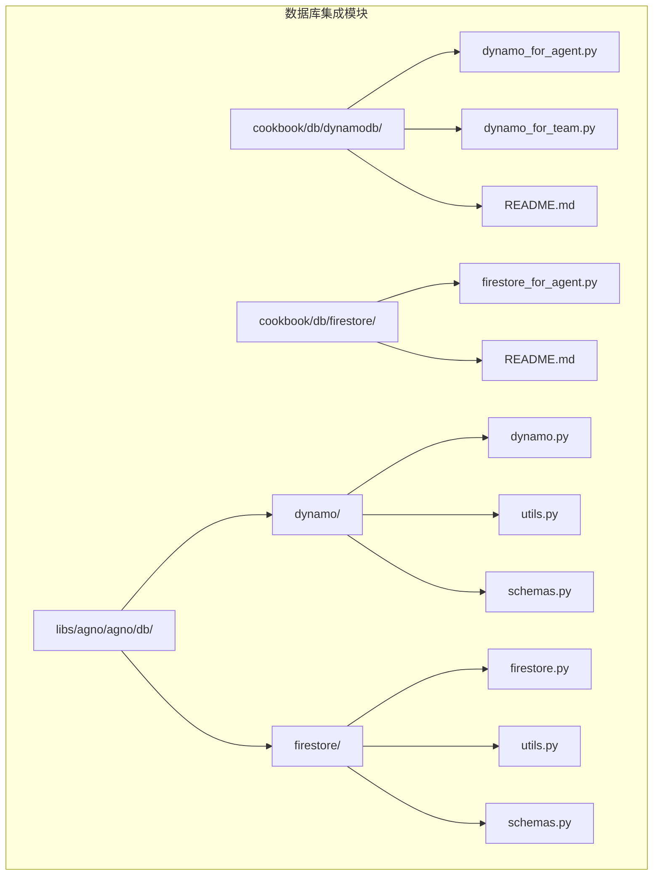
```mermaid
graph TB
subgraph "数据库集成模块"
A[cookbook/db/dynamodb/] --> A1[dynamo_for_agent.py]
A --> A2[dynamo_for_team.py]
A --> A3[README.md]
B[cookbook/db/firestore/] --> B1[firestore_for_agent.py]
B --> B2[README.md]
C[libs/agno/agno/db/] --> C1[dynamo/]
C --> C2[firestore/]
C1 --> C11[dynamo.py]
C1 --> C12[utils.py]
C1 --> C13[schemas.py]
C2 --> C21[firestore.py]
C2 --> C22[utils.py]
C2 --> C23[schemas.py]
end
```

**图表来源**
- [cookbook/db/dynamodb/README.md](file://cookbook/db/dynamodb/README.md#L1-L44)
- [cookbook/db/firestore/README.md](file://cookbook/db/firestore/README.md#L1-L40)

**章节来源**
- [cookbook/db/dynamodb/README.md](file://cookbook/db/dynamodb/README.md#L1-L44)
- [cookbook/db/firestore/README.md](file://cookbook/db/firestore/README.md#L1-L40)

## 核心组件

### DynamoDB 集成

DynamoDB 是 Amazon 提供的完全托管的 NoSQL 数据库服务，专为需要一致低延迟性能的应用程序而设计。

#### 主要特性
- **分区键设计**：基于会话类型和时间戳的复合分区键
- **全局二级索引（GSI）**：支持高效的查询和过滤
- **按需容量模式**：自动扩展以处理流量变化
- **跨区域复制**：支持多区域部署

#### 实现架构

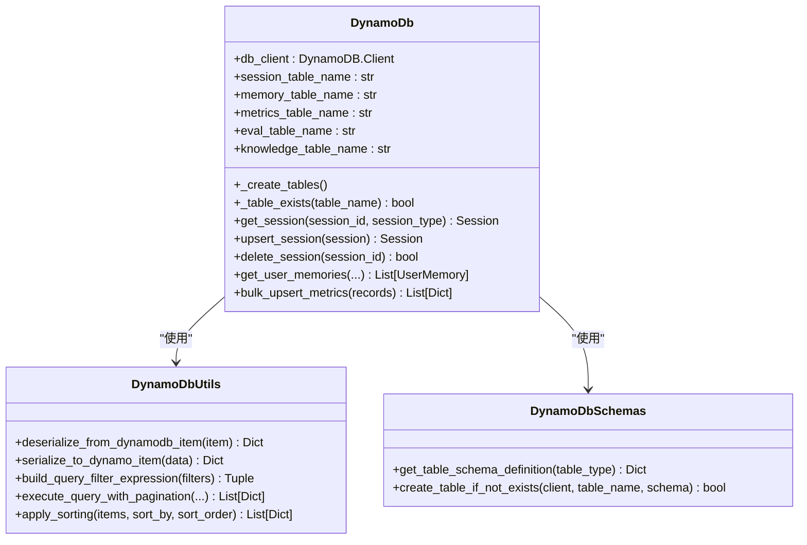
```mermaid
classDiagram
class DynamoDb {
+db_client : DynamoDB.Client
+session_table_name : str
+memory_table_name : str
+metrics_table_name : str
+eval_table_name : str
+knowledge_table_name : str
+_create_tables()
+_table_exists(table_name) bool
+get_session(session_id, session_type) Session
+upsert_session(session) Session
+delete_session(session_id) bool
+get_user_memories(...) List[UserMemory]
+bulk_upsert_metrics(records) List[Dict]
}
class DynamoDbUtils {
+deserialize_from_dynamodb_item(item) Dict
+serialize_to_dynamo_item(data) Dict
+build_query_filter_expression(filters) Tuple
+execute_query_with_pagination(...) List[Dict]
+apply_sorting(items, sort_by, sort_order) List[Dict]
}
class DynamoDbSchemas {
+get_table_schema_definition(table_type) Dict
+create_table_if_not_exists(client, table_name, schema) bool
}
DynamoDb --> DynamoDbUtils : "使用"
DynamoDb --> DynamoDbSchemas : "使用"
```

**图表来源**
- [libs/agno/agno/db/dynamo/dynamo.py](file://libs/agno/agno/db/dynamo/dynamo.py#L42-L106)
- [libs/agno/agno/db/dynamo/utils.py](file://libs/agno/agno/db/dynamo/utils.py#L41-L61)

### Firestore 集成

Firestore 是 Google Cloud 提供的灵活、可扩展的 NoSQL 文档数据库。

#### 主要特性
- **集合设计**：基于功能类型的集合组织
- **复合索引**：支持复杂查询条件
- **事务支持**：保证数据一致性
- **实时监听**：支持实时数据同步

#### 实现架构

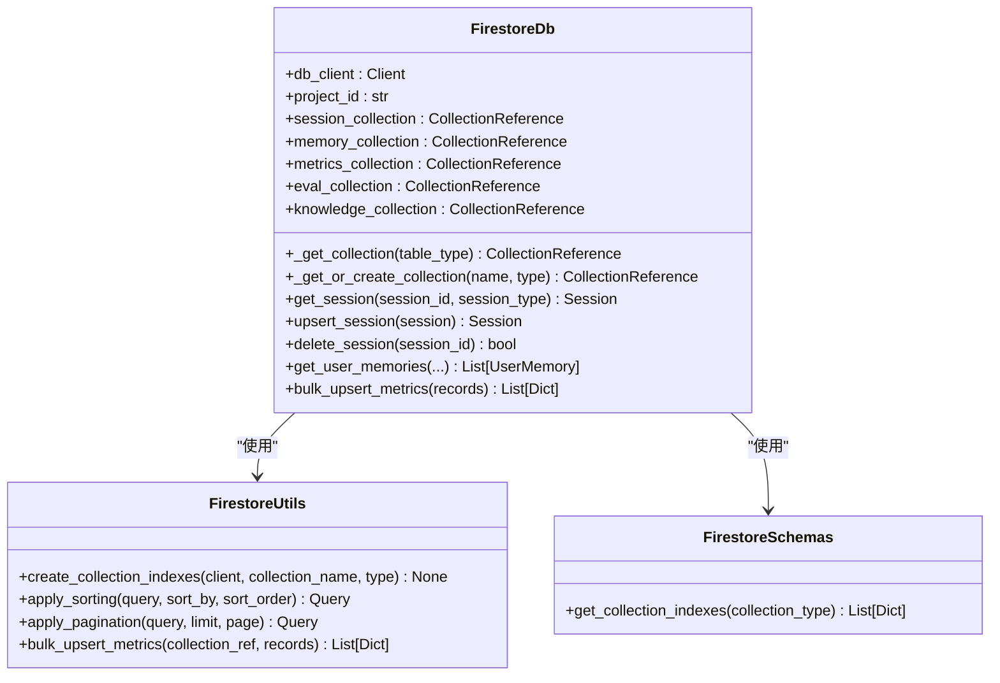
```mermaid
classDiagram
class FirestoreDb {
+db_client : Client
+project_id : str
+session_collection : CollectionReference
+memory_collection : CollectionReference
+metrics_collection : CollectionReference
+eval_collection : CollectionReference
+knowledge_collection : CollectionReference
+_get_collection(table_type) CollectionReference
+_get_or_create_collection(name, type) CollectionReference
+get_session(session_id, session_type) Session
+upsert_session(session) Session
+delete_session(session_id) bool
+get_user_memories(...) List[UserMemory]
+bulk_upsert_metrics(records) List[Dict]
}
class FirestoreUtils {
+create_collection_indexes(client, collection_name, type) None
+apply_sorting(query, sort_by, sort_order) Query
+apply_pagination(query, limit, page) Query
+bulk_upsert_metrics(collection_ref, records) List[Dict]
}
class FirestoreSchemas {
+get_collection_indexes(collection_type) List[Dict]
}
FirestoreDb --> FirestoreUtils : "使用"
FirestoreDb --> FirestoreSchemas : "使用"
```

**图表来源**
- [libs/agno/agno/db/firestore/firestore.py](file://libs/agno/agno/db/firestore/firestore.py#L31-L61)
- [libs/agno/agno/db/firestore/utils.py](file://libs/agno/agno/db/firestore/utils.py#L25-L75)

**章节来源**
- [libs/agno/agno/db/dynamo/dynamo.py](file://libs/agno/agno/db/dynamo/dynamo.py#L42-L106)
- [libs/agno/agno/db/firestore/firestore.py](file://libs/agno/agno/db/firestore/firestore.py#L31-L61)

## 架构概览

### 整体系统架构

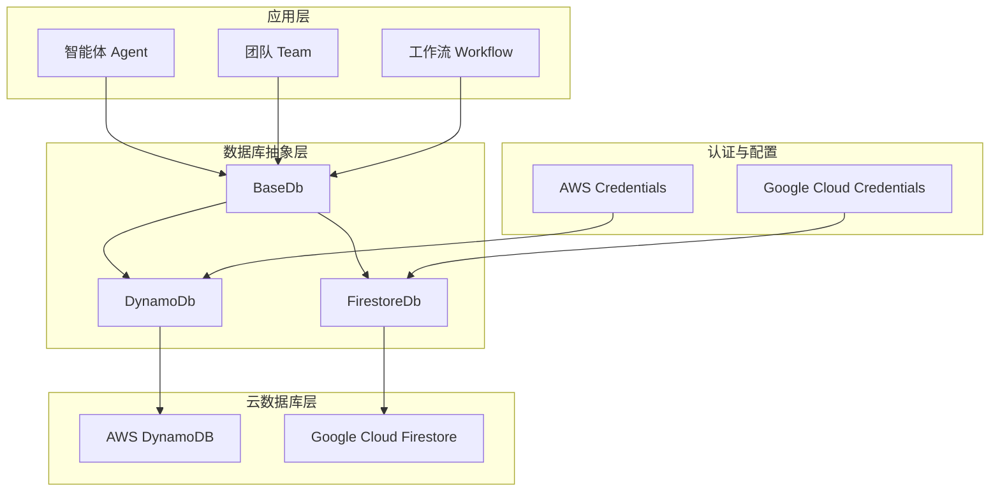
```mermaid
graph TB
subgraph "应用层"
A[智能体 Agent]
B[团队 Team]
C[工作流 Workflow]
end
subgraph "数据库抽象层"
D[BaseDb]
E[DynamoDb]
F[FirestoreDb]
end
subgraph "云数据库层"
G[AWS DynamoDB]
H[Google Cloud Firestore]
end
subgraph "认证与配置"
I[AWS Credentials]
J[Google Cloud Credentials]
end
A --> D
B --> D
C --> D
D --> E
D --> F
E --> G
F --> H
I --> E
J --> F
```

**图表来源**
- [libs/agno/agno/db/dynamo/dynamo.py](file://libs/agno/agno/db/dynamo/dynamo.py#L42-L77)
- [libs/agno/agno/db/firestore/firestore.py](file://libs/agno/agno/db/firestore/firestore.py#L31-L61)

### 数据流架构

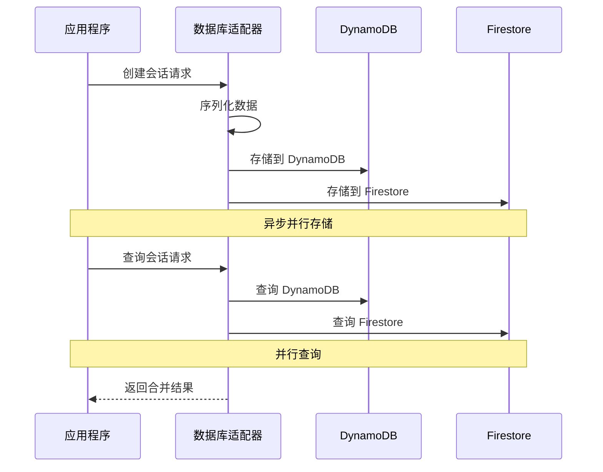
```mermaid
sequenceDiagram
participant App as 应用程序
participant Db as 数据库适配器
participant Dynamo as DynamoDB
participant Firestore as Firestore
App->>Db : 创建会话请求
Db->>Db : 序列化数据
Db->>Dynamo : 存储到 DynamoDB
Db->>Firestore : 存储到 Firestore
Note over App,Firestore : 异步并行存储
App->>Db : 查询会话请求
Db->>Dynamo : 查询 DynamoDB
Db->>Firestore : 查询 Firestore
Note over App,Firestore : 并行查询
Db-->>App : 返回合并结果
```

**图表来源**
- [libs/agno/agno/db/dynamo/dynamo.py](file://libs/agno/agno/db/dynamo/dynamo.py#L107-L150)
- [libs/agno/agno/db/firestore/firestore.py](file://libs/agno/agno/db/firestore/firestore.py#L150-L200)

## 详细组件分析

### DynamoDB 分区键设计

DynamoDB 的分区键设计是其高性能的关键所在。在 Agno 中，采用了基于会话类型和时间戳的复合分区键策略：

#### 分区键策略

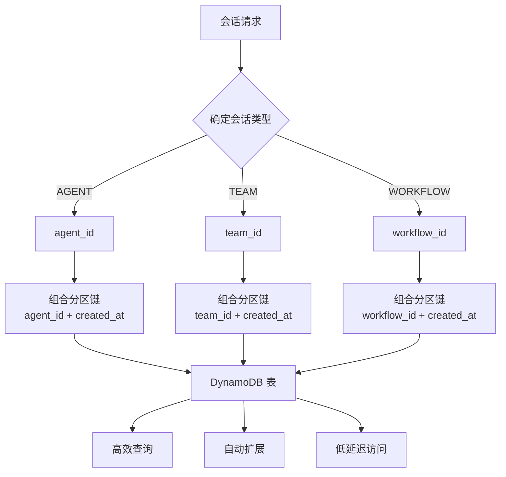
```mermaid
flowchart TD
A[会话请求] --> B{确定会话类型}
B --> |AGENT| C[agent_id]
B --> |TEAM| D[team_id]
B --> |WORKFLOW| E[workflow_id]
C --> F[组合分区键<br/>agent_id + created_at]
D --> G[组合分区键<br/>team_id + created_at]
E --> H[组合分区键<br/>workflow_id + created_at]
F --> I[DynamoDB 表]
G --> I
H --> I
I --> J[高效查询]
I --> K[自动扩展]
I --> L[低延迟访问]
```

**图表来源**
- [libs/agno/agno/db/dynamo/dynamo.py](file://libs/agno/agno/db/dynamo/dynamo.py#L426-L461)

#### 全局二级索引（GSI）

DynamoDB 使用多个 GSI 来支持不同查询模式：

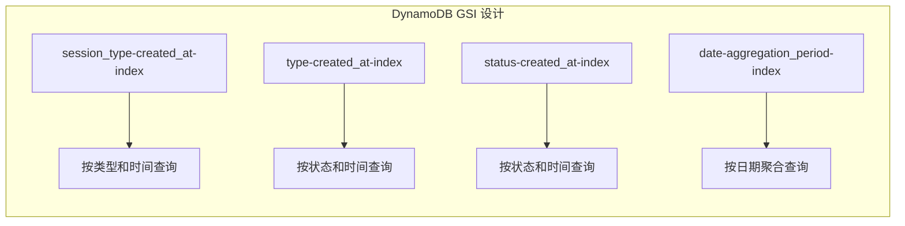
```mermaid
graph LR
subgraph "DynamoDB GSI 设计"
A[session_type-created_at-index] --> A1[按类型和时间查询]
B[type-created_at-index] --> B1[按状态和时间查询]
C[status-created_at-index] --> C1[按状态和时间查询]
D[date-aggregation_period-index] --> D1[按日期聚合查询]
end
```

**图表来源**
- [libs/agno/agno/db/dynamo/schemas.py](file://libs/agno/agno/db/dynamo/schemas.py#L199-L222)

### Firestore 集合设计

Firestore 采用基于功能的集合设计，每个功能都有独立的集合：

#### 集合组织结构

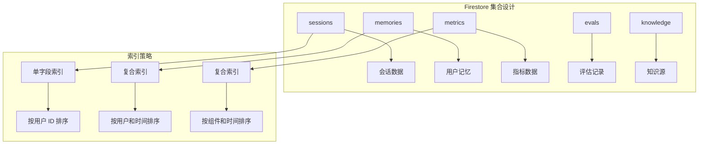
```mermaid
graph TB
subgraph "Firestore 集合设计"
A[sessions] --> A1[会话数据]
B[memories] --> B1[用户记忆]
C[metrics] --> C1[指标数据]
D[evals] --> D1[评估记录]
E[knowledge] --> E1[知识源]
end
subgraph "索引策略"
F[单字段索引] --> F1[按用户 ID 排序]
G[复合索引] --> G1[按用户和时间排序]
H[复合索引] --> H1[按组件和时间排序]
end
A --> F
B --> G
C --> H
```

**图表来源**
- [libs/agno/agno/db/firestore/utils.py](file://libs/agno/agno/db/firestore/utils.py#L25-L75)

### 一致性模型

#### DynamoDB 一致性模型

DynamoDB 支持两种一致性模型：
- **强一致性读取**：默认提供强一致性读取
- **最终一致性读取**：适用于读取性能优先场景

#### Firestore 一致性模型

Firestore 提供以下一致性保证：
- **强一致性**：写入后立即可读
- **最终一致性**：适用于离线场景
- **事务支持**：保证原子性操作

### 索引策略

#### DynamoDB 索引策略

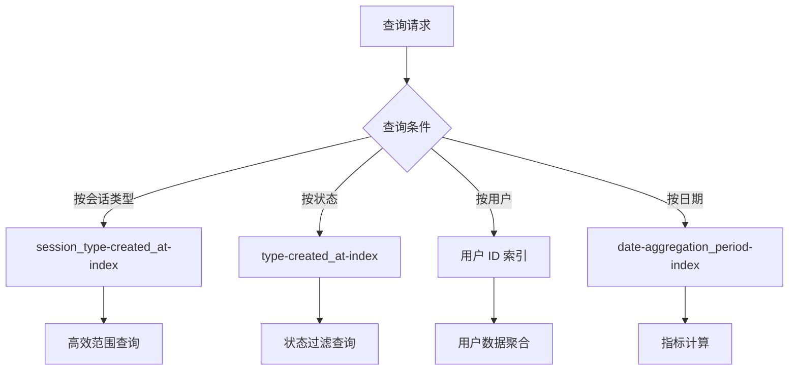
```mermaid
flowchart TD
A[查询请求] --> B{查询条件}
B --> |按会话类型| C[session_type-created_at-index]
B --> |按状态| D[type-created_at-index]
B --> |按用户| E[用户 ID 索引]
B --> |按日期| F[date-aggregation_period-index]
C --> G[高效范围查询]
D --> H[状态过滤查询]
E --> I[用户数据聚合]
F --> J[指标计算]
```

**图表来源**
- [libs/agno/agno/db/dynamo/utils.py](file://libs/agno/agno/db/dynamo/utils.py#L579-L618)

#### Firestore 索引策略

Firestore 自动管理索引，但支持手动创建复合索引：

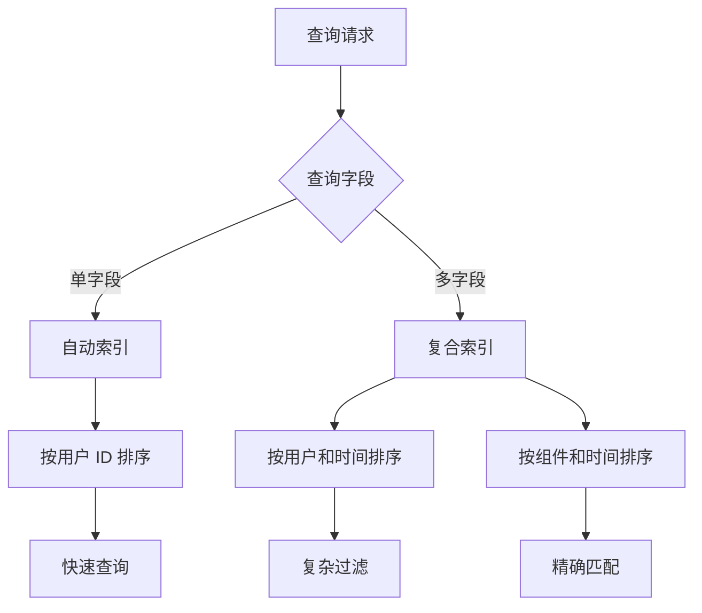
```mermaid
flowchart TD
A[查询请求] --> B{查询字段}
B --> |单字段| C[自动索引]
B --> |多字段| D[复合索引]
C --> E[按用户 ID 排序]
D --> F[按用户和时间排序]
D --> G[按组件和时间排序]
E --> H[快速查询]
F --> I[复杂过滤]
G --> J[精确匹配]
```

**图表来源**
- [libs/agno/agno/db/firestore/utils.py](file://libs/agno/agno/db/firestore/utils.py#L42-L75)

**章节来源**
- [libs/agno/agno/db/dynamo/dynamo.py](file://libs/agno/agno/db/dynamo/dynamo.py#L107-L200)
- [libs/agno/agno/db/firestore/firestore.py](file://libs/agno/agno/db/firestore/firestore.py#L150-L250)

### 成本优化技巧

#### DynamoDB 成本优化

1. **按需容量模式**：根据实际负载自动调整
2. **压缩存储**：利用 DynamoDB 的自动压缩功能
3. **批量操作**：使用批量写入减少费用
4. **TTL 设置**：设置自动过期时间清理旧数据

#### Firestore 成本优化

1. **集合分组**：合理设计集合结构
2. **索引管理**：避免不必要的索引
3. **批量操作**：使用批量写入和删除
4. **缓存策略**：利用客户端缓存减少查询

### 跨区域复制

#### DynamoDB 跨区域复制

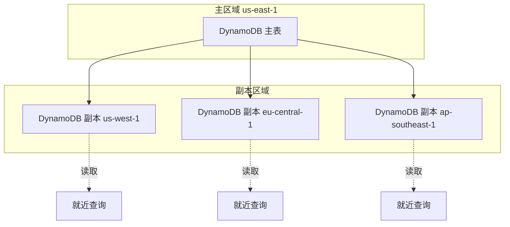
```mermaid
graph TB
subgraph "主区域 us-east-1"
A[DynamoDB 主表]
end
subgraph "副本区域"
B[DynamoDB 副本 us-west-1]
C[DynamoDB 副本 eu-central-1]
D[DynamoDB 副本 ap-southeast-1]
end
A --> B
A --> C
A --> D
B -.->|读取| E[就近查询]
C -.->|读取| F[就近查询]
D -.->|读取| G[就近查询]
```

#### Firestore 多区域部署

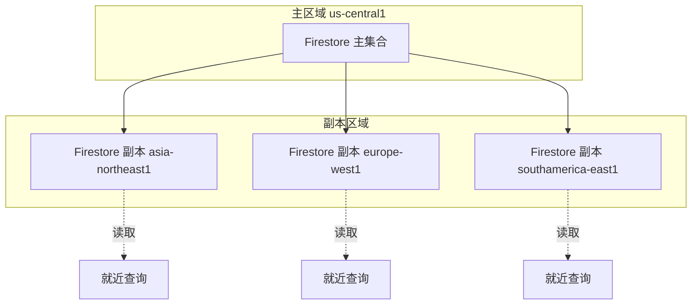
```mermaid
graph TB
subgraph "主区域 us-central1"
A[Firestore 主集合]
end
subgraph "副本区域"
B[Firestore 副本 asia-northeast1]
C[Firestore 副本 europe-west1]
D[Firestore 副本 southamerica-east1]
end
A --> B
A --> C
A --> D
B -.->|读取| E[就近查询]
C -.->|读取| F[就近查询]
D -.->|读取| G[就近查询]
```

### 备份恢复

#### DynamoDB 备份策略

1. **自动备份**：启用自动备份保留策略
2. **跨区域备份**：定期备份到 S3 或其他区域
3. **点-in-time 恢复**：支持秒级恢复
4. **快照备份**：定期创建表快照

#### Firestore 备份策略

1. **自动备份**：利用 Cloud Storage 进行备份
2. **导出功能**：定期导出集合数据
3. **版本控制**：使用 Firestore 导出的版本控制
4. **灾难恢复**：制定完整的恢复计划

### 安全访问控制

#### DynamoDB 安全措施

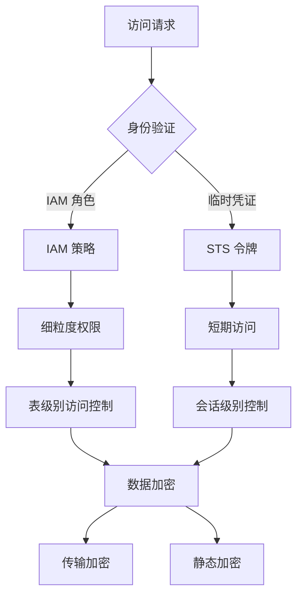
```mermaid
flowchart TD
A[访问请求] --> B{身份验证}
B --> |IAM 角色| C[IAM 策略]
B --> |临时凭证| D[STS 令牌]
C --> E[细粒度权限]
D --> F[短期访问]
E --> G[表级别访问控制]
F --> H[会话级别控制]
G --> I[数据加密]
H --> I
I --> J[传输加密]
I --> K[静态加密]
```

#### Firestore 安全措施

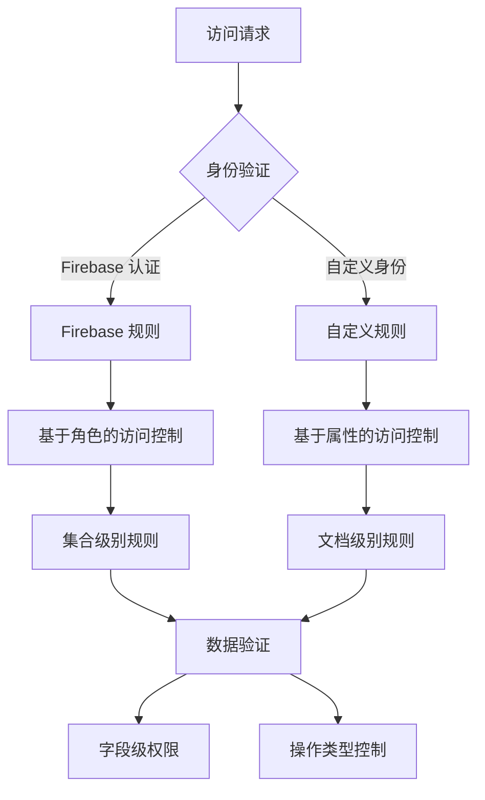
```mermaid
flowchart TD
A[访问请求] --> B{身份验证}
B --> |Firebase 认证| C[Firebase 规则]
B --> |自定义身份| D[自定义规则]
C --> E[基于角色的访问控制]
D --> F[基于属性的访问控制]
E --> G[集合级别规则]
F --> H[文档级别规则]
G --> I[数据验证]
H --> I
I --> J[字段级权限]
I --> K[操作类型控制]
```

**章节来源**
- [libs/agno/agno/db/dynamo/dynamo.py](file://libs/agno/agno/db/dynamo/dynamo.py#L79-L106)
- [libs/agno/agno/db/firestore/firestore.py](file://libs/agno/agno/db/firestore/firestore.py#L79-L106)

## 依赖关系分析

### DynamoDB 依赖关系

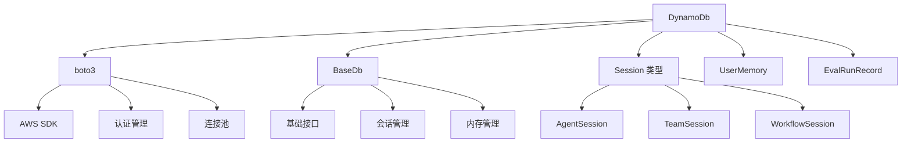
```mermaid
graph TD
A[DynamoDb] --> B[boto3]
A --> C[BaseDb]
A --> D[Session 类型]
A --> E[UserMemory]
A --> F[EvalRunRecord]
B --> B1[AWS SDK]
B --> B2[认证管理]
B --> B3[连接池]
C --> C1[基础接口]
C --> C2[会话管理]
C --> C3[内存管理]
D --> D1[AgentSession]
D --> D2[TeamSession]
D --> D3[WorkflowSession]
```

**图表来源**
- [libs/agno/agno/db/dynamo/dynamo.py](file://libs/agno/agno/db/dynamo/dynamo.py#L1-L30)

### Firestore 依赖关系

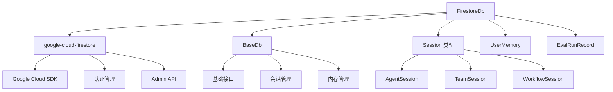
```mermaid
graph TD
A[FirestoreDb] --> B[google-cloud-firestore]
A --> C[BaseDb]
A --> D[Session 类型]
A --> E[UserMemory]
A --> F[EvalRunRecord]
B --> B1[Google Cloud SDK]
B --> B2[认证管理]
B --> B3[Admin API]
C --> C1[基础接口]
C --> C2[会话管理]
C --> C3[内存管理]
D --> D1[AgentSession]
D --> D2[TeamSession]
D --> D3[WorkflowSession]
```

**图表来源**
- [libs/agno/agno/db/firestore/firestore.py](file://libs/agno/agno/db/firestore/firestore.py#L1-L30)

**章节来源**
- [libs/agno/agno/db/dynamo/dynamo.py](file://libs/agno/agno/db/dynamo/dynamo.py#L1-L30)
- [libs/agno/agno/db/firestore/firestore.py](file://libs/agno/agno/db/firestore/firestore.py#L1-L30)

## 性能考虑

### 查询性能优化

#### DynamoDB 性能优化

1. **分区键设计**：确保均匀分布的数据访问
2. **批量操作**：使用 BatchWriteItem 减少网络往返
3. **条件表达式**：最小化服务器端处理
4. **投影表达式**：只获取需要的字段

#### Firestore 性能优化

1. **索引优化**：合理设计复合索引
2. **批量读取**：使用批量读取减少查询次数
3. **缓存策略**：利用本地缓存减少网络请求
4. **查询限制**：避免全集合扫描

### 扩展性设计

#### 自动扩展机制

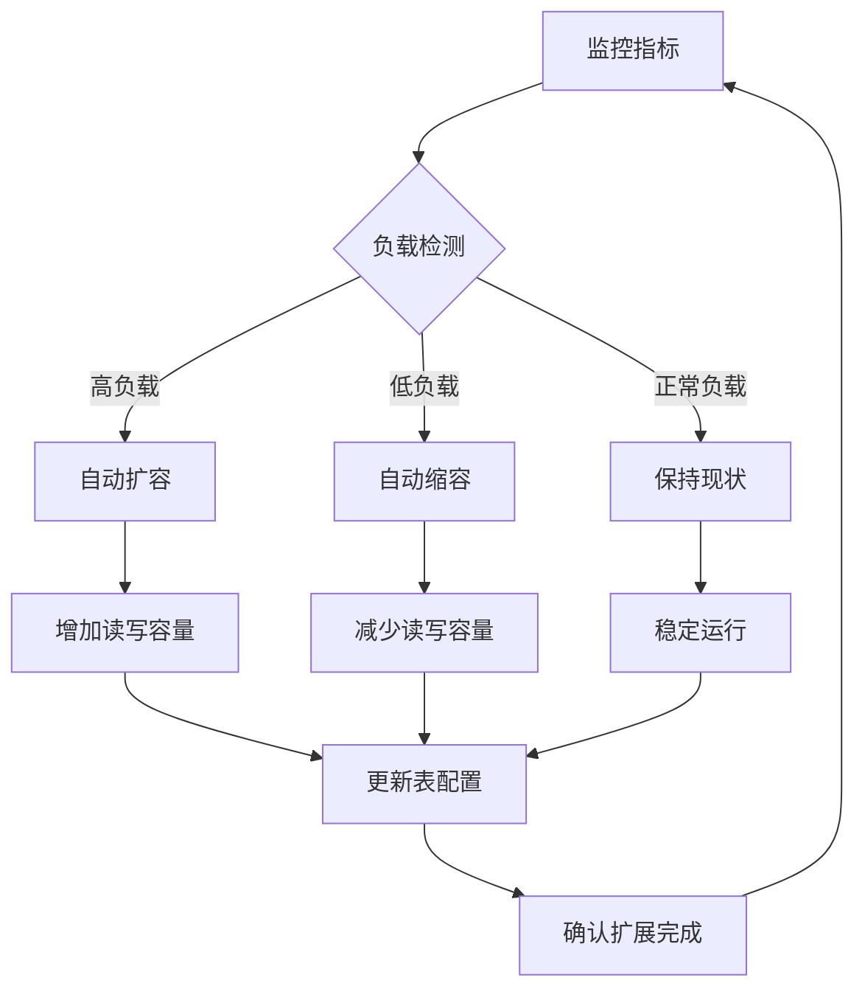
```mermaid
flowchart TD
A[监控指标] --> B{负载检测}
B --> |高负载| C[自动扩容]
B --> |低负载| D[自动缩容]
B --> |正常负载| E[保持现状]
C --> F[增加读写容量]
D --> G[减少读写容量]
E --> H[稳定运行]
F --> I[更新表配置]
G --> I
H --> I
I --> J[确认扩展完成]
J --> A
```

### 成本优化策略

#### 动态定价模型

1. **按需付费**：只支付实际使用的容量
2. **预留实例**：长期稳定负载使用预留实例
3. **批处理优化**：合并小请求减少费用
4. **冷热数据分离**：将不活跃数据迁移到低成本存储

## 故障排除指南

### 常见问题诊断

#### DynamoDB 故障排除

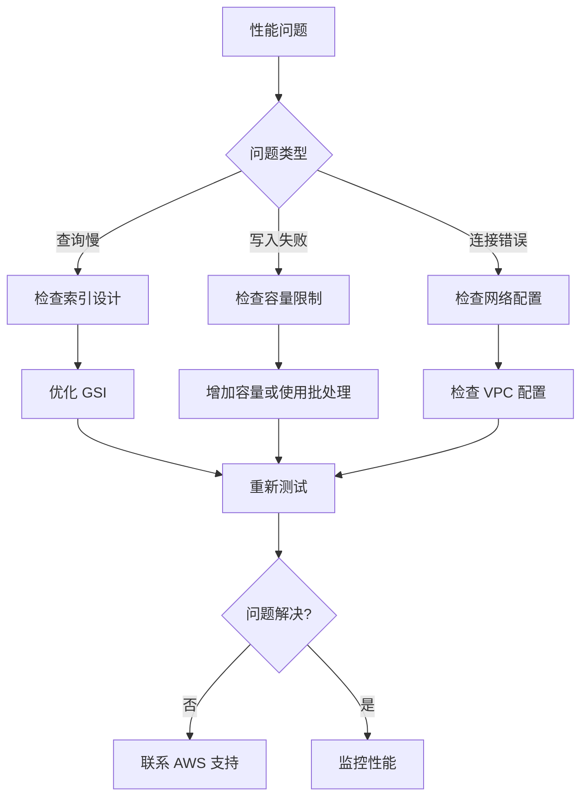
```mermaid
flowchart TD
A[性能问题] --> B{问题类型}
B --> |查询慢| C[检查索引设计]
B --> |写入失败| D[检查容量限制]
B --> |连接错误| E[检查网络配置]
C --> F[优化 GSI]
D --> G[增加容量或使用批处理]
E --> H[检查 VPC 配置]
F --> I[重新测试]
G --> I
H --> I
I --> J{问题解决?}
J --> |否| K[联系 AWS 支持]
J --> |是| L[监控性能]
```

#### Firestore 故障排除

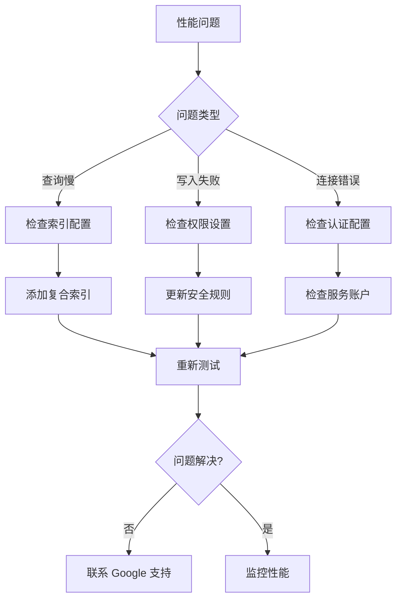
```mermaid
flowchart TD
A[性能问题] --> B{问题类型}
B --> |查询慢| C[检查索引配置]
B --> |写入失败| D[检查权限设置]
B --> |连接错误| E[检查认证配置]
C --> F[添加复合索引]
D --> G[更新安全规则]
E --> H[检查服务账户]
F --> I[重新测试]
G --> I
H --> I
I --> J{问题解决?}
J --> |否| K[联系 Google 支持]
J --> |是| L[监控性能]
```

### 监控和告警

#### 关键指标监控

1. **读写容量利用率**：监控接近 100% 的情况
2. **错误率**：跟踪 HTTP 500 错误和超时
3. **延迟**：监控 P99 延迟超过阈值
4. **连接数**：跟踪连接池使用情况

#### 告警配置

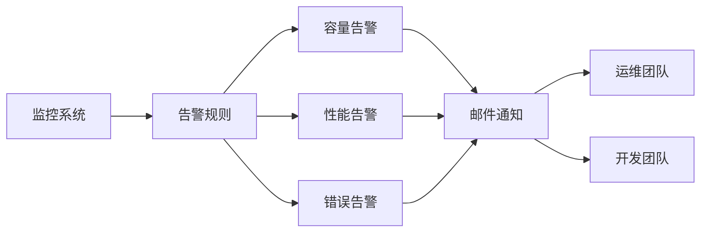
```mermaid
graph LR
A[监控系统] --> B[告警规则]
B --> C[容量告警]
B --> D[性能告警]
B --> E[错误告警]
C --> F[邮件通知]
D --> F
E --> F
F --> G[运维团队]
F --> H[开发团队]
```

**章节来源**
- [libs/agno/agno/db/dynamo/dynamo.py](file://libs/agno/agno/db/dynamo/dynamo.py#L1196-L1237)
- [libs/agno/agno/db/firestore/utils.py](file://libs/agno/agno/db/firestore/utils.py#L42-L75)

## 结论

Agno 的 DynamoDB 和 Firestore 集成提供了强大而灵活的云原生数据库解决方案。通过合理的分区键设计、索引策略和成本优化，这些数据库能够满足智能体系统对高可扩展性和全球分布的需求。

### 主要优势

1. **高可扩展性**：自动扩展能力确保系统能够处理突发流量
2. **全球分布**：多区域部署支持低延迟访问
3. **成本效益**：按需付费模式优化运营成本
4. **易于维护**：云服务提供商负责基础设施维护

### 最佳实践建议

1. **选择合适的数据库**：根据具体需求选择 DynamoDB 或 Firestore
2. **合理设计索引**：避免过度索引导致的成本增加
3. **监控和优化**：持续监控性能指标并进行优化
4. **备份和恢复**：建立完善的备份和灾难恢复机制

通过遵循这些最佳实践，开发者可以充分利用云原生数据库的优势，构建高性能、高可用的智能体系统。