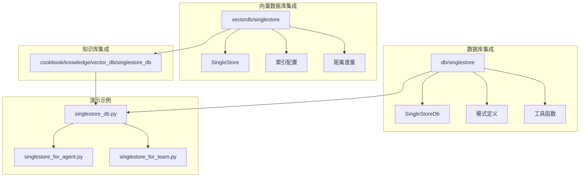
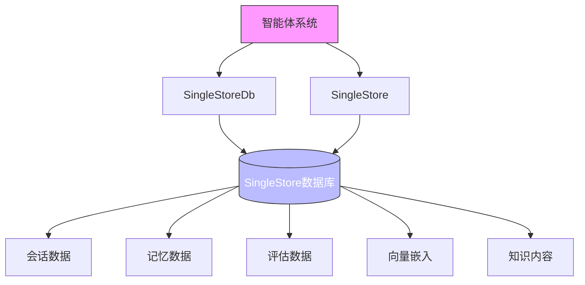
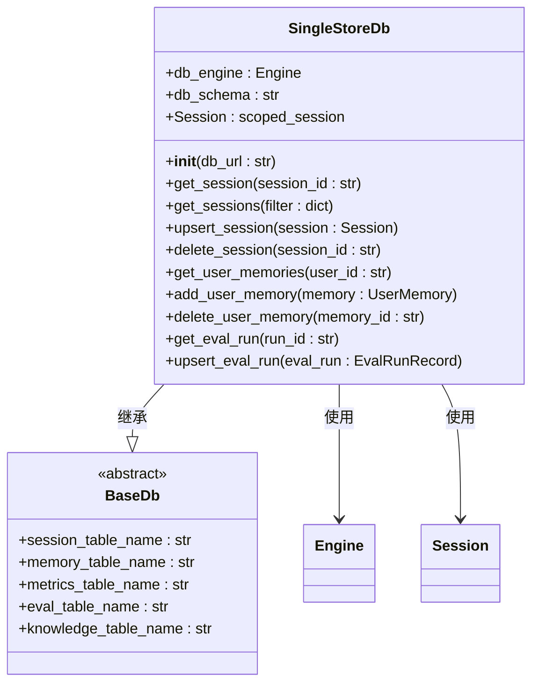
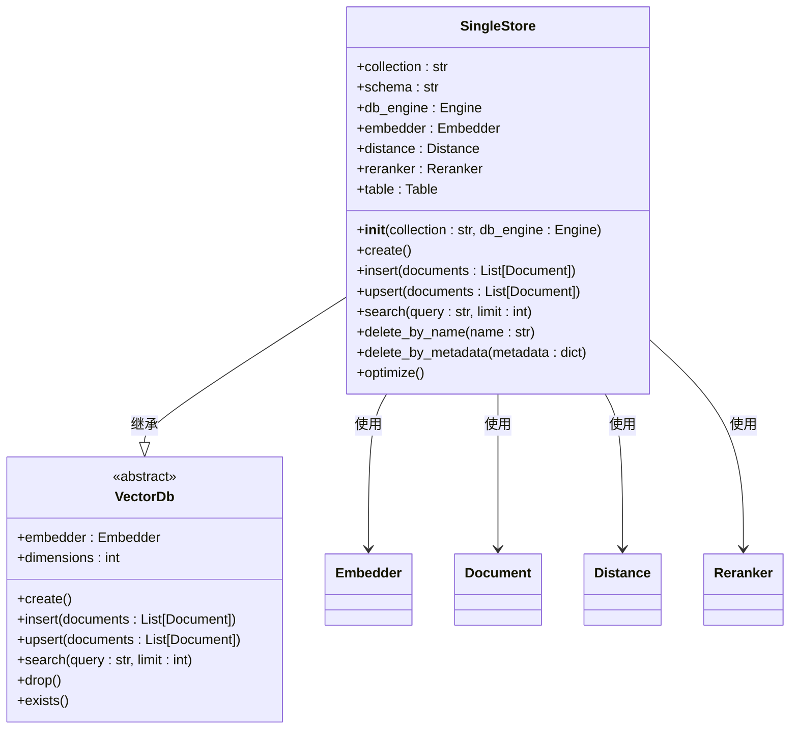
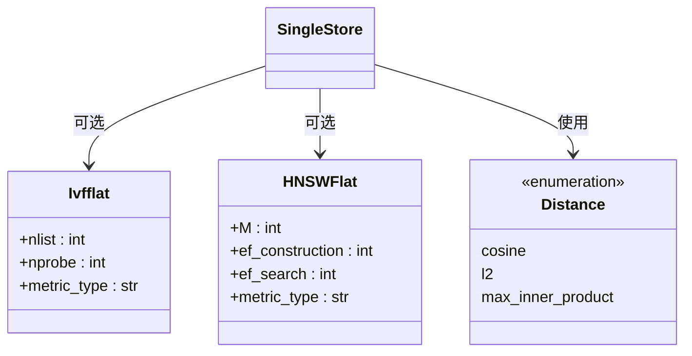
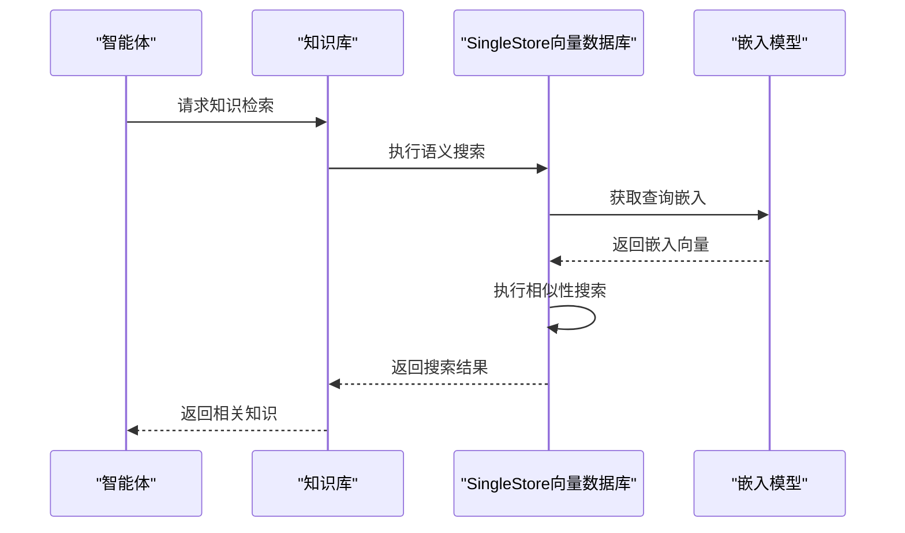
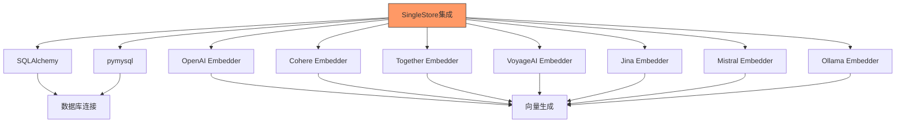

# 向量数据库集成

<cite>
**本文档中引用的文件**  
- [singlestore.py](file://libs/agno/agno/db/singlestore/singlestore.py)
- [schemas.py](file://libs/agno/agno/db/singlestore/schemas.py)
- [utils.py](file://libs/agno/agno/db/singlestore/utils.py)
- [singlestore_for_agent.py](file://cookbook/db/singlestore/singlestore_for_agent.py)
- [singlestore_for_team.py](file://cookbook/db/singlestore/singlestore_for_team.py)
- [singlestore.py](file://libs/agno/agno/vectordb/singlestore/singlestore.py)
- [index.py](file://libs/agno/agno/vectordb/singlestore/index.py)
- [singlestore_db.py](file://cookbook/knowledge/vector_db/singlestore_db/singlestore_db.py)
</cite>

## 目录
1. [简介](#简介)
2. [项目结构](#项目结构)
3. [核心组件](#核心组件)
4. [架构概述](#架构概述)
5. [详细组件分析](#详细组件分析)
6. [依赖分析](#依赖分析)
7. [性能考虑](#性能考虑)
8. [故障排除指南](#故障排除指南)
9. [结论](#结论)

## 简介
本文档详细介绍了Agno中SingleStore集成的实现机制，重点阐述如何利用SingleStore的向量化存储和计算能力来支持智能体系统的高级知识检索和语义搜索功能。通过分析实际代码示例，展示了在智能体、团队和工作流中使用SingleStore进行向量嵌入存储、相似性搜索和混合查询的最佳实践。文档还解释了SingleStore适配器的实现细节，包括向量索引构建、距离度量算法、数据分片和实时更新策略，并提供了性能调优建议。

## 项目结构
Agno项目中的SingleStore集成主要分布在两个核心目录中：`db`用于常规数据库操作，`vectordb`专门处理向量数据库功能。这种分离的设计使得SingleStore既可以作为传统的关系型数据库存储会话、记忆和评估数据，又可以作为高性能的向量数据库支持语义搜索。

**Diagram sources**
- [singlestore.py](file://libs/agno/agno/db/singlestore/singlestore.py)
- [singlestore.py](file://libs/agno/agno/vectordb/singlestore/singlestore.py)
- [singlestore_for_agent.py](file://cookbook/db/singlestore/singlestore_for_agent.py)
- [singlestore_db.py](file://cookbook/knowledge/vector_db/singlestore_db/singlestore_db.py)

**Section sources**
- [singlestore.py](file://libs/agno/agno/db/singlestore/singlestore.py)
- [singlestore.py](file://libs/agno/agno/vectordb/singlestore/singlestore.py)

## 核心组件
SingleStore集成的核心组件包括`SingleStoreDb`类和`SingleStore`向量数据库类。`SingleStoreDb`作为Agno框架的数据库适配器，实现了会话、记忆、评估和知识元数据的持久化存储。而`SingleStore`向量数据库类则专注于向量嵌入的存储、索引和相似性搜索，为智能体系统提供语义搜索能力。

**Section sources**
- [singlestore.py](file://libs/agno/agno/db/singlestore/singlestore.py)
- [singlestore.py](file://libs/agno/agno/vectordb/singlestore/singlestore.py)

## 架构概述
SingleStore集成的架构分为两个主要层次：数据持久化层和向量搜索层。数据持久化层通过`SingleStoreDb`类与SingleStore数据库交互，存储结构化数据如会话记录、用户记忆和评估结果。向量搜索层通过`SingleStore`类管理向量集合，支持文档的向量化存储和基于相似度的语义搜索。

**Diagram sources**
- [singlestore.py](file://libs/agno/agno/db/singlestore/singlestore.py)
- [singlestore.py](file://libs/agno/agno/vectordb/singlestore/singlestore.py)

## 详细组件分析

### SingleStore数据库适配器分析
`SingleStoreDb`类实现了Agno框架的数据库接口，提供了对SingleStore数据库的完整操作支持。该类通过SQLAlchemy ORM与数据库交互，支持会话的增删改查、记忆管理、评估数据存储等功能。

**Diagram sources**
- [singlestore.py](file://libs/agno/agno/db/singlestore/singlestore.py)

**Section sources**
- [singlestore.py](file://libs/agno/agno/db/singlestore/singlestore.py)

### 向量数据库组件分析
`SingleStore`向量数据库类提供了完整的向量搜索功能，包括向量嵌入的存储、索引构建、相似性搜索和混合查询。该类利用SingleStore的向量数据类型和相似性搜索算法，实现了高效的语义搜索能力。

**Diagram sources**
- [singlestore.py](file://libs/agno/agno/vectordb/singlestore/singlestore.py)

**Section sources**
- [singlestore.py](file://libs/agno/agno/vectordb/singlestore/singlestore.py)

### 向量索引与距离度量分析
SingleStore向量数据库支持多种索引类型和距离度量算法，以优化不同场景下的搜索性能。索引配置通过Pydantic模型定义，支持IVF和HNSW等先进的向量索引算法。

**Diagram sources**
- [index.py](file://libs/agno/agno/vectordb/singlestore/index.py)
- [singlestore.py](file://libs/agno/agno/vectordb/singlestore/singlestore.py)

**Section sources**
- [index.py](file://libs/agno/agno/vectordb/singlestore/index.py)

### 知识库集成分析
SingleStore向量数据库与Agno的知识库系统深度集成，支持从多种来源（URL、文件路径、主题等）导入内容，并自动进行向量化处理和存储。这种集成使得智能体能够基于丰富的知识库进行语义搜索和推理。

**Diagram sources**
- [singlestore_db.py](file://cookbook/knowledge/vector_db/singlestore_db/singlestore_db.py)
- [singlestore.py](file://libs/agno/agno/vectordb/singlestore/singlestore.py)

**Section sources**
- [singlestore_db.py](file://cookbook/knowledge/vector_db/singlestore_db/singlestore_db.py)

## 依赖分析
SingleStore集成依赖于多个关键组件和库，形成了一个完整的生态系统。主要依赖包括SQLAlchemy作为ORM框架，pymysql作为数据库驱动，以及各种嵌入模型提供者（如OpenAI、Cohere等）用于生成向量嵌入。

**Diagram sources**
- [singlestore.py](file://libs/agno/agno/vectordb/singlestore/singlestore.py)
- [singlestore.py](file://libs/agno/agno/db/singlestore/singlestore.py)

**Section sources**
- [singlestore.py](file://libs/agno/agno/vectordb/singlestore/singlestore.py)

## 性能考虑
为了优化SingleStore集成的性能，建议采取以下措施：合理配置向量索引参数以平衡搜索精度和速度，使用适当的数据分片策略来提高查询效率，定期优化数据库表结构，并根据实际使用场景调整向量维度。

- **向量维度优化**：选择与嵌入模型匹配的向量维度，避免不必要的计算开销
- **查询延迟降低**：通过配置合适的索引参数（如HNSW的ef_search）来优化搜索速度
- **大规模数据集管理**：利用SingleStore的分布式架构特性，对大规模向量数据集进行有效管理
- **混合查询优化**：将向量搜索与传统SQL查询相结合，实现复杂的多条件过滤和排序

## 故障排除指南
在使用SingleStore集成时，可能会遇到一些常见问题。以下是一些故障排除建议：

- **连接问题**：确保数据库URL配置正确，网络连接正常，认证信息有效
- **向量搜索精度低**：检查嵌入模型是否适合应用场景，调整距离度量算法
- **性能瓶颈**：检查索引配置是否合理，考虑增加计算资源或优化查询模式
- **数据一致性问题**：确保向量数据与元数据同步更新，使用事务保证数据完整性

**Section sources**
- [singlestore.py](file://libs/agno/agno/vectordb/singlestore/singlestore.py)
- [singlestore.py](file://libs/agno/agno/db/singlestore/singlestore.py)

## 结论
SingleStore集成为Agno智能体系统提供了强大的向量化存储和计算能力，支持高级知识检索和语义搜索功能。通过合理的架构设计和性能优化，该集成能够有效支持智能体、团队和工作流中的复杂应用场景。未来可以进一步探索更先进的向量索引算法和混合查询优化技术，以提升系统的整体性能和用户体验。