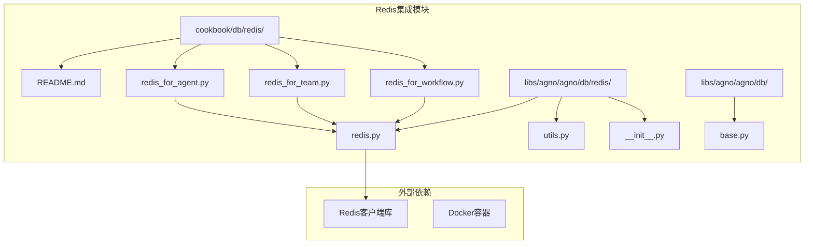
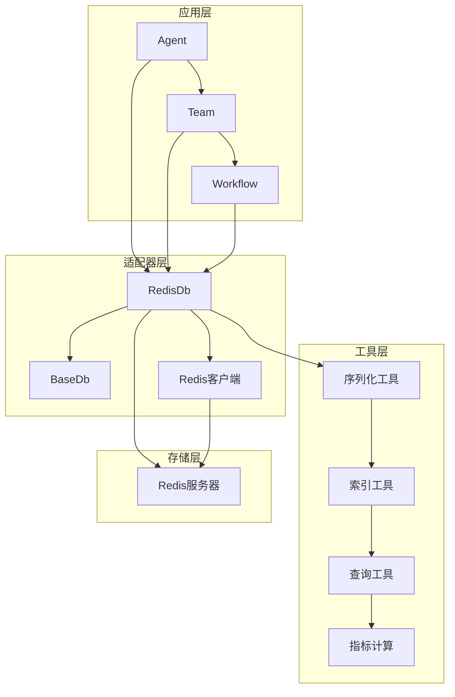
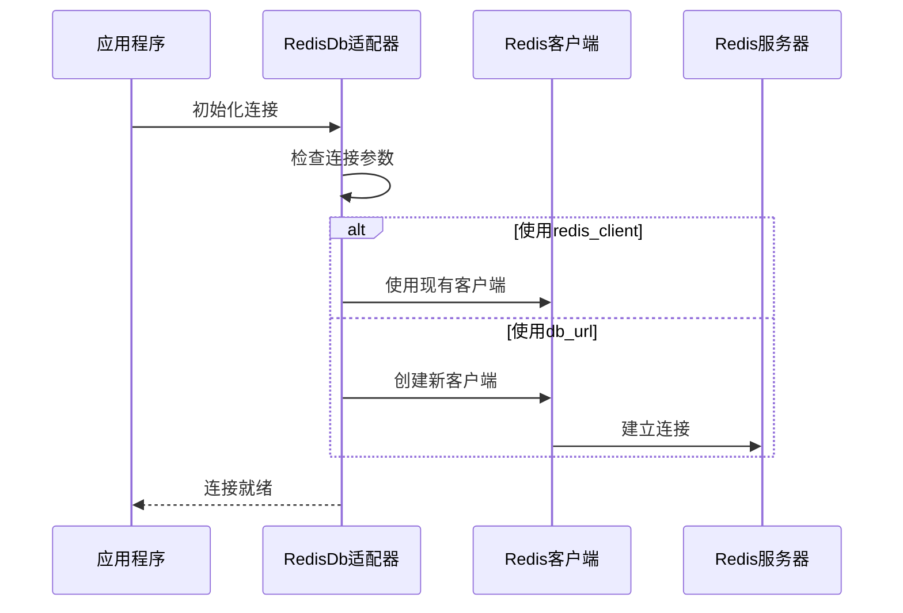
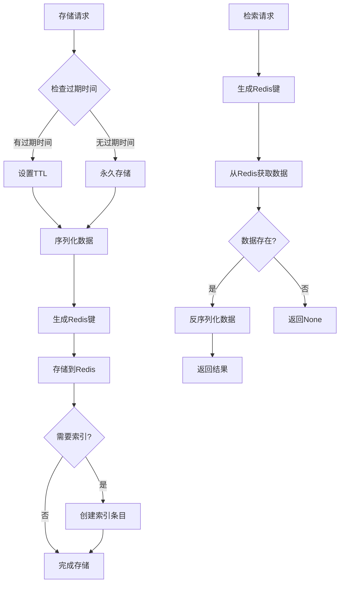
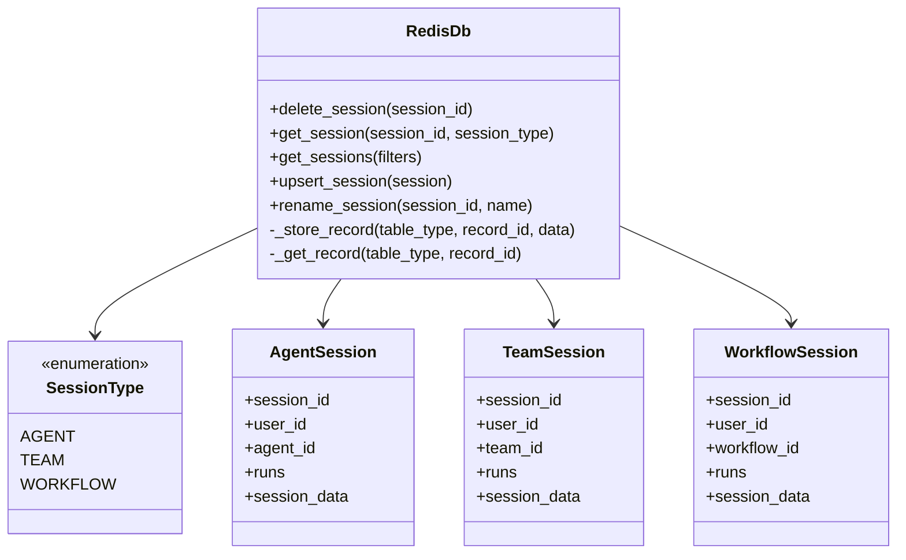
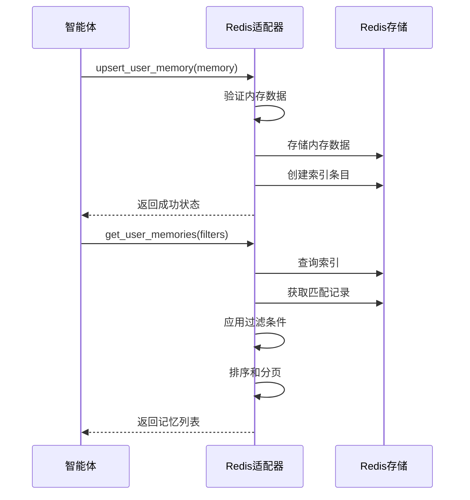
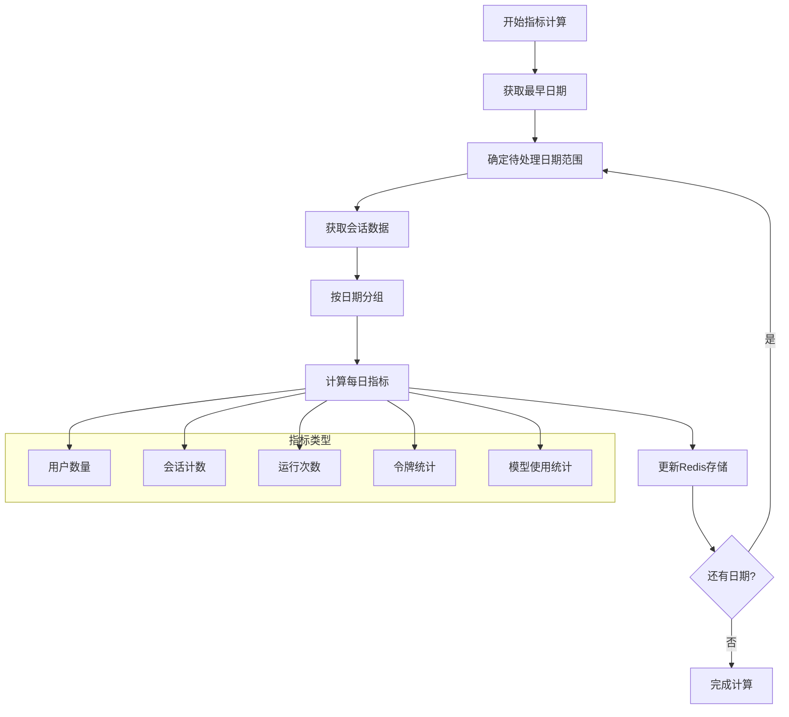
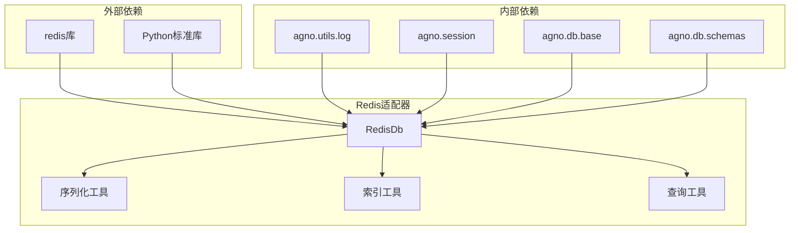

# 键值存储集成

<cite>
**本文档中引用的文件**
- [README.md](file://cookbook/db/redis/README.md)
- [redis_for_agent.py](file://cookbook/db/redis/redis_for_agent.py)
- [redis_for_team.py](file://cookbook/db/redis/redis_for_team.py)
- [redis_for_workflow.py](file://cookbook/db/redis/redis_for_workflow.py)
- [redis.py](file://libs/agno/agno/db/redis/redis.py)
- [utils.py](file://libs/agno/agno/db/redis/utils.py)
- [__init__.py](file://libs/agno/agno/db/redis/__init__.py)
- [base.py](file://libs/agno/agno/db/base.py)
</cite>

## 目录
1. [简介](#简介)
2. [项目结构](#项目结构)
3. [核心组件](#核心组件)
4. [架构概览](#架构概览)
5. [详细组件分析](#详细组件分析)
6. [依赖关系分析](#依赖关系分析)
7. [性能考虑](#性能考虑)
8. [故障排除指南](#故障排除指南)
9. [结论](#结论)

## 简介

Agno框架提供了强大的Redis键值存储集成，作为高性能的缓存、会话存储和实时数据交换解决方案。Redis适配器为智能体、团队和工作流提供了低延迟的数据访问和状态共享能力，充分利用了Redis的内存存储特性和丰富的数据结构支持。

该集成不仅支持基本的键值存储操作，还提供了完整的索引系统、数据序列化、过期策略和查询优化功能，确保在大规模分布式环境中也能保持卓越的性能表现。

## 项目结构

Redis集成在Agno项目中的组织结构如下：



**图表来源**
- [redis.py](file://libs/agno/agno/db/redis/redis.py#L1-L50)
- [base.py](file://libs/agno/agno/db/base.py#L1-L30)

**章节来源**
- [README.md](file://cookbook/db/redis/README.md#L1-L33)
- [redis.py](file://libs/agno/agno/db/redis/redis.py#L1-L100)

## 核心组件

### RedisDb适配器类

RedisDb是整个Redis集成的核心组件，继承自BaseDb抽象基类，提供了完整的数据库操作接口：

```python
class RedisDb(BaseDb):
    def __init__(
        self,
        id: Optional[str] = None,
        redis_client: Optional[Redis] = None,
        db_url: Optional[str] = None,
        db_prefix: str = "agno",
        expire: Optional[int] = None,
        session_table: Optional[str] = None,
        memory_table: Optional[str] = None,
        metrics_table: Optional[str] = None,
        eval_table: Optional[str] = None,
        knowledge_table: Optional[str] = None,
    ):
```

### 数据序列化系统

Redis适配器实现了自定义的JSON序列化系统，支持复杂数据类型的存储：

```python
class CustomEncoder(json.JSONEncoder):
    def default(self, obj):
        if isinstance(obj, UUID):
            return str(obj)
        elif isinstance(obj, (date, datetime)):
            return obj.isoformat()
        return super().default(obj)

def serialize_data(data: dict) -> str:
    return json.dumps(data, ensure_ascii=False, cls=CustomEncoder)

def deserialize_data(data: str) -> dict:
    return json.loads(data)
```

### 索引和查询系统

Redis适配器提供了高效的索引系统，支持多字段索引和复杂查询：

```python
def create_index_entries(
    redis_client: Redis,
    prefix: str,
    table_type: str,
    record_id: str,
    record_data: Dict[str, Any],
    index_fields: List[str],
) -> None:
    for field in index_fields:
        if field in record_data and record_data[field] is not None:
            index_key = generate_index_key(prefix, table_type, field, str(record_data[field]))
            redis_client.sadd(index_key, record_id)
```

**章节来源**
- [redis.py](file://libs/agno/agno/db/redis/redis.py#L27-L100)
- [utils.py](file://libs/agno/agno/db/redis/utils.py#L18-L40)

## 架构概览

Redis适配器采用分层架构设计，确保了良好的可扩展性和维护性：



**图表来源**
- [redis.py](file://libs/agno/agno/db/redis/redis.py#L27-L100)
- [base.py](file://libs/agno/agno/db/base.py#L15-L50)

## 详细组件分析

### Redis连接管理

Redis适配器支持多种连接方式，提供了灵活的配置选项：



**图表来源**
- [redis.py](file://libs/agno/agno/db/redis/redis.py#L40-L70)

### 数据存储和检索流程

Redis适配器实现了高效的键值存储和检索机制：



**图表来源**
- [redis.py](file://libs/agno/agno/db/redis/redis.py#L121-L184)
- [utils.py](file://libs/agno/agno/db/redis/utils.py#L142-L180)

### 会话管理

Redis适配器为不同类型的会话提供了专门的管理功能：



**图表来源**
- [redis.py](file://libs/agno/agno/db/redis/redis.py#L220-L400)
- [base.py](file://libs/agno/agno/db/base.py#L15-L25)

### 内存管理

Redis适配器提供了完整的用户记忆管理系统：



**图表来源**
- [redis.py](file://libs/agno/agno/db/redis/redis.py#L800-L900)

**章节来源**
- [redis.py](file://libs/agno/agno/db/redis/redis.py#L220-L800)
- [redis_for_agent.py](file://cookbook/db/redis/redis_for_agent.py#L1-L41)
- [redis_for_team.py](file://cookbook/db/redis/redis_for_team.py#L1-L64)

### 指标计算和分析

Redis适配器内置了强大的指标计算功能，支持历史数据分析：



**图表来源**
- [redis.py](file://libs/agno/agno/db/redis/redis.py#L950-L1100)

**章节来源**
- [redis.py](file://libs/agno/agno/db/redis/redis.py#L950-L1200)

## 依赖关系分析

Redis适配器的依赖关系展现了清晰的分层架构：



**图表来源**
- [redis.py](file://libs/agno/agno/db/redis/redis.py#L1-L25)
- [utils.py](file://libs/agno/agno/db/redis/utils.py#L1-L20)

**章节来源**
- [redis.py](file://libs/agno/agno/db/redis/redis.py#L1-L50)
- [utils.py](file://libs/agno/agno/db/redis/utils.py#L1-L50)

## 性能考虑

### 内存管理优化

Redis适配器采用了多种策略来优化内存使用：

1. **数据压缩**：使用JSON序列化减少存储空间
2. **TTL管理**：自动过期机制避免内存泄漏
3. **批量操作**：支持批量删除和清理操作

### 查询性能优化

1. **索引系统**：多字段索引支持快速查询
2. **分页机制**：大数据集的高效分页
3. **排序优化**：内存中的排序算法

### 并发处理

Redis适配器支持高并发场景：
- 原子操作保证数据一致性
- 连接池管理提高并发性能
- 异步操作支持非阻塞I/O

## 故障排除指南

### 常见问题和解决方案

1. **连接失败**
   - 检查Redis服务器是否运行
   - 验证连接URL格式
   - 确认网络连通性

2. **序列化错误**
   - 检查数据类型兼容性
   - 使用自定义编码器处理特殊类型
   - 验证JSON格式正确性

3. **性能问题**
   - 调整TTL设置
   - 优化索引策略
   - 监控内存使用情况

**章节来源**
- [redis.py](file://libs/agno/agno/db/redis/redis.py#L121-L221)

## 结论

Agno的Redis键值存储集成提供了一个强大而灵活的数据存储解决方案。通过精心设计的架构和优化的性能特性，它能够满足现代智能体系统对高速数据访问和状态共享的需求。

主要优势包括：
- **高性能**：利用Redis的内存存储特性实现低延迟访问
- **灵活性**：支持多种数据类型和复杂的查询需求
- **可扩展性**：良好的架构设计支持水平扩展
- **易用性**：简洁的API接口降低开发复杂度

该集成特别适用于需要实时数据处理、会话管理和状态同步的智能体应用场景，为构建高性能的AI系统提供了坚实的基础。