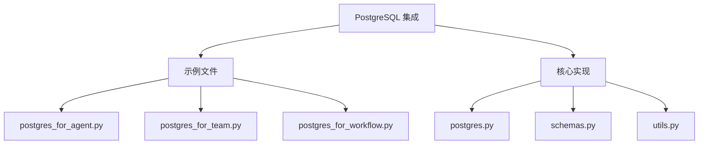
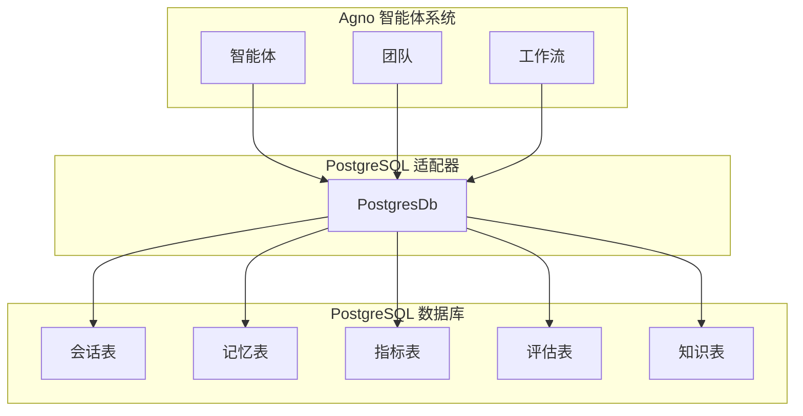
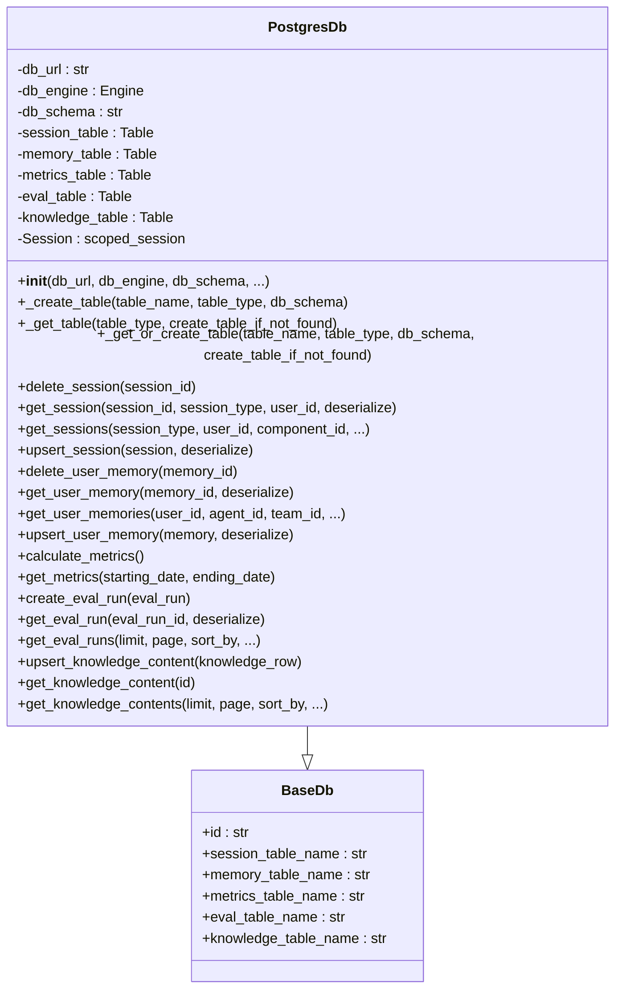
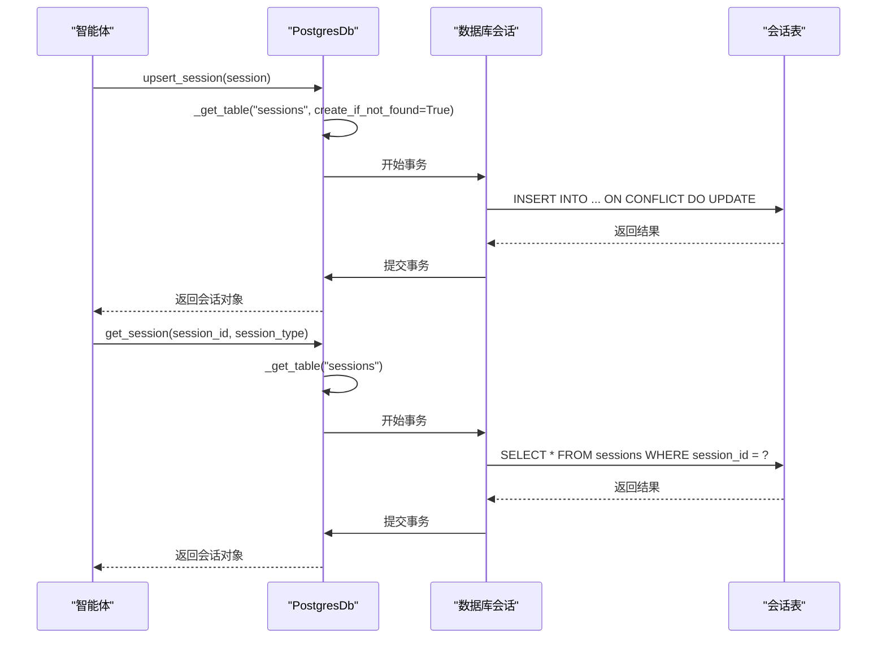
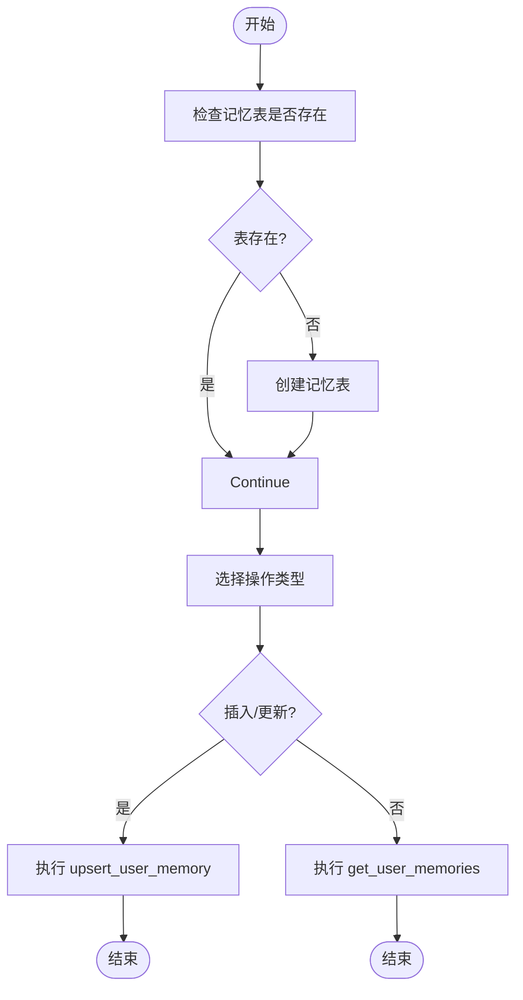
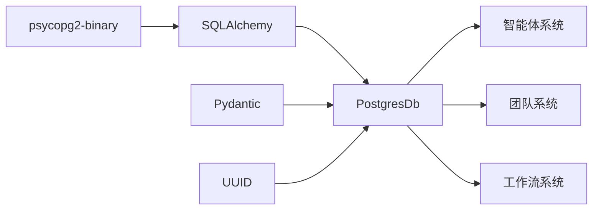

# PostgreSQL 集成

<cite>
**本文档中引用的文件**  
- [postgres.py](file://libs/agno/agno/db/postgres/postgres.py)
- [postgres_for_agent.py](file://cookbook/db/postgres/postgres_for_agent.py)
- [postgres_for_team.py](file://cookbook/db/postgres/postgres_for_team.py)
- [postgres_for_workflow.py](file://cookbook/db/postgres/postgres_for_workflow.py)
- [README.md](file://cookbook/db/postgres/README.md)
</cite>

## 目录
1. [简介](#简介)
2. [项目结构](#项目结构)
3. [核心组件](#核心组件)
4. [架构概述](#架构概述)
5. [详细组件分析](#详细组件分析)
6. [依赖分析](#依赖分析)
7. [性能考虑](#性能考虑)
8. [故障排除指南](#故障排除指南)
9. [结论](#结论)

## 简介
本文档详细介绍了 Agno 智能体系统中 PostgreSQL 数据库的集成方案。文档涵盖了如何配置和使用 PostgreSQL 作为智能体、团队和工作流的持久化存储，包括连接字符串配置、驱动适配器实现、会话状态管理、用户记忆存储和结构化数据处理。通过实际代码示例展示了在智能体系统中使用 PostgreSQL 的最佳实践，并解释了数据库迁移策略、事务处理机制、连接池配置和性能优化建议。

## 项目结构
Agno 项目的 PostgreSQL 集成主要位于 `cookbook/db/postgres` 目录下，包含针对智能体、团队和工作流的具体实现示例。核心数据库适配器实现在 `libs/agno/agno/db/postgres` 目录中。

**Diagram sources**
- [postgres_for_agent.py](file://cookbook/db/postgres/postgres_for_agent.py)
- [postgres_for_team.py](file://cookbook/db/postgres/postgres_for_team.py)
- [postgres_for_workflow.py](file://cookbook/db/postgres/postgres_for_workflow.py)
- [postgres.py](file://libs/agno/agno/db/postgres/postgres.py)

**Section sources**
- [postgres.py](file://libs/agno/agno/db/postgres/postgres.py)
- [postgres_for_agent.py](file://cookbook/db/postgres/postgres_for_agent.py)

## 核心组件
PostgreSQL 集成的核心组件是 `PostgresDb` 类，它作为 Agno 系统与 PostgreSQL 数据库之间的桥梁。该类实现了会话管理、用户记忆存储、指标计算、知识内容管理和评估数据存储等功能。通过 SQLAlchemy ORM 实现了与 PostgreSQL 的交互，支持会话、记忆、指标、评估和知识等多种数据类型的持久化。

**Section sources**
- [postgres.py](file://libs/agno/agno/db/postgres/postgres.py#L100-L200)

## 架构概述
PostgreSQL 集成架构采用分层设计，上层是 Agno 智能体系统，中间是 `PostgresDb` 适配器层，底层是 PostgreSQL 数据库。适配器层负责将 Agno 系统的抽象数据模型转换为数据库表结构，并处理所有数据库操作。

**Diagram sources**
- [postgres.py](file://libs/agno/agno/db/postgres/postgres.py#L50-L100)

## 详细组件分析

### PostgresDb 类分析
`PostgresDb` 类是 PostgreSQL 集成的核心，它继承自 `BaseDb` 基类，实现了数据库连接管理、表创建、会话操作、记忆管理、指标计算等关键功能。

#### 类结构

**Diagram sources**
- [postgres.py](file://libs/agno/agno/db/postgres/postgres.py#L100-L200)

#### 会话管理流程

**Diagram sources**
- [postgres.py](file://libs/agno/agno/db/postgres/postgres.py#L600-L800)

#### 用户记忆管理流程

**Diagram sources**
- [postgres.py](file://libs/agno/agno/db/postgres/postgres.py#L800-L1000)

**Section sources**
- [postgres.py](file://libs/agno/agno/db/postgres/postgres.py#L100-L1600)

## 依赖分析
PostgreSQL 集成依赖于多个关键组件和库，形成了一个完整的依赖链。

**Diagram sources**
- [postgres.py](file://libs/agno/agno/db/postgres/postgres.py#L1-L50)
- [requirements.txt](file://libs/agno/requirements.txt)

## 性能考虑
PostgreSQL 集成在性能方面进行了多项优化，包括连接池管理、索引策略和查询优化。

### 连接池配置
`PostgresDb` 类使用 SQLAlchemy 的 `scoped_session` 和连接池机制来管理数据库连接，避免了频繁创建和销毁连接的开销。

### 索引策略
系统自动为关键字段创建索引，包括：
- 会话表的 `session_id` 字段
- 记忆表的 `memory_id` 字段
- 评估表的 `run_id` 字段
- 知识表的 `id` 字段

这些索引显著提高了数据检索的性能。

### 查询优化
通过以下方式优化查询性能：
- 使用批量操作（bulk operations）减少数据库往返次数
- 实现分页查询避免一次性加载大量数据
- 使用适当的排序和过滤条件
- 利用 PostgreSQL 的 JSONB 类型进行高效的数据存储和查询

**Section sources**
- [postgres.py](file://libs/agno/agno/db/postgres/postgres.py#L200-L400)

## 故障排除指南
在使用 PostgreSQL 集成时可能会遇到一些常见问题，以下是解决方案：

### 数据库连接问题
如果出现数据库连接问题，请检查：
1. 数据库 URL 格式是否正确
2. 数据库服务是否正在运行
3. 网络连接是否正常
4. 认证凭据是否正确

### 表创建失败
如果表创建失败，可能是由于：
1. 缺少必要的权限
2. 模式（schema）不存在
3. 表名冲突

解决方案是确保数据库用户有足够的权限，并在必要时手动创建模式。

### 性能问题
如果遇到性能问题，可以：
1. 检查索引是否已正确创建
2. 优化查询条件
3. 调整连接池大小
4. 监控数据库性能指标

**Section sources**
- [postgres.py](file://libs/agno/agno/db/postgres/postgres.py#L1000-L1600)

## 结论
PostgreSQL 集成为 Agno 智能体系统提供了强大而灵活的持久化存储解决方案。通过 `PostgresDb` 适配器，系统能够高效地管理会话状态、用户记忆、评估数据和知识内容。集成方案设计合理，具有良好的扩展性和性能表现，为构建复杂的智能体应用提供了坚实的基础。