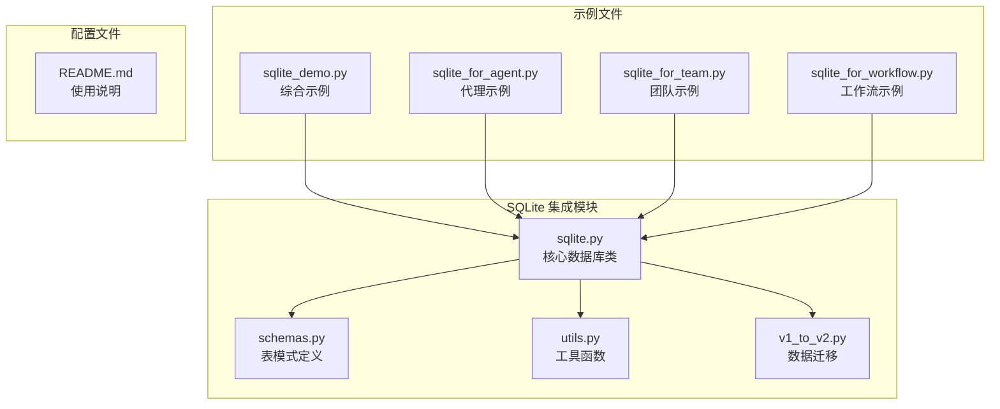
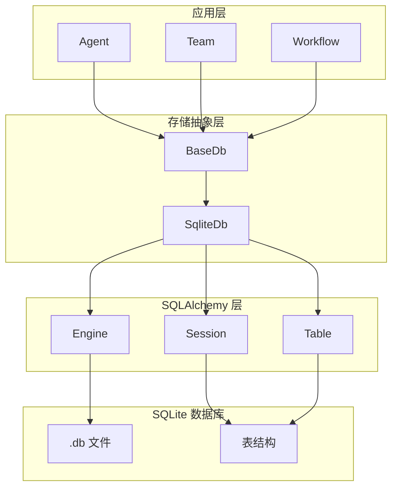
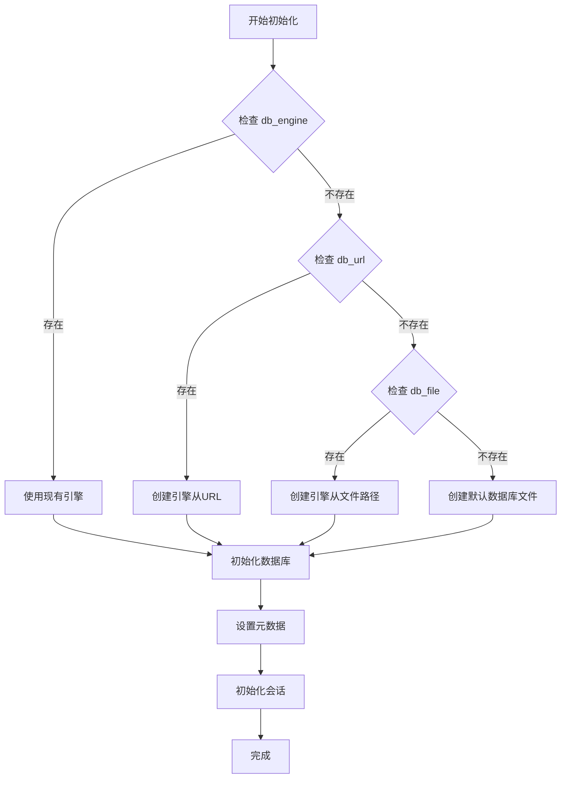
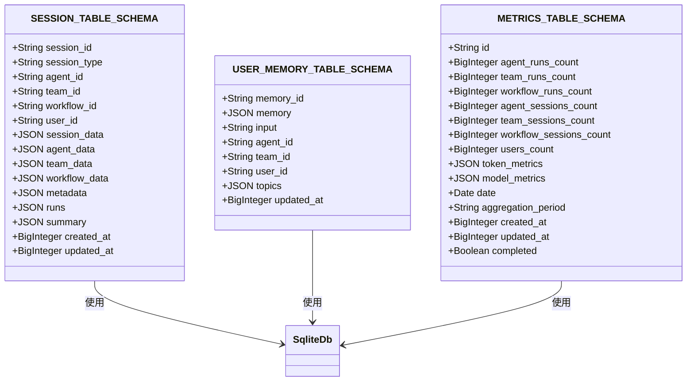
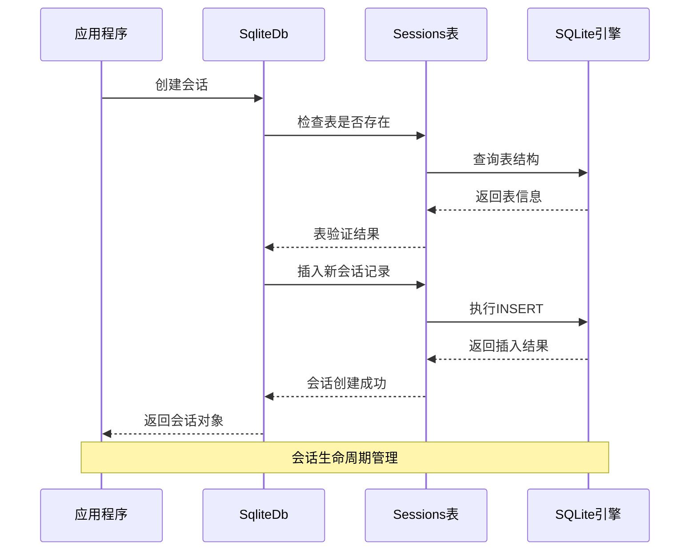
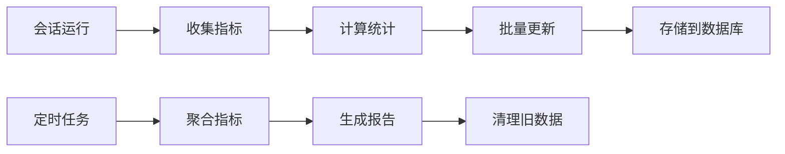
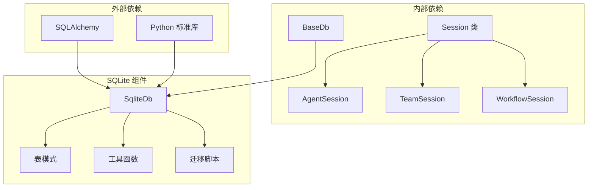

# SQLite 集成

<cite>
**本文档中引用的文件**
- [sqlite.py](file://libs/agno/agno/db/sqlite/sqlite.py)
- [schemas.py](file://libs/agno/agno/db/sqlite/schemas.py)
- [utils.py](file://libs/agno/agno/db/sqlite/utils.py)
- [sqlite_demo.py](file://cookbook/agent_os/dbs/sqlite_demo.py)
- [sqlite_for_agent.py](file://cookbook/db/sqllite/sqlite_for_agent.py)
- [sqlite_for_team.py](file://cookbook/db/sqllite/sqlite_for_team.py)
- [sqlite_for_workflow.py](file://cookbook/db/sqllite/sqlite_for_workflow.py)
- [README.md](file://cookbook/db/sqllite/README.md)
- [v1_to_v2.py](file://libs/agno/agno/db/migrations/v1_to_v2.py)
</cite>

## 目录
1. [简介](#简介)
2. [项目结构](#项目结构)
3. [核心组件](#核心组件)
4. [架构概览](#架构概览)
5. [详细组件分析](#详细组件分析)
6. [依赖关系分析](#依赖关系分析)
7. [性能考虑](#性能考虑)
8. [故障排除指南](#故障排除指南)
9. [结论](#结论)

## 简介

Agno 中的 SQLite 集成提供了一个轻量级、嵌入式的持久化存储解决方案，专为智能体、团队和工作流设计。SQLite 是一个零配置的关系型数据库引擎，非常适合开发环境、原型设计和小型生产部署。

该集成支持以下核心功能：
- 会话状态持久化存储
- 用户记忆和上下文管理
- 性能指标收集和分析
- 评估运行数据存储
- 知识库文档管理
- 数据库迁移和版本控制

## 项目结构

SQLite 集成功能在 Agno 项目中的组织结构如下：



**图表来源**
- [sqlite.py](file://libs/agno/agno/db/sqlite/sqlite.py#L1-L50)
- [schemas.py](file://libs/agno/agno/db/sqlite/schemas.py#L1-L30)
- [utils.py](file://libs/agno/agno/db/sqlite/utils.py#L1-L30)

**章节来源**
- [README.md](file://cookbook/db/sqllite/README.md#L1-L24)

## 核心组件

### SqliteDb 类

`SqliteDb` 是 SQLite 集成的核心类，继承自 `BaseDb`，提供了完整的数据库操作接口。

```python
class SqliteDb(BaseDb):
    def __init__(
        self,
        db_engine: Optional[Engine] = None,
        db_url: Optional[str] = None,
        db_file: Optional[str] = None,
        session_table: Optional[str] = None,
        memory_table: Optional[str] = None,
        metrics_table: Optional[str] = None,
        eval_table: Optional[str] = None,
        knowledge_table: Optional[str] = None,
        id: Optional[str] = None,
    ):
```

### 支持的表类型

SQLite 集成支持五种主要的表类型：

1. **sessions 表** - 存储代理、团队和工作流的会话数据
2. **memories 表** - 存储用户记忆和上下文信息
3. **metrics 表** - 存储性能指标和统计数据
4. **evals 表** - 存储评估运行结果
5. **knowledge 表** - 存储知识库文档信息

**章节来源**
- [sqlite.py](file://libs/agno/agno/db/sqlite/sqlite.py#L35-L66)
- [schemas.py](file://libs/agno/agno/db/sqlite/schemas.py#L8-L119)

## 架构概览

SQLite 集成采用分层架构设计，确保了良好的可扩展性和维护性：



**图表来源**
- [sqlite.py](file://libs/agno/agno/db/sqlite/sqlite.py#L35-L100)

## 详细组件分析

### 数据库初始化和配置

SQLite 数据库支持多种初始化方式，按优先级顺序：



**图表来源**
- [sqlite.py](file://libs/agno/agno/db/sqlite/sqlite.py#L75-L100)

### 表模式定义

SQLite 集成使用预定义的表模式来确保数据结构的一致性：



**图表来源**
- [schemas.py](file://libs/agno/agno/db/sqlite/schemas.py#L8-L119)

### 会话管理

SQLite 集成提供了完整的会话管理功能，支持三种类型的会话：



**图表来源**
- [sqlite.py](file://libs/agno/agno/db/sqlite/sqlite.py#L280-L350)

### 用户记忆存储

用户记忆系统允许持久化用户的个性化信息和上下文：

```python
# 示例：用户记忆操作
db = SqliteDb(db_file="agno.db")

# 创建用户记忆
memory = UserMemory(
    user_id="user123",
    memory={"preferences": {"theme": "dark"}},
    topics=["technology", "AI"]
)

# 存储记忆
db.upsert_user_memory(memory)

# 获取用户记忆
user_memories = db.get_user_memories(user_id="user123")
```

### 性能指标收集

SQLite 集成内置了强大的性能指标收集和分析功能：



**图表来源**
- [utils.py](file://libs/agno/agno/db/sqlite/utils.py#L100-L200)

**章节来源**
- [sqlite.py](file://libs/agno/agno/db/sqlite/sqlite.py#L280-L400)
- [utils.py](file://libs/agno/agno/db/sqlite/utils.py#L100-L200)

### 数据库迁移

SQLite 集成包含完整的数据库迁移系统，支持从 v1 到 v2 的平滑升级：

```python
# 迁移示例
def migrate_table_from_v1_to_v2(
    v1_db_schema: str,
    v1_table_name: str,
    v1_table_type: str,
) -> None:
    """将 v1 表迁移到 v2 格式"""
    # 字段映射和转换
    # 性能指标格式转换
    # 兼容性处理
```

**章节来源**
- [v1_to_v2.py](file://libs/agno/agno/db/migrations/v1_to_v2.py#L1-L100)

## 依赖关系分析

SQLite 集成的依赖关系图展示了各组件之间的相互作用：



**图表来源**
- [sqlite.py](file://libs/agno/agno/db/sqlite/sqlite.py#L1-L30)

**章节来源**
- [sqlite.py](file://libs/agno/agno/db/sqlite/sqlite.py#L1-L30)

## 性能考虑

### 数据库文件管理

SQLite 数据库文件的管理是性能的关键因素：

1. **文件位置选择**：推荐将数据库文件放在应用程序的工作目录或专门的数据目录中
2. **文件权限**：确保应用程序对数据库文件有适当的读写权限
3. **备份策略**：定期备份数据库文件以防数据丢失
4. **文件大小限制**：SQLite 单个数据库文件最大支持 140TB，但实际使用中应考虑性能影响

### 事务处理机制

SQLite 集成使用 SQLAlchemy 的事务管理：

```python
with self.Session() as sess, sess.begin():
    # 批量操作
    # 自动提交或回滚
```

### 性能优化建议

1. **索引优化**：为常用查询字段创建索引
2. **批量操作**：使用批量插入和更新提高效率
3. **连接池**：合理配置连接池大小
4. **定期维护**：执行 VACUUM 和 ANALYZE 命令优化数据库

### 资源受限环境

在资源受限环境中使用 SQLite 时需要注意：

- 内存使用：SQLite 在内存中缓存数据，注意内存占用
- CPU 使用：复杂查询可能消耗较多 CPU 资源
- I/O 性能：磁盘 I/O 可能成为瓶颈
- 并发访问：SQLite 支持多线程读取，但写入需要串行化

## 故障排除指南

### 常见错误和解决方案

1. **数据库连接失败**
   ```python
   # 错误：无法创建数据库文件
   # 解决方案：检查文件路径和权限
   db = SqliteDb(db_file="/path/to/nonexistent/dir/db.db")
   ```

2. **表结构不匹配**
   ```python
   # 错误：表模式验证失败
   # 解决方案：运行数据库迁移
   db.migrate_table_from_v1_to_v2(...)
   ```

3. **并发访问冲突**
   ```python
   # 错误：数据库锁定
   # 解决方案：使用事务和适当的锁机制
   with db.Session() as sess:
       # 执行操作
   ```

### 连接恢复最佳实践

```python
def robust_database_operation(db, operation_func):
    """带重试机制的数据库操作"""
    max_retries = 3
    for attempt in range(max_retries):
        try:
            return operation_func(db)
        except Exception as e:
            if attempt == max_retries - 1:
                raise
            time.sleep(2 ** attempt)  # 指数退避
```

### 错误处理策略

SQLite 集成实现了全面的错误处理机制：

```python
try:
    # 数据库操作
    result = db.get_session(session_id)
except Exception as e:
    log_error(f"数据库操作失败: {e}")
    # 实施降级策略或重试逻辑
```

**章节来源**
- [sqlite.py](file://libs/agno/agno/db/sqlite/sqlite.py#L280-L400)

## 结论

Agno 的 SQLite 集成提供了一个强大而灵活的持久化存储解决方案，特别适合需要轻量级数据库的场景。其主要优势包括：

1. **简单易用**：零配置安装，开箱即用
2. **高性能**：嵌入式设计，低延迟访问
3. **可靠性**：ACID 事务保证数据完整性
4. **可扩展性**：支持多种表类型和数据模型
5. **兼容性**：与 SQLAlchemy 完美集成

通过合理的配置和使用最佳实践，SQLite 集成能够满足从开发环境到生产部署的各种需求。对于需要快速原型开发、小型应用部署或离线使用的场景，SQLite 是一个理想的选择。