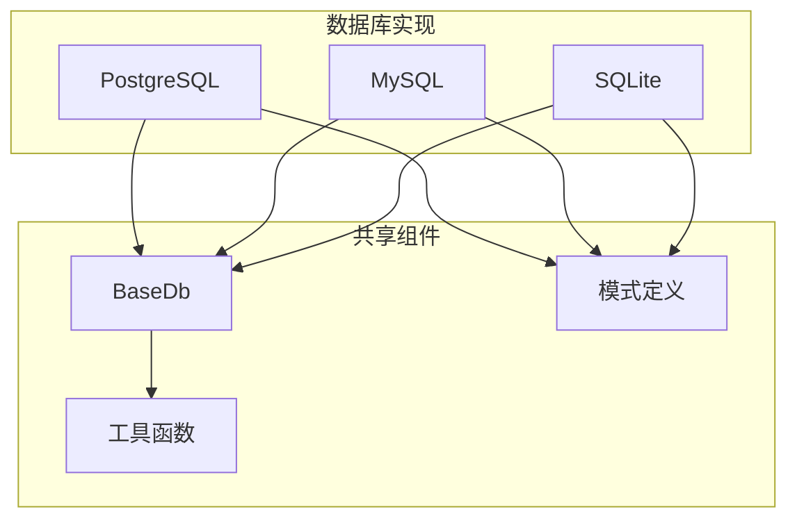
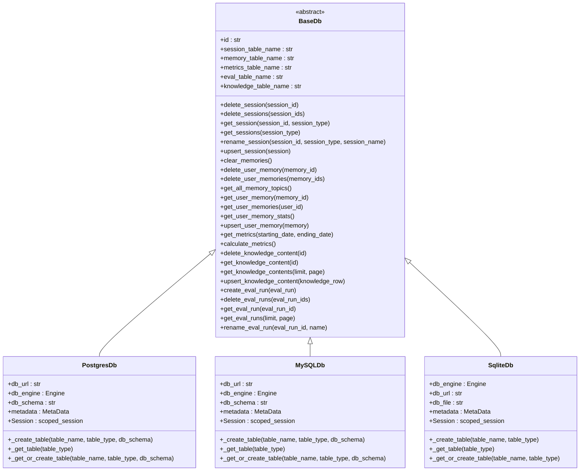
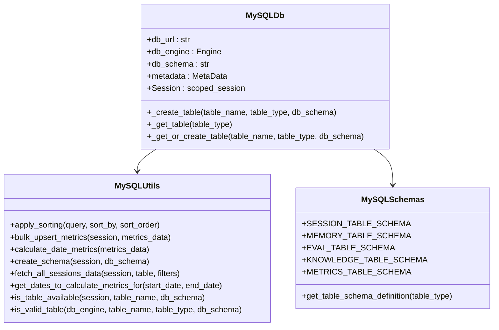
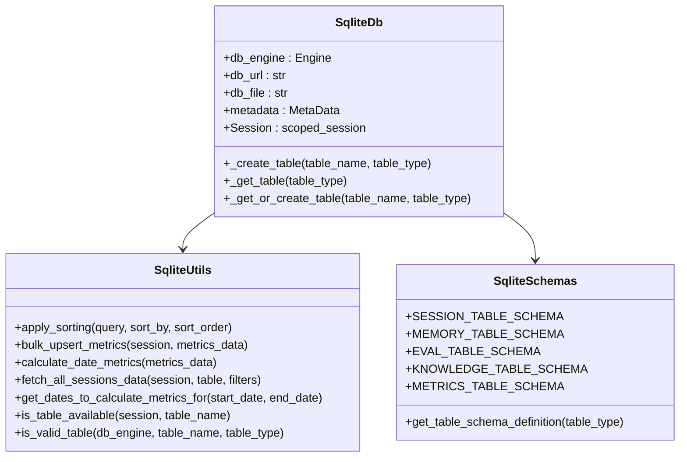
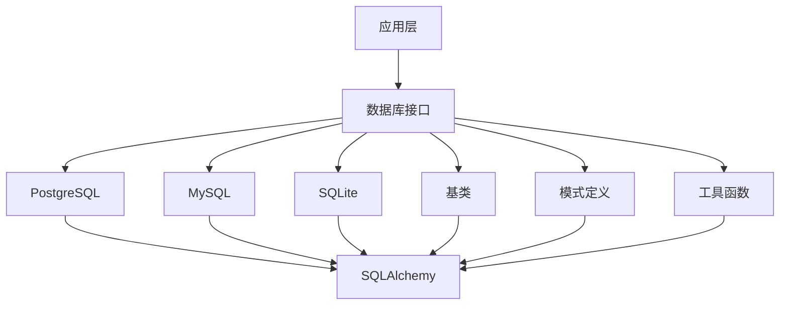

# 关系型数据库集成

<cite>
**本文档中引用的文件**  
- [postgres.py](file://libs/agno/agno/db/postgres/postgres.py)
- [mysql.py](file://libs/agno/agno/db/mysql/mysql.py)
- [sqlite.py](file://libs/agno/agno/db/sqlite/sqlite.py)
- [base.py](file://libs/agno/agno/db/base.py)
- [schemas.py](file://libs/agno/agno/db/postgres/schemas.py)
- [schemas.py](file://libs/agno/agno/db/mysql/schemas.py)
- [schemas.py](file://libs/agno/agno/db/sqlite/schemas.py)
- [postgres_demo.py](file://cookbook/agent_os/dbs/postgres_demo.py)
- [mysql_for_agent.py](file://db/mysql/mysql_for_agent.py)
- [sqlite_for_agent.py](file://db/sqllite/sqlite_for_agent.py)
</cite>

## 目录
1. [简介](#简介)
2. [项目结构](#项目结构)
3. [核心组件](#核心组件)
4. [架构概述](#架构概述)
5. [详细组件分析](#详细组件分析)
6. [依赖分析](#依赖分析)
7. [性能考虑](#性能考虑)
8. [故障排除指南](#故障排除指南)
9. [结论](#结论)

## 简介
Agno 提供了对多种关系型数据库的集成支持，包括 PostgreSQL、MySQL 和 SQLite。这些数据库集成主要用于智能体、团队和工作流中的会话状态持久化、用户记忆存储和结构化数据管理。通过统一的抽象层，Agno 实现了跨数据库的兼容性，同时保留了各数据库的特定优化特性。

## 项目结构
Agno 的数据库集成模块采用分层架构，每个支持的数据库都有独立的实现目录，同时共享通用的基类和模式定义。这种设计既保证了代码的可维护性，又提供了足够的灵活性来适应不同数据库的特性。

**图示来源**
- [base.py](file://libs/agno/agno/db/base.py#L0-L246)
- [postgres.py](file://libs/agno/agno/db/postgres/postgres.py#L0-L1720)
- [mysql.py](file://libs/agno/agno/db/mysql/mysql.py#L0-L1731)
- [sqlite.py](file://libs/agno/agno/db/sqlite/sqlite.py#L0-L1686)

**本节来源**
- [base.py](file://libs/agno/agno/db/base.py#L0-L246)
- [postgres.py](file://libs/agno/agno/db/postgres/postgres.py#L0-L1720)
- [mysql.py](file://libs/agno/agno/db/mysql/mysql.py#L0-L1731)
- [sqlite.py](file://libs/agno/agno/db/sqlite/sqlite.py#L0-L1686)

## 核心组件
关系型数据库集成的核心是 `BaseDb` 抽象基类，它定义了所有数据库实现必须遵循的接口。具体实现包括 `PostgresDb`、`MySQLDb` 和 `SqliteDb`，它们分别针对各自的数据库系统进行了优化。

**本节来源**
- [base.py](file://libs/agno/agno/db/base.py#L0-L246)
- [postgres.py](file://libs/agno/agno/db/postgres/postgres.py#L0-L1720)
- [mysql.py](file://libs/agno/agno/db/mysql/mysql.py#L0-L1731)
- [sqlite.py](file://libs/agno/agno/db/sqlite/sqlite.py#L0-L1686)

## 架构概述
Agno 的数据库集成架构采用抽象工厂模式，通过统一的接口访问不同的数据库系统。这种设计使得应用程序可以无缝切换数据库后端，而无需修改业务逻辑代码。

**图示来源**
- [base.py](file://libs/agno/agno/db/base.py#L0-L246)
- [postgres.py](file://libs/agno/agno/db/postgres/postgres.py#L0-L1720)
- [mysql.py](file://libs/agno/agno/db/mysql/mysql.py#L0-L1731)
- [sqlite.py](file://libs/agno/agno/db/sqlite/sqlite.py#L0-L1686)

## 详细组件分析

### PostgreSQL 集成分析
PostgreSQL 集成提供了完整的功能支持，包括表创建、索引管理、模式管理和数据操作。它利用 PostgreSQL 的 JSON 数据类型来存储复杂的数据结构。

#### 类图

**图示来源**
- [postgres.py](file://libs/agno/agno/db/postgres/postgres.py#L0-L1720)
- [utils.py](file://libs/agno/agno/db/postgres/utils.py#L0-L200)
- [schemas.py](file://libs/agno/agno/db/postgres/schemas.py#L0-L125)

### MySQL 集成分析
MySQL 集成针对 MySQL 数据库的特性进行了优化，包括使用特定的字符串长度限制和索引策略。它同样支持完整的 CRUD 操作和模式管理。

#### 类图

**图示来源**
- [mysql.py](file://libs/agno/agno/db/mysql/mysql.py#L0-L1731)
- [utils.py](file://libs/agno/agno/db/mysql/utils.py#L0-L200)
- [schemas.py](file://libs/agno/agno/db/mysql/schemas.py#L0-L125)

### SQLite 集成分析
SQLite 集成专注于轻量级部署和文件级数据库管理。它支持内存数据库和文件数据库两种模式，适用于开发和测试环境。

#### 类图

**图示来源**
- [sqlite.py](file://libs/agno/agno/db/sqlite/sqlite.py#L0-L1686)
- [utils.py](file://libs/agno/agno/db/sqlite/utils.py#L0-L200)
- [schemas.py](file://libs/agno/agno/db/sqlite/schemas.py#L0-L125)

**本节来源**
- [postgres.py](file://libs/agno/agno/db/postgres/postgres.py#L0-L1720)
- [mysql.py](file://libs/agno/agno/db/mysql/mysql.py#L0-L1731)
- [sqlite.py](file://libs/agno/agno/db/sqlite/sqlite.py#L0-L1686)
- [schemas.py](file://libs/agno/agno/db/postgres/schemas.py#L0-L125)
- [schemas.py](file://libs/agno/agno/db/mysql/schemas.py#L0-L125)
- [schemas.py](file://libs/agno/agno/db/sqlite/schemas.py#L0-L125)

## 依赖分析
关系型数据库集成模块依赖于 SQLAlchemy 作为 ORM 框架，实现了与不同数据库的交互。各数据库实现共享基类和工具函数，同时保持各自的特性和优化。

**图示来源**
- [base.py](file://libs/agno/agno/db/base.py#L0-L246)
- [postgres.py](file://libs/agno/agno/db/postgres/postgres.py#L0-L1720)
- [mysql.py](file://libs/agno/agno/db/mysql/mysql.py#L0-L1731)
- [sqlite.py](file://libs/agno/agno/db/sqlite/sqlite.py#L0-L1686)

**本节来源**
- [base.py](file://libs/agno/agno/db/base.py#L0-L246)
- [postgres.py](file://libs/agno/agno/db/postgres/postgres.py#L0-L1720)
- [mysql.py](file://libs/agno/agno/db/mysql/mysql.py#L0-L1731)
- [sqlite.py](file://libs/agno/agno/db/sqlite/sqlite.py#L0-L1686)

## 性能考虑
在使用关系型数据库集成时，应考虑以下性能优化建议：
- 为常用查询字段创建索引
- 合理设置连接池大小
- 使用批量操作减少数据库往返次数
- 定期清理过期数据以保持数据库性能

## 故障排除指南
当遇到数据库连接问题时，应检查以下方面：
- 数据库URL配置是否正确
- 数据库服务是否正常运行
- 网络连接是否畅通
- 认证信息是否正确

**本节来源**
- [postgres.py](file://libs/agno/agno/db/postgres/postgres.py#L0-L1720)
- [mysql.py](file://libs/agno/agno/db/mysql/mysql.py#L0-L1731)
- [sqlite.py](file://libs/agno/agno/db/sqlite/sqlite.py#L0-L1686)

## 结论
Agno 的关系型数据库集成提供了对 PostgreSQL、MySQL 和 SQLite 的全面支持，通过统一的接口和灵活的配置，满足了不同场景下的数据持久化需求。开发者可以根据具体需求选择合适的数据库后端，并利用提供的最佳实践来优化性能和可靠性。