# 数据库集成

<cite>
**本文档中引用的文件**  
- [postgres.py](file://libs/agno/agno/db/postgres/postgres.py)
- [mongo.py](file://libs/agno/agno/db/mongo/mongo.py)
- [redis.py](file://libs/agno/agno/db/redis/redis.py)
- [dynamo.py](file://libs/agno/agno/db/dynamo/dynamo.py)
- [firestore.py](file://libs/agno/agno/db/firestore/firestore.py)
- [sqlite.py](file://libs/agno/agno/db/sqlite/sqlite.py)
- [mysql.py](file://libs/agno/agno/db/mysql/mysql.py)
- [singlestore.py](file://libs/agno/agno/db/singlestore/singlestore.py)
- [db_app.py](file://libs/agno_infra/agno/base/db_app.py)
- [README.md](file://cookbook/db/README.md)
</cite>

## 目录
1. [简介](#简介)
2. [项目结构](#项目结构)
3. [核心组件](#核心组件)
4. [架构概述](#架构概述)
5. [详细组件分析](#详细组件分析)
6. [依赖分析](#依赖分析)
7. [性能考虑](#性能考虑)
8. [故障排除指南](#故障排除指南)
9. [结论](#结论)

## 简介
Agno 是一个支持多种数据库系统的智能体框架，允许开发者在智能体、团队和工作流中使用不同的数据库进行状态持久化、会话存储和知识管理。本文档详细阐述了 Agno 如何集成关系型数据库（如 PostgreSQL、MySQL、SQLite）和 NoSQL 数据库（如 MongoDB、Redis、DynamoDB、Firestore），并提供配置方法、连接参数、最佳实践以及性能调优建议。

## 项目结构
Agno 的数据库集成功能主要分布在 `libs/agno/agno/db` 目录下，每个数据库类型都有独立的适配器实现。此外，`cookbook/db` 目录提供了各种数据库集成的示例代码。

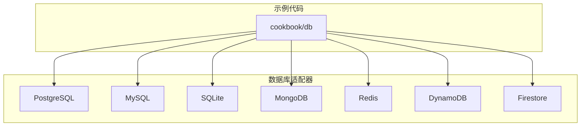

**图表来源**  
- [postgres.py](file://libs/agno/agno/db/postgres/postgres.py)
- [mongo.py](file://libs/agno/agno/db/mongo/mongo.py)
- [redis.py](file://libs/agno/agno/db/redis/redis.py)
- [dynamo.py](file://libs/agno/agno/db/dynamo/dynamo.py)
- [firestore.py](file://libs/agno/agno/db/firestore/firestore.py)
- [sqlite.py](file://libs/agno/agno/db/sqlite/sqlite.py)
- [mysql.py](file://libs/agno/agno/db/mysql/mysql.py)
- [singlestore.py](file://libs/agno/agno/db/singlestore/singlestore.py)

**章节来源**  
- [README.md](file://cookbook/db/README.md)

## 核心组件
Agno 的数据库集成基于统一的 `BaseDb` 接口，所有数据库适配器都继承自该接口。每个适配器负责处理特定数据库的连接、会话管理、内存存储和知识管理。

**章节来源**  
- [postgres.py](file://libs/agno/agno/db/postgres/postgres.py)
- [mongo.py](file://libs/agno/agno/db/mongo/mongo.py)
- [redis.py](file://libs/agno/agno/db/redis/redis.py)

## 架构概述
Agno 的数据库架构采用分层设计，上层为智能体、团队和工作流提供统一的数据库接口，底层为各个数据库适配器实现具体的数据库操作。

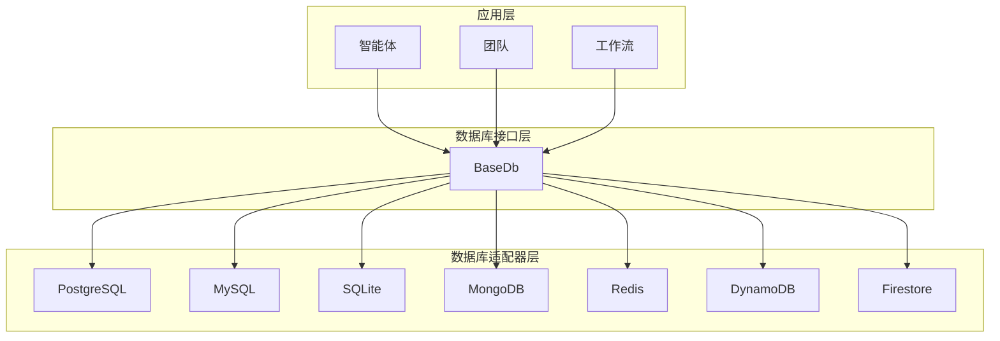

**图表来源**  
- [postgres.py](file://libs/agno/agno/db/postgres/postgres.py)
- [mongo.py](file://libs/agno/agno/db/mongo/mongo.py)
- [redis.py](file://libs/agno/agno/db/redis/redis.py)
- [dynamo.py](file://libs/agno/agno/db/dynamo/dynamo.py)
- [firestore.py](file://libs/agno/agno/db/firestore/firestore.py)
- [sqlite.py](file://libs/agno/agno/db/sqlite/sqlite.py)
- [mysql.py](file://libs/agno/agno/db/mysql/mysql.py)
- [singlestore.py](file://libs/agno/agno/db/singlestore/singlestore.py)

## 详细组件分析
### PostgreSQL 分析
PostgreSQL 适配器使用 SQLAlchemy 作为 ORM 工具，支持复杂的查询和事务处理。

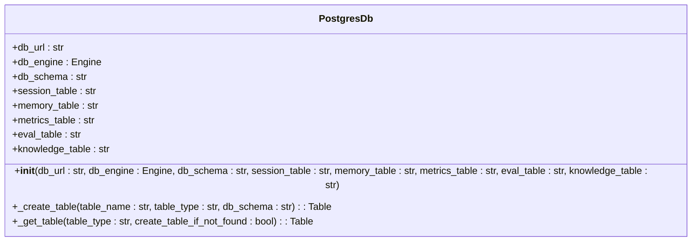

**图表来源**  
- [postgres.py](file://libs/agno/agno/db/postgres/postgres.py)

**章节来源**  
- [postgres.py](file://libs/agno/agno/db/postgres/postgres.py)

### MongoDB 分析
MongoDB 适配器使用 PyMongo 作为驱动程序，支持灵活的文档存储和查询。

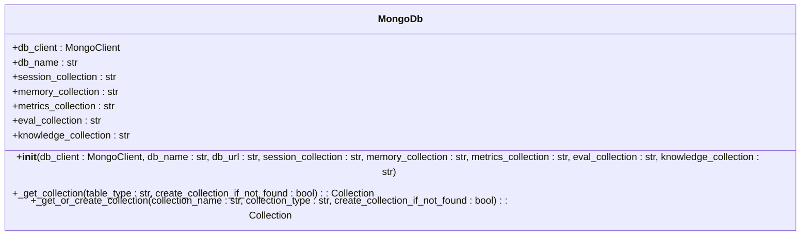

**图表来源**  
- [mongo.py](file://libs/agno/agno/db/mongo/mongo.py)

**章节来源**  
- [mongo.py](file://libs/agno/agno/db/mongo/mongo.py)

### Redis 分析
Redis 适配器使用 Redis-py 作为客户端，支持高速缓存和会话存储。

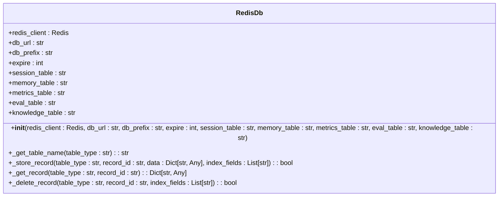

**图表来源**  
- [redis.py](file://libs/agno/agno/db/redis/redis.py)

**章节来源**  
- [redis.py](file://libs/agno/agno/db/redis/redis.py)

### DynamoDB 分析
DynamoDB 适配器使用 Boto3 作为 AWS SDK，支持高可用性和可扩展性的 NoSQL 存储。

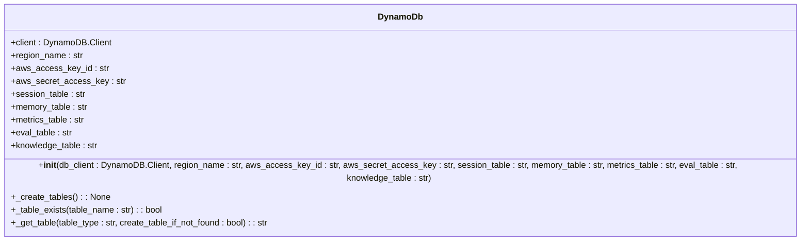

**图表来源**  
- [dynamo.py](file://libs/agno/agno/db/dynamo/dynamo.py)

**章节来源**  
- [dynamo.py](file://libs/agno/agno/db/dynamo/dynamo.py)

### Firestore 分析
Firestore 适配器使用 Google Cloud Firestore 客户端库，支持实时数据同步和灵活的查询。

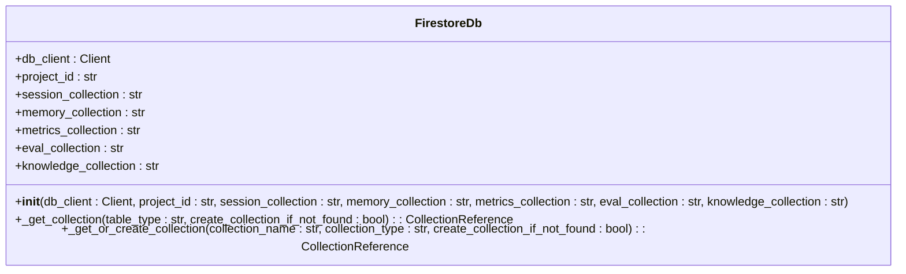

**图表来源**  
- [firestore.py](file://libs/agno/agno/db/firestore/firestore.py)

**章节来源**  
- [firestore.py](file://libs/agno/agno/db/firestore/firestore.py)

### SQLite 分析
SQLite 适配器使用 SQLAlchemy 作为 ORM 工具，支持轻量级的文件数据库。

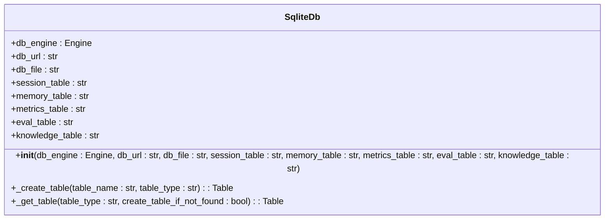

**图表来源**  
- [sqlite.py](file://libs/agno/agno/db/sqlite/sqlite.py)

**章节来源**  
- [sqlite.py](file://libs/agno/agno/db/sqlite/sqlite.py)

### MySQL 分析
MySQL 适配器使用 SQLAlchemy 作为 ORM 工具，支持标准的 SQL 查询和事务处理。

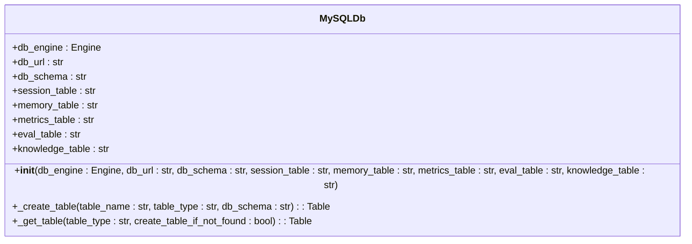

**图表来源**  
- [mysql.py](file://libs/agno/agno/db/mysql/mysql.py)

**章节来源**  
- [mysql.py](file://libs/agno/agno/db/mysql/mysql.py)

### SingleStore 分析
SingleStore 适配器使用 SQLAlchemy 作为 ORM 工具，支持高性能的分布式 SQL 数据库。

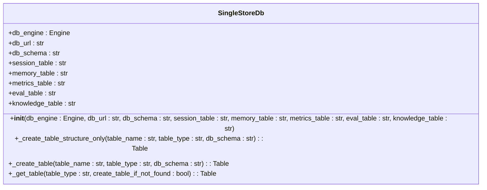

**图表来源**  
- [singlestore.py](file://libs/agno/agno/db/singlestore/singlestore.py)

**章节来源**  
- [singlestore.py](file://libs/agno/agno/db/singlestore/singlestore.py)

## 依赖分析
Agno 的数据库适配器依赖于相应的数据库驱动程序，这些驱动程序通过 pip 安装。

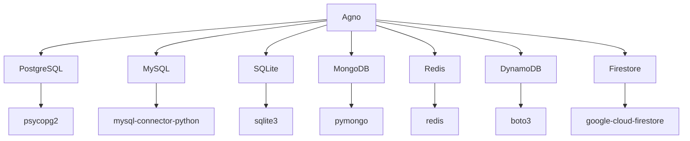

**图表来源**  
- [README.md](file://cookbook/db/README.md)

**章节来源**  
- [README.md](file://cookbook/db/README.md)

## 性能考虑
选择合适的数据库对于性能至关重要。PostgreSQL 和 MySQL 适合需要复杂查询和事务处理的场景；MongoDB 和 Redis 适合需要高吞吐量和低延迟的场景；DynamoDB 和 Firestore 适合需要高可用性和可扩展性的场景。

## 故障排除指南
如果遇到数据库连接问题，请检查数据库 URL、用户名、密码和端口是否正确。如果遇到性能问题，请检查数据库索引和查询优化。

**章节来源**  
- [postgres.py](file://libs/agno/agno/db/postgres/postgres.py)
- [mongo.py](file://libs/agno/agno/db/mongo/mongo.py)
- [redis.py](file://libs/agno/agno/db/redis/redis.py)
- [dynamo.py](file://libs/agno/agno/db/dynamo/dynamo.py)
- [firestore.py](file://libs/agno/agno/db/firestore/firestore.py)
- [sqlite.py](file://libs/agno/agno/db/sqlite/sqlite.py)
- [mysql.py](file://libs/agno/agno/db/mysql/mysql.py)
- [singlestore.py](file://libs/agno/agno/db/singlestore/singlestore.py)

## 结论
Agno 提供了丰富的数据库集成选项，开发者可以根据具体需求选择合适的数据库系统。通过统一的接口和灵活的配置，Agno 能够轻松地与各种数据库进行集成，实现高效的状态持久化、会话存储和知识管理。