# 记忆系统集成

<cite>
**本文档中引用的文件**
- [mem0_integration.py](file://cookbook/integrations/memory/mem0_integration.py)
- [zep_integration.py](file://cookbook/integrations/memory/zep_integration.py)
- [zep.py](file://libs/agno/agno/tools/zep.py)
- [mem0.py](file://libs/agno/agno/tools/mem0.py)
- [manager.py](file://libs/agno/agno/memory/manager.py)
- [base.py](file://libs/agno/agno/db/base.py)
- [01_agent_with_memory.py](file://cookbook/memory/01_agent_with_memory.py)
- [02_agentic_memory.py](file://cookbook/memory/02_agentic_memory.py)
</cite>

## 目录
1. [引言](#引言)
2. [记忆系统架构](#记忆系统架构)
3. [核心组件分析](#核心组件分析)
4. [Mem0集成](#mem0集成)
5. [Zep集成](#zep集成)
6. [记忆生命周期管理](#记忆生命周期管理)
7. [记忆存储与检索](#记忆存储与检索)
8. [隐私保护机制](#隐私保护机制)
9. [高级话题](#高级话题)
10. [结论](#结论)

## 引言
Agno平台提供了一套完整的记忆系统集成方案，支持与外部记忆管理服务如Mem0和Zep的无缝集成。本文档详细阐述了如何在智能体对话中利用长期记忆实现个性化交互，包括用户记忆的存储、检索和上下文注入等关键功能。通过代码示例展示了记忆数据的结构化存储方式、语义搜索能力以及隐私保护机制，帮助开发者构建具有持续学习能力的智能体应用。

## 记忆系统架构
Agno的记忆系统采用分层架构设计，将记忆管理功能与智能体核心逻辑分离，实现了灵活的可扩展性。系统通过工具包（Toolkit）机制与外部记忆平台集成，支持多种记忆存储后端。

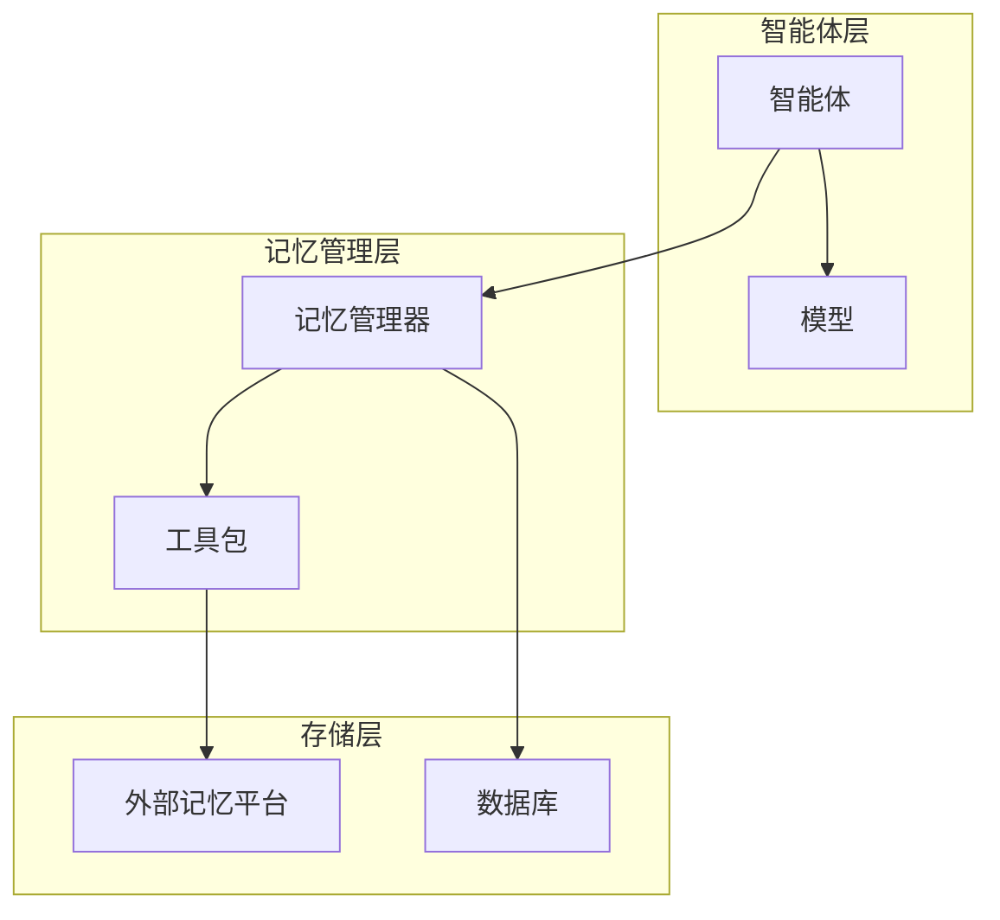

**图示来源**
- [manager.py](file://libs/agno/agno/memory/manager.py#L1-L1074)
- [zep.py](file://libs/agno/agno/tools/zep.py#L1-L455)

## 核心组件分析

### 记忆管理器
记忆管理器是Agno记忆系统的核心组件，负责协调记忆的创建、更新、删除和检索操作。它通过抽象接口与不同的记忆存储后端通信，确保了系统的灵活性和可扩展性。

**组件功能**
- 记忆生命周期管理
- 记忆检索策略实现
- 数据库操作抽象
- 用户记忆上下文注入

**组件关系**
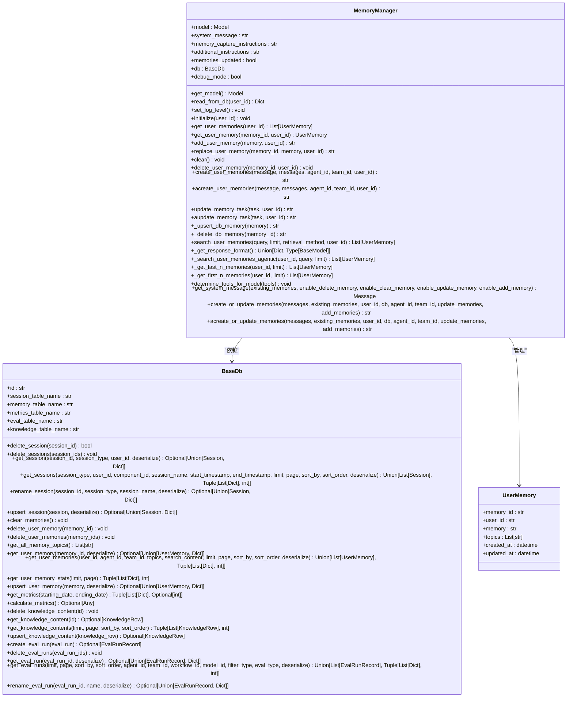

**图示来源**
- [manager.py](file://libs/agno/agno/memory/manager.py#L1-L1074)
- [base.py](file://libs/agno/agno/db/base.py#L1-L246)

**本节来源**
- [manager.py](file://libs/agno/agno/memory/manager.py#L1-L1074)
- [base.py](file://libs/agno/agno/db/base.py#L1-L246)

## Mem0集成

### Mem0工具包
Mem0工具包提供了与Mem0记忆平台的集成接口，支持记忆的添加、搜索、获取和删除操作。工具包通过API密钥进行身份验证，并支持多种配置选项。

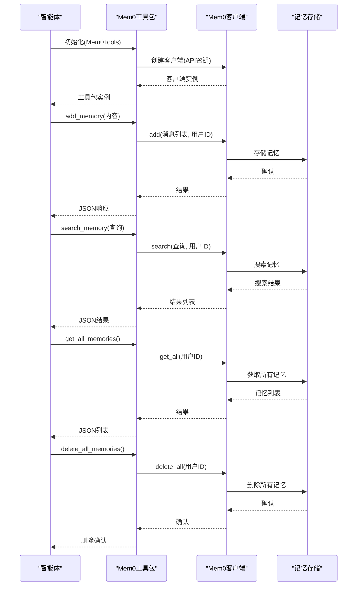

**图示来源**
- [mem0.py](file://libs/agno/agno/tools/mem0.py#L1-L194)
- [mem0_integration.py](file://cookbook/integrations/memory/mem0_integration.py#L1-L34)

### Mem0集成示例
以下示例展示了如何在Agno智能体中集成Mem0记忆系统：

```python
from agno.agent import Agent
from agno.models.openai import OpenAIChat
from agno.utils.pprint import pprint_run_response
from mem0 import MemoryClient

# 初始化Mem0客户端
client = MemoryClient()

# 设置用户ID
user_id = "agno"

# 添加用户记忆
messages = [
    {"role": "user", "content": "My name is John Billings."},
    {"role": "user", "content": "I live in NYC."},
    {"role": "user", "content": "I'm going to a concert tomorrow."},
]
client.add(messages, user_id=user_id)

# 创建智能体并注入记忆
agent = Agent(
    model=OpenAIChat(),
    dependencies={"memory": client.get_all(user_id=user_id)},
    add_dependencies_to_context=True,
)

# 查询用户记忆
run = agent.run("What do you know about me?")
pprint_run_response(run)

# 更新记忆
input = [{"role": i.role, "content": str(i.content)} for i in (run.messages or [])]
client.add(messages, user_id=user_id)
```

**本节来源**
- [mem0_integration.py](file://cookbook/integrations/memory/mem0_integration.py#L1-L34)
- [mem0.py](file://libs/agno/agno/tools/mem0.py#L1-L194)

## Zep集成

### Zep工具包
Zep工具包提供了与Zep记忆平台的同步和异步集成接口，支持会话管理、记忆添加、记忆检索和语义搜索等功能。工具包通过API密钥进行身份验证，并支持会话和用户ID的自动管理。

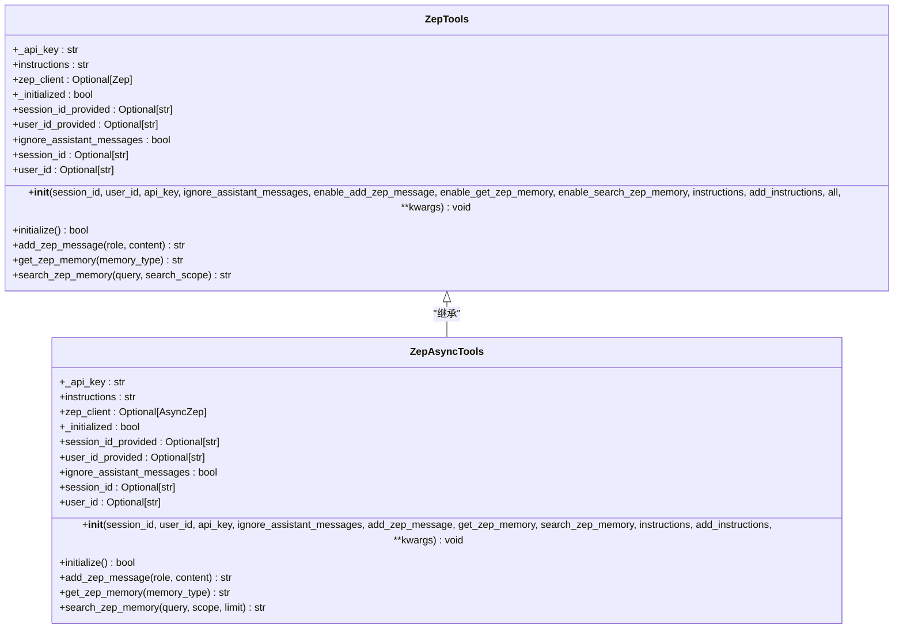

**图示来源**
- [zep.py](file://libs/agno/agno/tools/zep.py#L1-L455)

### Zep集成示例
以下示例展示了如何在Agno智能体中集成Zep记忆系统：

```python
import time
from agno.agent import Agent
from agno.models.openai import OpenAIChat
from agno.tools.zep import ZepTools

# 初始化Zep工具
zep_tools = ZepTools(user_id="agno", session_id="agno-session")

# 添加用户记忆
zep_tools.add_zep_message(role="user", content="My name is John Billings")
zep_tools.add_zep_message(role="user", content="I live in NYC")
zep_tools.add_zep_message(role="user", content="I'm going to a concert tomorrow")

# 等待记忆同步
time.sleep(10)

# 创建智能体并注入记忆
agent = Agent(
    model=OpenAIChat(),
    tools=[zep_tools],
    dependencies={"memory": zep_tools.get_zep_memory(memory_type="context")},
    add_dependencies_to_context=True,
)

# 查询用户记忆
agent.print_response("What do you know about me?")
```

**本节来源**
- [zep_integration.py](file://cookbook/integrations/memory/zep_integration.py#L1-L27)
- [zep.py](file://libs/agno/agno/tools/zep.py#L1-L455)

## 记忆生命周期管理

### 记忆创建与更新
Agno的记忆系统支持自动和手动两种记忆创建方式。自动记忆创建通过智能体的对话内容分析实现，而手动记忆创建则通过工具调用完成。

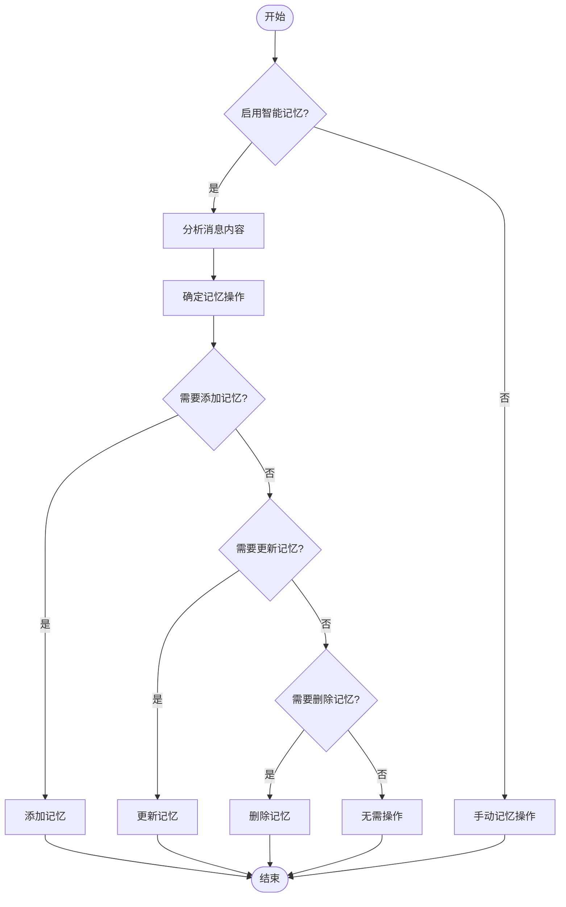

**图示来源**
- [manager.py](file://libs/agno/agno/memory/manager.py#L1-L1074)
- [02_agentic_memory.py](file://cookbook/memory/02_agentic_memory.py#L1-L67)

### 记忆压缩与优化
Agno的记忆系统实现了记忆压缩机制，通过合并相似记忆和删除过时记忆来优化存储效率。系统还支持记忆检索优化，提高查询性能。

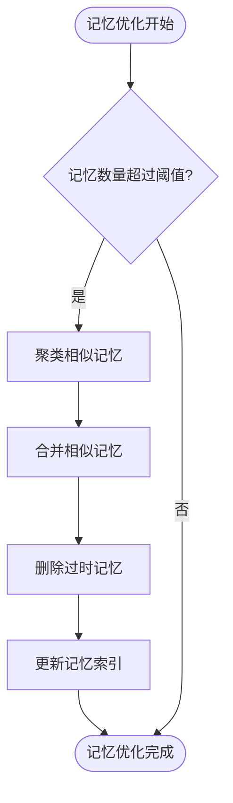

**图示来源**
- [manager.py](file://libs/agno/agno/memory/manager.py#L1-L1074)

**本节来源**
- [manager.py](file://libs/agno/agno/memory/manager.py#L1-L1074)
- [02_agentic_memory.py](file://cookbook/memory/02_agentic_memory.py#L1-L67)

## 记忆存储与检索

### 记忆存储结构
Agno的记忆数据采用结构化存储方式，每个记忆记录包含唯一ID、用户ID、记忆内容、主题标签和时间戳等字段。这种设计支持高效的查询和索引操作。

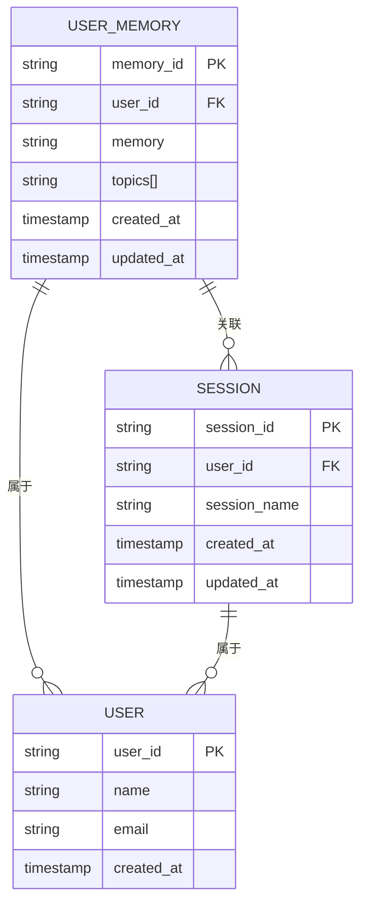

**图示来源**
- [base.py](file://libs/agno/agno/db/base.py#L1-L246)
- [manager.py](file://libs/agno/agno/memory/manager.py#L1-L1074)

### 记忆检索策略
Agno支持多种记忆检索策略，包括最近N条记忆、最旧N条记忆和智能语义搜索。这些策略可以根据应用场景灵活选择。

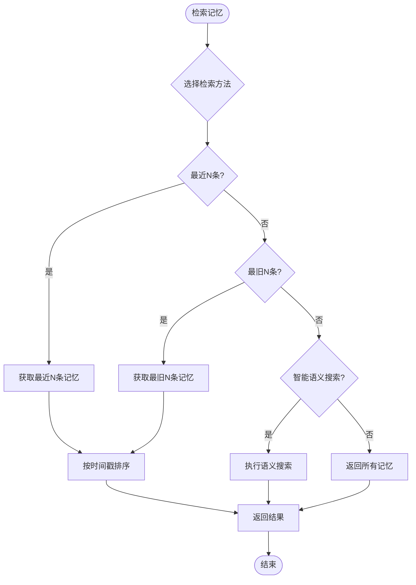

**图示来源**
- [manager.py](file://libs/agno/agno/memory/manager.py#L1-L1074)

**本节来源**
- [manager.py](file://libs/agno/agno/memory/manager.py#L1-L1074)
- [base.py](file://libs/agno/agno/db/base.py#L1-L246)

## 隐私保护机制
Agno的记忆系统实现了多层次的隐私保护机制，确保用户数据的安全性和合规性。系统支持记忆的加密存储、访问控制和数据删除功能。

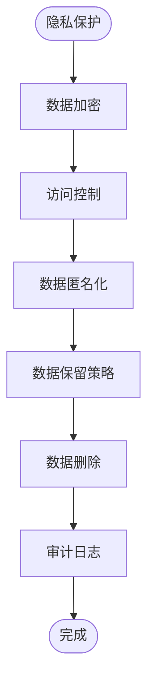

**本节来源**
- [manager.py](file://libs/agno/agno/memory/manager.py#L1-L1074)
- [base.py](file://libs/agno/agno/db/base.py#L1-L246)

## 高级话题

### 记忆上下文注入
Agno支持将用户记忆作为上下文注入到智能体的对话中，实现个性化的交互体验。系统通过依赖注入机制将记忆数据传递给智能体。

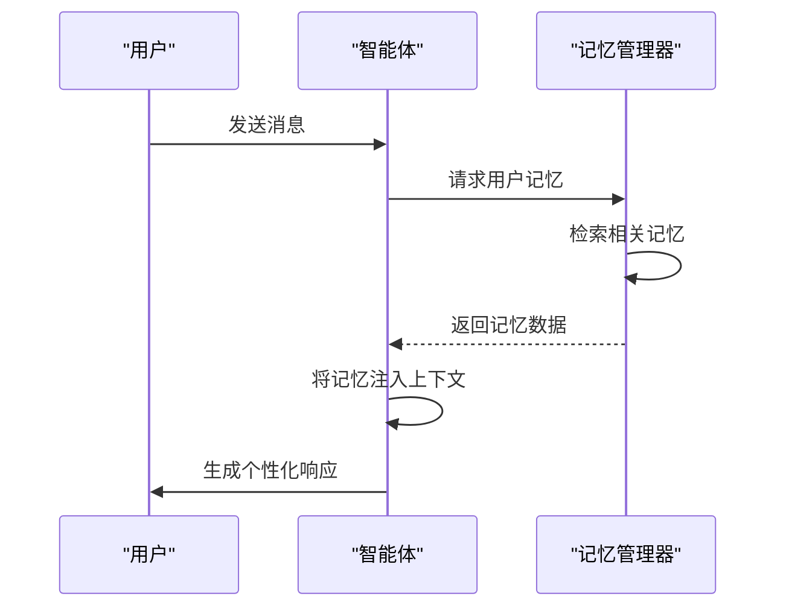

**图示来源**
- [01_agent_with_memory.py](file://cookbook/memory/01_agent_with_memory.py#L1-L57)
- [manager.py](file://libs/agno/agno/memory/manager.py#L1-L1074)

### 多用户多会话管理
Agno的记忆系统支持多用户多会话场景，能够为不同用户和会话维护独立的记忆空间。系统通过用户ID和会话ID进行记忆隔离。

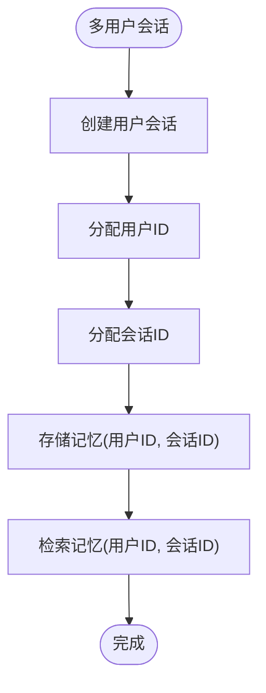

**图示来源**
- [05_multi_user_multi_session_chat.py](file://cookbook/memory/05_multi_user_multi_session_chat.py)
- [manager.py](file://libs/agno/agno/memory/manager.py#L1-L1074)

**本节来源**
- [01_agent_with_memory.py](file://cookbook/memory/01_agent_with_memory.py#L1-L57)
- [05_multi_user_multi_session_chat.py](file://cookbook/memory/05_multi_user_multi_session_chat.py)
- [manager.py](file://libs/agno/agno/memory/manager.py#L1-L1074)

## 结论
Agno的记忆系统集成方案为开发者提供了强大的长期记忆管理能力，支持与Mem0和Zep等外部记忆平台的无缝集成。通过结构化的记忆存储、智能的检索策略和完善的隐私保护机制，开发者可以构建具有持续学习能力的智能体应用。系统的设计注重灵活性和可扩展性，能够适应各种应用场景的需求。