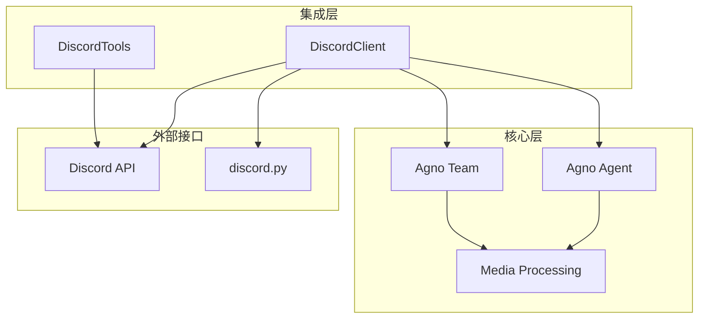
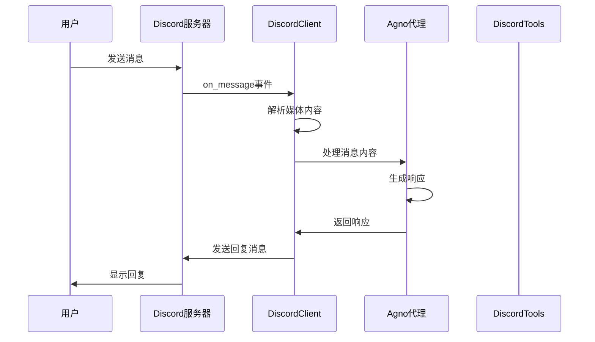
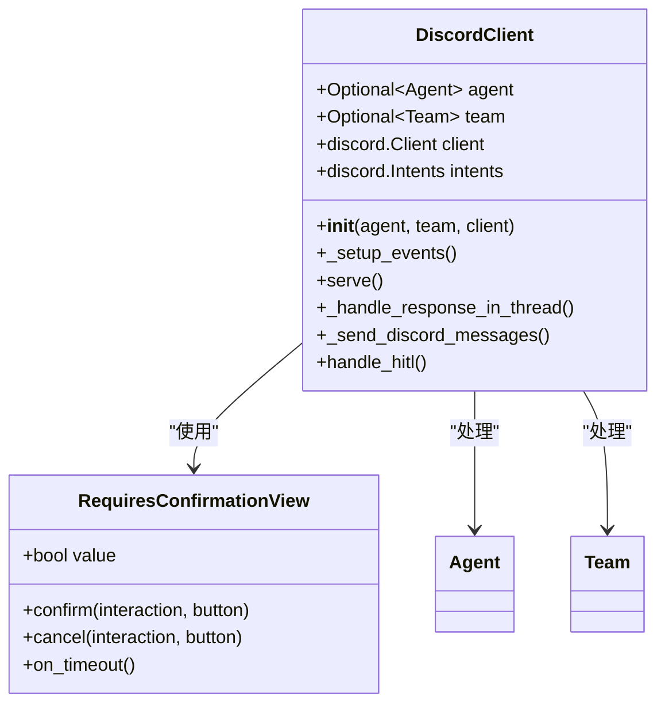
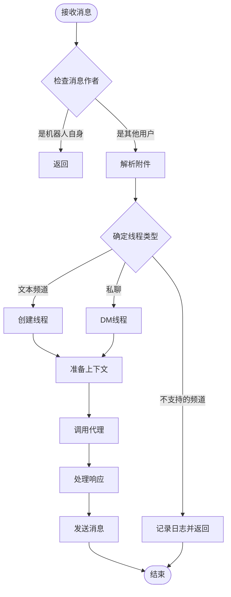
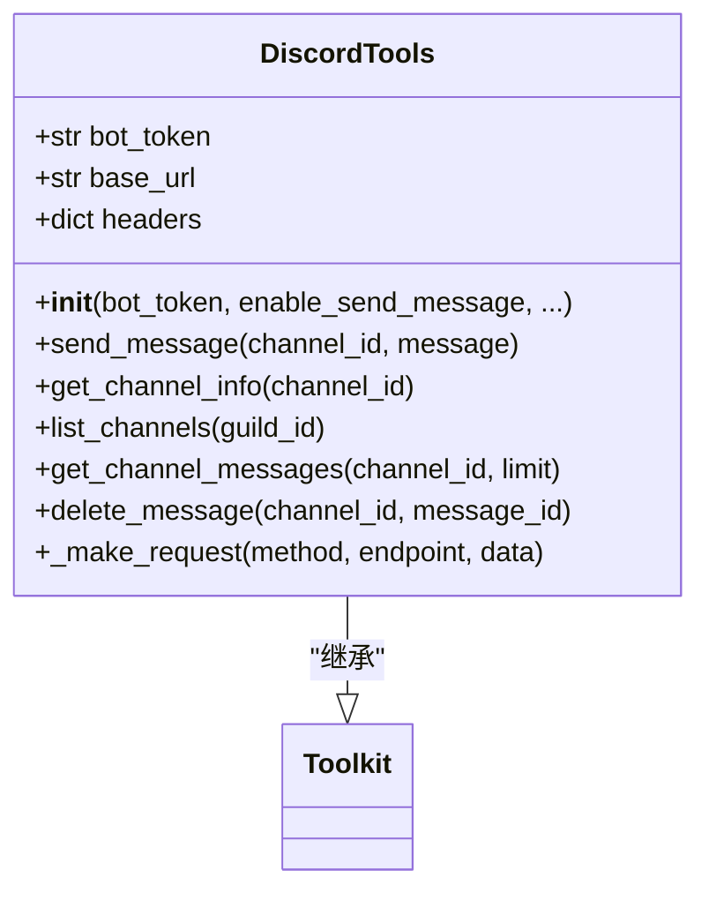
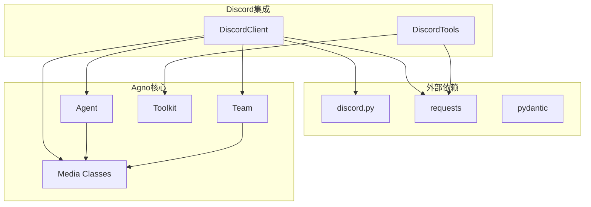

# Discord集成

<cite>
**本文档中引用的文件**
- [README.md](file://cookbook/integrations/discord/README.md)
- [basic.py](file://cookbook/integrations/discord/basic.py)
- [agent_with_media.py](file://cookbook/integrations/discord/agent_with_media.py)
- [agent_with_user_memory.py](file://cookbook/integrations/discord/agent_with_user_memory.py)
- [client.py](file://libs/agno/agno/integrations/discord/client.py)
- [discord.py](file://libs/agno/agno/tools/discord.py)
- [discord_tools.py](file://cookbook/tools/discord_tools.py)
</cite>

## 目录
1. [简介](#简介)
2. [项目结构](#项目结构)
3. [核心组件](#核心组件)
4. [架构概览](#架构概览)
5. [详细组件分析](#详细组件分析)
6. [依赖关系分析](#依赖关系分析)
7. [性能考虑](#性能考虑)
8. [故障排除指南](#故障排除指南)
9. [结论](#结论)

## 简介

Agno的Discord集成模块为开发者提供了一个强大的平台，用于创建AI驱动的Discord机器人。该模块无缝集成了Agno的智能代理框架，使开发者能够构建功能丰富、响应迅速的Discord智能体应用。

通过Discord集成，开发者可以：
- 创建具有多模态能力的AI助手
- 实现复杂的对话管理逻辑
- 处理媒体内容（图像、音频、视频）
- 维护用户会话状态和记忆
- 执行各种Discord API操作

## 项目结构

Discord集成模块采用分层架构设计，包含以下关键组件：



**图表来源**
- [client.py](file://libs/agno/agno/integrations/discord/client.py#L48-L80)
- [discord.py](file://libs/agno/agno/tools/discord.py#L13-L33)

**章节来源**
- [README.md](file://cookbook/integrations/discord/README.md#L1-L90)

## 核心组件

### DiscordClient类

`DiscordClient`是Discord集成的核心类，负责处理所有与Discord服务器的交互。它提供了完整的事件处理机制和消息路由功能。

主要特性：
- 自动消息处理和响应
- 多模态媒体支持（图像、音频、视频、文件）
- 线程和直接消息支持
- 人类在环交互（Human-in-the-loop）
- 消息批处理和格式化

### DiscordTools工具包

`DiscordTools`提供了对Discord API的直接访问，允许代理执行各种Discord操作。

支持的操作：
- 发送消息到频道
- 获取频道信息
- 列出服务器频道
- 获取消息历史
- 删除消息

**章节来源**
- [client.py](file://libs/agno/agno/integrations/discord/client.py#L48-L80)
- [discord.py](file://libs/agno/agno/tools/discord.py#L13-L33)

## 架构概览

Discord集成采用事件驱动架构，通过discord.py库与Discord服务器建立连接：



**图表来源**
- [client.py](file://libs/agno/agno/integrations/discord/client.py#L58-L108)

## 详细组件分析

### DiscordClient实现分析

#### 初始化和事件设置



**图表来源**
- [client.py](file://libs/agno/agno/integrations/discord/client.py#L48-L80)
- [client.py](file://libs/agno/agno/integrations/discord/client.py#L18-L46)

#### 消息处理流程

DiscordClient的消息处理遵循以下流程：



**图表来源**
- [client.py](file://libs/agno/agno/integrations/discord/client.py#L58-L108)

#### 多模态媒体处理

DiscordClient支持多种媒体类型的自动检测和处理：

```python
# 媒体类型检测和处理
if media_type.startswith("image/"):
    message_image = media_url
elif media_type.startswith("video/"):
    req = requests.get(media_url)
    video = req.content
    message_video = video
elif media_type.startswith("application/"):
    req = requests.get(media_url)
    document = req.content
    message_file = document
elif media_type.startswith("audio/"):
    message_audio = media_url
```

**章节来源**
- [client.py](file://libs/agno/agno/integrations/discord/client.py#L82-L108)

### DiscordTools分析

#### 工具配置和初始化



**图表来源**
- [discord.py](file://libs/agno/agno/tools/discord.py#L13-L33)

#### API操作实现

每个Discord API操作都经过精心设计，确保错误处理和响应格式的一致性：

```python
def send_message(self, channel_id: str, message: str) -> str:
    try:
        data = {"content": message}
        self._make_request("POST", f"/channels/{channel_id}/messages", data)
        return f"Message sent successfully to channel {channel_id}"
    except Exception as e:
        logger.error(f"Error sending message: {e}")
        return f"Error sending message: {str(e)}"
```

**章节来源**
- [discord.py](file://libs/agno/agno/tools/discord.py#L44-L62)

### 示例应用分析

#### 基础代理示例

基础代理展示了最简单的Discord集成配置：

```python
basic_agent = Agent(
    name="Basic Agent",
    model=OpenAIChat(id="gpt-4o"),
    add_history_to_context=True,
    num_history_runs=3,
    add_datetime_to_context=True,
)
```

#### 媒体处理代理示例

媒体处理代理专门用于处理各种媒体内容：

```python
media_agent = Agent(
    name="Media Agent",
    model=Gemini(id="gemini-2.0-flash"),
    description="A Media processing agent",
    instructions="Analyze images, audios and videos sent by the user",
    add_history_to_context=True,
    num_history_runs=3,
    add_datetime_to_context=True,
    markdown=True,
)
```

#### 用户记忆代理示例

用户记忆代理展示了高级功能的组合使用：

```python
personal_agent = Agent(
    name="Basic Agent",
    model=Gemini(id="gemini-2.0-flash"),
    tools=[GoogleSearchTools()],
    add_history_to_context=True,
    num_history_runs=3,
    add_datetime_to_context=True,
    markdown=True,
    db=db,
    enable_agentic_memory=True,
    instructions=dedent("""
        You are a personal AI friend of the user...
    """),
    debug_mode=True,
)
```

**章节来源**
- [basic.py](file://cookbook/integrations/discord/basic.py#L1-L17)
- [agent_with_media.py](file://cookbook/integrations/discord/agent_with_media.py#L1-L20)
- [agent_with_user_memory.py](file://cookbook/integrations/discord/agent_with_user_memory.py#L1-L33)

## 依赖关系分析

Discord集成模块的依赖关系图如下：



**图表来源**
- [client.py](file://libs/agno/agno/integrations/discord/client.py#L1-L15)
- [discord.py](file://libs/agno/agno/tools/discord.py#L1-L10)

**章节来源**
- [client.py](file://libs/agno/agno/integrations/discord/client.py#L1-L15)
- [discord.py](file://libs/agno/agno/tools/discord.py#L1-L10)

## 性能考虑

### 消息处理优化

DiscordClient实现了多种性能优化策略：

1. **消息批处理**：当消息长度超过1500字符时，自动分割为多个批次
2. **异步处理**：所有网络请求和消息发送都是异步的
3. **媒体缓存**：对下载的媒体内容进行适当的缓存处理
4. **线程管理**：自动为每个用户创建独立的线程以避免消息混乱

### 并发处理

```python
async def _send_discord_messages(self, thread: discord.channel, message: str, italics: bool = False):
    if len(message) < 1500:
        # 单条消息发送
        await thread.send(message)
        return
    
    # 分批发送长消息
    message_batches = [message[i : i + 1500] for i in range(0, len(message), 1500)]
    for i, batch in enumerate(message_batches, 1):
        batch_message = f"[{i}/{len(message_batches)}] {batch}"
        await thread.send(batch_message)
```

### 错误处理和重试机制

- 自动重试失败的API请求
- 完善的日志记录系统
- 超时处理和优雅降级
- 网络异常的容错处理

## 故障排除指南

### 常见问题和解决方案

#### 1. 认证问题

**问题**：`DISCORD_BOT_TOKEN NOT SET`

**解决方案**：
```bash
# 设置环境变量
export DISCORD_BOT_TOKEN=your_bot_token_here

# 或者在.envrc文件中添加
echo "DISCORD_BOT_TOKEN=your_bot_token_here" >> .envrc
```

#### 2. 权限配置问题

**问题**：Bot无法发送消息或获取信息

**解决方案**：
- 在Discord开发者门户中启用必要的网关意图
- 确保Bot具有正确的权限
- 检查服务器成员权限设置

#### 3. 网络连接问题

**问题**：连接超时或网络错误

**解决方案**：
- 检查防火墙设置
- 验证网络连接稳定性
- 使用代理服务器（如果需要）

#### 4. 内存使用过高

**问题**：长时间运行后内存占用增加

**解决方案**：
- 定期清理会话数据
- 限制历史消息数量
- 使用数据库存储长期会话

**章节来源**
- [README.md](file://cookbook/integrations/discord/README.md#L25-L41)

## 结论

Agno的Discord集成模块为开发者提供了一个功能强大且易于使用的平台，用于构建AI驱动的Discord机器人。通过其模块化的架构设计、完善的错误处理机制和丰富的功能特性，开发者可以快速创建出具有多模态能力、智能对话管理和复杂业务逻辑的Discord智能体应用。

主要优势包括：
- 无缝集成Agno的智能代理框架
- 完整的Discord API支持
- 多模态媒体处理能力
- 灵活的权限控制机制
- 高性能的并发处理能力
- 完善的开发文档和支持

随着Discord生态系统的不断发展，这个集成模块将继续演进，为开发者提供更多创新的可能性。