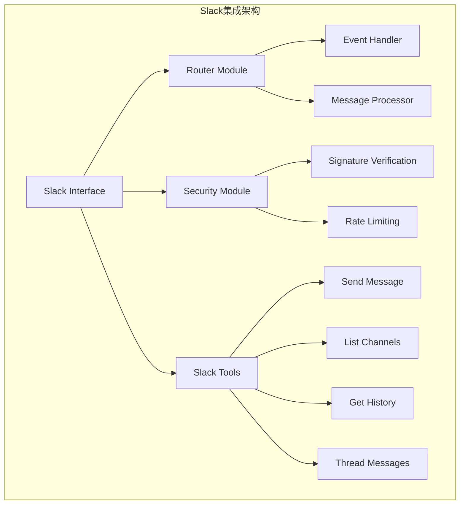
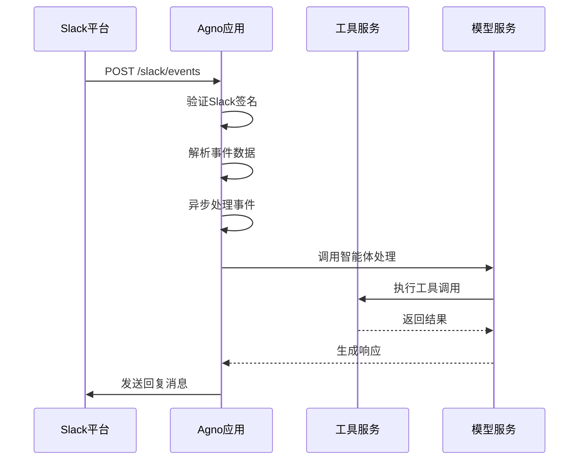
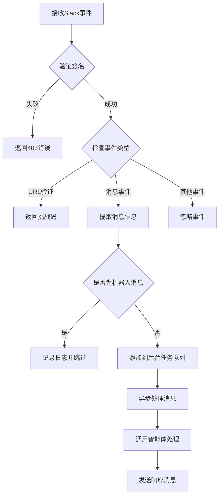
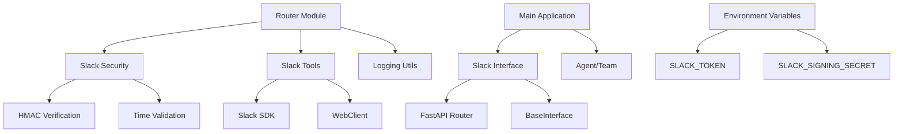

# Slack集成

<cite>
**本文档中引用的文件**
- [slack.py](file://libs/agno/agno/os/interfaces/slack/slack.py)
- [router.py](file://libs/agno/agno/os/interfaces/slack/router.py)
- [security.py](file://libs/agno/agno/os/interfaces/slack/security.py)
- [slack.py](file://libs/agno/agno/tools/slack.py)
- [slack_tools.py](file://cookbook/tools/slack_tools.py)
- [log.py](file://libs/agno/agno/utils/log.py)
</cite>

## 目录
1. [简介](#简介)
2. [项目结构](#项目结构)
3. [核心组件](#核心组件)
4. [架构概览](#架构概览)
5. [详细组件分析](#详细组件分析)
6. [依赖关系分析](#依赖关系分析)
7. [性能考虑](#性能考虑)
8. [故障排除指南](#故障排除指南)
9. [结论](#结论)

## 简介

Agno框架提供了完整的Slack集成解决方案，使开发者能够轻松构建智能体与Slack平台进行交互。该集成支持OAuth身份验证、事件订阅、消息处理和人机协作流程，为开发者提供了一个强大而灵活的Slack智能体开发平台。

主要特性包括：
- 完整的Slack OAuth身份验证流程
- 实时事件订阅和处理机制
- 消息块和模态对话框支持
- 文件上传和多媒体内容处理
- 会话状态管理和多线程支持
- 错误处理和速率限制保护
- 安全性最佳实践和签名验证

## 项目结构

Agno的Slack集成功能分布在多个模块中，采用分层架构设计：



**图表来源**
- [slack.py](file://libs/agno/agno/os/interfaces/slack/slack.py#L1-L33)
- [router.py](file://libs/agno/agno/os/interfaces/slack/router.py#L1-L91)
- [security.py](file://libs/agno/agno/os/interfaces/slack/security.py#L1-L31)

**章节来源**
- [slack.py](file://libs/agno/agno/os/interfaces/slack/slack.py#L1-L33)
- [router.py](file://libs/agno/agno/os/interfaces/slack/router.py#L1-L91)

## 核心组件

### Slack Interface类

Slack接口是整个集成的核心入口点，继承自BaseInterface基类：

```python
class Slack(BaseInterface):
    type = "slack"
    
    router: APIRouter
    
    def __init__(self, agent: Optional[Agent] = None, team: Optional[Team] = None):
        self.agent = agent
        self.team = team
        
        if not self.agent and not self.team:
            raise ValueError("Slack requires an agent and a team")
```

该类负责：
- 初始化Slack连接配置
- 创建FastAPI路由处理器
- 管理代理或团队实例
- 处理路由注册和事件分发

### 路由处理器模块

路由处理器负责处理来自Slack的所有HTTP请求：

```python
def attach_routes(router: APIRouter, agent: Optional[Agent] = None, team: Optional[Team] = None) -> APIRouter:
    @router.post("/events")
    async def slack_events(request: Request, background_tasks: BackgroundTasks):
        # 验证签名
        # 处理URL验证
        # 异步处理事件
```

**章节来源**
- [slack.py](file://libs/agno/agno/os/interfaces/slack/slack.py#L13-L33)
- [router.py](file://libs/agno/agno/os/interfaces/slack/router.py#L11-L28)

## 架构概览

Agno的Slack集成采用事件驱动架构，确保高效的实时通信：



**图表来源**
- [router.py](file://libs/agno/agno/os/interfaces/slack/router.py#L13-L58)
- [security.py](file://libs/agno/agno/os/interfaces/slack/security.py#L13-L30)

## 详细组件分析

### 安全性模块

安全性是Slack集成的关键组成部分，确保所有通信的安全性和完整性：

```python
def verify_slack_signature(body: bytes, timestamp: str, slack_signature: str) -> bool:
    if not SLACK_SIGNING_SECRET:
        raise HTTPException(status_code=500, detail="SLACK_SIGNING_SECRET is not set")
    
    # 防止重放攻击
    if abs(time.time() - int(timestamp)) > 60 * 5:
        return False
    
    sig_basestring = f"v0:{timestamp}:{body.decode('utf-8')}"
    my_signature = (
        "v0=" + hmac.new(SLACK_SIGNING_SECRET.encode("utf-8"), 
                        sig_basestring.encode("utf-8"), 
                        hashlib.sha256).hexdigest()
    )
    
    return hmac.compare_digest(my_signature, slack_signature)
```

安全特性：
- HMAC SHA-256签名验证
- 时间戳验证（防止重放攻击）
- 密钥管理最佳实践
- 常量时间比较防止时序攻击

### 消息处理引擎

消息处理引擎负责解析和处理来自Slack的各种事件类型：



**图表来源**
- [router.py](file://libs/agno/agno/os/interfaces/slack/router.py#L13-L58)

### Slack工具集

Slack工具集提供了与Slack API交互的完整功能集合：

```python
class SlackTools(Toolkit):
    def __init__(self, token: Optional[str] = None, 
                 enable_send_message: bool = True,
                 enable_send_message_thread: bool = True,
                 enable_list_channels: bool = True,
                 enable_get_channel_history: bool = True,
                 all: bool = False, **kwargs):
        self.token = token or getenv("SLACK_TOKEN")
        if self.token is None or self.token == "":
            raise ValueError("SLACK_TOKEN is not set")
        self.client = WebClient(token=self.token)
```

主要功能：
- **发送消息**：支持普通消息和线程回复
- **频道管理**：列出频道和获取历史消息
- **错误处理**：完整的异常捕获和日志记录
- **配置灵活性**：可选择启用的功能模块

### 消息分发和格式化

系统实现了智能的消息分发机制，支持长文本分割和格式化：

```python
def _send_slack_message(channel: str, thread_ts: str, message: str, italics: bool = False):
    if len(message) <= 40000:
        if italics:
            formatted_message = "\n".join([f"_{line}_" for line in message.split("\n")])
            SlackTools().send_message_thread(channel=channel, text=formatted_message, thread_ts=thread_ts)
        else:
            SlackTools().send_message_thread(channel=channel, text=message, thread_ts=thread_ts)
        return
    
    # 分割长消息为批次
    message_batches = [message[i:i + 40000] for i in range(0, len(message), 40000)]
    
    for i, batch in enumerate(message_batches, 1):
        batch_message = f"[{i}/{len(message_batches)}] {batch}"
        if italics:
            formatted_batch = "\n".join([f"_{line}_" for line in batch_message.split("\n")])
            SlackTools().send_message_thread(channel=channel, text=formatted_batch, thread_ts=thread_ts)
```

**章节来源**
- [security.py](file://libs/agno/agno/os/interfaces/slack/security.py#L13-L30)
- [router.py](file://libs/agno/agno/os/interfaces/slack/router.py#L60-L89)
- [slack.py](file://libs/agno/agno/tools/slack.py#L15-L40)

## 依赖关系分析

Slack集成模块具有清晰的依赖层次结构：



**图表来源**
- [slack.py](file://libs/agno/agno/os/interfaces/slack/slack.py#L1-L10)
- [router.py](file://libs/agno/agno/os/interfaces/slack/router.py#L1-L10)

**章节来源**
- [slack.py](file://libs/agno/agno/os/interfaces/slack/slack.py#L1-L33)
- [router.py](file://libs/agno/agno/os/interfaces/slack/router.py#L1-L91)

## 性能考虑

### 异步处理机制

为了确保高性能和响应性，系统采用异步处理模式：

- **后台任务队列**：所有Slack事件都通过BackgroundTasks异步处理
- **非阻塞I/O**：避免阻塞主事件循环
- **并发控制**：合理管理并发请求数量

### 内存优化

- **流式处理**：大消息采用流式处理避免内存溢出
- **会话管理**：基于时间戳的会话隔离减少内存占用
- **资源清理**：及时释放不需要的资源

### 缓存策略

- **频道列表缓存**：减少重复的API调用
- **用户信息缓存**：提高消息处理效率
- **配置缓存**：避免重复加载配置

## 故障排除指南

### 常见问题和解决方案

#### 1. 签名验证失败

**症状**：收到403错误，提示"Invalid signature"

**原因**：
- SLACK_SIGNING_SECRET环境变量未设置
- 时间戳过期（超过5分钟）
- 请求体被修改

**解决方案**：
```bash
export SLACK_SIGNING_SECRET="your-signing-secret"
```

#### 2. 消息发送失败

**症状**：消息无法发送到指定频道

**原因**：
- SLACK_TOKEN无效或过期
- 频道权限不足
- API速率限制

**解决方案**：
- 检查SLACK_TOKEN的有效性
- 确认机器人在目标频道有权限
- 实现指数退避重试机制

#### 3. 事件处理延迟

**症状**：Slack事件响应缓慢

**原因**：
- 同步处理阻塞
- 外部API调用超时
- 资源竞争

**解决方案**：
- 使用异步处理
- 实现超时控制
- 优化外部API调用

### 日志和监控

系统提供了完整的日志记录功能：

```python
from agno.utils.log import logger

# 记录重要操作
logger.info("Processing Slack event")
logger.debug("Event data: %s", event_data)
logger.error("Failed to send message: %s", error_message)
```

**章节来源**
- [security.py](file://libs/agno/agno/os/interfaces/slack/security.py#L13-L30)
- [router.py](file://libs/agno/agno/os/interfaces/slack/router.py#L60-L89)
- [log.py](file://libs/agno/agno/utils/log.py#L1-L50)

## 结论

Agno的Slack集成功能提供了一个完整、安全且高性能的智能体通信平台。通过模块化的架构设计、强大的安全机制和灵活的配置选项，开发者可以快速构建功能丰富的Slack智能体应用。

主要优势：
- **安全性**：完整的签名验证和时间戳保护
- **可靠性**：异步处理和错误恢复机制
- **可扩展性**：模块化设计支持功能扩展
- **易用性**：简洁的API和丰富的示例代码

建议开发者：
- 正确配置环境变量
- 实施适当的错误处理
- 监控系统性能指标
- 遵循Slack API的最佳实践

通过遵循本文档的指导原则和最佳实践，开发者可以构建出高效、可靠且安全的Slack智能体应用。