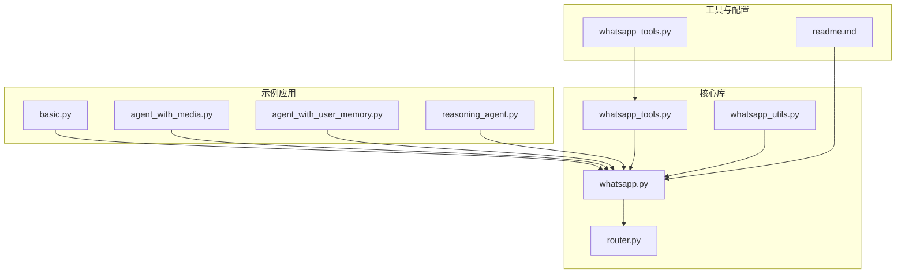
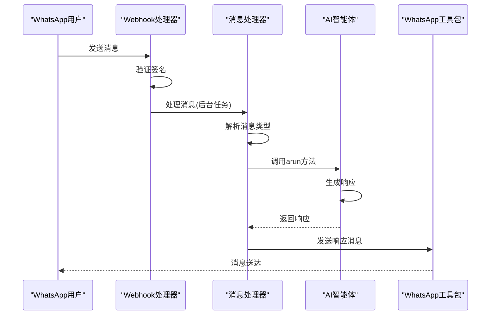
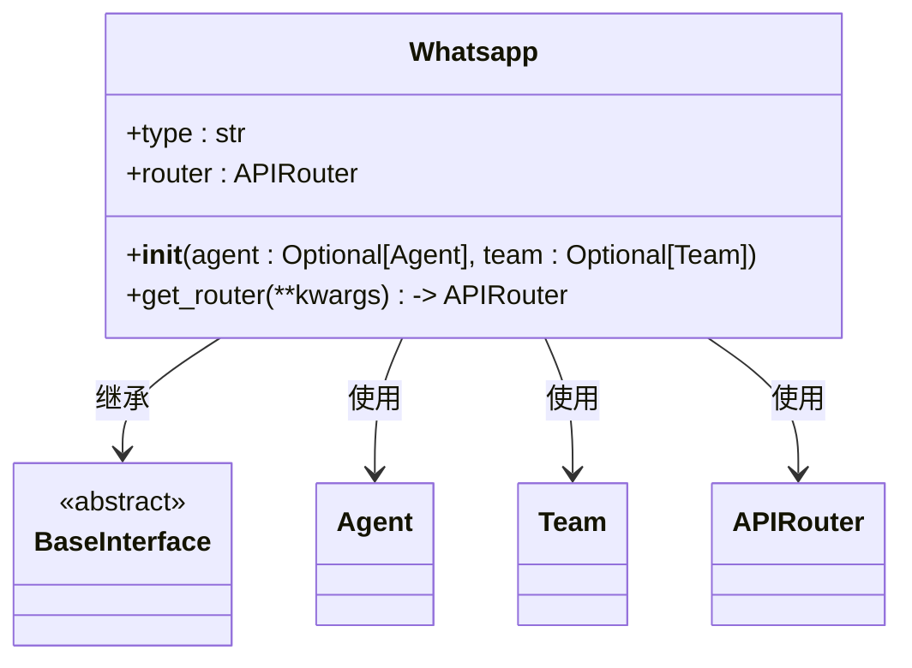
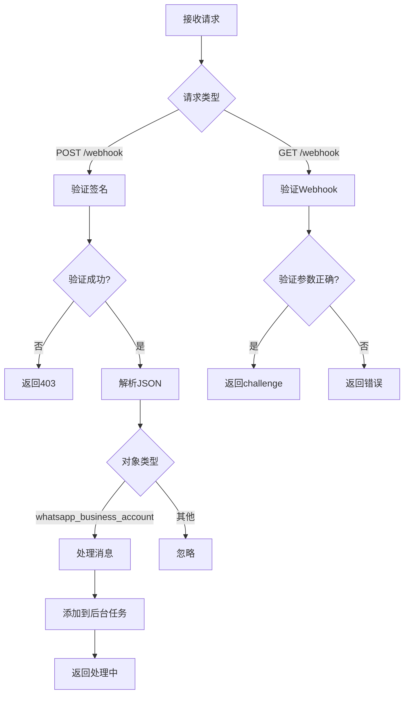
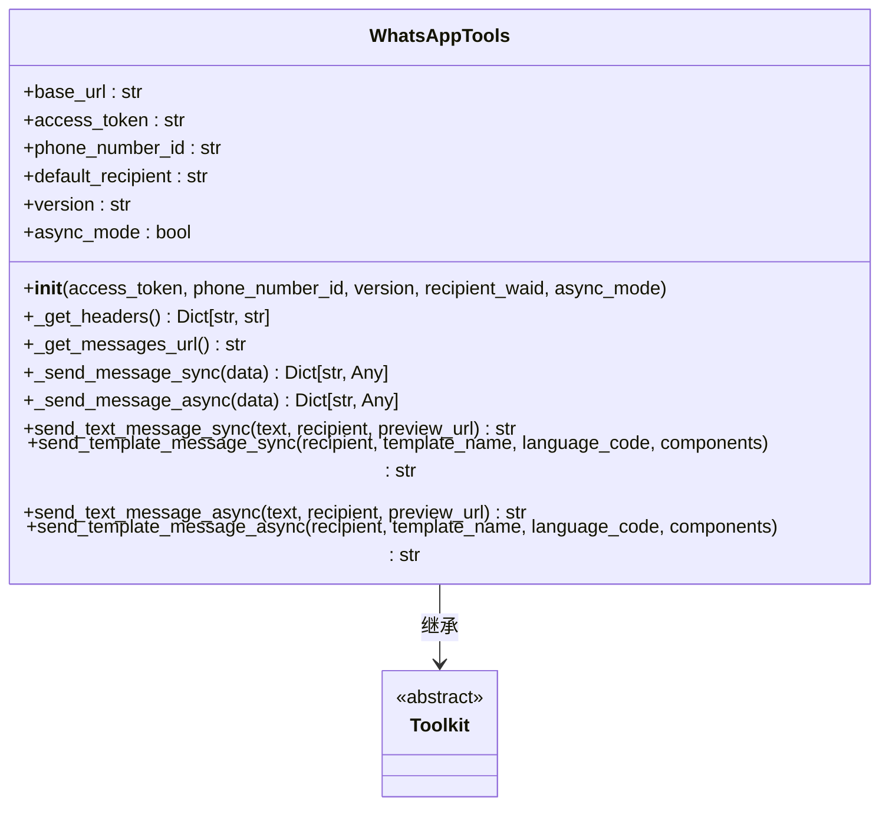
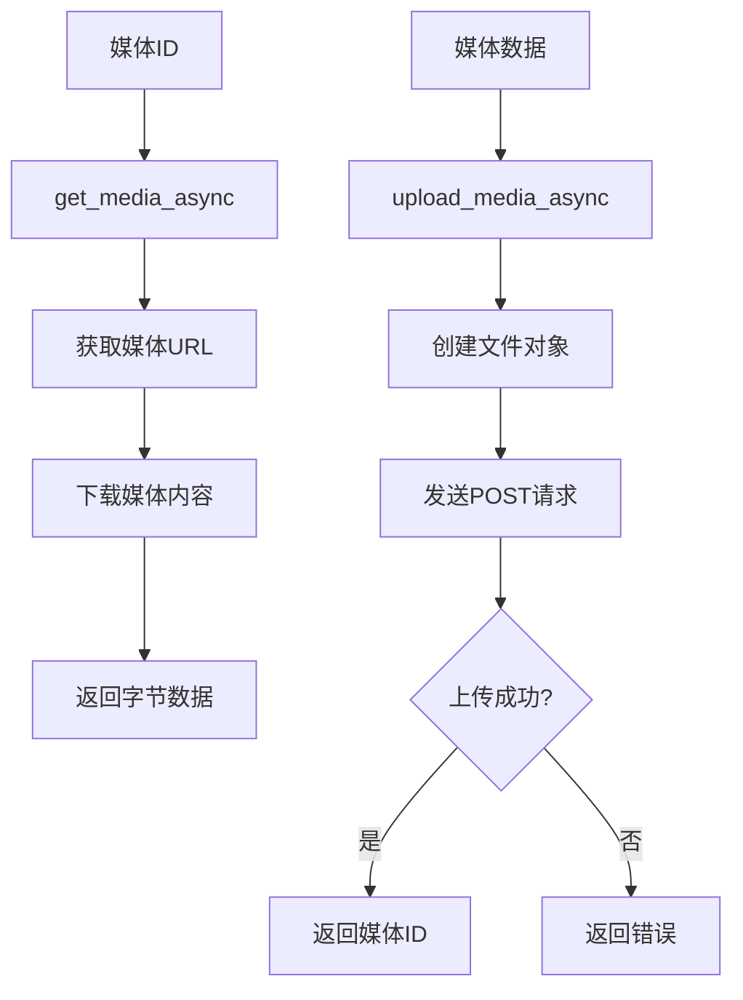
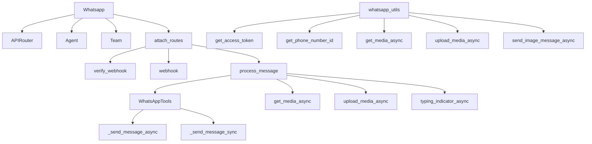

# WhatsApp集成

<cite>
**本文档中引用的文件**  
- [whatsapp.py](file://libs/agno/agno/os/interfaces/whatsapp/whatsapp.py)
- [router.py](file://libs/agno/agno/os/interfaces/whatsapp/router.py)
- [whatsapp_tools.py](file://libs/agno/agno/tools/whatsapp.py)
- [whatsapp.py](file://libs/agno/agno/utils/whatsapp.py)
- [basic.py](file://cookbook/agent_os/interfaces/whatsapp/basic.py)
- [agent_with_media.py](file://cookbook/agent_os/interfaces/whatsapp/agent_with_media.py)
- [agent_with_user_memory.py](file://cookbook/agent_os/interfaces/whatsapp/agent_with_user_memory.py)
- [reasoning_agent.py](file://cookbook/agent_os/interfaces/whatsapp/reasoning_agent.py)
- [whatsapp_tools.py](file://cookbook/tools/whatsapp_tools.py)
- [readme.md](file://cookbook/agent_os/interfaces/whatsapp/readme.md)
</cite>

## 目录
1. [简介](#简介)
2. [项目结构](#项目结构)
3. [核心组件](#核心组件)
4. [架构概述](#架构概述)
5. [详细组件分析](#详细组件分析)
6. [依赖分析](#依赖分析)
7. [性能考虑](#性能考虑)
8. [故障排除指南](#故障排除指南)
9. [结论](#结论)

## 简介
本文档详细介绍了Agno平台如何通过WhatsApp Business API实现智能体通信。文档涵盖了WhatsApp Cloud API配置、消息模板审批、媒体消息处理和用户状态管理等关键主题。通过实际代码示例，展示了如何发送文本、图片、视频和文档消息，处理用户回复，以及实现多轮对话流程。同时解释了WhatsApp特定限制如24小时消息窗口的处理策略，以及如何利用媒体生成工具创建动态内容。文档还涵盖了消息加密、用户隐私保护和平台合规性要求，帮助开发者构建符合规范的WhatsApp智能体应用。

## 项目结构
Agno项目的WhatsApp集成主要分布在多个目录中，形成了清晰的模块化结构。核心功能分布在`libs/agno/agno/os/interfaces/whatsapp/`目录下，而示例和教程则位于`cookbook/agent_os/interfaces/whatsapp/`目录中。

**图表来源**  
- [whatsapp.py](file://libs/agno/agno/os/interfaces/whatsapp/whatsapp.py)
- [router.py](file://libs/agno/agno/os/interfaces/whatsapp/router.py)
- [whatsapp_tools.py](file://libs/agno/agno/tools/whatsapp.py)
- [whatsapp.py](file://libs/agno/agno/utils/whatsapp.py)
- [basic.py](file://cookbook/agent_os/interfaces/whatsapp/basic.py)
- [agent_with_media.py](file://cookbook/agent_os/interfaces/whatsapp/agent_with_media.py)
- [agent_with_user_memory.py](file://cookbook/agent_os/interfaces/whatsapp/agent_with_user_memory.py)
- [reasoning_agent.py](file://cookbook/agent_os/interfaces/whatsapp/reasoning_agent.py)
- [whatsapp_tools.py](file://cookbook/tools/whatsapp_tools.py)
- [readme.md](file://cookbook/agent_os/interfaces/whatsapp/readme.md)

**章节来源**  
- [whatsapp.py](file://libs/agno/agno/os/interfaces/whatsapp/whatsapp.py)
- [readme.md](file://cookbook/agent_os/interfaces/whatsapp/readme.md)

## 核心组件
WhatsApp集成的核心组件包括接口层、路由处理、工具包和实用工具。`Whatsapp`类作为主要接口，负责处理与WhatsApp Business API的交互。`router.py`文件中的`attach_routes`函数负责处理Webhook验证和消息接收。`WhatsAppTools`工具包提供了发送各种类型消息的功能，而`whatsapp.py`实用工具则处理媒体上传和下载等底层操作。

**章节来源**  
- [whatsapp.py](file://libs/agno/agno/os/interfaces/whatsapp/whatsapp.py)
- [router.py](file://libs/agno/agno/os/interfaces/whatsapp/router.py)
- [whatsapp_tools.py](file://libs/agno/agno/tools/whatsapp.py)
- [whatsapp.py](file://libs/agno/agno/utils/whatsapp.py)

## 架构概述
Agno的WhatsApp集成采用分层架构，将接口、路由、业务逻辑和工具功能分离。当用户通过WhatsApp发送消息时，请求首先到达FastAPI路由，经过验证后传递给消息处理函数。该函数解析消息内容，包括文本、图片、视频等媒体类型，然后将其传递给相应的智能体进行处理。智能体生成响应后，通过WhatsApp工具包将响应发送回用户。

**图表来源**  
- [router.py](file://libs/agno/agno/os/interfaces/whatsapp/router.py)
- [whatsapp_tools.py](file://libs/agno/agno/tools/whatsapp.py)

## 详细组件分析

### WhatsApp接口分析
`Whatsapp`类是Agno与WhatsApp Business API之间的主要接口。它继承自`BaseInterface`，并实现了必要的方法来处理消息接收和发送。

**图表来源**  
- [whatsapp.py](file://libs/agno/agno/os/interfaces/whatsapp/whatsapp.py)

**章节来源**  
- [whatsapp.py](file://libs/agno/agno/os/interfaces/whatsapp/whatsapp.py)

### 消息路由分析
消息路由组件负责处理所有与WhatsApp相关的HTTP请求，包括Webhook验证和消息接收。它实现了完整的请求处理流程，从验证到消息解析再到后台处理。

**图表来源**  
- [router.py](file://libs/agno/agno/os/interfaces/whatsapp/router.py)

**章节来源**  
- [router.py](file://libs/agno/agno/os/interfaces/whatsapp/router.py)

### WhatsApp工具包分析
`WhatsAppTools`工具包提供了与WhatsApp Business API交互的核心功能，包括发送文本消息、模板消息和媒体消息。

**图表来源**  
- [whatsapp_tools.py](file://libs/agno/agno/tools/whatsapp.py)

**章节来源**  
- [whatsapp_tools.py](file://libs/agno/agno/tools/whatsapp.py)

### 媒体处理分析
媒体处理组件负责处理WhatsApp中的各种媒体类型，包括图片、视频、音频和文档的上传和下载。

**图表来源**  
- [whatsapp.py](file://libs/agno/agno/utils/whatsapp.py)

**章节来源**  
- [whatsapp.py](file://libs/agno/agno/utils/whatsapp.py)

## 依赖分析
WhatsApp集成组件之间的依赖关系清晰，形成了一个稳定的架构。核心依赖包括FastAPI用于Web服务、httpx用于HTTP请求、以及Agno平台的Agent和Team组件。

**图表来源**  
- [whatsapp.py](file://libs/agno/agno/os/interfaces/whatsapp/whatsapp.py)
- [router.py](file://libs/agno/agno/os/interfaces/whatsapp/router.py)
- [whatsapp_tools.py](file://libs/agno/agno/tools/whatsapp.py)
- [whatsapp.py](file://libs/agno/agno/utils/whatsapp.py)

**章节来源**  
- [whatsapp.py](file://libs/agno/agno/os/interfaces/whatsapp/whatsapp.py)
- [router.py](file://libs/agno/agno/os/interfaces/whatsapp/router.py)
- [whatsapp_tools.py](file://libs/agno/agno/tools/whatsapp.py)
- [whatsapp.py](file://libs/agno/agno/utils/whatsapp.py)

## 性能考虑
在设计WhatsApp集成时，需要考虑多个性能因素。首先，所有消息处理都在后台任务中进行，避免了请求超时问题。其次，媒体上传和下载都使用异步方法，提高了整体响应速度。此外，消息长度限制为4096字符，超过此限制的消息会被自动分批发送。

**章节来源**  
- [router.py](file://libs/agno/agno/os/interfaces/whatsapp/router.py)
- [whatsapp_tools.py](file://libs/agno/agno/tools/whatsapp.py)

## 故障排除指南
在部署和使用WhatsApp集成时，可能会遇到各种问题。常见问题包括Webhook验证失败、消息发送失败和媒体处理错误。

**章节来源**  
- [readme.md](file://cookbook/agent_os/interfaces/whatsapp/readme.md)
- [router.py](file://libs/agno/agno/os/interfaces/whatsapp/router.py)
- [whatsapp_tools.py](file://libs/agno/agno/tools/whatsapp.py)

## 结论
Agno的WhatsApp集成提供了一个强大而灵活的框架，用于构建基于WhatsApp Business API的智能体应用。通过清晰的架构设计和丰富的功能支持，开发者可以轻松实现复杂的对话流程、媒体处理和用户状态管理。文档中提供的示例代码和最佳实践为开发者提供了实用的指导，帮助他们快速上手并构建符合规范的WhatsApp应用。