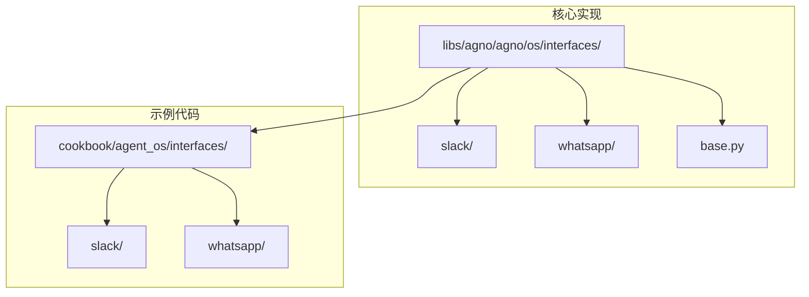
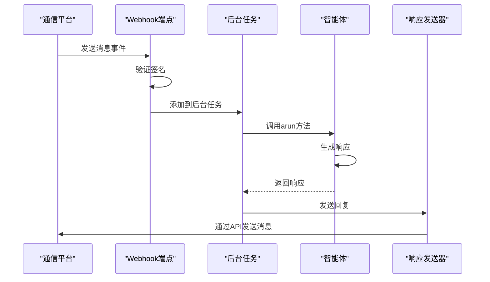
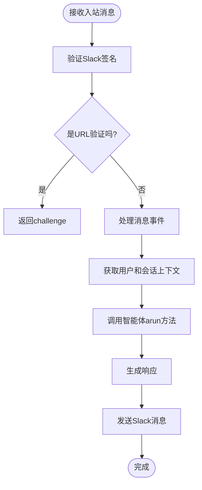
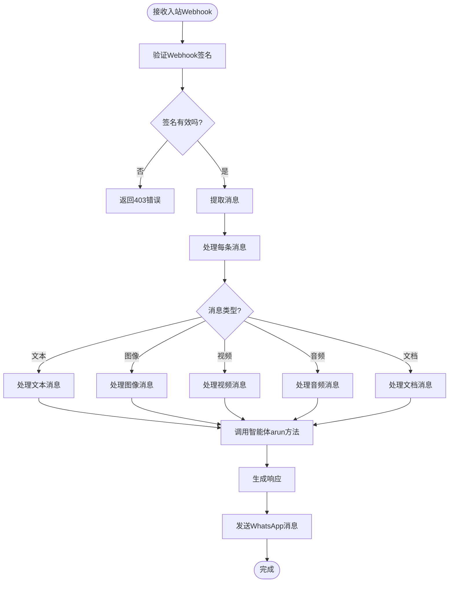
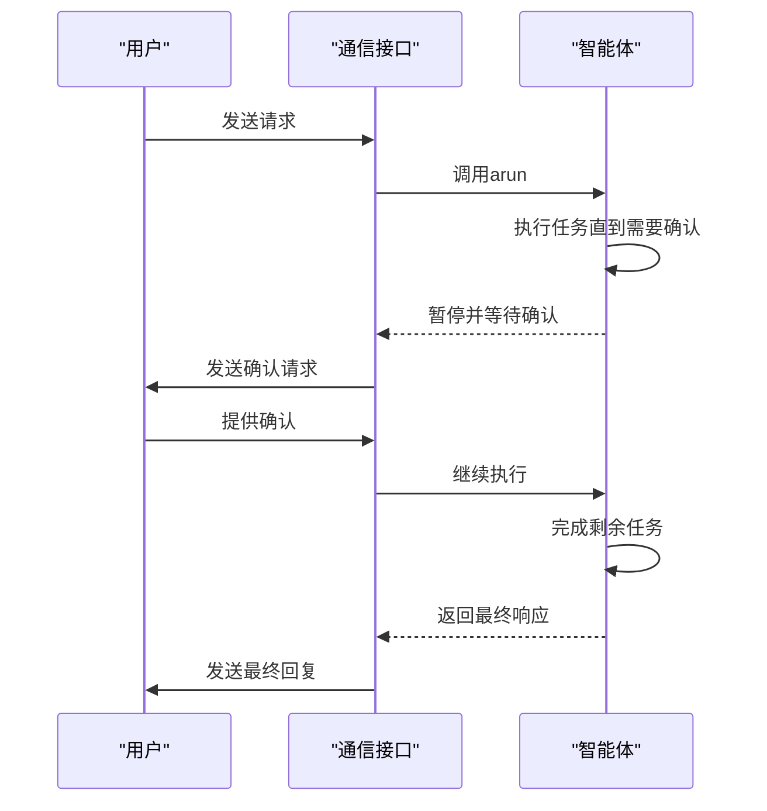
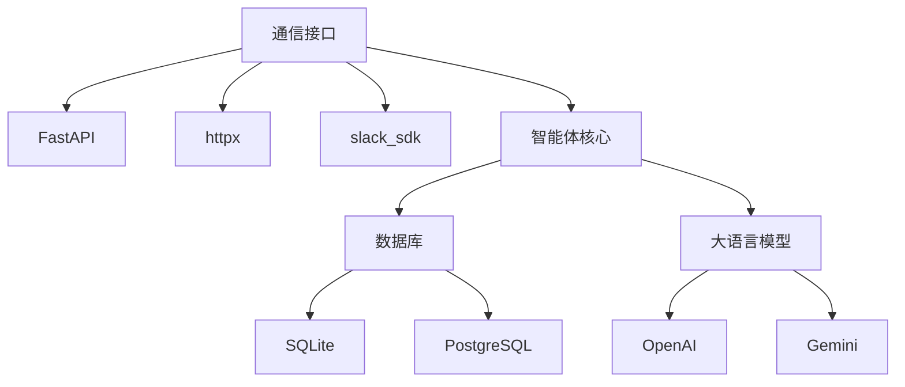

# 通信接口

<cite>
**本文档引用的文件**
- [whatsapp.py](file://libs/agno/agno/os/interfaces/whatsapp/whatsapp.py)
- [slack.py](file://libs/agno/agno/os/interfaces/slack/slack.py)
- [router.py](file://libs/agno/agno/os/interfaces/slack/router.py)
- [router.py](file://libs/agno/agno/os/interfaces/whatsapp/router.py)
- [security.py](file://libs/agno/agno/os/interfaces/whatsapp/security.py)
- [security.py](file://libs/agno/agno/os/interfaces/slack/security.py)
- [whatsapp.py](file://libs/agno/agno/tools/whatsapp.py)
- [slack.py](file://libs/agno/agno/tools/slack.py)
- [base.py](file://libs/agno/agno/os/interfaces/base.py)
- [basic.py](file://cookbook/agent_os/interfaces/whatsapp/basic.py)
- [basic.py](file://cookbook/agent_os/interfaces/slack/basic.py)
- [agent_with_media.py](file://cookbook/agent_os/interfaces/whatsapp/agent_with_media.py)
- [agent_with_user_memory.py](file://cookbook/agent_os/interfaces/slack/agent_with_user_memory.py)
</cite>

## 目录
1. [简介](#简介)
2. [项目结构](#项目结构)
3. [核心组件](#核心组件)
4. [架构概述](#架构概述)
5. [详细组件分析](#详细组件分析)
6. [依赖分析](#依赖分析)
7. [性能考虑](#性能考虑)
8. [故障排除指南](#故障排除指南)
9. [结论](#结论)

## 简介
本文档详细介绍了Agno如何与主流通信平台（包括Slack、WhatsApp和Discord）集成。文档涵盖了身份验证、消息路由、媒体处理和用户状态管理等关键方面。通过实际代码示例，展示了如何配置Webhook、处理入站消息以及发送富媒体响应。此外，还解释了事件驱动架构在通信集成中的应用，以及如何实现人机协作流程。文档还涵盖了消息格式转换、会话上下文维护和平台特定限制的处理，帮助开发者构建跨平台的智能对话应用。

## 项目结构
Agno项目的通信接口功能主要分布在`libs/agno/agno/os/interfaces/`目录下，每个支持的平台都有独立的子目录。核心实现位于`slack`和`whatsapp`目录中，而示例代码则位于`cookbook/agent_os/interfaces/`目录下。这种结构化的组织方式使得平台特定的逻辑与通用接口抽象分离，便于维护和扩展。

**图示来源**
- [slack.py](file://libs/agno/agno/os/interfaces/slack/slack.py)
- [whatsapp.py](file://libs/agno/agno/os/interfaces/whatsapp/whatsapp.py)
- [base.py](file://libs/agno/agno/os/interfaces/base.py)

**本节来源**
- [libs/agno/agno/os/interfaces/](file://libs/agno/agno/os/interfaces/)
- [cookbook/agent_os/interfaces/](file://cookbook/agent_os/interfaces/)

## 核心组件
Agno的通信接口由几个核心组件构成：`BaseInterface`定义了所有接口的通用契约，`Slack`和`Whatsapp`类实现了平台特定的逻辑，而`attach_routes`函数则负责设置Webhook端点。工具类`SlackTools`和`WhatsAppTools`封装了与外部API通信的细节，使得核心逻辑保持简洁。

**本节来源**
- [base.py](file://libs/agno/agno/os/interfaces/base.py#L1-L22)
- [slack.py](file://libs/agno/agno/os/interfaces/slack/slack.py#L1-L32)
- [whatsapp.py](file://libs/agno/agno/os/interfaces/whatsapp/whatsapp.py#L1-L30)

## 架构概述
Agno的通信集成采用事件驱动架构，通过Webhook接收来自通信平台的消息。当消息到达时，系统验证其来源，然后在后台异步处理。处理流程包括解析消息内容、调用相应的智能体（Agent）或团队（Team）进行响应生成，最后通过平台API发送回复。这种架构确保了高响应性和可扩展性。

**图示来源**
- [router.py](file://libs/agno/agno/os/interfaces/slack/router.py#L1-L90)
- [router.py](file://libs/agno/agno/os/interfaces/whatsapp/router.py#L1-L207)

## 详细组件分析

### Slack集成分析
Slack集成通过`Slack`类实现，该类继承自`BaseInterface`。它设置了一个以`/slack`为前缀的API路由，并将事件处理委托给`attach_routes`函数。消息处理包括验证Slack签名、处理URL验证挑战以及异步处理消息事件。

#### Slack消息处理流程

**图示来源**
- [slack.py](file://libs/agno/agno/os/interfaces/slack/slack.py#L1-L32)
- [router.py](file://libs/agno/agno/os/interfaces/slack/router.py#L1-L90)

**本节来源**
- [slack.py](file://libs/agno/agno/os/interfaces/slack/slack.py#L1-L32)
- [router.py](file://libs/agno/agno/os/interfaces/slack/router.py#L1-L90)
- [security.py](file://libs/agno/agno/os/interfaces/slack/security.py#L1-L30)
- [slack.py](file://libs/agno/agno/tools/slack.py#L1-L122)

### WhatsApp集成分析
WhatsApp集成通过`Whatsapp`类实现，该类同样继承自`BaseInterface`。它提供了`/webhook`端点用于接收和验证来自WhatsApp Business API的消息。系统支持文本、图像、视频、音频和文档等多种消息类型，并能处理相应的媒体内容。

#### WhatsApp消息处理流程

**图示来源**
- [whatsapp.py](file://libs/agno/agno/os/interfaces/whatsapp/whatsapp.py#L1-L30)
- [router.py](file://libs/agno/agno/os/interfaces/whatsapp/router.py#L1-L207)

**本节来源**
- [whatsapp.py](file://libs/agno/agno/os/interfaces/whatsapp/whatsapp.py#L1-L30)
- [router.py](file://libs/agno/agno/os/interfaces/whatsapp/router.py#L1-L207)
- [security.py](file://libs/agno/agno/os/interfaces/whatsapp/security.py#L1-L54)
- [whatsapp.py](file://libs/agno/agno/tools/whatsapp.py#L1-L287)

### 人机协作流程
Agno支持复杂的人机协作流程，允许在智能体执行过程中需要人工干预时暂停并等待用户输入。这在需要确认或提供额外信息的场景中非常有用。

**图示来源**
- [agent_with_user_memory.py](file://cookbook/agent_os/interfaces/slack/agent_with_user_memory.py)
- [human_in_the_loop](file://cookbook/agents/human_in_the_loop/)

## 依赖分析
Agno的通信接口依赖于多个外部库和API。核心依赖包括FastAPI用于Web服务、httpx用于HTTP请求，以及特定于平台的SDK（如slack_sdk）。这些依赖通过清晰的接口抽象进行管理，确保了代码的可维护性和可测试性。

**图示来源**
- [slack.py](file://libs/agno/agno/os/interfaces/slack/slack.py)
- [whatsapp.py](file://libs/agno/agno/os/interfaces/whatsapp/whatsapp.py)
- [pyproject.toml](file://libs/agno/pyproject.toml)

**本节来源**
- [slack.py](file://libs/agno/agno/os/interfaces/slack/slack.py)
- [whatsapp.py](file://libs/agno/agno/os/interfaces/whatsapp/whatsapp.py)
- [requirements.txt](file://libs/agno/requirements.txt)

## 性能考虑
在处理通信集成时，性能是一个关键因素。Agno通过异步处理和后台任务来确保Webhook端点的快速响应。消息被分割成符合平台限制的批次（Slack为40,000字符，WhatsApp为4,096字符），并添加了批处理编号以保持上下文。此外，系统实现了打字指示器，以在处理较长响应时向用户提供反馈。

## 故障排除指南
常见的集成问题包括身份验证失败、Webhook验证错误和消息发送失败。确保正确设置了环境变量（如`SLACK_SIGNING_SECRET`和`WHATSAPP_ACCESS_TOKEN`），并且Webhook URL正确配置。在开发模式下，可以绕过某些安全验证以简化测试。

**本节来源**
- [security.py](file://libs/agno/agno/os/interfaces/slack/security.py#L1-L30)
- [security.py](file://libs/agno/agno/os/interfaces/whatsapp/security.py#L1-L54)
- [router.py](file://libs/agno/agno/os/interfaces/whatsapp/router.py#L1-L207)

## 结论
Agno提供了一套强大而灵活的通信接口，能够轻松集成Slack、WhatsApp等主流平台。通过清晰的抽象和模块化设计，开发者可以快速构建跨平台的智能对话应用。事件驱动架构和异步处理确保了系统的高性能和可扩展性，而丰富的人机协作功能则支持复杂的业务流程。