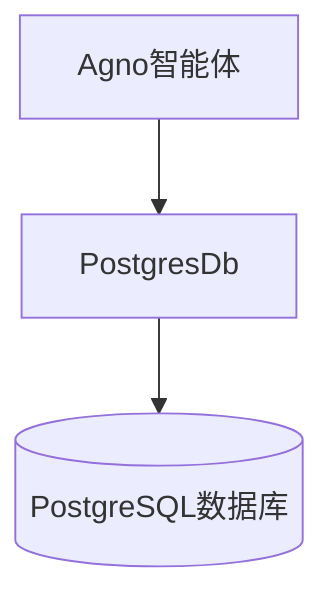
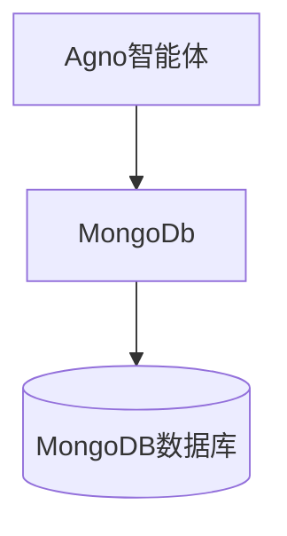
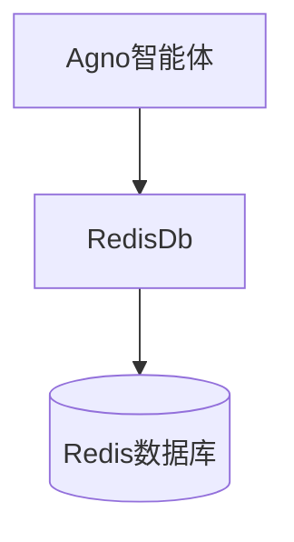
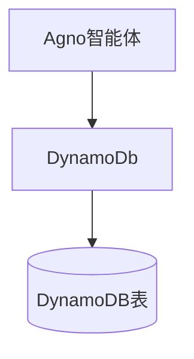
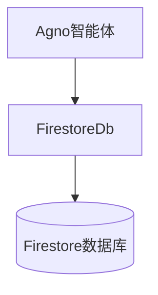
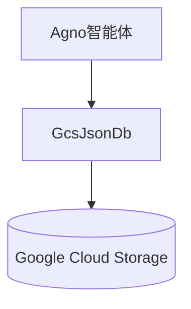
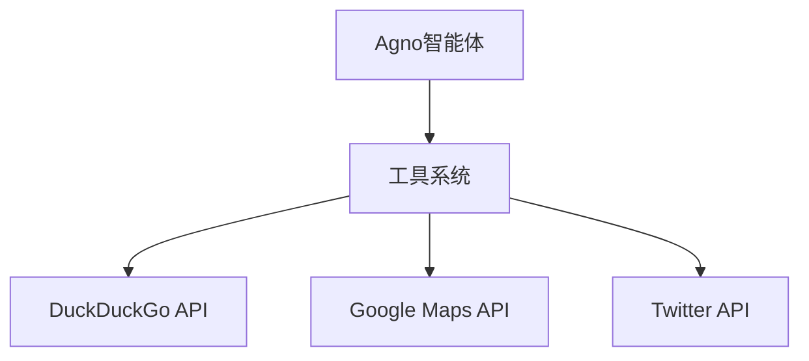
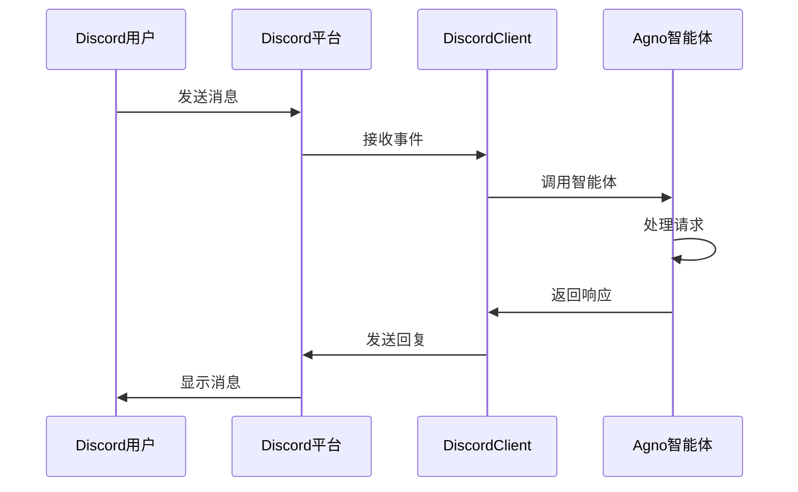
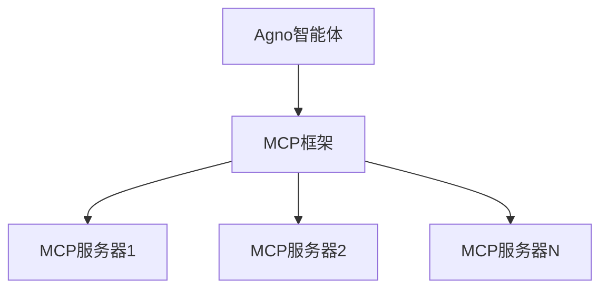

# 集成

<cite>
**本文档中引用的文件**
- [postgres_for_agent.py](file://cookbook/db/postgres/postgres_for_agent.py)
- [mongodb_for_agent.py](file://cookbook/db/mongo/mongodb_for_agent.py)
- [redis_for_agent.py](file://cookbook/db/redis/redis_for_agent.py)
- [dynamo_for_agent.py](file://cookbook/db/dynamodb/dynamo_for_agent.py)
- [firestore_for_agent.py](file://cookbook/db/firestore/firestore_for_agent.py)
- [gcs_json_for_agent.py](file://cookbook/db/gcs/gcs_json_for_agent.py)
- [basic.py](file://cookbook/integrations/discord/basic.py)
- [agent_with_media.py](file://cookbook/integrations/discord/agent_with_media.py)
- [mcp_tools.py](file://cookbook/tools/mcp/mcp_tools.py)
- [slack_tools.py](file://cookbook/tools/slack_tools.py)
- [whatsapp_tools.py](file://cookbook/tools/whatsapp_tools.py)
- [discord_tools.py](file://cookbook/tools/discord_tools.py)
</cite>

## 目录
1. [简介](#简介)
2. [数据库集成](#数据库集成)
3. [云存储集成](#云存储集成)
4. [消息队列与第三方API集成](#消息队列与第三方api集成)
5. [前端与通信平台接口集成](#前端与通信平台接口集成)
6. [MCP协议集成](#mcp协议集成)
7. [端到端应用示例](#端到端应用示例)
8. [结论](#结论)

## 简介
Agno 是一个灵活的智能体框架，支持与多种外部系统和服务的深度集成。本文档全面介绍 Agno 如何与外部系统进行集成，涵盖数据库、云存储、消息队列、第三方 API 以及各种前端通信平台的连接方式。通过具体的代码示例和配置说明，展示如何将 Agno 智能体连接到这些外部服务，构建完整的端到端应用。

## 数据库集成
Agno 支持与多种数据库系统的集成，包括关系型数据库和 NoSQL 数据库。每种数据库都有专门的适配器类，允许智能体持久化会话数据、运行历史和其他状态信息。

### PostgreSQL 集成
Agno 提供了对 PostgreSQL 的原生支持，通过 `PostgresDb` 类实现。开发者只需提供数据库连接 URL，即可将智能体的会话数据存储在 PostgreSQL 中。

**图示来源**
- [postgres_for_agent.py](file://cookbook/db/postgres/postgres_for_agent.py)

**本节来源**
- [postgres_for_agent.py](file://cookbook/db/postgres/postgres_for_agent.py)

### MongoDB 集成
对于需要灵活文档模型的应用场景，Agno 支持 MongoDB 集成。通过 `MongoDb` 类，智能体可以将数据以 BSON 格式存储在 MongoDB 集合中。

**图示来源**
- [mongodb_for_agent.py](file://cookbook/db/mongo/mongodb_for_agent.py)

**本节来源**
- [mongodb_for_agent.py](file://cookbook/db/mongo/mongodb_for_agent.py)

### Redis 集成
Redis 作为高性能的内存数据存储，适用于需要快速读写会话数据的场景。Agno 的 `RedisDb` 类提供了与 Redis 的连接能力。

**图示来源**
- [redis_for_agent.py](file://cookbook/db/redis/redis_for_agent.py)

**本节来源**
- [redis_for_agent.py](file://cookbook/db/redis/redis_for_agent.py)

### DynamoDB 集成
对于 AWS 云环境，Agno 支持 DynamoDB 集成。通过环境变量配置 AWS 凭据后，使用 `DynamoDb` 类即可连接。

**图示来源**
- [dynamo_for_agent.py](file://cookbook/db/dynamodb/dynamo_for_agent.py)

**本节来源**
- [dynamo_for_agent.py](file://cookbook/db/dynamodb/dynamo_for_agent.py)

## 云存储集成
Agno 支持与主流云存储服务的集成，便于存储大型文件、媒体内容和结构化数据。

### Firestore 集成
Google Cloud Firestore 提供了 NoSQL 文档数据库服务，Agno 通过 `FirestoreDb` 类实现集成，支持跨平台数据同步。

**图示来源**
- [firestore_for_agent.py](file://cookbook/db/firestore/firestore_for_agent.py)

**本节来源**
- [firestore_for_agent.py](file://cookbook/db/firestore/firestore_for_agent.py)

### Google Cloud Storage 集成
对于对象存储需求，Agno 提供了 `GcsJsonDb` 类，可将数据以 JSON 格式存储在 GCS 存储桶中。

**图示来源**
- [gcs_json_for_agent.py](file://cookbook/db/gcs/gcs_json_for_agent.py)

**本节来源**
- [gcs_json_for_agent.py](file://cookbook/db/gcs/gcs_json_for_agent.py)

## 消息队列与第三方API集成
Agno 通过工具系统支持与各种第三方 API 的集成，包括消息队列服务。

### 第三方API集成
Agno 的工具系统允许智能体调用外部 API。每个工具封装了特定服务的 API 调用逻辑，如 `DuckDuckGoTools` 用于网络搜索。

**本节来源**
- [postgres_for_agent.py](file://cookbook/db/postgres/postgres_for_agent.py)
- [mongodb_for_agent.py](file://cookbook/db/mongo/mongodb_for_agent.py)

## 前端与通信平台接口集成
Agno 支持与多种前端和通信平台的集成，使智能体能够通过不同渠道与用户交互。

### Discord 集成
通过 `DiscordClient` 类，Agno 智能体可以部署为 Discord 机器人，响应频道消息和私信。

**图示来源**
- [basic.py](file://cookbook/integrations/discord/basic.py)

**本节来源**
- [basic.py](file://cookbook/integrations/discord/basic.py)
- [agent_with_media.py](file://cookbook/integrations/discord/agent_with_media.py)

### Slack 集成
类似地，Agno 提供了 Slack 集成能力，通过 `slack_tools.py` 中的工具实现与 Slack API 的交互。

**本节来源**
- [slack_tools.py](file://cookbook/tools/slack_tools.py)

### WhatsApp 集成
通过 `whatsapp_tools.py`，Agno 智能体可以集成 WhatsApp 通信功能，实现消息收发。

**本节来源**
- [whatsapp_tools.py](file://cookbook/tools/whatsapp_tools.py)

## MCP协议集成
Agno 支持 MCP（Model Control Protocol）协议集成，允许智能体与支持 MCP 的服务进行交互。

### MCP工具集成
通过 `mcp_tools.py` 文件中的工具类，Agno 智能体可以连接到 MCP 服务器，执行远程操作。

**本节来源**
- [mcp_tools.py](file://cookbook/tools/mcp/mcp_tools.py)

## 端到端应用示例
结合上述集成能力，可以构建完整的端到端应用。例如，一个跨平台客户服务智能体可以：

1. 使用 PostgreSQL 存储客户会话历史
2. 通过 Discord 和 Slack 与客户交互
3. 调用 MCP 服务执行业务操作
4. 将媒体文件存储在 GCS 中

这种架构实现了数据持久化、多渠道接入和外部服务调用的完整闭环。

**本节来源**
- [postgres_for_agent.py](file://cookbook/db/postgres/postgres_for_agent.py)
- [basic.py](file://cookbook/integrations/discord/basic.py)
- [slack_tools.py](file://cookbook/tools/slack_tools.py)
- [mcp_tools.py](file://cookbook/tools/mcp/mcp_tools.py)
- [gcs_json_for_agent.py](file://cookbook/db/gcs/gcs_json_for_agent.py)

## 结论
Agno 提供了丰富的集成选项，支持与主流数据库、云存储、通信平台和第三方服务的连接。通过模块化的架构设计，开发者可以灵活选择所需的集成组件，构建适应不同业务场景的智能体应用。这些集成能力使得 Agno 不仅是一个对话智能体框架，更是一个强大的系统集成平台。