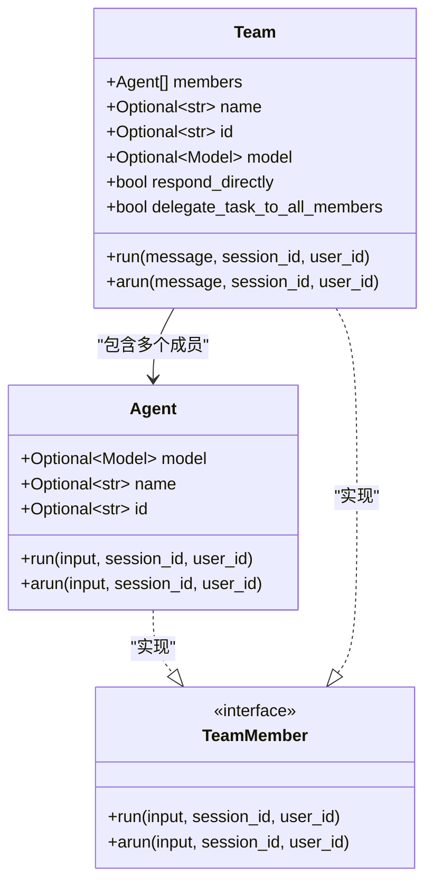
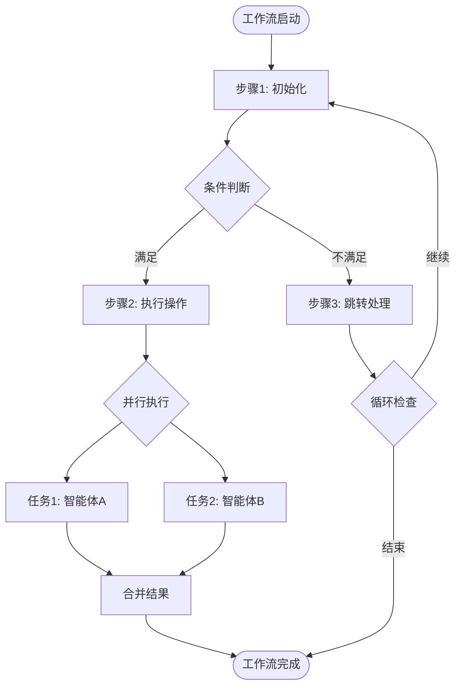
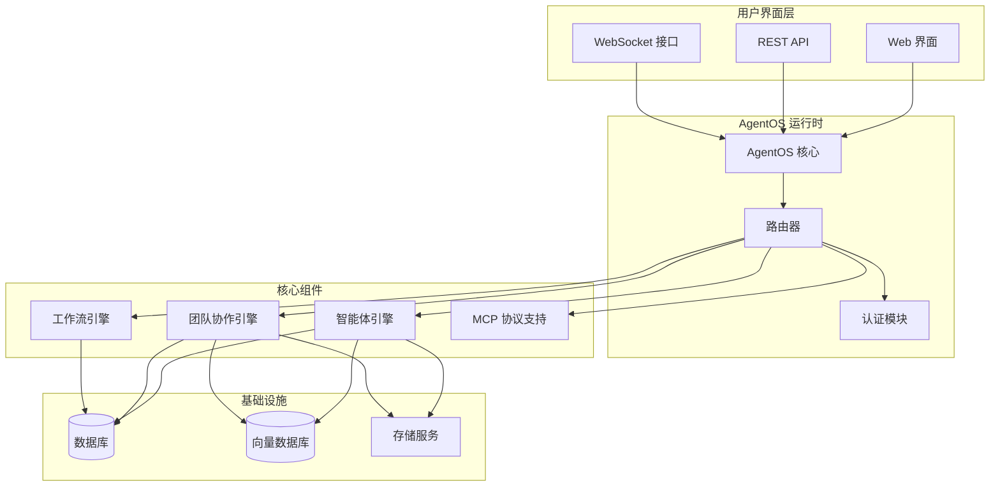
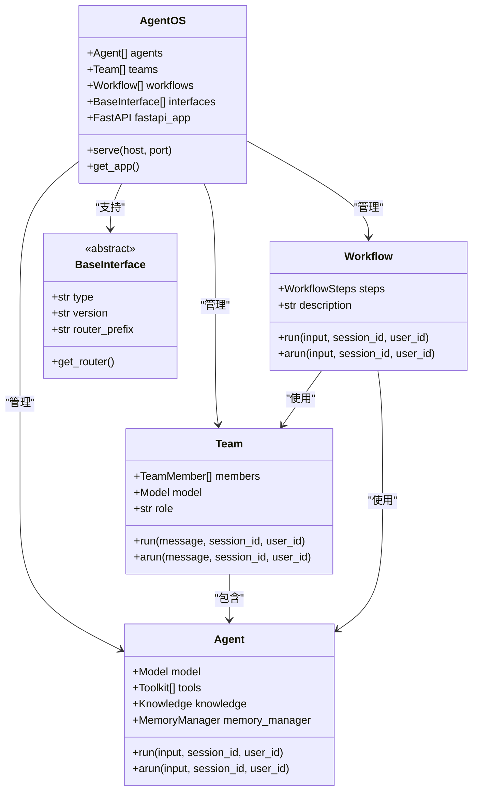
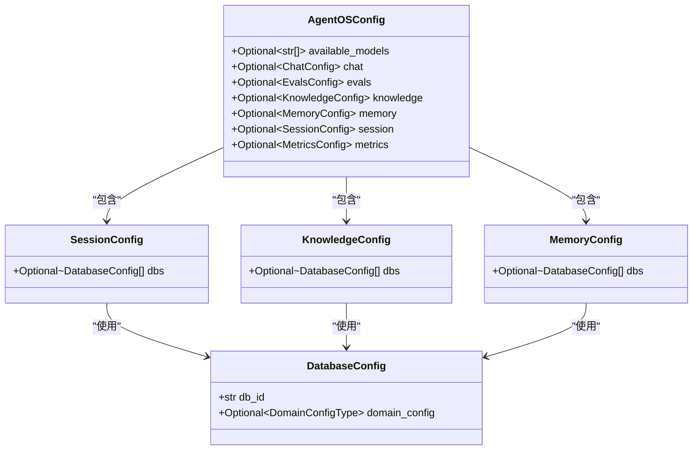
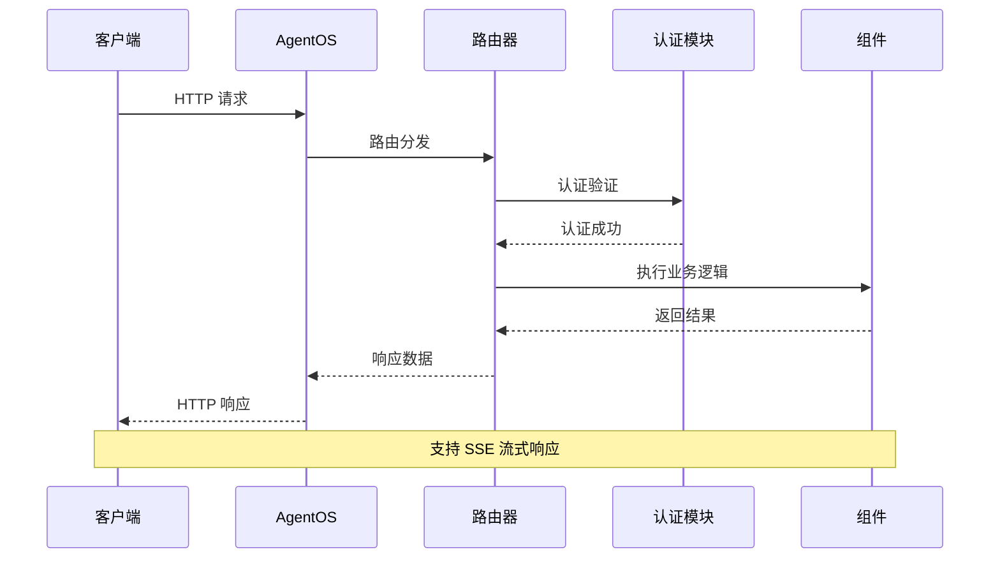
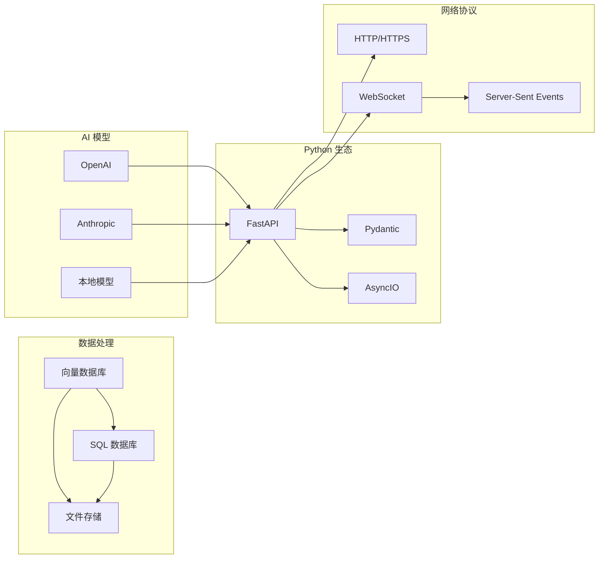
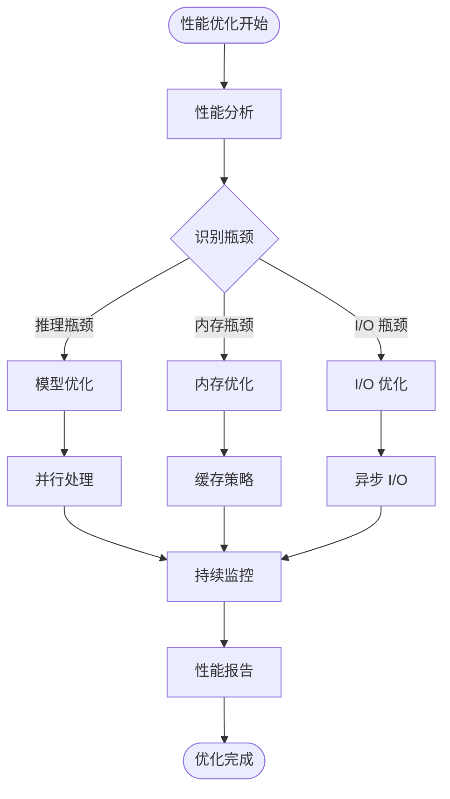

# Agno 项目综合介绍

<cite>
**本文档中引用的文件**
- [README.md](file://README.md)
- [libs/agno/agno/__init__.py](file://libs/agno/agno/__init__.py)
- [libs/agno/agno/agent/agent.py](file://libs/agno/agno/agno/agent/agent.py)
- [libs/agno/agno/team/team.py](file://libs/agno/agno/team/team.py)
- [libs/agno/agno/workflow/workflow.py](file://libs/agno/agno/workflow/workflow.py)
- [libs/agno/agno/os/app.py](file://libs/agno/agno/os/app.py)
- [libs/agno/agno/os/config.py](file://libs/agno/agno/os/config.py)
- [libs/agno/agno/os/router.py](file://libs/agno/agno/os/router.py)
- [libs/agno/agno/os/settings.py](file://libs/agno/agno/os/settings.py)
- [libs/agno/agno/os/schema.py](file://libs/agno/agno/os/schema.py)
</cite>

## 目录
1. [项目概述](#项目概述)
2. [核心特性](#核心特性)
3. [设计哲学](#设计哲学)
4. [项目架构](#项目架构)
5. [核心组件分析](#核心组件分析)
6. [AgentOS 运行时环境](#agentos-运行时环境)
7. [学习路径指南](#学习路径指南)
8. [技术栈与扩展能力](#技术栈与扩展能力)
9. [性能优势](#性能优势)
10. [总结](#总结)

## 项目概述

Agno 是一个高性能的多智能体系统运行时框架，专为构建、运行和管理安全的多智能体系统而设计。作为新一代的 AgentOS（智能体操作系统），Agno 提供了一个完整的解决方案，让开发者能够快速构建复杂的多智能体应用。

### 核心价值主张

Agno 的核心价值在于其独特的架构设计和卓越的性能表现：

- **高性能执行**：Agent 实例化时间仅需约 3 微秒，内存占用仅为 6.5KB
- **完整生态系统**：提供从开发到部署的全生命周期支持
- **数据隐私保护**：所有数据完全保留在用户云环境中
- **开箱即用**：预构建的 FastAPI 应用程序，支持直接产品开发

**章节来源**
- [README.md](file://README.md#L1-L140)

## 核心特性

### 智能体（Agent）

智能体是 Agno 系统的基本执行单元，具备以下核心功能：

```python
from agno.agent import Agent
from agno.models.anthropic import Claude
from agno.tools.hackernews import HackerNewsTools

agent = Agent(
    model=Claude(id="claude-sonnet-4-0"),
    tools=[HackerNewsTools()],
    markdown=True,
)
agent.print_response("Summarize the top 5 stories on hackernews", stream=True)
```

**主要特性：**
- **会话管理**：支持持久化会话和历史记录
- **记忆管理**：内置用户记忆和会话摘要功能
- **知识集成**：支持向量数据库和 RAG（检索增强生成）
- **工具调用**：丰富的工具生态系统
- **多模态支持**：图像、音频、视频和文档处理
- **人类交互**：支持确认机制和外部工具执行

### 团队（Team）

团队是多个智能体协作的高级抽象，支持多种协作模式：



**图表来源**
- [libs/agno/agno/team/team.py](file://libs/agno/agno/team/team.py#L1-L200)

**团队协作模式：**
- **协作模式**：所有成员共同参与任务
- **协调模式**：通过领导智能体进行任务分配
- **路由模式**：根据任务类型选择特定成员

### 工作流（Workflow）

工作流提供了步骤化的流程控制能力：



**图表来源**
- [libs/agno/agno/workflow/workflow.py](file://libs/agno/agno/workflow/workflow.py#L1-L200)

**工作流特性：**
- **条件执行**：支持复杂的条件分支逻辑
- **循环控制**：无限循环和有限循环支持
- **并行执行**：多任务并行处理
- **嵌套步骤**：支持步骤内嵌套其他步骤类型

**章节来源**
- [libs/agno/agno/agent/agent.py](file://libs/agno/agno/agent/agent.py#L1-L200)
- [libs/agno/agno/team/team.py](file://libs/agno/agno/team/team.py#L1-L200)
- [libs/agno/agno/workflow/workflow.py](file://libs/agno/agno/workflow/workflow.py#L1-L200)

## 设计哲学

### 数据隐私与安全性

Agno 的设计哲学建立在数据隐私和安全性的基础之上：

1. **本地化部署**：所有 AgentOS 运行在用户自己的云环境中
2. **数据隔离**：没有数据离开用户的系统边界
3. **零泄露原则**：不向外部服务发送任何追踪数据
4. **企业级安全**：支持企业级的安全认证和访问控制

### 开发者体验优化

Agno 致力于提供卓越的开发者体验：

- **开箱即用**：预配置的 FastAPI 应用程序
- **直观接口**：简洁的 Python API 设计
- **丰富示例**：完整的示例库和最佳实践
- **实时监控**：内置的控制平面用于系统监控

### 性能优先

性能是 Agno 的核心设计理念：

- **毫秒级响应**：智能体实例化速度极快
- **内存效率**：低内存占用设计
- **并发处理**：支持高并发请求处理
- **资源优化**：智能的资源管理和调度

## 项目架构

### 高层架构概览



**图表来源**
- [libs/agno/agno/os/app.py](file://libs/agno/agno/os/app.py#L1-L100)
- [libs/agno/agno/os/router.py](file://libs/agno/agno/os/router.py#L1-L100)

### 组件关系图



**图表来源**
- [libs/agno/agno/os/app.py](file://libs/agno/agno/os/app.py#L50-L150)
- [libs/agno/agno/agent/agent.py](file://libs/agno/agno/agent/agent.py#L50-L150)
- [libs/agno/agno/team/team.py](file://libs/agno/agno/team/team.py#L50-L150)

**章节来源**
- [libs/agno/agno/os/app.py](file://libs/agno/agno/os/app.py#L1-L200)
- [libs/agno/agno/os/config.py](file://libs/agno/agno/os/config.py#L1-L104)

## 核心组件分析

### AgentOS 核心类

AgentOS 类是整个系统的入口点，负责协调所有组件：

```python
class AgentOS:
    def __init__(
        self,
        os_id: Optional[str] = None,
        name: Optional[str] = None,
        description: Optional[str] = None,
        agents: Optional[List[Agent]] = None,
        teams: Optional[List[Team]] = None,
        workflows: Optional[List[Workflow]] = None,
        interfaces: Optional[List[BaseInterface]] = None,
        config: Optional[Union[str, AgentOSConfig]] = None,
        settings: Optional[AgnoAPISettings] = None,
        fastapi_app: Optional[FastAPI] = None,
        lifespan: Optional[Any] = None,
        enable_mcp: bool = False,
        replace_routes: bool = True,
        telemetry: bool = True,
    ):
```

**关键特性：**
- **统一管理**：集中管理所有智能体、团队和工作流
- **路由冲突解决**：智能处理路由冲突，支持自定义覆盖
- **MCP 支持**：可选的模型上下文协议支持
- **配置驱动**：支持 YAML 配置文件和程序化配置

### 配置管理系统



**图表来源**
- [libs/agno/agno/os/config.py](file://libs/agno/agno/os/config.py#L1-L104)

**章节来源**
- [libs/agno/agno/os/app.py](file://libs/agno/agno/os/app.py#L50-L200)
- [libs/agno/agno/os/config.py](file://libs/agno/agno/os/config.py#L1-L104)

## AgentOS 运行时环境

### 快速启动应用程序

AgentOS 提供了一个完整的 FastAPI 应用程序，开箱即用：

```python
def serve(
    self,
    app: Union[str, FastAPI],
    *,
    host: str = "localhost",
    port: int = 7777,
    reload: bool = False,
    workers: Optional[int] = None,
    **kwargs,
):
```

**主要功能：**
- **自动路由生成**：根据注册的组件自动生成 API 路由
- **健康检查**：内置的健康检查端点
- **认证支持**：可选的 Bearer Token 认证
- **CORS 配置**：灵活的跨域资源共享设置

### 控制平面

AgentOS 包含一个强大的控制平面，提供以下功能：



**图表来源**
- [libs/agno/agno/os/router.py](file://libs/agno/agno/os/router.py#L1-L200)

**控制平面特性：**
- **实时监控**：WebSocket 连接支持实时事件推送
- **会话管理**：完整的会话生命周期管理
- **指标收集**：自动收集和报告系统指标
- **评估支持**：内置的评估和测试框架

**章节来源**
- [libs/agno/agno/os/app.py](file://libs/agno/agno/os/app.py#L200-L400)
- [libs/agno/agno/os/router.py](file://libs/agno/agno/os/router.py#L1-L400)

## 学习路径指南

### 初学者路径

对于刚开始接触 Agno 的开发者，建议按照以下顺序学习：

1. **基础概念理解**
   - 了解智能体、团队和工作流的基本概念
   - 理解 AgentOS 运行时的工作原理
   - 掌握基本的配置和设置

2. **简单示例练习**
   ```python
   # 基础智能体
   from agno.agent import Agent
   
   agent = Agent(name="My First Agent")
   agent.print_response("Hello, world!")
   
   # 带工具的智能体
   from agno.tools.calculator import CalculatorTools
   
   agent = Agent(
       name="Calculator Agent",
       tools=[CalculatorTools()]
   )
   agent.print_response("What is 25 * 4?")
   ```

3. **进阶功能探索**
   - 会话管理
   - 知识库集成
   - 多模态输入输出
   - 自定义工具开发

### 有经验开发者路径

对于已经有 AI 开发经验的开发者：

1. **深入架构理解**
   - 分析 AgentOS 内部组件的交互
   - 理解异步处理和并发模型
   - 探索 MCP 协议的高级用法

2. **性能优化**
   - 分析性能基准测试结果
   - 优化内存使用和实例化速度
   - 实现自定义缓存策略

3. **企业级部署**
   - 生产环境配置
   - 监控和日志配置
   - 安全和权限管理

## 技术栈与扩展能力

### 核心技术栈



### 扩展能力

**工具生态系统：**
- **内置工具**：计算器、文件操作、网络搜索等
- **第三方集成**：GitHub、Slack、Discord 等平台集成
- **自定义工具**：支持开发者创建专用工具

**接口支持：**
- **Web 界面**：内置的 Web 控制台
- **REST API**：完整的 RESTful API
- **WebSocket**：实时通信支持
- **MCP 协议**：模型上下文协议支持

**数据库兼容性：**
- **关系型数据库**：PostgreSQL、MySQL、SQLite
- **向量数据库**：Chroma、Qdrant、Pinecone
- **NoSQL 数据库**：MongoDB、Redis、DynamoDB

## 性能优势

### 基准测试结果

Agno 在性能方面表现出色：

- **实例化时间**：平均 3 微秒
- **内存占用**：平均 6.5KB
- **并发处理**：支持高并发请求
- **响应延迟**：毫秒级响应时间

### 性能优化策略



**性能特点：**
- **毫秒级启动**：智能体快速实例化
- **低内存占用**：高效的内存管理
- **高并发支持**：支持大量并发请求
- **资源调度**：智能的资源分配和调度

**章节来源**
- [README.md](file://README.md#L80-L140)

## 总结

Agno 作为一个高性能多智能体系统运行时，为开发者提供了一个完整的解决方案。其核心优势包括：

### 主要成就

1. **技术创新**：首创的 AgentOS 架构，实现了真正的数据隐私保护
2. **性能卓越**：毫秒级响应时间和极低的内存占用
3. **生态完善**：从开发到部署的全生命周期支持
4. **易用性强**：简洁的 API 设计和丰富的示例

### 应用场景

- **企业智能助手**：构建企业级的 AI 助手系统
- **自动化工作流**：实现复杂的业务流程自动化
- **多智能体协作**：支持多个智能体的协同工作
- **研究实验平台**：为 AI 研究提供实验环境

### 发展前景

Agno 正在快速发展，未来将继续在以下方面进行改进：

- **性能优化**：进一步提升执行效率和并发能力
- **功能扩展**：增加更多内置工具和接口支持
- **生态建设**：扩大社区和第三方集成
- **企业服务**：提供更完善的企业级功能

Agno 不仅仅是一个技术框架，更是一个完整的生态系统，为多智能体系统的发展提供了坚实的基础。无论是初学者还是有经验的开发者，都能在这个平台上找到适合自己的发展路径。